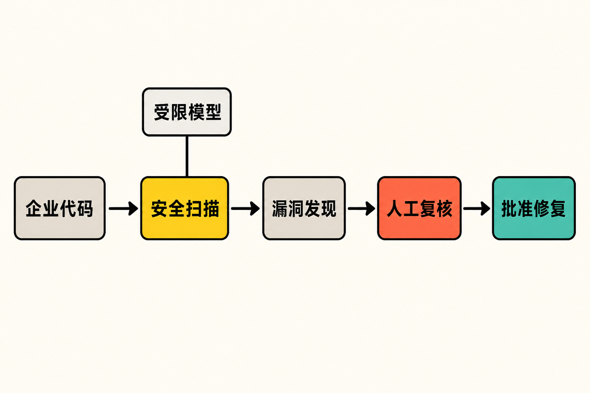

Anthropic正在尝试回答一个棘手问题：当一款模型既能帮助防守者发现漏洞，也可能被滥用于攻击时，怎样扩大它的安全价值，又不把完整能力直接交出去？

它给出的答案，是把模型藏在产品背后。

Anthropic宣布，将受限模型Claude Mythos 5接入Claude Security，为企业代码库执行漏洞扫描；用户能获得漏洞发现、风险判断与修复建议，却不能直接访问或自由提示模型。与这项产品调整同时公布的，还有一个价值3500万美元的开源软件防御基金。

这看起来像是一次模型开放，但更准确地说，它开放的是经过约束的“能力出口”。

## Mythos 5进了扫描器，但没有交到用户手里

**已确认事实：**Claude Security目前仍处于公开测试阶段，其中的Mythos 5扫描仅通过Claude.ai上的Claude Security应用向Claude Enterprise客户提供。[Anthropic官方公告](https://claude.com/blog/bringing-claude-mythos-5-to-more-defenders)显示，该模型将在后台分析企业代码库，扫描结果包括漏洞发现、CWE分类、置信度、严重程度以及建议修复方案。

企业客户不需要单独购买一个Mythos 5附加项目，扫描消耗计入现有方案的常规令牌用量。需要注意的是，Claude Security的Claude Code插件仍使用客户账户原本能够调用的模型，并不会因此获得Mythos 5能力。[官方产品页面](https://claude.com/product/claude-security)对此作了明确区分。

真正关键的限制在交互层：客户不能直接调用Mythos 5，也不能对其自由提问。产品只交付预先限定的安全成果，例如漏洞报告、风险信息和建议补丁，而不是开放模型本身。报道还指出，用户不能借这个入口要求模型生成漏洞利用代码。[The Next Web](https://thenextweb.com/news/anthropic-mythos-5-defenders-open-source-fund)将其概括为：防守者得到模型发现的东西，但得不到模型本身。

所有建议补丁在实施前都必须经过人工审核和批准。Anthropic也提醒，模型仍可能犯错，涉及关键系统时尤其不能跳过人工复核。

## 这不是传统意义上的“模型发布”

**基于事实的推断：**Anthropic正在把高风险能力封装成一项用途明确的服务，而不是把通用模型作为API或聊天入口开放。控制点至少有三层：限定用户范围、限定任务场景、限定输出形式。

这套设计改变了能力开放的基本单位。过去，人们讨论模型开放程度，往往关注权重、API或上下文窗口；在Mythos 5的案例中，开放单位变成了一项可审计的工作流：代码进入扫描器，模型在后台分析，系统只输出安全发现和修复建议，最终由人决定是否实施。

这也意味着“能力可用”不再等于“模型可访问”。Anthropic还计划把Mythos 5嵌入合作伙伴的网络防御工具，并与合作伙伴设置防滥用措施，限制模型偏离既定防御任务。[Impress Watch](https://www.watch.impress.co.jp/docs/news/2134847.html)报道，该模型此前主要限于Project Glasswing参与组织使用，如今扩大的是受控防御用途，而非一般访问权限。

**本文观点：**如果这一模式运行有效，它可能成为高能力安全模型商业化的一条现实路径。用户购买的不是一位可以任意指挥的“安全专家”，而是一组边界清晰的分析结果。它牺牲了一部分灵活性，却换来更低的滥用风险和更明确的责任链条。

## 3500万美元，不是现金基金

另一项容易被标题误读的信息，是Defender Advantage Fund，简称0xDAF。

**已确认事实：**所谓3500万美元基金，实际提供的是价值3500万美元的Claude使用额度，并非向开源项目发放等额现金。[Anthropic官方公告](https://claude.com/blog/bringing-claude-mythos-5-to-more-defenders)列出了三类重点方向：修复广泛使用的开源项目中已经存在的漏洞；自动化扫描与补丁流程；探索能够防范整类攻击的新安全方案。

Anthropic计划先发放少量、规模相对较大的试点资助，并在随后数周公布首批接受方。相关报道还称，Cyber Verification Program将逐步扩展至Mythos级能力。[ITmedia AI＋](https://www.itmedia.co.jp/aiplus/article/2608/22/2000000697/)

额度型资助有清晰优势：它能把昂贵的模型分析能力交给开源维护者和安全组织，用于大规模审查代码、验证发现并尝试自动生成补丁。对缺少算力预算的项目而言，这确实可能降低采用门槛。

但它也有同样清晰的边界。

**基于事实的推断：**使用额度解决的是模型调用成本，不能自动补齐维护者时间、安全工程经验、测试环境和发布协调能力。模型发现一个问题，只是修复链条的起点；后续还需要确认是否误报、评估兼容性、编写测试、合并代码并推动用户升级。

The Next Web也指出，额度不能替代负责验证和实施修复的开源维护人员。换言之，3500万美元衡量的是可调用的AI能力，而不是开源生态最终能够完成多少修复。

## AI代码扫描真正要接受三道考验

第一道是准确性。官方称，Claude Security希望识别传统扫描器可能遗漏的复杂、跨组件漏洞模式，[技术评论社](https://gihyo.jp/article/2026/08/mythos-5-to-claude-security)也提到了这一目标。但现有资料没有给出统一基准、误报率或实际修复率，因此目前不能据此断言它已经优于成熟扫描工具。

第二道是可验证性。扫描结果包含CWE分类、置信度、严重程度和补丁建议，为人工判断提供了结构化线索；然而“置信度高”不等于结论正确。尤其在关键基础设施和广泛依赖的开源组件中，错误补丁本身也可能制造新的风险。

第三道是规模化落地。Anthropic既要让合作伙伴集成模型，又要确保工具无法被轻易转向攻击用途。产品边界越严格，滥用面可能越小；但限制越多，系统适应特殊代码库和复杂调查的能力也可能越弱。这是受控开放无法回避的张力。

**本文观点：**判断这项计划是否成功，不宜只看扫描了多少代码或发放了多少额度，更应看四个结果：发现了多少可复现的真实漏洞、补丁被维护者接受了多少、修复耗时是否下降，以及有没有出现因自动建议导致的新问题。

## 结语：开放的不是钥匙，而是窗口

Mythos 5接入Claude Security，代表的并不是Anthropic解除模型限制，而是一次更精细的能力分发实验：模型留在受控环境里，防守者通过产品窗口取得限定结果，人类继续掌握补丁落地的最终决定权。

与此同时，3500万美元额度把这种能力延伸到开源安全领域，却不能代替维护者真正完成验证、修复和发布工作。

这次变化最值得关注的，或许不是“Mythos 5有多强”，而是Anthropic正在定义一种新的开放方式：不交出完整工具，而是交付经过约束的能力。它能否成为安全与可用性之间的可靠平衡，还要等待真实漏洞修复、误报控制和开源项目采用情况给出答案。

## 参考资料

1. [Anthropic：Bringing the cybersecurity capabilities of Claude Mythos 5 to more defenders](https://claude.com/blog/bringing-claude-mythos-5-to-more-defenders)
2. [Anthropic：Claude Security产品页面](https://claude.com/product/claude-security)
3. [The Next Web：Anthropic will give defenders what its strongest model finds, but not the model itself](https://thenextweb.com/news/anthropic-mythos-5-defenders-open-source-fund)
4. [ITmedia AI＋：Mythos 5通过Claude Security向Enterprise客户提供](https://www.itmedia.co.jp/aiplus/article/2608/22/2000000697/)
5. [Impress Watch：Anthropic扩大Mythos的受控防御用途](https://www.watch.impress.co.jp/docs/news/2134847.html)
6. [gihyo.jp：Claude Mythos 5在Claude Security中提供](https://gihyo.jp/article/2026/08/mythos-5-to-claude-security)
