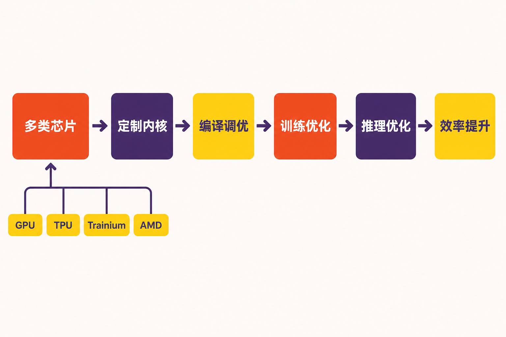
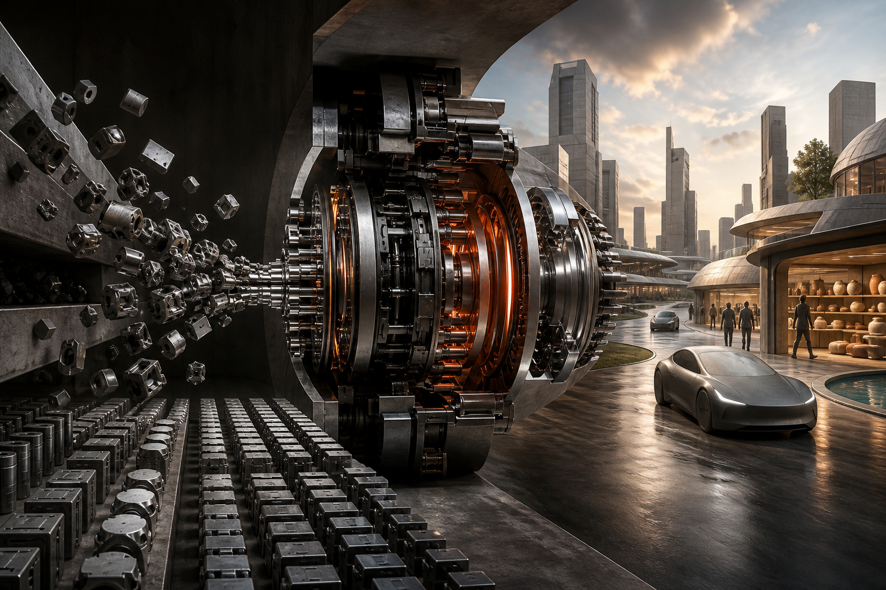

一笔尚未落定的收购，正在透露Anthropic对下一阶段AI竞争的判断。

据知情人士消息，Anthropic正在洽谈以约60亿美元收购AI初创公司Decart。交易目前尚未完成，谈判仍可能破裂，Anthropic和Decart均拒绝置评；若最终成交，这将成为Anthropic已知规模最大的收购。[Bloomberg / Cinco Días](https://cincodias.elpais.com/companias/2026-08-13/anthropic-se-lanza-a-por-la-start-up-decart-por-5200-millones-su-mayor-compra-historica.html)

表面看，Anthropic是在购买一家世界模型公司；进一步拆解会发现，它真正可能收入囊中的，是一套贯穿芯片优化、模型训练、推理部署和实时生成产品的技术栈。

这使交易的意义超出了常规的产品并购：当购买更多算力越来越昂贵，头部模型公司开始尝试掌握“如何把算力用得更好”。

## 先说清楚：这仍是一笔拟议交易

目前能够确认的核心事实有三点。

第一，拟议价格约为60亿美元。作为参照，Decart在2026年5月完成3亿美元融资时，估值已接近40亿美元；Axios披露，其累计融资超过4.5亿美元。[Bloomberg / Cinco Días](https://cincodias.elpais.com/companias/2026-08-13/anthropic-se-lanza-a-por-la-start-up-decart-por-5200-millones-su-mayor-compra-historica.html)、[Axios](https://www.axios.com/2026/08/13/anthropic-decart-nvidia-ipo)

第二，这不是已经签署并交割的交易。现阶段使用“拟收购”或“洽购”更准确，不能把谈判消息写成既成事实。

第三，如果交易完成，Decart团队预计将加入Anthropic的推理与性能部门。这个安排相当关键：它表明Decart至少不会只被当作一条独立的视频产品线，而可能直接参与Anthropic核心模型的运行效率建设。[Bloomberg / Cinco Días](https://cincodias.elpais.com/companias/2026-08-13/anthropic-se-lanza-a-por-la-start-up-decart-por-5200-millones-su-mayor-compra-historica.html)

上述内容属于已报道事实。至于交易能否完成、整合后能节省多少成本，以及Anthropic是否会据此研发自有芯片，目前都没有确定答案。

## 60亿美元买的第一层：把现有芯片“榨”出更多性能

Decart最容易被忽略、却可能最有战略价值的资产，是Decart Optimization Stack，简称DOS。

按照Decart官方介绍，DOS同时覆盖推理、训练和硬件层，能力包括定制内核、编译器调优、跨工作负载优化，以及性能分析器和模拟器授权。它并不只服务某一种芯片，官方列出的支持范围包括GPU、Google TPU、AWS Trainium、AMD及其他加速器。[Decart官方产品页](https://decart.ai/optimization-engine)

这意味着什么？

购买算力解决的是“有多少芯片”，底层优化解决的则是“每块芯片能完成多少有效工作”。当模型调用量上升时，公司当然可以继续增加硬件投入，也可以通过内核、编译器、训练和推理协同优化，让已有基础设施承载更多需求。

需要强调的是，DOS的性能与成本优势主要来自Decart自身陈述，现有材料没有提供独立基准测试。因此，“它具备跨层优化能力”是事实；“它能为Anthropic节省多少资金”仍然未知。

**推断：**若Anthropic把DOS用于自身模型，潜在收益可能不仅是降低单次训练成本，还包括缩短响应延迟、提高推理吞吐，并减少对单一硬件路线的依赖。Axios据此认为，这笔交易可能推动Anthropic从单纯购买英伟达算力，转向掌握更底层的计算效率能力，甚至为未来的自研芯片战略积累基础。[Axios](https://www.axios.com/2026/08/13/anthropic-decart-nvidia-ipo)

但“可能为自研芯片铺路”是分析，不等于Anthropic已经公布造芯计划。

## 第二层：世界模型不只是生成视频

Decart的另一面，是实时世界模型。

其Lucy产品能够实时修改人物、商品、环境和视觉效果，可用于虚拟试穿、广告、直播、社交平台及游戏。Decart于2026年7月发布Lucy 2.5，并宣称其可实现每秒30帧的实时生成。[Decart官方博客](https://decart.ai/blog)

Oasis 3则更接近物理AI基础设施。按照官方介绍，它能够依据转向、移动和API指令实时更新生成环境，先面向自动驾驶，随后计划扩展到无人机、越野车辆、海事和人形机器人训练。Decart宣称其端到端延迟低于200毫秒、生成速度为每秒22帧；这些数字同样属于厂商自述，尚不能视为独立验证结果。[Decart Oasis 3产品页](https://decart.ai/oasis)

世界模型的核心价值，不只是生成一段看起来真实的视频，而是让环境能够对输入持续作出响应。传统视频是一条预先确定的时间线；交互式世界模型则需要根据动作即时生成下一状态，让车辆、机器人或虚拟角色在闭环环境中行动。

**推断：**这类能力若进入Anthropic体系，可能为Claude之外提供新的技术方向，例如实时交互内容、物理环境模拟以及机器人训练。但现有来源没有显示Anthropic已经确定具体产品路线，因此不能把这些可能性写成产品预告。

## 真正稀缺的是“模型与基础设施共同设计”

Decart的特殊之处，在于Lucy和Oasis并非脱离底层基础设施独立存在。Lucy使用DOS优化基础设施，Oasis 3也由DOS推理与训练平台驱动。[Decart官方博客](https://decart.ai/blog)、[Decart Oasis 3产品页](https://decart.ai/oasis)

这形成了一条相对完整的链路：底层优化提高硬件效率，训练与推理平台支撑模型运行，世界模型再将能力转化为可以体验或调用的产品。

**观点：**相比只购买一项热门生成产品，这种垂直整合或许更值得Anthropic支付高溢价。AI系统的竞争已经不只发生在模型参数或榜单成绩上，还发生在硬件适配、编译优化、推理成本、实时性与产品体验之间。谁能共同设计这些环节，谁就更可能把实验室能力稳定地交付给大规模用户。

这也是“从购买算力到掌控计算效率”的准确含义：它不是停止采购芯片，更不是立即摆脱外部供应商，而是在硬件采购之外，把决定芯片利用率的关键软件能力掌握在自己手里。

## 收购之后，Anthropic还要面对三道题

即使交易完成，60亿美元也只是整合的开始。

第一是技术整合。DOS需要适配Anthropic已有的训练、推理和基础设施体系，理论优势能否在真实负载中转化为成本优势，有待验证。

第二是业务取舍。Lucy偏向实时视觉内容，Oasis面向物理AI，而Anthropic目前最鲜明的市场认知仍来自Claude。保留独立产品、并入基础平台，还是围绕Claude重组能力，将决定收购价值如何兑现。

第三是组织整合。Decart团队预计进入推理与性能部门，这有利于底层能力快速落地，但世界模型产品同时涉及研究、商业化和行业场景，跨团队协作仍可能复杂。

以上三点属于基于现有事实的分析，并非Anthropic已经披露的整合方案。

## 结语

这笔拟议交易尚未落锤，却已经展示了一个清晰趋势：头部AI公司的竞争焦点，正在从“谁能买到更多算力”延伸到“谁能更深入地控制算力效率”。

如果收购完成，Anthropic得到的不会只是一个实时视频模型，也不会只是一套芯片优化工具，而是一条从底层计算到交互式世界模型的完整技术链。它能否值回约60亿美元，最终取决于DOS能否真正改善Anthropic核心模型的训练与推理，以及世界模型能否从技术展示走向规模化产品。

现阶段最稳妥的结论是：交易仍有不确定性，但Anthropic试图掌控更多基础设施关键环节的意图，已经比交易结果本身更值得关注。

## 参考资料

1. [Bloomberg / Cinco Días：Anthropic洽购Decart](https://cincodias.elpais.com/companias/2026-08-13/anthropic-se-lanza-a-por-la-start-up-decart-por-5200-millones-su-mayor-compra-historica.html)
2. [Axios：Anthropic ramps up pre-IPO dealmaking](https://www.axios.com/2026/08/13/anthropic-decart-nvidia-ipo)
3. [Decart：The ultra-optimized infrastructure for AI](https://decart.ai/optimization-engine)
4. [Decart：The Interactive World Model for Physical AI](https://decart.ai/oasis)
5. [Decart：Lucy 2.5: Raising the Bar for Live AI](https://decart.ai/blog)
