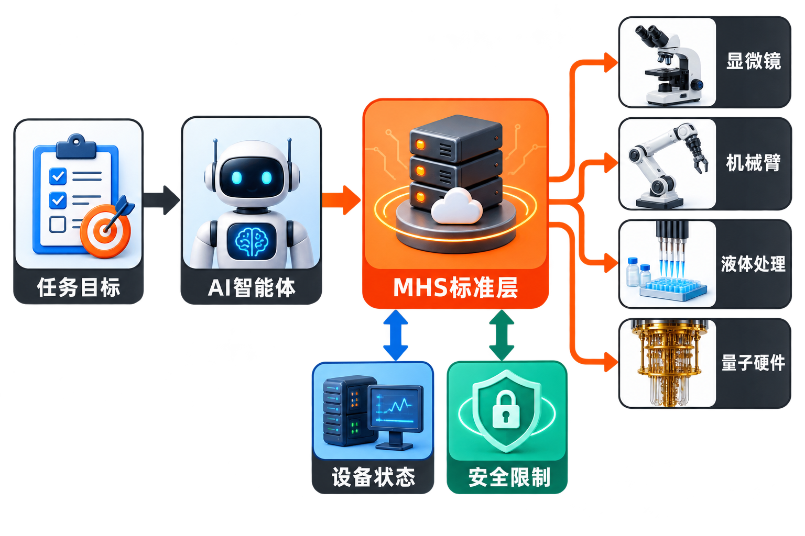
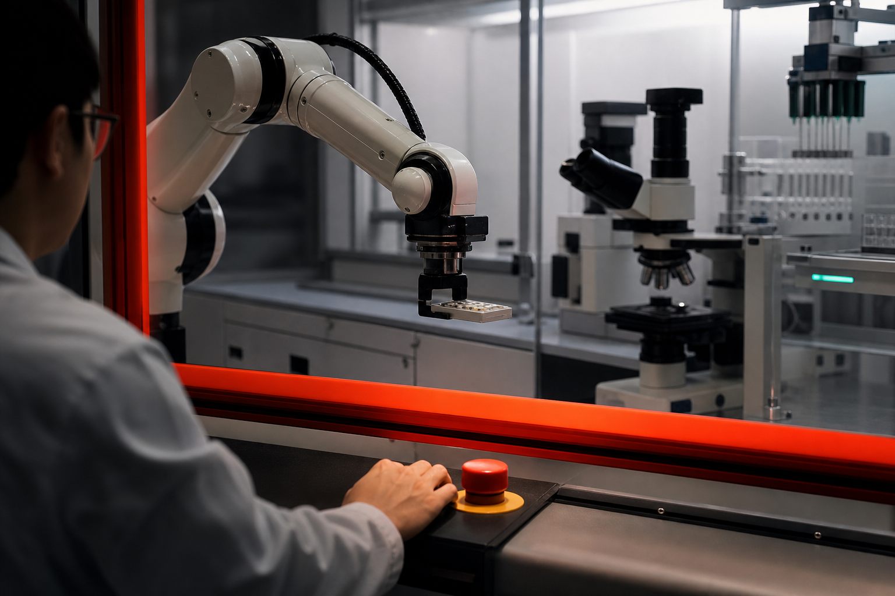

过去两年，AI智能体最擅长处理的对象仍然是数字世界：读取文档、调用软件、分析数据、生成代码。它可以设计一项实验，却未必能启动显微镜；可以规划制造流程，却很难直接协调来自不同厂商的机械臂、传感器和控制器。

现在，Anthropic试图补上从“理解信息”到“操控设备”的一层接口。

8月27日，Anthropic发布[Model Hardware Standard（MHS）研究预览](https://www.anthropic.com/news/model-hardware-standard-research-preview)。其目标不是制造一台新机器人，而是建立一种统一方式，让AI智能体发现、监控并操作具有可编程接口的物理设备。首批应用集中在实验室和先进制造领域，包括显微镜、液体处理设备、机械臂以及量子计算硬件。

这项发布值得关注的地方，不是AI突然获得了“身体”，而是Anthropic开始为智能体连接物理世界定义一层通用语言。

## MHS究竟解决什么问题？

现实中的自动化设备并不缺软件接口，缺的是统一接口。

不同厂商、不同年代的仪器通常拥有各自的API、驱动程序、控制软件和数据格式。让一台机器独立运行已有成熟方案，但要让多台异构设备协同完成实验或生产任务，工程团队往往需要逐一适配，并编写大量定制代码。据[WIRED报道](https://www.wired.com/story/anthropic-standard-ai-agents-coming-to-the-physical-world/)，跨厂商机器人此前通常需要这种专门开发。

MHS试图在设备与智能体之间增加一个标准层。设备通过标准化驱动程序说明“我是什么、能做什么、当前是什么状态、哪些操作不被允许”；智能体则使用统一指令读取状态、下发动作和协调流程。

根据[Anthropic的介绍](https://www.anthropic.com/news/model-hardware-standard-research-preview)，MHS提供了 `read`、`write` 等基础指令，并用标准格式描述设备能力、状态和安全限制。智能体可以通过MCP、命令行或代码API访问这些设备，也可以经由网络协调多台仪器。

因此，MHS并不是取代设备原有接口，更像是给不同接口加上一层“通用翻译器”。

从结构上看，一条可能的工作链路是：研究人员给出目标，智能体理解实验文档，将任务拆成步骤，再通过MHS查询设备能力、检查状态、执行操作并收集结果。The Next Web提到，Anthropic已经展示过[Claude依据实验PDF在支持MHS的硬件上执行实验](https://thenextweb.com/news/anthropic-model-hardware-standard-mhs-eu-machinery-regulation-2027)的场景。

这里需要明确：这是MHS所展示的能力方向，不等于任何实验室都能立刻接入，也不意味着智能体可以在无人监管下自由操作所有机器。

## 从连接软件，走向连接物理设备

MHS很容易让人联想到Anthropic此前推出的Model Context Protocol（MCP）。MCP解决的是模型如何连接数据源和软件工具；MHS进一步把连接对象延伸到了物理硬件。[WIRED也将MHS视为MCP向硬件领域的延伸](https://www.wired.com/story/anthropic-standard-ai-agents-coming-to-the-physical-world/)。

不过，软件调用与硬件操作存在根本差异。一次错误的数据库查询可以撤销，一次过强的激光照射、一次超速的机械臂运动或一次错误的化学操作，却可能损坏样品和设备，甚至威胁人员安全。

因此，设备说明不能只列出功能，还必须写明边界。例如，MHS参考文件可以描述机械臂负载、传感器波长范围等属性；设备供应商或操作者也能限定机械臂速度、活动角度，或限制显微实验中的激光强度。这意味着安全约束有机会成为机器可读取、可执行的配置，而不只是一份放在操作台旁的手册。

**事实层面**，Anthropic称MHS不绑定某个特定模型，原则上适用于任何具有可编程接口的设备。项目最初由Anthropic与HHMI Janelia Research Campus合作开发，目前仍处于限制访问的研究预览阶段，参与者需要申请。项目方计划先与合作伙伴测试标准、建立安全评估和操作最佳实践，之后再开源。[MHS官网](https://modelhardwarestandard.com/)也确认了这一推进顺序。

**由此可以推断**，Anthropic希望推动的并非“Claude专用遥控器”，而是一套可被更多模型、设备商和开发者采用的中间标准。但它能否真正保持模型中立、获得跨厂商支持，仍要看开源后的治理方式、兼容性测试和产业采用情况。

## 早期案例透露了什么？

目前披露的案例横跨生命科学、机器人和量子计算。

HHMI开发了能够自动管理显微镜的AI智能体；QuEra Computing使用MHS和Claude协调量子计算机所需的激光系统。路透社的[报道](https://www.investing.com/news/stock-market-news/anthropic-unveils-new-framework-allowing-ai-agents-to-operate-physical-devices-4880003)还提到，应用任务包括常规药物发现实验和量子计算机的激光校准。

Anthropic列出的早期案例还涉及Genentech、华盛顿大学和卡内基梅隆大学。在卡内基梅隆大学的案例中，MHS集成约耗时8小时，而传统供应商方案通常需要数周。这是特定案例中的项目方数据，不能直接外推为所有设备接入都能获得同等幅度的效率提升，但它说明统一接口可能显著减少一次性的适配工作。

参与测试的机构还包括AWS、Danaher、Hugging Face和Raspberry Pi。多种类型的合作伙伴同时出现，反映出MHS的潜在生态不只涉及模型公司和科研机构，也会牵动云服务、仪器制造、开发平台与边缘硬件厂商。

**我们的判断是**，MHS近期最现实的价值不是打造完全自主的“黑灯实验室”，而是降低设备编排门槛。研究人员仍然定义目标、审核方案和处理异常，智能体则承担状态查询、重复操作、跨设备调度与记录整理。相比一步到位的全自动化，这种“人在监督环路中”的渐进模式更可能率先落地。

## 真正的难点，是把安全写进接口

当智能体只能处理文档时，幻觉通常造成信息错误；当它能控制机械臂和激光器时，同类错误会转化为物理后果。

Anthropic也承认，当前模型仍缺乏可靠的物理、化学和生物直觉，高风险操作需要专家监督。MHS允许定义操作限制，是重要的第一步，但标准文件本身并不能自动保证安全。

至少还有三道问题需要解决。

第一，限制是否足够完整。设备可以规定最高速度，却难以仅靠静态参数穷举真实环境中的所有危险组合。

第二，限制是否会被绕过。模型受到恶意操控、任务被错误拆解，或者设备状态信息失真，都可能让看似合规的单步操作组合成危险流程。WIRED指出，模型失常或受到操控可能导致[设备损坏乃至人员伤害](https://www.wired.com/story/anthropic-standard-ai-agents-coming-to-the-physical-world/)。

第三，责任如何划分。如果事故源于模型决策、MHS配置、设备固件和操作人员审批的共同作用，仅靠技术接口很难回答由谁负责。The Next Web进一步提出，在欧洲，如果MHS配置实际承担安全控制功能，它可能受到[相关机械法规的约束](https://thenextweb.com/news/anthropic-model-hardware-standard-mhs-eu-machinery-regulation-2027)。这是媒体基于法规环境提出的分析，并非已经形成的监管结论。

因此，MHS的成败不仅取决于接口是否易用，还取决于权限控制、身份认证、操作日志、异常停止、人工审批和独立安全系统能否共同形成防线。尤其在高风险场景中，智能体的权限不应等同于设备的全部能力。

## 一场尚未开始定局的标准竞争

从产业视角看，MHS争夺的是AI智能体进入物理世界时的“接口层”。谁能让更多设备采用统一描述，谁就可能降低智能体应用的开发成本，并影响未来工具生态的规则。

但标准不会因为技术方案发布就自然成为标准。它还需要设备厂商愿意维护驱动与能力描述，开发者相信接口足够稳定，用户确认安全收益大于新增复杂度，同时还要处理旧设备、实时控制、网络中断和合规差异。

**观点层面**，MHS最有价值的设计方向，是把“设备能做什么”和“设备绝不能做什么”放进同一个机器可读框架。它为AI操作硬件建立了一个较清晰的起点。至于它最终会成为跨行业的公共协议、某个生态中的事实标准，还是只在少数科研场景使用，目前都还不能下结论。

## 结语

AI智能体走出屏幕，关键并不是给模型接上一只机械手，而是让它认识设备、理解边界，并在可追踪、可停止、可审计的规则下行动。

MHS展示了一种可能路径：用统一接口连接原本割裂的硬件，再把安全限制嵌入设备描述与操作流程。它带来的想象空间很大——实验可以跨仪器连续运行，工厂设备可以由智能体协同调度，科研人员也可能把更多时间投入到问题设计与结果判断中。

但研究预览不是成熟部署，统一指令也不等于统一安全。至少在当前阶段，MHS更应被理解为一项正在接受验证的基础设施实验，而不是“无人实验室和自主工厂已经到来”的宣言。

### 参考资料

- [Anthropic：Previewing the Model Hardware Standard](https://www.anthropic.com/news/model-hardware-standard-research-preview)
- [Model Hardware Standard官方网站](https://modelhardwarestandard.com/)
- [Reuters：Anthropic unveils new framework allowing AI agents to operate physical devices](https://www.investing.com/news/stock-market-news/anthropic-unveils-new-framework-allowing-ai-agents-to-operate-physical-devices-4880003)
- [WIRED：This Is How Anthropic Thinks AI Agents Should Navigate the Physical World](https://www.wired.com/story/anthropic-standard-ai-agents-coming-to-the-physical-world/)
- [The Next Web：Anthropic tests a new standard for Claude to work with factory and lab hardware](https://thenextweb.com/news/anthropic-model-hardware-standard-mhs-eu-machinery-regulation-2027)
- [SiliconANGLE：Anthropic previews MHS standard for AI agents that operate machines](https://siliconangle.com/2026/08/27/anthropic-previews-mhs-standard-ai-agents-operate-machines/)
