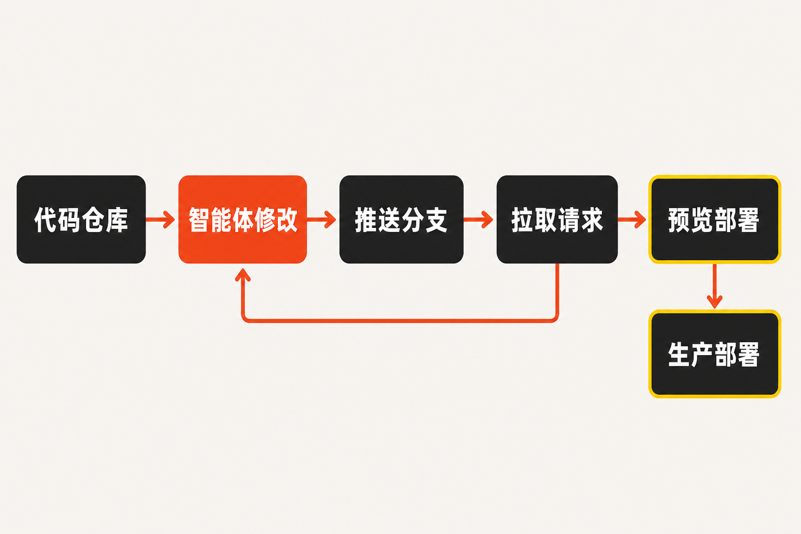

Cursor 不再满足于只做程序员写代码时打开的编辑器。

8 月 17 日，Cursor 发布代码托管服务 Origin 的早期测试版，把产品边界延伸到 Git 仓库、代码浏览、拉取请求和团队协作。Origin 正逐步向所有付费方案开放，企业管理员可以选择退出。[Cursor 官方公告](https://cursor.com/changelog/origin-code-hosting)

这项更新表面上是在 Cursor 里增加一个仓库标签页，实质上却触及了 GitHub 最重要的阵地：代码存放在哪里，协作围绕哪个平台展开，以及开发过程产生的上下文最终由谁掌握。

需要先讲清楚：Origin 目前还不是成熟的 GitHub 替代品。但它释放出了一个更值得关注的信号——AI 编程产品的竞争，正在从“谁更会生成代码”，走向“谁能控制从任务、修改、评审到部署的完整工作流”。

## Origin 到底是什么

**已确认事实：**Origin 是一项基于 Git 的云端代码托管与协作服务。用户可以直接创建、托管仓库，通过 Cursor 客户端的新标签页或专用命令行工具访问；本地与云端 Cursor 智能体能够理解仓库代码、进行修改、更新拉取请求或推送分支。[Cursor 官方公告](https://cursor.com/changelog/origin-code-hosting)与[SiliconANGLE 报道](https://siliconangle.com/2026/08/17/cursor-launches-origin-code-hosting-service-to-compete-with-github/)均确认了这些能力。

Origin 首批提供的组件并不陌生：仓库、代码浏览、拉取请求、评论和回复。真正不同的是，智能体不再只是编辑器里的辅助功能，而是被放进仓库协作流程中。它既能读取整个项目，也能直接作用于分支和拉取请求。

这改变了 AI 与代码库的关系。过去，AI 助手往往需要临时读取文件、索引项目，再把生成结果交给开发者处理；当代码仓库本身属于同一平台时，智能体可以持续接触分支状态、修改记录和评审过程。

**推断：**这可能减少智能体在编辑器、代码托管平台与云端任务之间反复获取上下文的成本。不过，现有资料没有提供效率、准确率或开发时间方面的量化数据，因此现在还不能断言 Origin 已经提高了团队生产率。

## Cursor 没有要求用户立刻搬离 GitHub

Origin 最现实的设计，是允许用户把 GitHub 项目同步过来，而且后续变更可以持续同步。对于源自 GitHub 的项目，GitHub 仍是事实源，代码推送继续进入 GitHub；拉取请求、评论和回复则可在两边双向同步。[Cursor 对同步机制的说明](https://cursor.com/changelog/origin-code-hosting)

这说明 Cursor 选择的不是“强制迁移”，而是先与 GitHub 并行。开发者可以在 Origin 中使用 Cursor 的智能体和协作界面，同时保留 GitHub 上原有仓库及工作流。

**推断：**双向同步既是过渡方案，也是市场进入策略。它降低了试用成本，让团队无需一开始就迁移全部资产；但反过来看，只要 GitHub仍是事实源，Origin 就还没有真正取代 GitHub 的基础地位。

这种关系很微妙：Origin 一方面依赖 GitHub 帮助用户平滑接入，另一方面又试图把日常操作发生的地点迁入 Cursor。平台竞争未必从“仓库整体搬家”开始，也可能从开发者逐渐减少打开 GitHub 页面开始。

## 真正的目标，是把智能体放进完整闭环

代码托管的价值不只在保存代码。一次真实的软件变更通常还要经历创建分支、提交修改、发起拉取请求、评论评审、预览部署和合并上线。谁能串起这条链路，谁就更接近团队研发活动的控制面。

Origin 首发集成了 Vercel、Depot 和 Buildkite。以 Vercel 为例，Origin 仓库可以直接连接至 Vercel；拉取请求会自动生成 Preview 部署，合并之后触发生产部署。该集成目前处于公开测试阶段，并面向 Vercel Pro 客户。[Vercel 官方更新](https://vercel.com/changelog/deploy-cursor-origin-repositories-with-vercel-in-public-beta)

由此可以看到一条初步闭环：仓库向智能体提供完整上下文，智能体修改代码并更新拉取请求，拉取请求触发预览，合并后进入生产部署。

**观点：**这才是 Origin 最值得关注的部分。单独复制一套仓库与拉取请求功能，并不足以撼动 GitHub；如果 Cursor 能让智能体可靠地跨越理解、修改、评审和部署多个阶段，代码托管就会从最终存放代码的基础设施，变成智能体执行工作的原生环境。

## 为什么 GitHub 的核心地盘仍然难攻

Origin 切入了 GitHub 的核心业务，并不代表它已经拥有与 GitHub 相同的产品完整度。

TechTarget 采访的企业用户指出，GitHub Actions、Marketplace、分支保护、身份管理以及下游 Webhook 都会形成显著的迁移成本。报道援引的分析判断也认为，GitHub 在智能体 DevSecOps 市场仍处于领先位置。[TechTarget 报道](https://www.techtarget.com/it-infrastructure/news/366649459/GitHub-outage-had-users-weighing-options-but-finding-few)

这些能力看上去分散，实际上共同构成了企业研发系统：自动化任务依赖 Actions，第三方服务通过应用和 Webhook 接入，权限与身份系统负责控制风险，分支规则保证变更经过必要审查。仓库可以复制，围绕仓库形成的组织流程却很难一键搬走。

Origin 目前仍是早期测试产品，Cursor 也表示更多智能体原生功能和集成将在后续推出。[Cursor 官方公告](https://cursor.com/changelog/origin-code-hosting)因此，把它描述成已经能全面替代 GitHub并不准确。

**观点：**Origin 的短期机会不是说服大型企业彻底迁移，而是成为 Cursor 用户处理代码变更的首选入口。只有当越来越多协作、评审和部署活动稳定地发生在这里，它才可能从 GitHub 的智能界面逐步变成独立平台。

## AI 编程竞争正在发生三层升级

第一层竞争是模型能力：谁能更准确地补全、解释和修改代码。

第二层竞争是智能体能力：谁能自主拆解任务、跨文件修改，并调用工具完成更长的工作链。

Origin 所代表的是第三层——基础设施与工作流。AI 产品开始拥有仓库、分支、拉取请求及部署入口，让智能体不仅“建议怎么改”，还可以在受控流程里真正推进变更。

**推断：**如果这一方向成立，未来 AI 编程平台之间的差异，可能越来越少取决于某一次代码生成，越来越多取决于它能掌握多少可靠上下文、接入多少研发工具，以及能否留下可审查的执行记录。现有资料足以显示 Cursor 正向这一方向扩张，但尚不足以判断开发者和企业会以多快速度接受它。

## 结语

Origin 现在更像一座搭在 GitHub 旁边的新工作台：底层代码仍可留在 GitHub，开发者却能在 Cursor 内调用智能体、处理拉取请求并连接部署流程。

它还没有复制 GitHub 多年积累的生态、治理与企业能力，也没有数据证明自己能显著改善研发效率。但 Cursor 已经把问题摆到了行业面前：当智能体开始承担越来越多实际开发工作，它最合适的家究竟是编辑器、代码托管平台，还是一个同时拥有两者的新系统？

GitHub 的护城河依旧深厚。Origin 的意义，则在于 AI 编程公司第一次如此明确地把战线推进到了护城河边。

## 参考资料

1. [Cursor：Origin Code Hosting](https://cursor.com/changelog/origin-code-hosting)，2026-08-17。
2. [SiliconANGLE：Cursor launches Origin code hosting service to compete with GitHub](https://siliconangle.com/2026/08/17/cursor-launches-origin-code-hosting-service-to-compete-with-github/)，2026-08-17。
3. [Vercel：Deploy Cursor Origin repositories with Vercel in public beta](https://vercel.com/changelog/deploy-cursor-origin-repositories-with-vercel-in-public-beta)，2026-08-17。
4. [Informa TechTarget：GitHub outage had users weighing options, but finding few](https://www.techtarget.com/it-infrastructure/news/366649459/GitHub-outage-had-users-weighing-options-but-finding-few)，2026-08-19。
