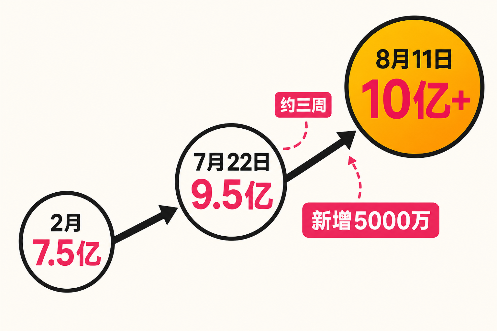

从9.5亿到10亿，Google只用了大约三周。

8月11日，Google宣布，[Gemini应用月活跃用户已经超过10亿](https://blog.google/innovation-and-ai/products/gemini-app/one-billion-monthly-users/)。而在7月22日的Alphabet第二季度业绩材料中，CEO桑达尔·皮查伊披露的数字还是[9.5亿月活](https://blog.google/company-news/inside-google/message-ceo/alphabet-earnings-q2-2026/)。按两个官方节点计算，Gemini在约20天里跨越了最后5000万用户。

这个里程碑的意义，不只是Google又多了一个十亿用户产品。更重要的是，消费级AI助手市场出现了一个清晰的新局面：Gemini与ChatGPT都进入十亿月活量级。行业竞争正从“一家产品定义赛道”，转向两套技术、产品与分发体系的正面对垒。

不过，10亿月活也不是终局。它证明了Gemini获得用户的能力，却没有自动回答用户使用得有多深、商业收入有多高，以及不同AI入口究竟创造了多少独立价值。

## 三周增加5000万，真正值得看的是增长曲线

先把几个已经确认的节点连起来。

据TechCrunch报道，[Gemini在2026年2月的月活为7.5亿](https://techcrunch.com/2026/07/23/google-closes-in-on-another-billion-user-product-with-gemini/)；到7月22日，这个数字升至9.5亿；8月11日又突破10亿。也就是说，半年左右增加约2.5亿月活，其中最后5000万出现在约三周内。

与此同时，Google还披露，Gemini日活跃用户数量同比增至三倍，第一方模型API每分钟处理约220亿个token。这些是比单一月活数字更有价值的补充信号：用户增长并非只存在于偶尔打开一次的统计口径里，产品的高频使用与开发者调用也在扩张。

需要明确的是，“约三周增加5000万”是根据两次官方披露做出的差值计算，不代表Google每天稳定新增约250万用户。月活是滚动统计指标，用户也可能来自首次使用、回流、跨端触达等不同情形，因此不能把两个时间点简单解释成线性获客速度。

但从结果看，Gemini跨过十亿门槛的速度仍然具有标志性。它说明Google已经把基础模型能力转化为大规模消费产品，而且增长并没有在逼近十亿时明显停滞。

## Google的优势，不只是模型，而是把AI送到用户面前

为什么Gemini能在短时间内补上最后5000万？现有材料没有提供用户新增渠道的精确拆分，因此不能给出单一归因。不过，Google的分发体系显然是理解这条曲线的重要背景。

Gemini覆盖Android、iOS和网页端，同时处在Google自有产品生态之中。TechCrunch将这种多端和生态分发列为其扩张的重要条件；TechRepublic也指出，Gemini的快速增长与Google在Android、搜索及其他服务中的分发能力密切相关。

事实层面，我们只能确认这些入口和增长同时存在。进一步的判断是：在AI模型能力逐步接近的阶段，“用户在哪里遇见AI”可能与“模型在榜单上领先多少”同样重要。

传统互联网产品往往要先说服用户下载、注册，再培养使用习惯。Google则拥有大量现成触点，可以降低用户第一次接触Gemini的成本。一个AI助手不必等用户专门想起它，才有机会进入任务流程。这种可见性和低摩擦体验，是平台型公司的结构性优势。

但优势并不等于胜利。生态分发能快速做大用户池，最终能否形成稳定使用，还取决于回答质量、响应速度、任务完成率，以及用户是否愿意把工作和生活中的关键环节交给它。

## “双巨头时代”成立，但不是简单的五五开

TechCrunch把Gemini与ChatGPT都归入十亿月活量级的消费级AI助手阵营。以用户规模衡量，“双巨头时代”已经具备现实基础：市场不再只有一个遥遥领先的通用AI助手，Google完成了量级上的追赶。

然而，“同属十亿级”不等于两者份额相同，更不意味着产品竞争已经定型。现有资料没有提供两款产品在同一统计周期、同一口径下的精确对比，也没有给出用户重合度。一个人完全可能同时使用Gemini和ChatGPT，因此两个十亿不能相加为二十亿独立用户。

更准确的理解是，消费级AI助手形成了两种不同的竞争路径。

一种路径以独立AI产品为中心，先建立品牌和使用习惯，再向更多终端与任务延伸；另一种路径依托既有操作系统、搜索和服务生态，把AI嵌入用户原本就在使用的环境。前者的力量来自用户主动选择，后者的力量来自广泛触达。这里是对竞争模式的概括，而不是来源材料直接给出的市场结论。

这也意味着下一阶段的较量会超越聊天窗口。谁能成为默认入口，谁能跨设备保持上下文，谁能从问答走向执行，谁就更有机会把庞大月活转化为持续使用。

## 10亿月活之外，还有三个问题没有答案

第一个问题是统计口径。

本次10亿明确指向“Gemini应用”，不能与Google搜索中的AI Overviews或AI Mode用户数混为一谈。Google研究人员发布的ATLAS研究也分别分析了Gemini应用、Google AI Mode和Gemini API，说明这些产品表面的使用数据需要区分。

该研究基于[1500万条去标识化交互](https://arxiv.org/abs/2608.00038)，关注AI在工作任务、技能要求和经济活动中的采用情况。它提醒我们，讨论AI规模时，既要看有多少人接触，也要看他们通过什么入口、完成什么任务。

第二个问题是使用深度。

月活回答的是“一个月内来过多少人”，却不能单独说明使用频次、会话长度或任务价值。日活同比增至三倍是积极信号，但Google没有在这些材料中披露具体日活人数，也未提供日活与月活的比例。因此，外界暂时无法仅凭公开数字判断Gemini的用户黏性。

第三个问题是商业化。

Alphabet当季营收为1198亿美元，同比增长24%，但TechRepublic指出，[Google尚未单独披露Gemini收入](https://www.techrepublic.com/article/news-google-gemini-950-million-monthly-users-alphabet-earnings/)。因此，“十亿用户已经带来多大直接收益”仍然没有公开答案。

这是所有大众AI助手都要面对的矛盾：更多使用意味着更大的商业机会，也可能意味着更高的推理成本。订阅、广告、企业服务和生态协同可能成为收入来源，但哪些路径能够长期覆盖成本，仍需后续财务数据验证。

## 十亿用户，是门票而不是奖杯

从产业视角看，Gemini突破10亿月活至少确认了三件事。

第一，通用AI助手已经成为十亿级大众产品，而不是只属于技术爱好者的工具。第二，Google证明了成熟互联网生态仍能在新一代产品竞争中迅速放大规模。第三，AI助手市场进入两强同量级竞争后，模型、入口、产品体验和商业化将被放到同一张考卷上。

我的观点是，未来最关键的指标未必还是“谁先增加下一个一亿月活”，而是谁能让用户更频繁、更放心地完成真实任务。规模决定参赛资格，留存和任务价值决定竞争质量，收入与成本则决定这种增长能否持续。

## 结语

Gemini用约三周跨越最后5000万，把消费级AI助手推入了更明确的双巨头阶段。这个数字展示了Google强大的产品化与分发能力，也让竞争从模型演示走向十亿用户的日常使用。

但10亿只是新的起点。接下来真正值得观察的，不是数字是否继续刷新，而是这些用户为何留下、把哪些任务交给AI，以及Google能否把广泛触达转化为不可替代的使用习惯。AI助手的上半场比的是谁能被更多人打开；下半场比的，将是谁能真正进入更多人的生活与工作。

## 参考资料

1. [Google：One billion people are now using the Gemini app every month](https://blog.google/innovation-and-ai/products/gemini-app/one-billion-monthly-users/)
2. [Google：Alphabet earnings call Q2 2026 — Sundar Pichai remarks](https://blog.google/company-news/inside-google/message-ceo/alphabet-earnings-q2-2026/)
3. [TechCrunch：Google’s Gemini app surges to one billion users](https://techcrunch.com/2026/08/11/googles-gemini-app-surges-to-one-billion-users/)
4. [TechCrunch：Google’s Gemini nears billion-user milestone](https://techcrunch.com/2026/07/23/google-closes-in-on-another-billion-user-product-with-gemini/)
5. [TechRepublic：Google Says Gemini Reaches 950 Million Monthly Users](https://www.techrepublic.com/article/news-google-gemini-950-million-monthly-users-alphabet-earnings/)
6. [Google / arXiv：AI & Economy ATLAS v1.0](https://arxiv.org/abs/2608.00038)
