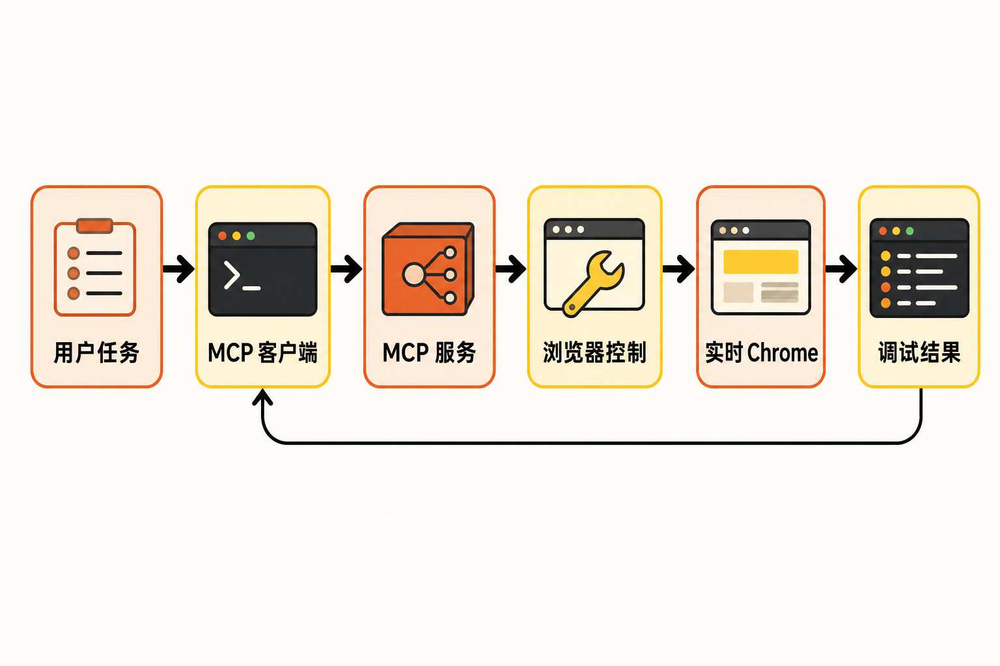

让编码智能体修改一个 Web 页面并不难，真正棘手的是下一步：按钮是否真的能点？接口为什么返回 500？控制台有没有报错？首屏卡顿究竟发生在哪里？

如果智能体只能阅读源码，它可以推断问题，却看不到代码在真实浏览器里的运行结果。开发者往往还得自己打开 DevTools，把错误、截图或性能数据重新交给智能体。Chrome DevTools 团队把这种状态形容为近似“蒙眼编程”。[官方发布文章](https://developer.chrome.com/blog/chrome-devtools-mcp?authuser=2&hl=en)

ChromeDevTools/chrome-devtools-mcp 想缩短的，正是“生成代码—打开浏览器—观察结果—继续修复”之间的距离。

## 30 秒认识项目

- **一句话定位：**一个面向编码智能体的 MCP 服务器，让智能体能够控制并检查实时运行的 Chrome；项目也提供能力范围较小的 CLI。
- **仓库地址：**[ChromeDevTools/chrome-devtools-mcp](https://github.com/ChromeDevTools/chrome-devtools-mcp)
- **许可证：**Apache-2.0。
- **主要语言：**TypeScript；仓库此前显示约 95.8% TypeScript、4.2% JavaScript，比例会随提交变化。
- **最新正式版：**v1.7.0，发布于 2026 年 8 月 10 日。[版本说明](https://github.com/ChromeDevTools/chrome-devtools-mcp/releases/tag/chrome-devtools-mcp-v1.7.0)
- **活跃度：**约 1119 次提交、3.4k Fork、76 个开放 Issue、约 37—39 个 PR。数据核实于 **2026 年 8 月 13 日 08:02（UTC+8）**，此后会变化。
- **Star 数据：**本次资料未能从 GitHub 页面稳定核实精确数字，因此不引用缓存值，也不以 Star 数替代质量判断。

**事实判断：**最新版本距核实时间仅三天，仓库仍有 Issue、PR 和 Discussion 活动。

**编辑部观点：**这些信号可以说明项目仍在维护，却不能单独证明其稳定性、安全性或适合生产环境。

## 它解决的不是“自动点击”，而是反馈闭环

普通编码智能体通常从源码、终端输出和用户描述中理解页面。问题在于，静态代码不能完整反映浏览器运行时状态：网络请求可能失败，JavaScript 可能抛错，布局也可能与预期不同。

chrome-devtools-mcp 把 Chrome DevTools 的浏览器控制、调试和性能分析能力包装为 MCP 工具。支持 MCP 的 IDE 或智能体可以直接发起导航、点击、截图、控制台检查、网络分析或性能追踪，再根据返回结果继续处理。[官方入门文档](https://developer.chrome.com/docs/devtools/agents/get-started?hl=en)

它与几类常见方案的差异可以这样理解：

- **相比只读源码：**它增加了真实浏览器中的运行证据，不必完全依靠静态推断。
- **相比开发者手工复制报错：**智能体可以自行取得部分控制台、网络和页面状态，减少信息转述。
- **相比单纯浏览器自动化：**重点不只是完成点击流程，还包括 DevTools 的性能、内存与调试信息。
- **相比项目自带 CLI：**CLI 只覆盖适合 Shell 自动化的部分能力；完整工具集由 MCP 服务提供。

这里需要划清边界：它为智能体提供“眼睛和工具”，不等于能够自动保证诊断正确，更不等于生成的修复一定安全。

## 五项核心能力，价值分别在哪里

### 1. 在真实页面中验证代码

项目基于 Puppeteer 提供导航、输入、点击、脚本执行、截图和页面快照等能力。实际价值是：智能体修改前端代码后，可以在 Chrome 中继续观察页面，而不是停留在“从代码看起来应该可用”。

若任务只需要浏览、执行脚本和截图，还可使用 `--slim --headless`。Slim 模式只暴露精简工具，有助于降低工具列表占用的模型上下文，但会主动放弃完整调试能力。[官方 README](https://github.com/ChromeDevTools/chrome-devtools-mcp/blob/main/README.md)

### 2. 查看控制台与网络请求

页面故障经常不在视觉层：接口超时、资源加载失败或运行时异常，都可能让页面“看起来差不多”，实际已经失效。智能体能够检查控制台消息和网络请求后，定位依据便从猜测转向浏览器记录。

**合理推断：**这对复现前端错误、排查接口联调和验证修复尤其有用。但诊断质量仍取决于智能体如何解释这些记录，项目本身不会替代工程判断。

### 3. 用性能追踪寻找卡顿原因

官方演示展示了 `performance_start_trace`：智能体启动 Chrome、打开页面并录制性能追踪，再依据 DevTools 的性能洞察提出建议。项目还整合 Lighthouse；v1.7.0 将其更新至 13.4.1。

这比只报告一个加载耗时更有价值，因为追踪数据能够提供优化方向。不过，性能工具可能把追踪涉及的 URL 发往 Google CrUX API，以取得真实用户数据；不希望发生这一行为时，应增加 `--no-performance-crux`。

### 4. 扩展到内存问题

v1.7.0 新增 `get_heapsnapshot_object_details`，堆快照摘要也能输出原生上下文，并按原生上下文筛选对象。这说明项目正在从页面操作继续进入更深入的运行时分析。[v1.7.0 Release](https://github.com/ChromeDevTools/chrome-devtools-mcp/releases/tag/chrome-devtools-mcp-v1.7.0)

**观点：**内存分析提高了能力上限，但堆快照和对象关系本来就较复杂。它更适合辅助有经验的开发者，不宜把模型给出的解释直接视为根因结论。

### 5. 模拟不同运行条件

工具集支持设备和网络仿真，也包含实验性的扩展、WebMCP、第三方开发工具及 PWA 工具。前者能帮助检查移动设备或较差网络下的表现；后几类实验能力则意味着接口和行为可能继续变化，不应默认具有与基础功能相同的稳定性。


## 它怎样工作

根据仓库、README 与官方介绍，可还原出一条简化流程：

1. 用户在支持 MCP 的编码智能体中提出任务；
2. MCP 客户端通过 `npx` 以 stdio 方式启动 chrome-devtools-mcp；
3. 服务器通过 Puppeteer及浏览器调试连接控制 Chrome；
4. Chrome 执行导航、交互、截图或追踪；
5. 页面状态、控制台、网络及性能结果返回智能体；
6. 智能体据此解释问题或继续修改代码。



首次调用需要浏览器的工具时，服务器才会自动启动 Chrome。官方支持 Google Chrome 和 Chrome for Testing；其他 Chromium 浏览器可能可用，但不在官方保证范围内。

**推断而非官方承诺：**这条链路的意义在于把浏览器反馈纳入智能体循环；但链路变长后，Node、MCP 客户端沙箱、Chrome 启动和调试连接中的任何一环都可能成为故障点。

## 安装与最小使用示例

前置条件是最新版 Node.js LTS、npm，以及当前稳定版 Chrome。以 Codex 为例，官方命令是：

```bash
codex mcp add chrome-devtools -- npx chrome-devtools-mcp@latest
```

其他支持 MCP 的客户端可采用 README 给出的最小配置：

```json
{
  "mcpServers": {
    "chrome-devtools": {
      "command": "npx",
      "args": ["-y", "chrome-devtools-mcp@latest"]
    }
  }
}
```

配置并重启客户端后，可使用官方示例提示词：

```text
Check the performance of https://developers.chrome.com
```

若安装失败，官方建议先验证服务器能否启动：

```bash
npx chrome-devtools-mcp@latest --help
```

同时确认 MCP 客户端与终端使用相同的 Node/npm。`ERR_MODULE_NOT_FOUND` 常与不受支持的 Node 版本或损坏的 npm/npx 缓存有关；`Target closed` 通常表示 Chrome 没能正常启动。[官方故障排查](https://github.com/ChromeDevTools/chrome-devtools-mcp/blob/main/docs/troubleshooting.md)

以上命令均来自官方文档；本文未进行独立实测，因此不对特定操作系统上的结果作额外承诺。

## 优点、限制与风险

项目最明显的优点，是能力覆盖了从页面交互到网络、控制台、性能和内存分析的连续链路；通过 `npx` 接入也较直接。v1.7.0 仍在新增能力并处理网络记录、截图句柄、守护进程和堆快照 worker 等问题，说明维护者正在解决真实运行中的资源与生命周期问题。

限制同样具体：

- MCP 客户端的 macOS Seatbelt 或 Linux 容器沙箱可能阻止 Chrome 创建自己的沙箱，需要调整可信环境配置，或用 `--browser-url` 连接外部 Chrome。
- WSL 默认需要在 Linux 环境安装 Chrome；直接启动 Windows Chrome 存在已知问题。
- 维护者截至 2026 年 1 月表示没有官方 Docker 镜像计划，而且项目只支持 stdio transport；网络化、多主机部署需要额外代理。[容器部署讨论](https://github.com/ChromeDevTools/chrome-devtools-mcp/discussions/749)
- 官方不建议连接拥有数百个标签页的日常浏览器。一个仍开放的 Issue 报告称，在约 2000 个标签页的特定环境中，首次调用可能导致浏览器无响应甚至崩溃；这是极端规模的个案，不能外推到所有用户，但与官方警告方向一致。[Issue #1921](https://github.com/ChromeDevTools/chrome-devtools-mcp/issues/1921)

安全边界尤其重要。连接一个已经登录账号的浏览器，意味着智能体可能代表用户读取、检查和修改页面数据，并执行交互。官方明确建议不要向智能体暴露敏感浏览会话。

项目默认收集匿名使用统计，可用 `--no-usage-statistics` 或环境变量 `CHROME_DEVTOOLS_MCP_NO_USAGE_STATISTICS` 关闭；CI 环境会禁用统计。再加上前述 CrUX URL 传输，团队在接入前应先审查隐私要求，而不是采用默认配置后再补救。

## 谁值得尝试，谁应谨慎

**适合尝试：**使用支持 MCP 的 IDE 或编码智能体、需要调试 Web 页面、分析控制台和网络问题，或希望把性能检查纳入开发流程的前端与全栈开发者。它也适合愿意审核智能体操作、能够处理 Node 与 Chrome 环境问题的技术团队。

**不太适合：**只需要静态代码补全的人；强依赖官方 Docker 镜像、网络 transport 或多租户远程服务的团队；希望把保存大量标签页的日常浏览器直接交给智能体的人；以及不能隔离登录态和敏感数据的环境。

## 结语：值得试，但应从隔离环境开始

**结论：值得 Web 开发者尝试。**理由不是仓库热度，而是它补上了编码智能体长期缺失的浏览器运行反馈，并把页面操作、网络、控制台、性能和内存分析放进同一工具链。

但更准确的定位是“智能体的浏览器调试接口”，而不是自动修复一切问题的按钮。建议先使用独立 Chrome 配置、无敏感登录态的测试页面和明确授权范围接入；确认工具调用、数据传输与资源占用符合预期后，再逐步扩大使用场景。

## 参考资料

1. [项目主仓库：ChromeDevTools/chrome-devtools-mcp](https://github.com/ChromeDevTools/chrome-devtools-mcp)
2. [官方 README](https://github.com/ChromeDevTools/chrome-devtools-mcp/blob/main/README.md)
3. [Chrome for Developers：Get started with Chrome DevTools for agents](https://developer.chrome.com/docs/devtools/agents/get-started?hl=en)
4. [Chrome DevTools (MCP) for your AI agent](https://developer.chrome.com/blog/chrome-devtools-mcp?authuser=2&hl=en)
5. [v1.7.0 Release](https://github.com/ChromeDevTools/chrome-devtools-mcp/releases/tag/chrome-devtools-mcp-v1.7.0)
6. [官方故障排查文档](https://github.com/ChromeDevTools/chrome-devtools-mcp/blob/main/docs/troubleshooting.md)
7. [Issue #1921：大量标签页下的挂起与崩溃报告](https://github.com/ChromeDevTools/chrome-devtools-mcp/issues/1921)
8. [Discussion #749：Docker 与 transport 边界](https://github.com/ChromeDevTools/chrome-devtools-mcp/discussions/749)
