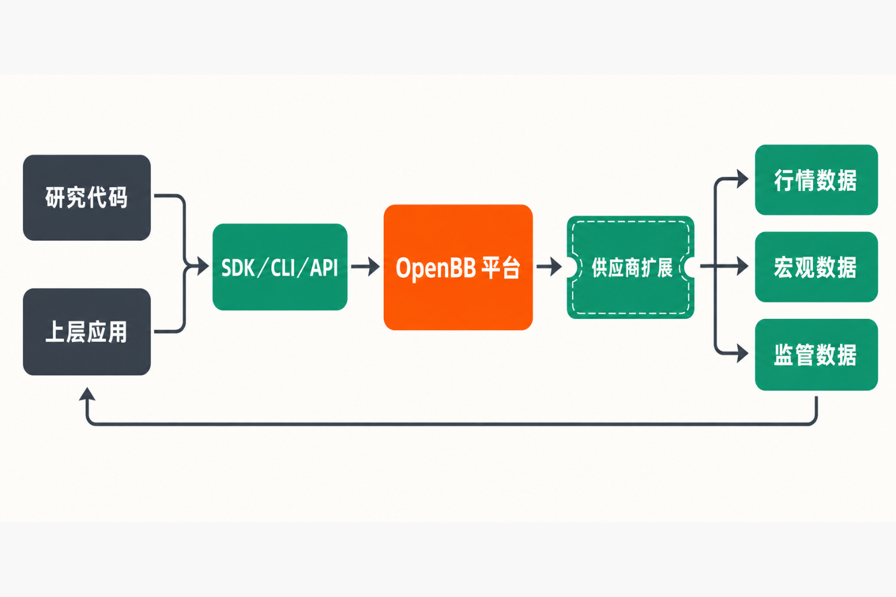

你正在写一套股票研究程序：历史行情来自一个供应商，宏观数据来自另一个，监管文件又要连接第三个。每家服务的密钥、参数、分页规则和返回字段都不同。换一家供应商，不只是修改一个地址，而可能意味着重写数据获取、清洗和异常处理代码。

这正是 OpenBB 想解决的问题。它不是简单增加一个行情界面，而是把分散的金融数据服务封装成统一、可扩展的访问层，让研究人员、量化开发者和上层应用围绕相对稳定的接口工作。[项目 README](https://github.com/OpenBB-finance/OpenBB) 将其定位为面向分析师、量化人员和 AI 智能体的开放数据平台。

## 30 秒认识项目

> **一句话定位：** 用统一的 Python 接口和可插拔扩展，连接多个金融数据供应商，并可进一步作为 API 后端使用。  
> **仓库：** [OpenBB-finance/OpenBB](https://github.com/OpenBB-finance/OpenBB)  
> **许可证：** GNU AGPLv3  
> **主要语言：** Python  
> **活跃度：** 截至 **2026 年 9 月 4 日 08:24（北京时间）**，GitHub 页面显示约 7.5k Fork、53 个开放 Issue、约 58—60 个开放 PR；Star 组件未成功渲染，因此不填报未经核实的数字。develop 分支最近可见提交日期为 2026 年 7 月 20 日。[提交记录](https://github.com/OpenBB-finance/OpenBB/commits/develop/)

这些数字只能说明项目仍有人使用、讨论和提交，不能单独证明代码质量、数据质量或长期维护能力。

## 它真正解决的，是“重复集成”

常见做法有三种：在表格里手工下载数据；直接调用每家供应商的 SDK；或者由团队自建一层内部数据 API。前两种启动快，但随着数据源增加，认证、字段转换、分页和错误处理会不断复制。第三种可控性强，却需要自己维护连接器、接口规范和服务层。

OpenBB 的差异，在于把这些工作组织成一个现成的扩展体系：开发者通过领域化对象路径调用数据，同一个端点可以由不同 provider 实现；需要服务化时，又能把平台作为 FastAPI 后端运行。

**事实是**，它提供统一入口和供应商扩展机制。**不能由此推出**所有供应商的数据完全等价。官方快速入门明确提醒，不同 provider 支持的参数、频率和可选值可能不同。[Python 快速入门](https://docs.openbb.co/odp/python/quickstart)

## 四项核心能力，以及它们的实际价值

### 1. 领域化的统一 Python 接口

调用路径采用类似 `obb.equity.price.historical` 的层级结构。对使用者而言，价值不只是代码更短，而是股票、价格等概念有了可发现的入口；对象树和 docstring 还能帮助查看已安装端点、参数与供应商。

当团队需要替换数据来源时，理想情况下可以保留业务调用结构，只调整 `provider` 和凭据。这里应注意“理想情况下”：供应商能力存在差异，迁移前仍须核对参数和数据语义。

### 2. 可插拔的数据供应商和扩展

OpenBB 把供应商适配和业务领域拆成扩展。实际价值是团队可以按需组合能力，而不必让所有项目绑定同一套庞大依赖；新的数据连接也能沿既有扩展方式接入。

模块化同时带来代价：核心包、领域扩展与 provider 扩展之间形成版本矩阵。一个已关闭的 Issue 曾记录，OpenBB 4.7.1 与部分组件版本不一致时，在全新环境中也会出现动态类型导入错误。[相关 Issue](https://github.com/OpenBB-finance/OpenBB/issues/7475) 不能证明当前版本仍有同一故障，但足以提示生产部署应锁定整套已验证依赖。

### 3. 从 SDK 到自托管 API

除了 Python SDK，仓库还提供 CLI 和 FastAPI 服务入口。安装完整后端后运行 `openbb-api`，默认监听 `127.0.0.1:6900`。这让数据能力可以从个人研究脚本上移为团队共享服务，也可连接 Workspace 或其他上层应用。[仓库说明](https://github.com/OpenBB-finance/OpenBB)

它的实际意义是把“每个分析师各写一套抓取代码”转变为“由一处管理数据连接，上层通过接口消费”。但这仍不是开箱即用的数据治理系统：权限、可用性监控、凭据管理和接口测试仍需部署者负责。

### 4. 面向上层应用与 AI 智能体的连接层

README 明确列出与 Workspace 和 AI 智能体集成的方向。这里最值得关注的并非“AI”标签，而是数据访问能力可以被服务化：上层工具不必分别理解每家金融数据供应商的接口。

**本文的判断是**，OpenBB 更像金融数据基础设施，而非替用户完成投资判断的成品。其价值取决于数据供应商、配置质量和调用方如何验证结果。

## 工作原理：一条可替换的数据访问链



从现有资料能确认的流程是：研究代码或上层应用提出请求，经 Python SDK、CLI 或 FastAPI 入口进入 OpenBB；平台依据领域端点与 `provider` 选择相应供应商扩展；扩展负责连接外部数据源，再把结果返回调用方。

这套结构降低的是接口接入成本，并没有消除底层差异。供应商仍可能需要单独密钥，也可能提供不同参数、频率和数据范围。换句话说，OpenBB 统一了“进入数据的门”，没有保证每扇门后的房间完全相同。

## 安装与最小使用示例

官方安装文档支持 Python 3.10—3.14，并建议使用独立虚拟环境，不要直接安装到系统 Python 或 Conda base 环境；推荐至少 8GB 内存。[安装文档](https://docs.openbb.co/odp/python/installation)

在准备好的独立环境中安装：

```bash
pip install openbb
```

最小 Python 示例：

```python
from openbb import obb

result = obb.equity.price.historical(
    "AAPL",
    provider="yfinance"
)
print(result)
```

首次导入会生成静态资产；在容器或 CI 环境中，官方文档给出的显式构建命令是：

```bash
openbb-build
```

若要安装完整后端并启动 API，README 给出的命令为：

```bash
pip install "openbb[all]"
openbb-api
```

以上示例只说明最小调用路径，不代表任何供应商都无需凭据，也不意味着不同 provider 可返回完全相同的数据。


## 优点、限制与成熟度

OpenBB 的明显优点，是把多供应商适配、Python 调用和 API 服务放进同一套扩展框架；对于需要反复更换或组合金融数据源的团队，它能减少大量重复连接代码。仓库在 2026 年 4—7 月仍有供应商、安全、打包、FastAPI 和桌面端相关提交，说明项目并非静止状态。[提交记录](https://github.com/OpenBB-finance/OpenBB/commits/develop/)

限制也很具体。

第一，平台不保证数据准确，使用者仍须验证来源、时间、复权方式和字段语义，不能把返回值直接等同于投资结论。

第二，供应商凭据和异常处理会影响整体体验。一个截至核实时仍开放的 Issue 显示，缺少 EIA 密钥时，相关端点会返回带 `API_KEY_MISSING` 的 HTTP 500；Workspace 可能把它判断为整个后端故障。[Issue #7628](https://github.com/OpenBB-finance/OpenBB/issues/7628) 这提示部署者只暴露已正确配置的供应商，并对错误响应进行专项测试。

第三，当前仓库标示为 AGPLv3。2026 年 8 月 25 日，创始人 Didier Lopes 宣布公司未找到可持续的商业产品市场契合点，并计划把 Workspace、Open Data Platform、Copilot 和 Excel Add-in 整套产品以宽松许可证开放；但发布时间表和长期治理仍未确定。[官方公告](https://openbb.co/blog/openbb-belongs-to-everyone/) 在新代码和许可证真正发布前，不能把未来承诺当成当前授权条件。

第四，发布页面同时包含 Python 平台和 ODP Desktop，版本号不能混用。页面可见 OpenBB v4.7.0 发布于 2026 年 3 月 9 日，ODP Desktop v1.0.2 发布于 4 月 25 日；后续 Issue 中又出现 4.7.1、4.7.2 环境。[Releases 页面](https://github.com/OpenBB-finance/OpenBB/releases) 因此，部署时应核对具体组件和 PyPI 依赖，而不是只抄一个“最新版本号”。

综合来看，**技术体系已有明确结构和实际使用者，但项目正处于商业模式结束、完整产品开放与治理安排待定的过渡期**。前半句是基于仓库、发布和提交记录的事实判断；“过渡期采用风险更高”则是本文基于官方公告作出的推断。

## 谁适合尝试，谁应该谨慎

它适合需要整合多个金融数据源的 Python 研究人员、量化团队，以及希望搭建内部金融数据 API 或为上层应用提供统一数据入口的工程团队。尤其当“切换供应商”和“复用数据访问代码”是持续需求时，OpenBB 的扩展结构才会体现价值。

它不太适合只想即装即用、完全不处理密钥与依赖的普通投资者；也不适合把数据准确性、合规授权和生产级支持全部外包给框架的机构。若团队无法评估 AGPLv3 义务，或不能承担治理变化与依赖兼容风险，也不应直接进入核心生产链路。

## 结语：值得试，但应从可替换层开始

OpenBB 值得技术型金融用户试用，理由不是 Fork 数量，而是它抓住了金融数据工程中长期存在的重复集成问题，并给出从 SDK 到 API 的统一路径。

更稳妥的采用方式，是先在独立环境中接入一两个明确的数据端点，验证字段、凭据、错误响应和 provider 切换，再锁定依赖版本；把它放在可替换的数据访问层，而不是立即作为不可迁移的唯一基础设施。对于金融数据工具，“接口统一”是起点，数据核验、许可证审查和持续维护才决定它能否真正进入生产环境。

## 参考资料

1. [OpenBB-finance/OpenBB 项目仓库](https://github.com/OpenBB-finance/OpenBB)
2. [OpenBB Python 安装文档](https://docs.openbb.co/odp/python/installation)
3. [OpenBB Python 快速入门](https://docs.openbb.co/odp/python/quickstart)
4. [OpenBB Releases](https://github.com/OpenBB-finance/OpenBB/releases)
5. [develop 分支提交记录](https://github.com/OpenBB-finance/OpenBB/commits/develop/)
6. [Issue #7628：缺少供应商凭据时的 HTTP 状态问题](https://github.com/OpenBB-finance/OpenBB/issues/7628)
7. [Issue #7475：组件版本不一致导致的导入问题](https://github.com/OpenBB-finance/OpenBB/issues/7475)
8. [OpenBB belongs to everyone](https://openbb.co/blog/openbb-belongs-to-everyone/)
