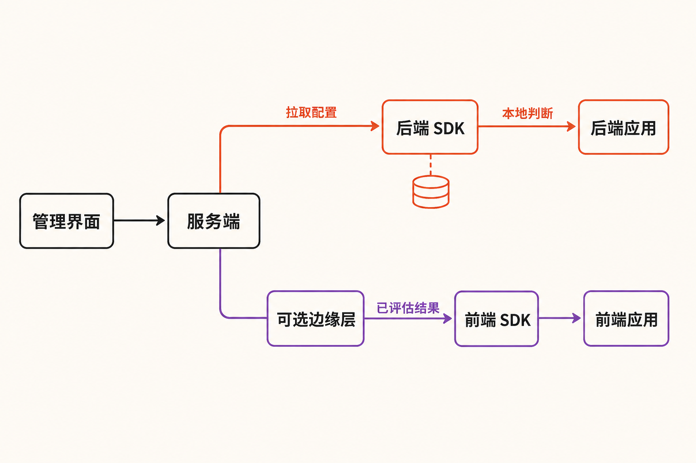

周五下午，新版代码已经部署，团队却发现一个新功能在部分账户上触发异常。传统处理方式通常只有两种：紧急回滚整个版本，或者连夜修复、重新构建和部署。前者会连带撤回本来正常的改动，后者则把一次产品事故变成一场工程抢修。

如果能在不重新部署代码的情况下，只关闭出问题的功能，事情会简单很多。这正是功能开关（feature flag）要解决的问题，也是开源项目 Unleash 的核心价值：把“代码是否已经进入生产环境”与“用户是否能看到某项功能”拆成两个独立决定。

## 30 秒认识项目

- **一句话定位**：以功能开关为核心、支持自托管的开源功能管理平台
- **仓库地址**：[Unleash/unleash](https://github.com/Unleash/unleash)
- **许可证**：当前主仓库为 AGPL-3.0-or-later
- **主要语言**：TypeScript；后端位于 `src/`，React 前端位于 `frontend/`
- **最新正式版本**：v8.1.0，发布于 2026 年 8 月 5 日
- **活跃度**：约 13.8k Stars、890 Forks、73 Watchers、16,316 次提交；最新可见主分支提交日期为 2026 年 8 月 7 日
- **数据核实时间**：2026 年 9 月 5 日 08:12（北京时间）

以上仓库数字会持续变化。Star 可以反映关注度，却不能单独证明软件质量、安全性或是否适合生产环境。更有意义的成熟度信号，是近期仍有正式版本、多人提交，以及功能、修复、测试和依赖升级等持续维护活动。[版本记录](https://github.com/Unleash/unleash/releases)与[主分支提交历史](https://github.com/Unleash/unleash/commits/main/)共同显示，项目目前仍在活跃演进。


## 它解决的不是“写一个 if”，而是管理大量 if

一个最简功能开关，无非是：条件成立就运行新逻辑，否则走旧逻辑。困难出现在开关越来越多之后：谁能修改生产环境策略？新功能只开放给哪些用户？旧开关何时清理？一次错误修改能否追溯？不同应用和语言怎样获得一致规则？

Unleash 将这些问题集中到服务端和管理界面中处理，应用则通过 SDK 获取配置并做判断。它支持按用户、群组、环境和约束定向开放，也覆盖灰度或金丝雀发布、紧急关闭、A/B 测试、标签、审计事件以及过期开关管理。[官方仓库](https://github.com/Unleash/unleash)列出的能力表明，它的目标不是提供一个布尔值存储器，而是建立功能发布的治理层。

与几种常见替代方案相比，差异更清楚：

- **配置文件或环境变量**足以应付少量、低频开关，但修改往往要经过配置发布或应用重启，也缺少面向产品发布的分群、审计和生命周期管理。
- **自行维护数据库开关表**起步简单，却要自己处理缓存、鉴权、多环境、SDK、规则计算和失效策略；规模扩大后，维护成本会转移到业务团队。
- **直接用发布或回滚系统控制**管理的是整个构建产物，粒度通常大于单项功能，难以表达“只向某类用户逐步开放”。
- **通用动态配置系统**覆盖面更广，但未必内建功能实验、激活策略和技术债治理。反过来，Unleash 也不应被推断为通用配置中心；其社区讨论显示，多站点复制与部分动态配置场景并非开箱即用能力。

这里的判断是：Unleash 的真正差异不在“能开关功能”，而在于把发布控制变成一套独立、可审计且跨技术栈的工程能力。

## 四项核心能力，分别带来什么价值

### 1. 定向与渐进式发布

团队可以利用激活策略、约束和分群，只向特定用户或一定比例流量开放功能。实际价值是缩小故障半径：先让内部人员或少量用户验证，再逐步扩大范围，而不是把整个用户群当作第一批测试者。

这也让部署时间与业务发布时间分离。代码可以提前随常规版本进入生产环境，产品团队在条件满足时再启用功能。但开关不是质量保障的替代品；它降低上线风险，不会自动修复错误代码。

### 2. Kill switch 与运行期止损

当新路径发生异常时，可以关闭对应功能，而不用等待重新构建和部署。对于包含多项改动的大版本，这比整体回滚更精细，也避免撤销无关功能。

需要注意的是，“关闭”并非绝对实时。官方架构文档说明，配置传播通常存在数秒且可配置的延迟。因此，Unleash 适合发布控制，却不是强一致的紧急制动系统；若业务要求瞬时、强一致地阻止资金操作或权限访问，仍需独立的服务端安全校验。[官方架构说明](https://docs.getunleash.io/get-started/unleash-overview)

### 3. 多环境、审计与开关生命周期

开发、测试和生产环境可以采用不同策略；标签和审计事件帮助团队回答“谁在何时改变了什么”。过期与技术债管理则针对功能开关的常见副作用：临时分支如果长期不删，会让测试组合和代码复杂度不断上升。

v8.1.0 继续改进了项目状态概览、功能开关生命周期和归档视图。这表明项目已经把“如何清理开关”视为平台能力，而不只是文档建议。[v8.1.0 发布记录](https://github.com/Unleash/unleash/releases)

### 4. 跨语言 SDK 与可选 Edge

官方覆盖 Node.js、Go、Java、Python、.NET、PHP 等后端生态，以及 JavaScript、React、iOS、Android等前端平台。多语言组织由此可以共享控制平面，而不必让每个团队重新实现协议和缓存逻辑。

可选的 Unleash Edge 能承接大量 SDK 连接，改善性能、韧性及前端隐私。不过，社区已有问答指出，部分 Client API endpoint 不能经 Edge 访问。因此不能把 Edge 当成完全透明的服务器代理；采用前应逐项核验依赖的接口。[官方讨论区](https://github.com/orgs/Unleash/discussions)

## 它怎样工作：控制集中，判断尽量靠近应用

Unleash 的架构重点，不是让每一次 `isEnabled` 都跨网络查询中央服务。



对于后端应用，SDK 从 Unleash Server 的 Client API 获取相关开关配置，在应用进程内缓存，并在本地应用激活策略。这样，正常判断不必逐次访问服务器或数据库。即使服务器或网络短暂不可用，已经初始化的 SDK 仍可依据最近一次缓存继续工作，只是无法收到新配置。

前端和移动端的边界不同。它们通过 Frontend API 获取针对特定 Unleash Context 已经评估的结果，计算发生在 Unleash Server 或 Edge，避免把不必要的规则和敏感信息直接交给客户端。管理界面则通过 Admin API 修改项目、开关和策略。

流程可以概括为：管理员在管理界面配置规则，Server 保存并分发配置；后端 SDK 拉取后本地判定，前端 SDK 获取服务端或 Edge 已评估的结果，应用再依据结果选择新旧路径。[官方 SDK 文档](https://docs.getunleash.io/sdks)

这种设计提高了可用性，但首次启动仍是风险点：若 SDK 没有 bootstrap，启动时又连不上服务器，开关通常会回落为 disabled 或调用方指定的默认值。生产接入应等待初次同步，并为每个判断设计安全默认行为。

## 可复制的本地安装与最小使用方式

纯开源自托管的最短体验路径来自仓库 README。先安装 Git 与 Docker，然后执行：

```bash
git clone git@github.com:Unleash/unleash.git
cd unleash
docker compose up -d
```

浏览器访问：

```text
http://localhost:4242
```

本地演示账号为 `admin`，密码为 `unleash4all`。这组凭据只适合本地体验，不能照搬到可被外部访问的环境。完成登录后，可在 Default 项目中创建 feature flag，再按应用类型创建相应 API token。

应用侧最核心的判断形式是：

```javascript
if (unleash.isEnabled("AwesomeFeature")) {
  // 新功能路径
} else {
  // 旧功能或安全回退路径
}
```

前端接入时，官方 Quickstart 使用 `unleash-proxy-client` 的 `UnleashClient`，配置 `url`、`clientKey` 和 `appName`，等待 `synchronized` 事件后再调用 `isEnabled("some-flag")`。Frontend API 地址是实例基础地址加 `/api/frontend`。[官方快速入门](https://docs.getunleash.io/get-started/quickstart)

安全边界必须强调：浏览器代码只能使用 frontend API token，不能暴露后端 Client token，更不能暴露 Admin token。不同 SDK 的完整初始化代码和 bootstrap 方法有所不同，应以对应 SDK 文档为准。

## 优点、限制与成熟度：需要同时看

**优点方面**，Unleash 将发布控制从部署管线中解耦；SDK 本地缓存和本地判定降低了日常调用延迟及中央服务短暂故障的影响；多环境、审计和生命周期管理又使它能够服务多个团队，而不止单个应用。自托管能力对数据边界和基础设施控制要求较高的组织也有吸引力。

**限制方面**，它不是强一致实时系统，配置会有传播延迟；Edge 也不是所有 API 的透明替代层。开关数量增加后，命名、负责人、默认值、到期时间和删除流程都需要组织治理，否则平台只会把散落在代码里的复杂度搬到控制台中。

**许可证是升级时必须重新评估的变量。**从 v8.0.0 起，主仓库源码和 `unleash-server` npm 包由 Apache-2.0 转为 AGPLv3。官方预构建开源 Docker 镜像及各 SDK仍可能采用各自较宽松的许可证，但具体部署、修改和分发方式应分别核验，不能沿用旧版本结论。v7 升 v8 还需要阅读迁移指南，因为部分已弃用 schema 属性被移除。[官方版本说明](https://github.com/Unleash/unleash/releases)

**风险方面**，截至 2026 年 9 月 5 日，Issue 页面显示 25 个开放问题。其中一项尚未关闭的用户报告称，更新 CORS origins 后，旧缓存可能最多保留约两分钟。另一个报告针对 OSS Docker 8.0.3 镜像的 Projects 页面静态文件问题，不能外推到 v8.1.0。开放 Issue 只代表有人报告且尚未关闭，并不等于维护者已经复现或所有版本均受影响；它们更适合作为上线前测试清单，而不是直接定性。[Unleash Issues](https://github.com/Unleash/unleash/issues)

综合 Release、提交历史和功能完整度，可以把 Unleash 判断为持续维护、产品形态较完整的项目；但“成熟”不等于免运维，更不意味着默认配置适合直接暴露到公网。

## 适合谁，不适合谁

Unleash 更适合这些团队：拥有多个服务或多种语言栈；频繁发布并需要灰度、定向开放或快速关闭能力；希望自托管控制数据与基础设施；并且愿意建立开关负责人、命名、审计和清理制度。

它不一定适合只有一两个低频开关的小型应用，因为部署和维护独立平台可能大于收益；也不适合把功能开关当作访问控制、计费校验或强一致风控机制的场景。若组织无法持续清理过期开关，接入平台还可能增加长期复杂度。需要完整透明代理、多站点复杂拓扑或通用动态配置的团队，也应先做针对性验证。

## 结语：值得试，但先把治理问题想清楚

Unleash 值得需要渐进式发布和自托管能力的团队进入技术验证名单。它最有价值的地方，不是控制台上多了几个开关，而是重新划分了部署、发布和止损三件事的边界。

建议从一个风险可控、存在新旧两条路径的功能开始试点：验证 SDK 首次同步与断网回退，测量配置传播时间，检查 token 权限，并明确谁负责删除开关。若这些流程能够落地，Unleash 才会成为发布基础设施；否则，它只会变成另一套需要维护的系统。

## 参考资料

1. [Unleash/unleash 官方仓库与 README](https://github.com/Unleash/unleash)
2. [Unleash Releases](https://github.com/Unleash/unleash/releases)
3. [Unleash main 分支提交历史](https://github.com/Unleash/unleash/commits/main/)
4. [Unleash architecture overview](https://docs.getunleash.io/get-started/unleash-overview)
5. [Unleash Quickstart](https://docs.getunleash.io/get-started/quickstart)
6. [Unleash SDK overview](https://docs.getunleash.io/sdks)
7. [Unleash Issues](https://github.com/Unleash/unleash/issues)
8. [Unleash Discussions](https://github.com/orgs/Unleash/discussions)
