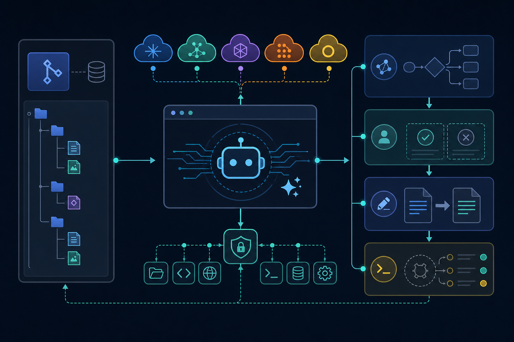

接手一个陌生仓库时，真正耗时的往往不是写代码，而是先弄清目录结构、调用链和工程约定。普通聊天工具可以回答问题，却未必能直接读取项目、制定修改计划，并在授权后编辑文件或执行命令。

OpenCode 想解决的正是这段断层：让 AI 不只“谈论代码”，而是进入开发工作流。不过，它不是一个编程模型，而是一套连接代码库、模型和本地工具的开源代理系统。

## 30 秒认识项目

- **一句话定位：**可在终端、桌面应用和 IDE 中运行的开源 AI 编程代理。
- **仓库地址：**[anomalyco/opencode](https://github.com/anomalyco/opencode)
- **许可证：**[MIT License](https://github.com/anomalyco/opencode/blob/dev/LICENSE)，允许商业使用、修改和分发，但须保留版权及许可声明。
- **主要语言：**TypeScript；仓库还包含 MDX、CSS 等。语言占比会随提交变化。
- **活跃度：**截至 **2026 年 7 月 30 日 18:12（北京时间）**，仓库页面显示约 15,230 次提交、3,700 个开放 Issue、1,100 个 PR 和 24,300 个 Fork；Star 数未能可靠核实，本文不采用。最新可核实版本为 [v1.18.9](https://github.com/anomalyco/opencode/releases)，发布于 2026 年 7 月 28 日。

这些数字属于可核实事实，但不能直接证明软件质量。较合理的推断是：项目关注度和开发活动都很高，同时也存在较大的维护与问题处理压力。

## 它解决的不是“问代码”，而是“推进任务”

传统代码聊天的典型链路是：开发者复制上下文，模型生成答案，再由人手动修改和验证。OpenCode 则可读取工程上下文、创建计划，并在权限允许时编辑文件和调用 Bash。执行位置也不局限于一个产品界面：官方提供终端界面、桌面应用和 IDE 扩展。[官方入门文档](https://opencode.ai/docs/)将它描述为面向终端的 AI coding agent。

另一个差异是模型选择权。OpenCode 不把使用者锁定在单一模型上，可以连接托管 API、模型网关、本地推理服务以及自定义的 OpenAI 兼容端点；官方文档列出了 Anthropic、OpenAI、Google、Bedrock、OpenRouter，以及 Ollama、LM Studio、llama.cpp 等接入方式。[提供商文档](https://opencode.ai/docs/providers)

> **推断：**与绑定单一模型的工具相比，这种架构更方便团队按成本、隐私或任务能力切换后端。代价则是配置和排障链条更长，最终效果也更依赖所选模型。

## 四项核心能力，以及它们的实际价值

### 1. 先规划，再动手

内置主代理包括 Build 与 Plan。Plan 对文件编辑和 Bash 默认要求确认，适合先分析需求、拆解步骤；Build 则拥有实施开发任务所需的工具。

实际价值在于把“理解方案”和“修改仓库”分开。面对重构、迁移或不熟悉的项目，可以先检查计划，再决定是否授予执行权限，减少模型一上来就改文件的风险。[代理与权限文档](https://opencode.ai/docs/agents/)

### 2. 细粒度权限控制

权限可设为 `ask`、`allow` 或 `deny`，并分别覆盖读取、编辑、Bash、子任务、网络搜索、LSP、技能及外部目录访问等能力。创建自定义代理时，遗漏的权限默认拒绝。

这意味着团队可以让代码解释代理只读，让实施代理编辑特定项目，同时对命令执行保留人工确认。权限不是附属设置，而是 OpenCode 的关键安全边界。

### 3. 多代理分工

除 Build、Plan 外，项目还提供 General、Explore 和 Scout 等子代理，主代理可以调用它们，使用者也能通过 `@` 手动指定。

它的价值不是简单增加多个聊天角色，而是把仓库探索、通用调查和具体实施分给不同配置，并为它们设置不同模型、提示词与权限。对于较大的代码库，这比让一个代理承担所有步骤更容易控制职责范围。

### 4. 交互工具，也能成为集成层

不带参数运行 `opencode` 会进入 TUI；CLI 还提供 `run`、`serve`、`web`、ACP、MCP、会话导入导出、插件及升级等命令。[CLI 文档](https://opencode.ai/docs/cli/)

因此，它既可以供开发者交互使用，也可以进入脚本或其他工具链。需要强调的是，“具备集成接口”是事实；是否适合无人值守的生产自动化，则取决于权限、模型稳定性和团队验证机制。

## 它是怎样工作的



根据官方文档，可以把基本流程概括为：

> **进入代码目录 → 启动 OpenCode → 连接模型提供商 → 选择模型 → 初始化项目上下文 → 由代理读取和分析代码 → 生成计划或申请工具权限 → 人工确认后编辑文件、执行命令。**

`/init` 会分析项目并在根目录生成 `AGENTS.md`，用于沉淀项目约定。凭据可通过环境变量引用，无须直接写入项目配置。这里应特别区分：OpenCode 负责组织上下文、代理、权限和工具调用；推理能力、费用、数据路径及工具调用兼容性，仍由所选模型和提供商共同决定。

## 安装与最小使用示例

官方推荐的安装脚本是：

```bash
curl -fsSL https://opencode.ai/install | bash
```

也可以通过 npm 安装：

```bash
npm install -g opencode-ai
```

随后进入现有项目并启动：

```bash
cd /path/to/project
opencode
```

在 TUI 中依次执行：

```text
/connect
/init
```

前者配置模型提供商，后者初始化项目上下文。若只想验证非交互调用，可使用官方 CLI 示例：

```bash
opencode run "Explain how closures work in JavaScript"
```

Windows 用户需要注意，官方建议优先在 WSL 中使用，以获得更完整的兼容性。安装与命令均来自[官方入门文档](https://opencode.ai/docs/)及[官方 CLI 参考](https://opencode.ai/docs/cli/)。

## 优点、限制与潜在风险


OpenCode 的主要优点很明确：代码开源且采用 MIT 许可；不绑定单一模型；交互入口较丰富；代理和工具权限可以细分；既支持本地探索，也预留了服务化与集成接口。

但它仍处于快速演进阶段。截至核实日，发行页在较短时间内连续出现 v1.18.5 至 v1.18.9。v1.18.9 仍在修复旧版 MCP SDK 兼容性、桌面端崩溃、会话加载和导航问题。高频发布说明维护活跃，却也意味着升级前需要回归验证。

社区还曾提出[稳定发布通道问题](https://github.com/anomalyco/opencode/issues/14357)，认为频繁补丁会增加下游打包和缺陷复测压力。该 Issue 已因重复而关闭，它只能证明社区存在这类诉求，不能证明相关方案已经落地。

更直接的风险来自代理权限：一旦允许编辑或 Bash，模型就能真实改变工作区、运行命令。API 调用还可能产生费用，并将上下文发送给外部提供商。MIT 的“按现状提供”条款也不保证生成代码正确、安全或适合生产环境。

> **本文观点：**团队使用时应固定版本、先用 Plan 或只读权限、限制外部目录访问、避免把密钥写进配置，并对修改和命令进行人工审查。关键仓库还应配合版本控制、测试与独立代码审查。

## 谁适合尝试，谁不适合

OpenCode 适合熟悉终端、希望在多个模型之间切换，并愿意主动管理权限与成本的开发者；也适合需要研究代码库、规划改造或搭建自定义代理流程的技术团队。

它不太适合期待“安装后全自动正确交付”的用户，也不适合无法审查代码和命令、不能接受外部模型处理代码，或要求长期版本极其稳定却没有升级验证能力的环境。

## 结语：值得试，但要把它当工具系统而非魔法

OpenCode 值得尝试的地方，不是仓库数字亮眼，而是它把模型选择、代码上下文、代理分工和权限控制放进了一条可配置的开发链路。

我的结论是：个人开发者可以从只读问答和 Plan 模式开始；团队则适合先在非关键仓库小范围验证。它已经具备较完整的产品形态，但快速迭代和真实工具权限意味着，使用者仍需承担版本治理、安全审查和结果验证责任。

## 参考资料

1. [GitHub：anomalyco/opencode 主仓库](https://github.com/anomalyco/opencode)
2. [OpenCode 官方入门文档](https://opencode.ai/docs/)
3. [OpenCode CLI 文档](https://opencode.ai/docs/cli/)
4. [OpenCode Agents 文档](https://opencode.ai/docs/agents/)
5. [OpenCode Providers 文档](https://opencode.ai/docs/providers)
6. [GitHub Releases](https://github.com/anomalyco/opencode/releases)
7. [MIT License 原文](https://github.com/anomalyco/opencode/blob/dev/LICENSE)
8. [社区 Issue：Stable Branch Release](https://github.com/anomalyco/opencode/issues/14357)
