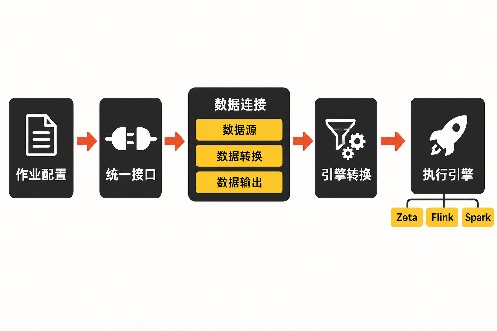

一家公司要把 MySQL 业务库同步到数仓，同时接入 Kafka 实时数据，再将历史文件导入湖仓。真正棘手的往往不是“搬一次”，而是长期维护：数据源协议不同，批处理与实时任务割裂，字段变化会让链路中断，失败恢复和状态监控也各有一套逻辑。

如果每条链路都用独立脚本或针对某个引擎单独开发，连接数量增加后，维护成本很容易变成连接数、引擎数与业务规则的乘积。Apache SeaTunnel 试图解决的，正是这种异构数据集成的工程复杂度。

## 30 秒认识项目

- **一句话定位：**面向批处理、流处理、CDC 和多模态数据摄取的分布式数据集成工具。
- **仓库地址：**[apache/seatunnel](https://github.com/apache/seatunnel)
- **许可证：**Apache License 2.0
- **主要语言：**Java，仓库还包含 Shell、前端与配置等辅助代码。
- **执行引擎：**内置 SeaTunnel Zeta Engine，也可适配 Apache Flink 和 Apache Spark。
- **最新稳定版本：**2.3.13，GitHub 发布页显示发布时间为 2026 年 3 月 14 日 02:52，页面未明确时区。[查看 Releases](https://github.com/apache/seatunnel/releases)
- **活跃度：**截至 **2026 年 8 月 11 日**，仓库约有 9.5k Stars、2.3k Forks、406 个开放 Issues、255 个 Pull Requests和 5,927 次提交。

这里需要强调：Star 和 Fork 只能反映关注度，不能直接证明稳定性。版本更新、提交活动以及问题处理情况，才更接近项目成熟度的真实侧面。


## 它解决的不是“复制数据”，而是连接复杂度

SeaTunnel 将一次数据任务抽象为 Source、Transform 和 Sink：从数据源读取，在中间完成必要转换，再写入目标端。官方称其连接器超过 160 个，覆盖数据库、文件、消息系统和湖仓；这是项目方统计口径，选型时仍需逐个核对所需连接器的功能矩阵。

与常见方案相比，它的差异主要在三个层面。

第一，相比自行编写 Python、Shell 或数据库脚本，SeaTunnel 提供统一配置、插件体系、并行执行及容错机制，更适合持续运行和规模化维护。代价是团队要承担引擎部署、插件管理和兼容性验证工作。

第二，相比直接围绕 Flink 或 Spark 编写数据集成程序，它把连接器逻辑与底层引擎解耦。同一套连接器 API 可以由 Zeta、Flink 或 Spark 执行。新用户并不必须先建设 Flink 或 Spark 集群，官方 FAQ 建议优先从 Zeta Engine 开始。

第三，它不是完整的数据开发与调度平台。周期任务可以交给 cron，复杂依赖和工作流则需要 Apache DolphinScheduler、Apache Airflow 等外部调度系统。[官方 FAQ](https://seatunnel.apache.org/docs/faq/)明确说明了这一边界。

## 四项核心能力，价值分别在哪里

### 1. 批流一体，减少两套链路

SeaTunnel 同时覆盖批量迁移、实时同步和 CDC。实际价值不是概念上的“统一”，而是团队可以用相近的作业模型描述离线导入和持续变更捕获，减少批、流两套工具带来的配置与运维分裂。

不过 CDC 存在明确前提：官方 FAQ 表示不支持无主键表，因为下游无法唯一定位重复记录中需要更新或删除的那一行。这不是简单调一个参数就能绕开的限制。

### 2. 插件化连接器，降低系统接入成本

Source、Transform、Sink 使用统一 API，插件发现与类加载机制负责扩展和隔离连接器。新增数据端时，团队优先面对的是一个连接器，而不是重新开发完整执行框架。

它也支持结构化文本、非结构化文本、图片、视频和二进制文件。2.3.13 又增加了多模态 Embedding Transform，以及面向 RAG 的 Markdown 文件解析。**事实是项目能力已向多模态数据集成扩展；至于它能否替代专门的 AI 数据管线，则必须通过具体文件格式、吞吐和目标向量库进行验证，现有材料不足以得出肯定结论。**

### 3. 多表与整库同步，适合迁移型任务

对于数据库迁移，如果每张表分别配置任务，表数量一多，配置和状态管理都会膨胀。SeaTunnel 提供多表、整库同步和 Schema Evolution 相关能力，价值在于让一组表共享迁移流程，并能应对一定范围的结构变化。

但自动建表、清理历史数据等行为取决于具体 Sink 是否支持相应的 `schema_save_mode` 和 `data_save_mode`。因此“支持整库同步”不能被理解成所有目标端都具备完全相同的建表与演进能力。

### 4. 容错与状态机制，让任务能够恢复

官方架构资料列出分布式快照和两阶段提交；2.3.13 还加入 Checkpoint API 与 checkpoint 最小暂停间隔。这些能力为长时间运行、故障恢复和一致性控制提供了基础。

但端到端 exactly-once 并不是无条件保证。它同时取决于 Source、Sink 连接器以及底层数据库能力。正确的选型问题不应是“SeaTunnel 是否支持 exactly-once”，而应是“这组源端、目标端和写入模式能否共同实现”。

## 一条任务如何运行

根据[官方架构概览](https://seatunnel.apache.org/docs/architecture/overview/)，SeaTunnel 可以分为配置层、API 层、连接器层、Translation 层和 Engine 层。

用户先通过 HOCON、JSON 或 SQL 表达作业；统一的 Source、Transform、Sink API 定义数据读取、转换和输出；Translation 层将作业转换为目标引擎可以执行的形式；最终由 Zeta、Flink 或 Spark 运行。连接器因此不必与某一种执行引擎永久绑定。



从数据流视角看，流程可以简化为：**作业配置 → Source 读取 → Transform 转换 → Sink 写入**，执行引擎负责调度、并行运行及相应的状态管理。这个解耦结构，是 SeaTunnel 最值得关注的设计，而不只是连接器数量。

## 用官方最小示例跑通链路

官方快速开始要求安装 Java 8 或 Java 11，并正确设置 `JAVA_HOME`。下载并解压 SeaTunnel 发布包后，进入对应目录；最小示例需要安装 Fake 和 Console 连接器。

```bash
cd "apache-seatunnel-${version}"
sh bin/install-plugin.sh
```

随后运行发布包自带的批处理模板：

```bash
./bin/seatunnel.sh --config ./config/v2.batch.config.template -m local
```

该模板采用 `BATCH` 模式和并行度 1：FakeSource 生成 16 行包含 `name`、`age` 的数据，FieldMapper 把 `name` 映射为 `new_name`，最后由 Console 输出。它覆盖了 Source、Transform、Sink 三个关键环节，适合确认 Java 环境、插件安装和本地执行链路是否正常。[官方 Quick Start](https://seatunnel.apache.org/docs/getting-started/locally/quick-start-seatunnel-engine/)还提示，从 2.3.1 起 `-e` 已弃用，应使用 `-m`。

这只是本地验证，并不等于生产部署。多节点运行、资源隔离以及接近生产的容错测试，需要继续采用 Zeta 集群部署方案。

## 优点、限制与潜在风险

**优势是明确的：**数据连接器覆盖面广；批、流、CDC 使用统一模型；连接器和执行引擎解耦；新用户可以直接采用内置 Zeta，而不必先部署 Flink 或 Spark。2.3.12 到 2.3.13 的连续发布，加上数千次提交，也支持“项目仍在维护”这一判断。

**限制同样具体：**它缺少完整工作流调度；CDC 要求主键；exactly-once、自动建表、数据清理与 Schema 演进都依赖连接器和底层系统；JDBC Sink 使用自定义 `query` 时，save mode 处理不会生效，而且 `query` 不应与 `generate_sink_sql` 同时配置。

运维上还要避免只盯着任务状态。一个[已关闭的 Doris Sink Issue](https://github.com/apache/seatunnel/issues/9355)记录了特定场景：2.3.10 的 Zeta 批任务遇到 HTTP 307 后抛出异常，但任务仍显示 Running，处理速率已降为零。页面没有关联修复 PR，因此不能仅凭关闭状态断言某版本已经修复；也不能把该问题外推到所有连接器。它更实际的启示是：告警应同时覆盖任务状态、吞吐率、错误日志和 Sink 提交结果。

GitHub Discussions 中还有作业停滞、Oracle CDC 等未获回复的用户报告。由于维护者明确表示 Discussions 不是重点维护渠道，这些内容只能视为待复现的风险线索，不能当作确认缺陷。正式评估应继续核对对应 Issue、修复 PR 和 Release Note。

## 适合谁，不适合谁

SeaTunnel 更适合需要连接多种数据库、消息系统、文件和湖仓，且同时存在批量迁移、CDC 或长期同步任务的团队；也适合已经使用 Flink、Spark，或希望从较轻量的 Zeta 起步、同时保留执行引擎选择权的组织。

它不太适合只做一次性、小规模文件复制的团队；也不适合期待一个产品同时包办数据建模、复杂调度、血缘治理和可视化开发的组织。如果核心业务依赖无主键表 CDC，或要求所有目标端无条件提供 exactly-once，它也不是可以直接套用的答案。

## 结语：值得试，但应以连接器组合为评估单位

**本文观点：SeaTunnel 值得进入数据集成工具的候选清单。**它最有价值的地方，是用统一 API 和插件结构隔离异构系统与执行引擎，而非“拥有很多连接器”这一单项数字。

但尝试方式应该务实：先用官方 FakeSource—Transform—Console 示例验证环境，再选择一条真实业务链路，逐项验证源端读取、目标端提交、Schema 变化、断点恢复和告警。最终决定能否上生产的，不是仓库 Star 数，也不是总体功能表，而是你实际使用的那组 Source、Transform、Sink 能否在目标版本下稳定协作。

## 参考资料

1. [apache/seatunnel 项目仓库与 README](https://github.com/apache/seatunnel)
2. [Apache SeaTunnel README 原文](https://raw.githubusercontent.com/apache/seatunnel/dev/README.md)
3. [Quick Start With SeaTunnel Engine](https://seatunnel.apache.org/docs/getting-started/locally/quick-start-seatunnel-engine/)
4. [SeaTunnel Architecture Overview](https://seatunnel.apache.org/docs/architecture/overview/)
5. [Apache SeaTunnel Releases](https://github.com/apache/seatunnel/releases)
6. [Apache SeaTunnel FAQ](https://seatunnel.apache.org/docs/faq/)
7. [apache/seatunnel Discussions](https://github.com/apache/seatunnel/discussions)
8. [Doris Sink HTTP 307 后任务仍为 Running：Issue #9355](https://github.com/apache/seatunnel/issues/9355)
