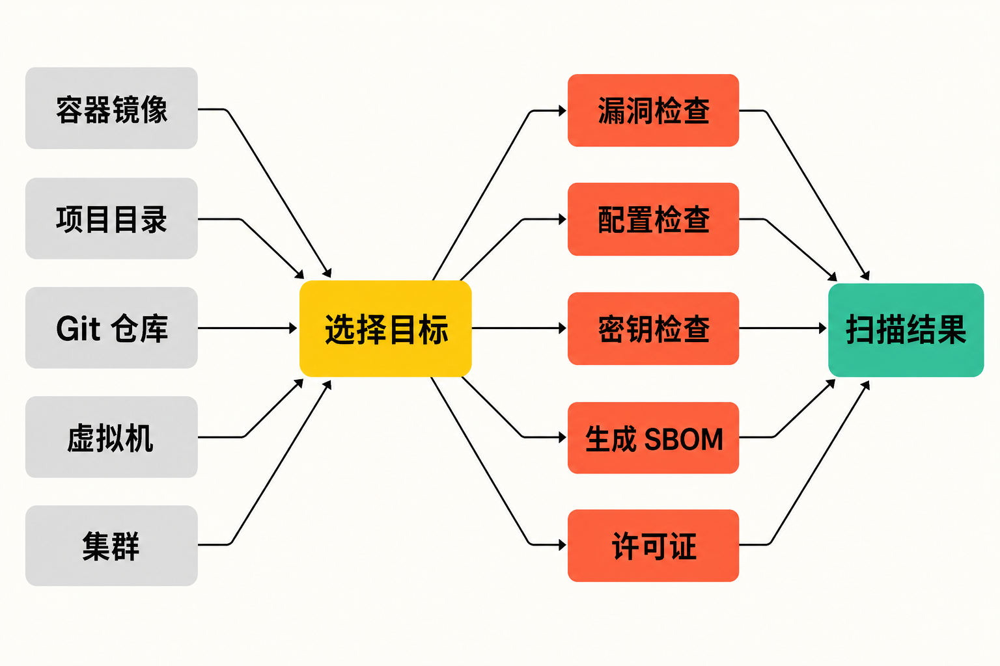

一个常见的软件交付场景是：开发者提交代码后，团队要检查依赖漏洞；镜像构建完成，又要检查操作系统包；部署前还需排查 Kubernetes 或 IaC 配置；如果担心密钥误提交，还得增加另一套检测。

问题不只是“缺少扫描器”，而是扫描对象、规则和输出分散在不同工具与流水线阶段。维护成本随工具数量增长，同一个问题也可能在代码仓库、镜像和集群中被重复发现，却没有统一入口。

Trivy 试图解决的正是这种碎片化：将不同目标和不同安全检查组织在一套命令模型中。不过，“覆盖面广”不等于“装上就安全”。理解它能检查什么、如何运行以及发布链路曾经发生过什么，比单看 Star 数更重要。

## 30 秒认识项目

- **一句话定位：**Aqua Security 维护的开源综合安全扫描器，可面向容器镜像、文件系统、远程 Git 仓库、虚拟机镜像和 Kubernetes，检查漏洞、错误配置、密钥、SBOM 与许可证信息。
- **仓库地址：**[aquasecurity/trivy](https://github.com/aquasecurity/trivy)
- **许可证：**Apache License 2.0
- **主要语言：**Go
- **最新版本：**截至 2026 年 8 月 14 日核实，GitHub 标记的 Latest 为 [v0.73.0](https://github.com/aquasecurity/trivy/releases/tag/v0.73.0)，发布于 2026 年 8 月 3 日。
- **活跃度快照：**截至 2026 年 8 月 14 日 08:11（UTC+8），仓库约有 37.4k Stars、590 Forks、163 个开放 Issue、78 个开放 Pull Request和 4,179 次提交；v0.73.0 发布后，main 分支又出现 20 次提交。

**事实边界：**这些数字只能说明关注度、协作规模和近期仍有维护活动，不能证明扫描准确率、代码质量或供应链安全。


## 它解决的不是单点漏洞，而是检查入口碎片化

Trivy 的官方功能边界可以概括为五类：识别操作系统包和软件依赖、匹配已知漏洞、发现 IaC 错误配置、查找敏感信息或密钥，并生成或读取软件物料清单及许可证信息。[项目 README](https://raw.githubusercontent.com/aquasecurity/trivy/main/README.md) 给出的通用命令结构是：

```bash
trivy <target> [--scanners <scanner1,scanner2>] <subject>
```

这里有两个相对稳定的维度：`target` 表示扫描对象，`scanners` 表示要启用的检查能力。因此，团队不必为“扫描镜像”和“扫描项目目录”重新学习完全不同的交互方式。

与常见的多个单用途工具组合相比，Trivy 的差异并非宣称每个检查项都更强，而是把多个安全信号放进统一的目标—扫描器模型。

**编辑观点：**这种统一入口的实际价值，主要是降低流水线接入和维护复杂度。它不能替代团队对结果的复核，也不意味着所有专项工具都可以被移除。是否整合，应由目标覆盖、误报处理和组织现有流程共同决定。

## 四项核心能力，分别有什么实际价值

### 1. 从依赖清单走到漏洞定位

Trivy 能识别操作系统包与软件依赖清单，并检查已知 CVE。实际价值在于：同一套工具既可以面向项目文件系统，也可以面向已经构建好的容器镜像。

这让安全检查可以前移到代码阶段，也能在交付物阶段再次确认。不过，漏洞匹配依赖扫描时获得的依赖信息；当依赖树不完整，结论也会受到影响。

### 2. 把 IaC 错误配置纳入提交检查

项目目录扫描可以同时开启漏洞、密钥和错误配置检查。对使用基础设施即代码的团队而言，这意味着配置问题不必等到资源部署后才暴露，而可以与代码变更一起进入检查流程。

官方示例为：

```bash
trivy fs --scanners vuln,secret,misconfig myproject/
```

这里的价值不是增加一份孤立报告，而是在开发目录这个共同入口观察三类风险。

### 3. 在泄露前发现误提交的密钥

Trivy 可以检查敏感信息或密钥。将它应用于仓库或文件系统，可以为误提交增加一道自动化发现机制。

**必要限制：**来源材料只支持“能够扫描密钥”，不支持把它描述为完整的凭据治理系统。密钥轮换、权限收敛和泄露后的响应仍需其他流程承担。

### 4. 用 SBOM 和许可证信息补足资产视角

只看 CVE，团队知道“哪些组件当前命中已知漏洞”；加入 SBOM 和许可证信息后，才能进一步梳理“交付物中究竟包含什么”。这为后续的软件成分管理提供基础材料。

**推断：**由于 Trivy 同时覆盖组件识别和漏洞检查，团队可减少在不同阶段反复转换资产描述的工作。但来源没有提供量化效率数据，因此不能据此断言它一定降低多少成本。

## 它如何工作：目标与扫描器的组合

根据官方命令模型，可以把 Trivy 的基本流程理解为：先指定扫描目标，再选择一个或多个扫描器，随后得到相应的检查结果。

```text
镜像／目录／Git 仓库／虚拟机／Kubernetes
                    ↓
              识别扫描目标
                    ↓
     漏洞／错误配置／密钥／SBOM／许可证
                    ↓
                输出结果
                    ↓
          本地处理或接入交付流程
```



这是依据官方功能边界整理的概念流程，而不是对其内部源码模块的逆向描述。项目还提供 GitHub Actions、Kubernetes Operator 和 VS Code 插件等集成入口，但来源材料不足以支持更细的内部组件调用关系，因此不在这里扩展。

## 五分钟完成安装与第一次扫描

官方安装文档覆盖容器镜像、GitHub Release、安装脚本、RPM、DEB、Homebrew、Windows 和 FreeBSD。对已安装 Homebrew 的 macOS 或 Linux 用户，最小步骤是：

```bash
brew install trivy
```

随后执行官方 README 中的镜像扫描示例：

```bash
trivy image python:3.4-alpine
```

若要检查本地项目目录，可执行：

```bash
trivy fs --scanners vuln,secret,misconfig myproject/
```

容器方式也由官方支持，镜像可从 Docker Hub、GHCR 或 ECR Public 获取。需要注意的是，扫描宿主机已有镜像时通常需要挂载容器引擎 socket，官方还建议挂载持久化缓存目录。[安装文档](https://trivy.dev/docs/latest/getting-started/installation/) 对各平台给出了对应方式。

生产环境不应使用 main 分支每次推送生成的 Canary 构建；README 明确警告，这类构建可能包含严重缺陷。

## 优点、限制与成熟度：不能绕过的供应链事件

从覆盖范围和命令模型看，Trivy 的优点很明确：扫描目标多，能力集中，CLI 入口统一，并有多种开发与 Kubernetes 集成方式。持续提交和近期 Release 表明项目仍处于活跃维护状态。

但实际使用存在可验证的边界：[官方故障排查文档](https://github.com/aquasecurity/trivy/blob/main/docs/guide/references/troubleshooting.md) 提到，Java 扫描可能耗时较长；大型 Java 项目在 Maven 本地缓存为空时可能遭遇 HTTP 429；离线扫描可能导致依赖树不完整。基于 BoltDB 的文件缓存不能由多个进程同时打开，大型镜像还可能耗尽临时磁盘空间。`--trace-http` 可能暴露请求或响应中的敏感数据，官方明确禁止在生产环境或 CI/CD 中使用。

容器镜像标签也有兼容性变化：从 v0.72.0 起，项目不再发布 `-amd64`、`-arm64` 等架构后缀标签，改由多架构 manifest 解析平台。需要固定架构时，应查找对应的单架构 digest。[官方说明](https://github.com/aquasecurity/trivy/discussions/10824)

更重要的是，Trivy 在 2026 年经历过一次供应链入侵。维护方披露，攻击者利用不安全的 GitHub Actions 工作流窃取凭据，曾接管仓库并发布恶意制品；受影响内容包括 2026 年 3 月 19 日生成的恶意 v0.69.4，以及随后被直接推送、现已移除的 Docker Hub 0.69.5 和 0.69.6 标签。[事件结案说明](https://github.com/aquasecurity/trivy/discussions/10462)

维护方称，事后已重置相关凭据，移除高风险的 `pull_request_target` 用法，将 GitHub Actions 固定到提交 SHA，并加强访问控制、审计和监控；后续 Release 增加 SLSA provenance，继续使用 Sigstore 签名，并在支持的平台启用不可变制品或标签。

**事实判断：**项目拥有持续维护、正式发布和较广集成生态，可视为成熟度较高的开源工具；但 2026 年事件证明，成熟与活跃都不是供应链可信的充分条件。

**使用建议：**生产部署应固定经过核验的版本或镜像 digest，检查签名、校验和或 provenance，不要把 `latest`、Star 数或下载来源看成完整性保证。

## 谁适合用，谁不适合用

Trivy 更适合希望用一套 CLI 覆盖代码目录、容器镜像与 Kubernetes 等对象，并把漏洞、错误配置、密钥及 SBOM 检查接入交付流程的开发、平台与安全团队。它也适合正在建立基础软件供应链检查、但不想一开始就维护多套命令模型的组织。

它不适合被当作“一键消除风险”的黑盒；也不适合无法为缓存、网络访问、扫描时延和结果复核投入资源的团队。若组织必须依赖特定架构后缀镜像标签，或仍在使用受事件影响的旧制品，也应先完成迁移与制品核验。

## 结语：值得尝试，但先验证扫描器本身

Trivy 值得尝试的理由，不是 37.4k Stars，而是它把多个常见安全检查组织成了清晰的“目标＋扫描器”模型，并能覆盖从项目目录到镜像、再到 Kubernetes 的多个阶段。

同时，它最值得记住的教训也很直接：负责检查供应链的工具，本身同样属于供应链。合理的采用方式，是先从非生产项目和最小命令开始，核对结果与资源消耗，再接入流水线；进入生产前固定版本或 digest，并验证制品来源与证明。

### 参考资料

1. [aquasecurity/trivy GitHub 仓库](https://github.com/aquasecurity/trivy)
2. [Trivy 官方 README](https://raw.githubusercontent.com/aquasecurity/trivy/main/README.md)
3. [Trivy 官方安装文档](https://trivy.dev/docs/latest/getting-started/installation/)
4. [Trivy v0.73.0 Release](https://github.com/aquasecurity/trivy/releases/tag/v0.73.0)
5. [Trivy main 分支提交记录](https://github.com/aquasecurity/trivy/commits/main/)
6. [Trivy 官方故障排查文档](https://github.com/aquasecurity/trivy/blob/main/docs/guide/references/troubleshooting.md)
7. [v0.72.0 镜像标签兼容性变更](https://github.com/aquasecurity/trivy/discussions/10824)
8. [2026 年 Trivy 安全事件结案说明](https://github.com/aquasecurity/trivy/discussions/10462)
