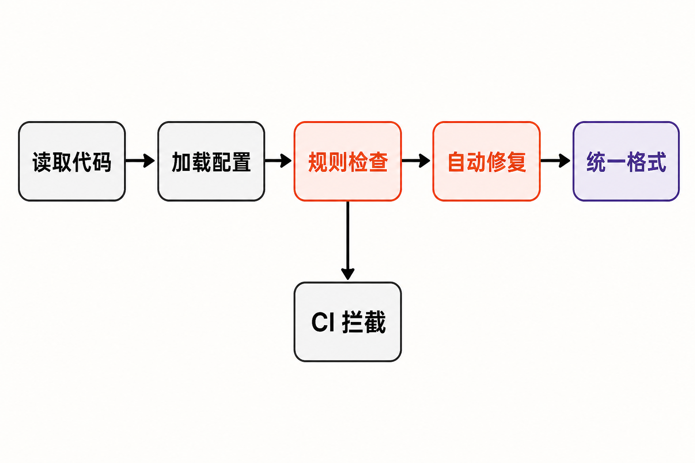

一个 Python 项目运行久了，开发工具往往会越堆越多：Flake8 负责检查，isort 整理导入，Black 统一格式，pyupgrade 更新语法，autoflake 清理无用导入；每个工具又有自己的配置、版本和 CI 步骤。

真正让团队头疼的通常不是某一次检查慢了几秒，而是整条链路的摩擦：本地与 CI 版本不一致，一条规则在两个工具间重复，格式化器与检查器意见相反，升级任何一环都要重新核对配置。

Ruff 瞄准的正是这类问题。它不是给旧工具简单套一层启动器，而是用 Rust 原生重实现大量规则，把代码检查、自动修复、导入排序和格式化纳入同一套 CLI 与配置体系。

## 30 秒认识项目

- **一句话定位：**用 Rust 编写的 Python 代码检查器与格式化器，主打统一工具链和高执行效率。
- **仓库地址：**[astral-sh/ruff](https://github.com/astral-sh/ruff)
- **许可证：**MIT；仓库许可证文件另保留了部分移植或借鉴组件的第三方许可声明。
- **主要语言：**Rust。
- **最新版本：**0.16.1，发布于 2026 年 7 月 30 日；核实日期为 2026 年 8 月 6 日。[官方 Releases](https://github.com/astral-sh/ruff/releases)
- **活跃度：**截至 2026 年 8 月 6 日 08:21（UTC+8），仓库约有 49.1k Stars、2.3k Forks 和 106 Watchers。7 月 29 日至 30 日仍有多位贡献者连续合入发布、修复和功能提交。[提交记录](https://github.com/astral-sh/ruff/commits/main/)

这里需要区分事实与判断：上述仓库数字只是动态热度指标，不能单独证明代码质量；“处于活跃维护状态”这一判断，主要依据近期连续提交和相邻版本发布，而不是 Star 数。


## 它解决的不是一条规则，而是工具链碎片化

传统组合的优势是专业分工：团队可以自由选择 Black、isort、Flake8 及其插件，也能按需替换其中一环。代价则是多套依赖、多份配置、多次文件扫描，以及潜在的规则冲突。

Ruff 的差异在于“内建并统一”。官方资料显示，它内置超过 900 条规则，并原生重实现了 Flake8、isort、pydocstyle、pyupgrade、autoflake 等工具的大量能力，而非在运行时逐个调用原工具。[官方仓库](https://github.com/astral-sh/ruff)

对于已经依赖 Black 的团队，Ruff Formatter 的目标是提供接近 Black 风格的高性能替代方案。不过，官方并不保证所有输入都得到逐字节相同的结果。因此，“换掉现有组合”应当被视为一次工具链迁移，而不是无成本地更换可执行文件。[格式化器文档](https://docs.astral.sh/ruff/formatter/)

项目方宣称 Ruff 相比既有 linter 和 formatter 快 10—100 倍，并在 README 中展示了从零检查 CPython 代码库的官方基准图。这是**项目方测试主张**，不是独立评测；实际收益会受代码库规模、规则配置、缓存状态和硬件影响，不宜直接套用到所有团队。

## 四项核心能力，价值分别在哪里

### 1. 一次检查覆盖大量常见规则

`ruff check` 会递归检查文件或目录。规则采用 Flake8 用户熟悉的字母前缀加数字代码，例如可选单条 `F401`，也可选整个 `E` 或 `F` 前缀；配置入口包括 `lint.select`、`lint.extend-select` 和 `lint.ignore`。

实际价值不只是规则多，而是团队可以在一处表达规则集合，并减少多个工具反复解析同一批文件的成本。已有 Flake8 规则认知也能部分沿用，迁移门槛相对可控。

### 2. 自动修复进入日常反馈循环

`ruff check --fix` 可以应用可用修复，`ruff check --watch` 则在文件变化后重新检查。对开发者而言，一部分原本需要手动定位、修改、再运行检查的问题，可以被压缩为一次命令。

但“可修复”不等于“可以不审查”。Ruff 区分安全与不安全修复；批量迁移时，仍应在版本控制中检查差异并运行测试。[Linter 文档](https://docs.astral.sh/ruff/linter/)

### 3. 检查与格式化共用一个入口

`ruff format` 会原地格式化 Python 文件，`ruff format --check` 只判断格式是否合规，并在发现未格式化文件时返回非零状态，适合放进 CI。检查器与格式化器可以分别启用，并不强制捆绑。

如果还要整理导入，官方建议先执行 `ruff check --fix`，再执行 `ruff format`。这个顺序明确了职责：先完成规则修复和导入处理，再让格式化器统一最终版式。

### 4. 配置、缓存与编辑器场景统一

官方仓库列出的能力包括内置缓存、`pyproject.toml` 配置、层级或级联配置以及编辑器集成。对多目录仓库而言，统一配置语言和执行入口，通常比单项性能提升更有长期价值。

0.16.1 还改进了 LSP 对嵌套 Ruff workspace 和 TOML 文件的处理。它反映出项目不只关注命令行批处理，也在持续完善编辑器反馈链路；这是基于发布内容的解读，不代表所有编辑器组合都已不存在兼容问题。

## Ruff 如何完成一条处理链

依据官方文档，可以确认的流程并不复杂：Ruff 读取文件或目录及项目配置，根据选中的内建规则执行检查；检查阶段可只报告，也可应用允许的修复；随后由格式化器统一代码版式，CI 则可通过检查模式和退出状态拦截不合规变更。



重要边界是：这些规则由 Ruff 原生实现，不是把 Flake8、isort 等插件串联起来运行。因此它能减少工具进程和配置入口，但也意味着没有被 Ruff 实现的第三方插件不能自动继承。

## 从零开始：安装与最小示例

以下命令均来自[官方安装文档](https://docs.astral.sh/ruff/installation/)。若已经使用 uv，官方推荐全局安装：

```bash
uv tool install ruff@latest
```

把 Ruff 作为项目开发依赖：

```bash
uv add --dev ruff
```

也可以使用通用的 PyPI 安装方式：

```bash
pip install ruff
```

只想临时试用，无需预先安装：

```bash
uvx ruff check
uvx ruff format
```

安装完成后的最小工作流是：

```bash
ruff check
ruff check --fix
ruff format
ruff format --check
```

其中第一条递归检查当前目录，第二条应用可用修复，第三条原地格式化，第四条只检查格式，适合作为 CI 门禁。想先观察效果，也可以使用[官方 Playground](https://play.ruff.rs/)试验规则与格式化结果。

## 优点明确，边界同样明确

Ruff 的主要优点是整合度、执行效率潜力和迁移友好的规则编码方式。预构建 wheel 与独立二进制也意味着普通使用者不必安装 Rust 工具链。MIT 许可证、跨主流系统和多种 CPU 架构的发布资产，则降低了采用门槛。

成熟度方面，截至核验日，项目已有频繁发布和多贡献者维护记录，最新版还提供校验和与 GitHub Artifact Attestations。可以据此判断它已具备持续交付能力，但不能由此推导出“没有缺陷”或“每次升级都安全”。

风险首先来自版本变化。0.16.0 将默认启用规则从 59 条扩大到 413 条，同时移除了 18 条较具主观性的默认 E/F 规则，并开始默认格式化 Markdown 中的 Python 代码块。默认行为发生如此明显的变化，团队升级前应固定版本、阅读发布说明并在分支中运行测试。[0.16 系列发布记录](https://github.com/astral-sh/ruff/releases)

其次，部分 lint 规则会和 formatter 冲突，包括 W191、E111、D203、D206 及部分 flake8-quotes 规则。接入时不应不加筛选地开启全部规则。

第三，Ruff 不是完整静态类型检查器，不能当作 Mypy、Pyright 或 Pyre 的等价替代品；它也尚不支持第三方 linter 插件。官方 Issue 中，维护者还明确表示 Ruff 当时不支持重复代码检测。未使用公共函数或类等需要跨文件调用关系的分析，也不能想当然地认为它会覆盖。[Issue #18432](https://github.com/astral-sh/ruff/issues/18432)

## 适合谁，不适合谁

Ruff 尤其适合三类使用者：希望缩短大型 Python 仓库本地与 CI 检查时间的团队；正在维护 Flake8、isort、Black 等多工具组合、希望减少配置面的团队；以及愿意通过固定版本、差异审查和渐进式规则启用完成迁移的项目。

它不适合被当作“所有 Python 质量问题的一站式答案”。如果项目强依赖 Ruff 尚未原生实现的 Flake8 插件，需要深度类型分析、跨文件调用图或重复代码检测，原有工具仍有保留价值。对要求 Black 输出逐字节不变的代码库，也应先比较格式差异，而非直接全库替换。

## 结语：值得试，但要把它当作一次工程迁移

Ruff 值得尝试，理由不是 49.1k Stars，而是它对一个真实工程问题给出了清晰方案：以原生实现和统一配置减少 Python 工具链的重复劳动，同时覆盖检查、修复、导入整理与格式化等高频环节。

更稳妥的采用路径是先锁定版本，只启用与现有规则等价的检查，在 CI 中观察差异，再逐步引入自动修复和 formatter。Ruff 最有价值的角色不是制造一张“工具全删掉”的清单，而是在边界清楚、变更可审查的前提下，让代码质量反馈变得更快、更简单。

## 参考资料

1. [astral-sh/ruff 官方仓库](https://github.com/astral-sh/ruff)
2. [Ruff 官方 README 原始文件](https://raw.githubusercontent.com/astral-sh/ruff/main/README.md)
3. [Installing Ruff](https://docs.astral.sh/ruff/installation/)
4. [The Ruff Linter](https://docs.astral.sh/ruff/linter/)
5. [The Ruff Formatter](https://docs.astral.sh/ruff/formatter/)
6. [Ruff Releases](https://github.com/astral-sh/ruff/releases)
7. [Ruff 主分支提交记录](https://github.com/astral-sh/ruff/commits/main/)
8. [Issue #18432：Code Duplication and Unused Code Detection](https://github.com/astral-sh/ruff/issues/18432)
