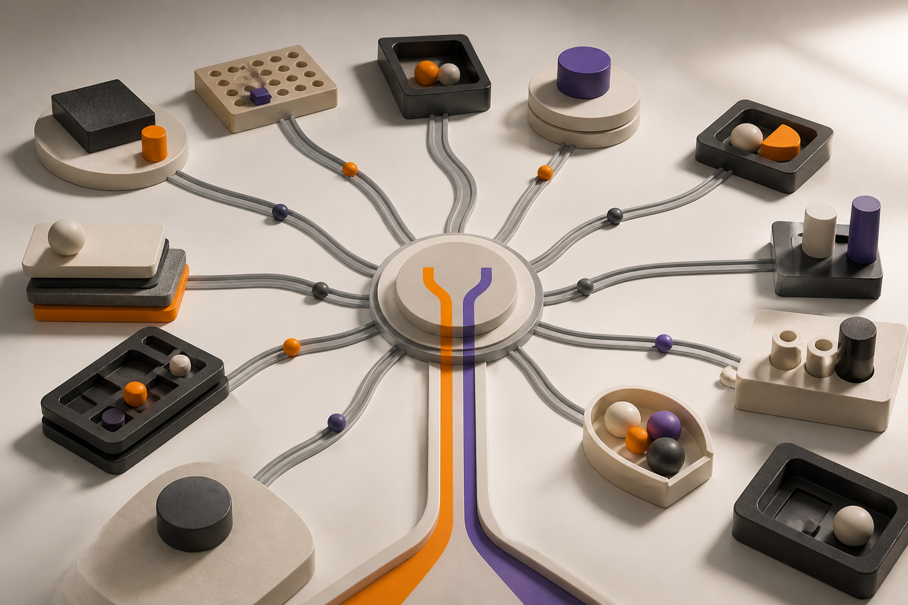
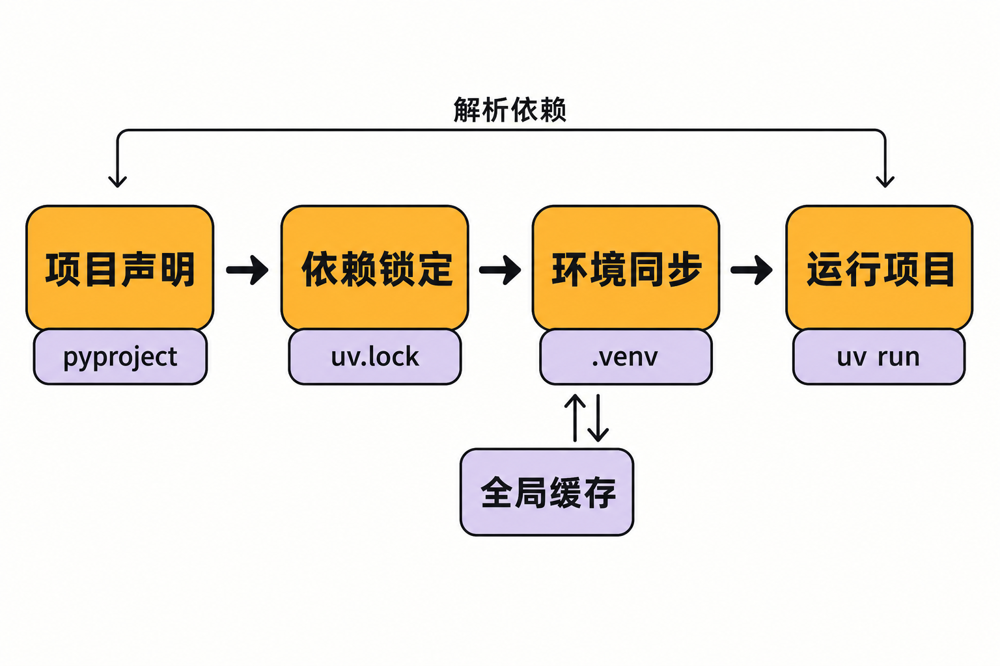

新建一个 Python 项目，真正让人疲惫的往往不是写第一行代码，而是先回答一串工具问题：用什么安装 Python？怎样创建虚拟环境？依赖写进哪个文件？如何锁定版本？命令行工具要不要全局安装？构建完成后又用什么发布？

常见答案可能分别是 pyenv、virtualenv、pip、pip-tools、pipx、Poetry 和 twine。每个工具各有所长，但当本地开发、CI 与多人协作叠在一起，团队还要维护一套“工具之间如何衔接”的知识。

[astral-sh/uv](https://github.com/astral-sh/uv) 针对的正是这种碎片化：它并非单纯给 pip 换一个更快的实现，而是尝试把 Python 版本、项目依赖、虚拟环境、脚本、命令行工具、构建与发布收进同一套命令体系。

## 30 秒认识项目

- **一句话定位：**Astral 用 Rust 编写的跨平台 Python 包与项目管理器
- **仓库地址：**[github.com/astral-sh/uv](https://github.com/astral-sh/uv)
- **许可证：**MIT 或 Apache-2.0 双许可证，使用者可任选其一
- **主要语言：**Rust
- **最新稳定版：**0.12.1，发布于 2026 年 7 月 31 日
- **活跃度：**约 88.3k Stars、3.4k Forks、约 2.4k Issues、482—483 个 Pull Requests、10,001 次提交
- **数据核实时间：**2026 年 8 月 5 日 08:02（北京时间）

上述仓库数字会持续变化，只能说明关注度和活动规模，不能单独证明质量。更有意义的成熟度信号是：截至核实日，[Release 页面](https://github.com/astral-sh/uv/releases)在一个月内可见十余个版本，并提供多平台预编译包、校验和及 GitHub Artifact Attestation 验证方式；另一面，密集发布也意味着团队应认真阅读升级说明。



## 它解决的不是一个命令慢，而是一条链路太散

uv 所面对的旧问题可以分成两层。

第一层是性能与重复劳动。解析依赖、下载包、反复创建环境，会在本地开发和 CI 中累积等待时间。uv 使用全局缓存复用文件，并以 Rust 实现核心能力。项目 README 声称部分场景比 pip 快 10—100 倍，但这是**维护方基准结论**，会受到缓存状态、网络、依赖图和平台影响，不能当作第三方实测结果。

第二层更关键：Python 工程缺少一条统一路径。uv 的目标覆盖 pip、pip-tools、pipx、Poetry、pyenv、virtualenv、twine 等工具的常用职责，同时保留 pip 兼容接口。这与“只替换安装器”不同，也与主要聚焦依赖和项目管理的方案不同——它把 Python 解释器本身、临时工具和单文件脚本也纳入同一个入口。

**推断：**uv 的主要组织价值未必只是缩短一次安装，而是减少团队要选择、组合和教学的工具数量。不过，“覆盖常用能力”不等于对每个既有工具实现完全等价替换；迁移前仍需逐项核对原工作流。

## 五项核心能力，价值在哪里

### 1. 项目、环境与锁文件形成闭环

uv 以 `pyproject.toml` 声明项目及依赖，以 `.venv` 隔离环境，以跨平台 `uv.lock` 固定解析结果。首次运行 `uv run`、`uv sync` 或 `uv lock` 时，它会创建环境和锁文件；[官方项目指南](https://docs.astral.sh/uv/guides/projects/)明确建议将 `uv.lock` 提交版本控制、不要手工编辑。

实际价值在于，声明、解析、安装与执行不再是几段松散步骤。团队拿到同一仓库后，可以围绕同一份锁定结果恢复环境，降低“我的机器可以运行”的概率。

### 2. 把 Python 版本也纳入项目上下文

uv 可以管理并自动下载 Python，不要求用户预先安装 Rust；通过独立二进制安装时，甚至可以在没有预装 Python 的机器上开始。项目默认生成的 `.python-version` 又把解释器选择与项目放在一起。

这对新电脑、CI 和教学环境尤其有价值：环境准备不必先依赖另一套版本管理器。需要注意的是，具体系统与架构仍受官方平台政策约束。

### 3. 全局缓存减少重复搬运

[官方文档首页](https://docs.astral.sh/uv/)列出全局缓存与去重能力。它的工程意义不是一句笼统的“更快”，而是在多个项目使用相同包时减少重复下载和存储，让高频重建环境的成本下降。

但缓存命中率、网络和依赖规模都会改变结果，因此不能把官方性能图直接外推到所有项目。

### 4. 脚本和命令行工具无需污染长期环境

单文件脚本可以声明内联依赖，再由 `uv run` 在隔离环境中执行。`uvx` 则是 `uv tool run` 的别名，可在临时环境里运行 PyPI 提供的命令行工具。

它解决了两个日常麻烦：分享脚本时不再只留下一句“请先安装 requests”；偶尔使用格式化器或生成器时，也不必把工具永久塞入全局 Python 环境。

### 5. 从开发延伸到构建和发布

uv 不止安装依赖，也覆盖工作区、构建和发布。`uv build` 默认生成源码包与 wheel。这样，从创建项目、添加依赖、运行命令到产生发布制品，可以使用较一致的命令和配置模型。

这是一种“一体化”优势，同时也是迁移风险来源：团队把更多环节交给同一工具后，版本升级的影响面也可能更大。

## 工作原理：声明、锁定、同步、执行

从官方资料能确认的项目流程是：开发者在 `pyproject.toml` 声明项目和依赖；uv 解析依赖并生成跨平台 `uv.lock`；随后将锁定结果同步到 `.venv`；最后通过 `uv run` 在项目环境中执行程序。



`uv sync` 默认进行精确同步。`uv run` 会保证项目可运行，但默认不会主动删除环境里的额外包，两者语义不能混为一谈。若绕开 `uv run` 直接执行项目命令，则需要先手动激活虚拟环境。

**观点：**这套模型最值得关注的地方，是把锁文件放在“声明”和“实际环境”之间，成为协作与复现的中间层，而不是把虚拟环境本身当作可移植成果。

## 安装与最小示例

以下命令均来自[项目 README](https://github.com/astral-sh/uv/blob/main/README.md)。macOS 或 Linux 可使用官方安装脚本：

```bash
curl -LsSf https://astral.sh/uv/install.sh | sh
```

如果已有 Python，也可选择：

```bash
pip install uv
```

创建一个项目、加入 Ruff 并运行检查：

```bash
uv init example
cd example
uv add ruff
uv run ruff check
```

按照官方说明，首次项目命令会创建虚拟环境，并解析、安装所需依赖。

如果只想运行一个带依赖的脚本：

```bash
uv add --script example.py requests
uv run example.py
```

安装脚本通过网络下载并执行内容，组织环境中应先按内部安全规范审查；也可选用官方提供的其他安装渠道或预编译制品。

## 优点、限制与成熟度

uv 的优势相当清晰：命令入口统一，项目模型完整；可管理 Python；锁文件支持跨平台；缓存有利于频繁创建环境；兼顾脚本、临时工具和 pip 兼容场景。Rust 实现和活跃发布是工程特征，但不应被自动等同于“必然更安全”或“所有场景都更快”。

平台支持也不是整齐划一。[官方平台政策](https://docs.astral.sh/uv/reference/policies/platforms/)将 Apple Silicon 与 x86_64 macOS、x86_64 Linux、x86_64 Windows 列为 Tier 1，会持续构建和测试；Linux aarch64、Windows arm64 等 Tier 2 平台持续构建但不运行完整测试套件；FreeBSD x86_64、Windows i686 等 Tier 3 平台仅为尽力支持。Windows 最低为 Windows 10/Server 2016，正式支持 macOS 13 及以上，Linux 官方二进制还有 glibc 要求。

Windows 企业环境另有现实摩擦。维护者建立的[杀毒软件与 EDR 跟踪 Issue](https://github.com/astral-sh/uv/issues/20792)记录了 `uv sync`、`uv lock` 遭遇访问拒绝，以及可执行文件被隔离或删除等现象。截至 2026 年 8 月 5 日该 Issue 仍开放，并被标为外部环境问题，不能直接归咎为 uv 缺陷。

还有一份需要谨慎解读的[文件冲突报告](https://github.com/astral-sh/uv/issues/20907)：用户在 Windows、uv 0.9.9 和特定 aws-cdk 包组合中复现了两个发行包写入同一路径、同步未恢复缺失文件的问题。报告截至核实日尚未关闭，但它针对旧版本和特定依赖，不能推断当前 0.12.1 或所有平台必然受影响。对包含路径重叠、私有索引或复杂原生依赖的项目，迁移测试仍不可省略。

成熟度方面，仓库已有超过一万次提交、发布频繁，README 将其描述为可用于生产；但这是项目方声明。0.12.0 的发布说明也包含可能影响既有工作流的正确性、安全性与规范兼容调整。更稳妥的判断是：uv 已不是早期玩具，但仍处在快速演进阶段。

## 谁适合尝试，谁应保持谨慎

适合尝试 uv 的人包括：新建 Python 项目的个人与团队；希望统一本地和 CI 工具链的工程团队；频繁创建隔离环境、运行临时命令行工具的人；需要让单文件脚本自带依赖说明的用户。

不适合立刻全面切换的情况包括：现有 Poetry、pip-tools 或内部发布流程高度定制；必须运行在 Tier 2、Tier 3 或旧系统上；企业 Windows 环境的 EDR 策略不可调整；项目依赖存在文件重叠、特殊索引或复杂安装钩子，却没有回归测试能力。

## 结语

uv 真正有吸引力的地方，不是用一个醒目的倍速数字击败 pip，而是试图把 Python 工程从“拼装许多工具”改造成一条可解释的工作流。它已经覆盖从解释器到发布制品的相当长链路，也表现出持续维护的活跃度。

我的结论是：**值得尝试，但更适合从新项目、个人工具或一条 CI 流程开始渐进验证，而不是仅凭 Star 数和官方基准一次性替换全部生产工具链。**先核对平台等级、锁文件差异、私有源与安全软件，再决定扩大范围，这比追逐“最快”更接近工程决策。

## 参考资料

1. [astral-sh/uv GitHub 仓库](https://github.com/astral-sh/uv)
2. [uv README](https://github.com/astral-sh/uv/blob/main/README.md)
3. [uv 官方文档](https://docs.astral.sh/uv/)
4. [Working on projects](https://docs.astral.sh/uv/guides/projects/)
5. [uv Releases](https://github.com/astral-sh/uv/releases)
6. [Platform support](https://docs.astral.sh/uv/reference/policies/platforms/)
7. [Windows antivirus/EDR issues：Issue #20792](https://github.com/astral-sh/uv/issues/20792)
8. [File collisions：Issue #20907](https://github.com/astral-sh/uv/issues/20907)
