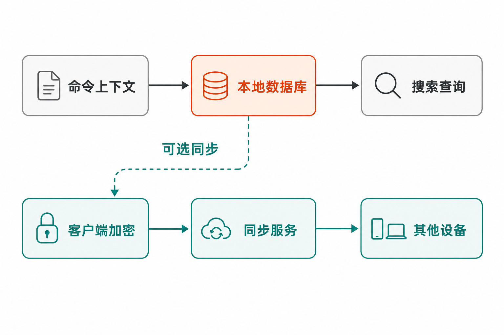

你记得自己曾成功执行过一条很长的命令，却不记得它在哪台电脑、哪个目录，又是什么时候运行的。

传统 Shell 历史通常只能告诉你“输入过什么”。当多个终端会话并行、项目目录越来越多、设备不止一台时，反复按上方向键或用 `Ctrl-R` 猜关键词，很快就会变成低效的人工考古。

开源项目 Atuin 试图改变的正是这件事：它不只改进历史列表的界面，而是把命令、执行结果和环境上下文组织成一个可以查询的本地数据库，并提供可选的跨设备加密同步。

## 30 秒认识项目

- **一句话定位：**用本地 SQLite、上下文搜索和可选加密同步，替代以纯文本文件为中心的 Shell 历史体验。
- **仓库地址：**[`atuinsh/atuin`](https://github.com/atuinsh/atuin)
- **许可证：**[MIT License](https://github.com/atuinsh/atuin/blob/main/LICENSE)
- **主要语言：**Rust，仓库采用 Cargo 工作区组织。
- **支持环境：**zsh、bash、fish、nushell、xonsh，以及支持层级较低的 PowerShell。
- **活跃度：**截至 **2026 年 8 月 15 日 08:07（UTC+8）**，仓库页面约有 31.2k Stars、933 Forks、297 个开放 Issues、99 个开放 PR 和 2,068 次提交；这些只是动态快照，不能直接证明代码质量。[Release 页面](https://github.com/atuinsh/atuin/releases)显示当时最新稳定版为 **18.19.0**，发布于 2026 年 8 月 3 日；最新预发布版为 **v18.20.0-beta.3**，发布于 8 月 7 日。
- **维护状态判断：**[main 分支记录](https://github.com/atuinsh/atuin/commits/main/)在 2026 年 7 月底至 8 月初连续出现功能、修复、测试和发布相关提交。结合近期稳定版与预发布版，可判断项目当时仍在积极维护；这比单看 Star 数更有参考价值。


## 它解决的不是“历史太少”，而是“历史没有上下文”

普通历史文件的优势是简单、透明，打开文本就能查看，也容易用现成工具处理。问题在于，它通常围绕命令字符串组织信息，很难同时回答几个更有价值的问题：这条命令在哪个目录执行？是否成功？属于哪台主机或哪个会话？运行了多久？

Atuin 会把历史存入本地 SQLite，并记录退出码、工作目录、主机、会话、耗时等上下文。搜索因此不必局限于字符串匹配。例如，官方给出的查询可以寻找昨天下午三点后成功执行、且包含 `make` 的记录：

```bash
atuin search --exit 0 --after "yesterday 3pm" make
```

这也是它与传统上方向键、基础反向搜索的主要差异：后者是在一条线性记录中翻找，Atuin 更接近对个人命令历史做结构化检索。

跨设备是另一项差异。传统历史天然留在当前设备；Atuin 可以使用官方同步服务，也可以连接自托管服务器，或者完全关闭同步，只保留本地数据库。也就是说，云服务并不是使用它的前提。

需要说明的是：以上是来源能够确认的产品差异。至于它能否比某个特定第三方搜索工具更快、更准，现有材料没有对照测试，不能据此下结论。

## 四项核心能力，以及它们的实际价值

### 1. 带执行上下文的结构化历史

Atuin 不仅保存命令文本，还能关联退出码、目录、主机、会话与耗时。实际价值在于缩小搜索范围：排障时可以优先找成功记录，维护多个项目时可以按当前目录筛选，多台机器之间也能区分命令来源。

它不会替换原来的 Shell 历史文件。这为迁移保留了退路，但也意味着用户需要理解“两套历史记录并存”的状态，而不能把 Atuin 简单视作原文件的另一种查看器。

### 2. 进入工作流的交互搜索

安装并完成 Shell 集成后，`Ctrl-R` 或上方向键可以打开搜索界面；搜索范围可设为当前会话、当前目录或全局。按 Enter 直接执行选中的命令，按 Tab 则只把命令带回编辑区。

这个细节很重要：历史中的命令可能包含旧路径、旧参数或危险操作。先按 Tab 检查和修改，比不加确认地重放更稳妥。

### 3. 可选的端到端加密同步

同步数据会在客户端进行端到端加密，服务器接收的是加密内容。官方服务适合希望快速启用的用户，自托管服务器则给团队或重视基础设施控制的人更多选择；不需要跨设备时，也可以完全不注册账号。

代价是密钥管理责任转移给用户。[官方同步指南](https://docs.atuin.sh/main/guide/sync/)明确提醒：加密密钥不能分享，建议保存到密码管理器；一旦丢失，项目维护者也无法恢复历史。这不是附带细节，而是采用同步前必须接受的运维责任。

### 4. 旧历史导入与渐进迁移

`atuin import auto` 会依据 `SHELL` 尝试选择导入器。官方列出的导入来源覆盖 Bash、Fish、PowerShell、Zsh、Nushell、Xonsh 等多种格式，因此用户不必从空数据库开始。

但“导入成功”不等于“旧数据自动获得完整上下文”。[导入文档](https://docs.atuin.sh/main/reference/import/)说明，旧格式本身缺少的信息无法补回；没有时间戳的历史会从当前时间开始生成时间戳，多数导入器还会丢弃无效 UTF-8 命令。Fish 和 Xonsh 的部分原始信息也不会完整保留。

## Atuin 怎样工作

依据官方仓库与文档，其核心流程可以概括为：Shell 集成捕获命令及可获得的上下文，写入本地 SQLite；用户通过快捷键或 CLI 查询数据库；如果启用同步，客户端加密记录后发送到官方或自托管服务器，其他设备凭账号和相同密钥取回并解密。

```text
Shell 命令与上下文
        ↓
本地 SQLite 历史库
        ↓
交互界面或 CLI 搜索
        │
        └─ 可选：客户端加密 → 同步服务器 → 其他设备解密
```



这张流程刻意没有展开数据库表、加密算法或服务端内部模块，因为给定来源没有提供足够细节。能够确认的是“本地数据库优先、同步可选、客户端端到端加密”，不宜进一步推演实现机制。

## 可复制的安装与最小示例

以下命令来自[官方入门文档](https://docs.atuin.sh/)。安装脚本会通过网络获取并执行内容，在生产设备上操作前，应由使用者自行评估脚本来源和供应链风险。

```bash
bash <(curl --proto '=https' --tlsv1.2 -sSf https://setup.atuin.sh)
```

安装后重启 Shell。若只打算使用本地数据库，可以跳过注册与同步，先导入旧历史：

```bash
atuin import auto
```

按 `Ctrl-R` 或上方向键打开搜索，输入关键词；按 Enter 执行，或按 Tab 放回命令行检查。也可以直接使用查询命令：

```bash
atuin search --exit 0 --after "yesterday 3pm" make
```

若需要官方同步服务，按文档执行：

```bash
atuin register -u <USERNAME> -e <EMAIL>
atuin import auto
atuin sync
```

随后查看并妥善保存本地密钥：

```bash
atuin key
```

默认同步间隔为一小时，也可用 `atuin sync` 手动触发。新设备使用 `atuin login -u <USERNAME>`，并提供密码和加密密钥。自托管用户则需要先配置 `sync_address`。

## 优点、限制与潜在风险

**优点是明确的：**历史数据本地落入 SQLite；搜索可以利用目录、状态和时间等上下文；同步不是强制依赖；官方服务与自托管两条路径并存；MIT 许可证也给予使用、修改和再分发较宽松的空间。

**成熟度方面，**截至 2026 年 8 月 15 日，18.x 已持续发布，稳定版和测试版并行，近期提交覆盖功能、修复、测试与文档。18.19.0 还修复了空加密密钥导致的崩溃、模糊搜索排序和配置注释保留问题。这表明项目具有持续维护能力，但开放 Issue 和 PR 数量也说明它仍是活跃演进的软件，而非完全定型的系统。

**限制与风险同样需要正视：**

1. Bash 集成依赖的 `bash-preexec` 存在局限，PowerShell 也只是二级支持；不同 Shell 的体验不能假设完全一致。
2. 旧历史导入存在信息损失，无法凭空恢复当时的目录、退出码等上下文。
3. 开启同步后，密钥丢失无法恢复；反过来，泄露密钥也会削弱加密保护，因此必须纳入密码管理和设备迁移流程。
4. 在线安装脚本虽然方便，但用户应自行决定是否直接执行远程脚本。Release 页面还提供了不同平台的预编译资产、校验文件和 GitHub Artifact Attestations，可作为更审慎安装流程的核验依据。
5. 一个[针对 18.3.0 的已关闭 Issue](https://github.com/atuinsh/atuin/issues/2406)曾出现新旧设备因 Sync v1 与 v2 不一致而看似缺少历史；报告者最终确认数据未丢失。它不能证明当前稳定版仍有同一缺陷，但提示多设备迁移时应检查客户端版本与同步协议配置是否一致，必要时查看 `atuin status`，再考虑较慢的 `atuin sync -f` 完整同步。
6. MIT 许可证明确按“现状”提供软件且不作担保。包含凭据、令牌或敏感参数的历史命令，本身就是需要治理的数据；这是基于命令历史性质作出的风险判断，而不是官方材料声称 Atuin 已发生泄露。

## 适合谁，不适合谁

Atuin 更适合频繁使用终端、同时维护多个项目、经常在不同目录或设备之间切换的人；也适合希望保留本地数据控制，同时又需要可选同步能力的开发者和运维人员。只启用本地模式，是成本较低的试用方式。

它不太适合几乎不检索历史、只使用单一终端环境的人；不愿管理加密密钥，却又把跨设备同步视为刚需的用户，也需要谨慎。高度依赖 PowerShell 或复杂 Bash 钩子的工作流，应先核对支持范围，而不是直接假设无缝替换。

## 结语：值得尝试，但先从本地模式开始

**观点：Atuin 值得重度终端用户尝试。**理由不是 31.2k Stars，而是它对问题的建模更完整：命令历史不再只是一串文本，而是附带执行上下文、可检索且可选择同步的个人操作记录。

更稳妥的路径是先安装、导入旧历史并保持纯本地使用，确认快捷键和 Shell 集成符合自己的习惯；确有跨设备需求时，再启用同步、备份密钥并统一各设备版本。这样既能获得结构化搜索的主要收益，也能把同步与迁移风险控制在可理解的范围内。

## 参考资料

1. [atuinsh/atuin GitHub 仓库](https://github.com/atuinsh/atuin)
2. [Atuin 官方入门文档](https://docs.atuin.sh/)
3. [Atuin Releases](https://github.com/atuinsh/atuin/releases)
4. [main 分支提交记录](https://github.com/atuinsh/atuin/commits/main/)
5. [MIT License](https://github.com/atuinsh/atuin/blob/main/LICENSE)
6. [Setting up sync](https://docs.atuin.sh/main/guide/sync/)
7. [Import reference](https://docs.atuin.sh/main/reference/import/)
8. [已关闭的同步问题 #2406](https://github.com/atuinsh/atuin/issues/2406)
