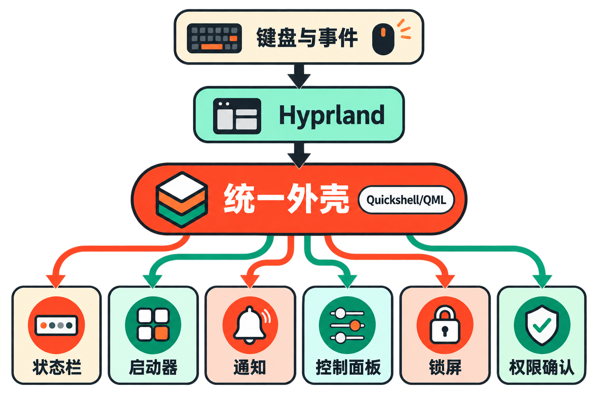
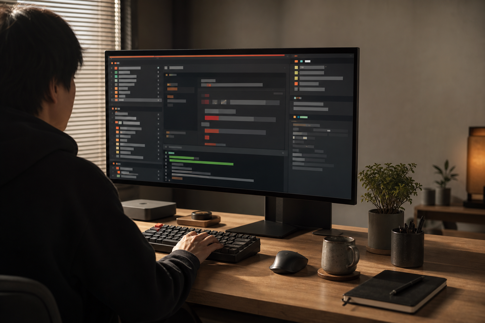

想把 Arch Linux 用作主力开发桌面，真正费时间的往往不是安装系统，而是安装之后：选择窗口管理器，拼接状态栏、启动器、通知中心和锁屏，再统一主题、快捷键与开发工具。每个组件都能替换，但它们之间的配置、依赖和更新问题也会随之而来。

Omarchy 试图解决的正是这段“从能启动到真正顺手”的距离。它没有让用户继续从零组装，而是预先选好 Hyprland 桌面、常用工具、主题和键盘工作流，交付一套带有明确取舍的 Arch Linux 衍生发行版。

它的关键词不是“无限选择”，而是“替你做出一批选择”。

## 30 秒认识项目

- **一句话定位：**面向键盘优先开发者、预先整合桌面与开发环境的 Arch Linux 衍生发行版
- **仓库地址：**[`basecamp/omarchy`](https://github.com/basecamp/omarchy)
- **发起与孵化：**由 DHH 发起、37signals 孵化
- **许可证：**MIT
- **主要语言：**仓库历史语言统计以 Shell 为主，另有 Lua、QML、Go Template、CSS 和 Python；由于 4.0 已大量采用 QML/Quickshell，这组旧统计不能代表 Quattro 分支的实时构成
- **当前版本：**Omarchy 4.0.0“Quattro”，2026 年 8 月 14 日发布
- **活跃度：**截至 2026 年 8 月 20 日，GitHub 页面约有 26.9k Stars、2.7k Forks、144 Watchers 和约 6,115 次提交；master 分支页面可见的最近提交日期为 2026 年 8 月 14 日
- **数据核实时间：**2026 年 8 月 20 日

上述数字只能说明项目获得了较高关注且仍在维护，不能单独证明稳定性、代码质量或硬件兼容性。[官方提交记录](https://github.com/basecamp/omarchy/commits/master/)还显示，项目近期持续处理 Hyprland、Vulkan 驱动、LUKS 键盘布局和 QMK HID 等兼容问题。

## 它解决的不是安装 Arch，而是整合桌面

常见路线大致有两类：一类是自行安装 Arch，再逐项选择窗口管理器、状态栏、通知服务和工具；另一类是采用桌面环境更完整、默认交互更传统的发行版。

Omarchy 处在两者之间。它保留 Arch 与 Hyprland 所代表的滚动更新、轻量组件和键盘操作取向，却把原本分散的选择打包成一套统一体验。用户不必先成为桌面组件集成专家，便能获得可工作的开发环境。

这是**已核实的事实**：项目预装并整合 Hyprland、主题、统一快捷键、剪贴板、截图录屏、开发工具、AI CLI、系统快照、游戏及 Windows 虚拟机支持。

由此可以作出一个**合理推断**：Omarchy 的主要价值不是提供某项独占技术，而是压缩配置和决策成本。它与自行组装 Arch 的差异，在于维护者替用户确定了默认答案；与传统完整桌面相比，则更强调平铺窗口和键盘驱动的开发流程。

相应代价也很清楚：默认答案越完整，用户越需要接受项目的审美、快捷键和升级方向。这正是“opinionated”一词的实际含义。

## 四项核心能力，价值分别在哪里

### 1. 开箱可用的键盘优先桌面

Hyprland 负责窗口管理，Omarchy 则继续补齐快捷键、启动器、通知、锁屏和系统控制等环节。实际价值是把高频操作收拢到一致的桌面语法中，减少鼠标和应用间切换，也省去用户逐项粘合组件的工作。

不过，键盘优先并不代表所有版本都保持同一种交互。社区关于 Quattro 的[讨论](https://github.com/basecamp/omarchy/discussions/6371)中，有用户认为新版音频和蓝牙面板更接近传统 GUI，不如旧版 TUI 工具符合其 Vim 风格习惯。这属于用户反馈，不是维护者确认的缺陷，却揭示了大版本升级可能改变工作方式。

### 2. 统一而可切换的视觉系统

项目把主题覆盖到桌面及常用工具，而不只是更换壁纸。实际价值在于减少 GTK 应用、终端、编辑器与桌面组件各自调整配色的重复劳动。

但这种一致性并非绝对。2026 年 8 月 20 日仍有用户在[Issue 列表](https://github.com/basecamp/omarchy/issues)报告 GTK4/libadwaita 应用未跟随主题。因此，更准确的表述是“项目追求统一”，而不是“所有应用必然一致”。

### 3. 把开发工具和 AI 代理纳入同一入口

Omarchy 为 Claude Code、OpenAI Codex、OpenCode、Gemini CLI、GitHub Copilot CLI 等代理提供统一包装。用户可以选定默认代理，通过快捷键启动，或从命令行直接传入任务。

它的实际价值不是捆绑某一家模型，而是统一代理的安装、选择和更新方式。额外 CLI 还可通过 `omarchy-mise-install` 纳入管理，并随 `omarchy update` 更新。

便利性也伴随风险：[官方 AI 文档](https://omarchy.org/manual/ai/)明确警告，通过这一入口启动的代理可能采用较少交互的运行模式并直接执行操作。用户仍应审查代理权限、工作目录和命令结果。

### 4. 覆盖安装、恢复与扩展场景

除了日常桌面，项目还提供系统快照、双系统、无人值守安装、游戏和 Windows VM 等能力。它们的共同价值是把“开发桌面”扩展成一套可以部署、恢复和兼容其他环境的工作站方案。

这不等于所有场景都同样成熟。例如，双系统需要正确处理空闲分区、加密和引导器；Windows BitLocker 又构成额外限制。Omarchy 降低了入口门槛，但没有消除操作系统安装本身的风险。

## Quattro 如何重构桌面外壳

[Omarchy 4.0.0 发布说明](https://github.com/basecamp/omarchy/releases)把状态栏、启动器、菜单、通知、屏幕显示提示、控制面板、锁屏和 polkit agent 合并进一个基于 Quickshell/QML 的常驻外壳，并提供插件架构。

可以把这次变化概括为以下流程：

```text
键盘操作与系统事件
          ↓
    Hyprland 窗口管理
          ↓
 Quickshell/QML 统一外壳
          ↓
状态栏｜启动器｜通知｜控制面板｜锁屏｜权限确认
```

此前相应职责分散在 Waybar、Walker、Mako、SwayOSD、hyprlock、hypridle、swaybg 和 polkit-gnome 等组件中。4.0 用统一外壳取代这些组合。



**事实层面**，这减少了独立桌面进程的数量，并让界面进入同一套 QML 体系。**推断层面**，集中架构有利于统一视觉和交互，也可能降低跨组件协调成本；但外壳出现问题时，影响范围也可能更集中。来源没有提供性能测试，因此不能据此宣称它更快或更省资源。



## 安装步骤与最小使用示例

官方推荐通过 ISO 全新安装。以下流程来自[入门手册](https://omarchy.org/manual/getting-started/)：

1. 下载官方 Omarchy ISO；4.0.0 镜像的官方 SHA-256 为 `9224fab3720560f771969a99a499e5f7e0f8e2d6a0681d872d52f05fb5003da4`。
2. 在 macOS 或 Windows 上用 balenaEtcher 写入 U 盘；Linux 可使用 caligula。
3. 备份数据，并在固件设置中关闭 Secure Boot 和 TPM。
4. 从 U 盘启动，依次选择键盘布局、用户和目标磁盘。
5. 独占磁盘可选择整盘安装；与现有系统共存必须选择 **Free space install**。
6. 完成安装后重新启动。

整盘安装会清除所选驱动器。默认安装启用加密；加密卷启动阶段不能依赖蓝牙键盘，应准备有线或 2.4GHz 接收器键盘。Windows 双系统还需先关闭 BitLocker，并等待解密完成，具体限制见[官方双系统文档](https://omarchy.org/manual/dual-boot-install/)。

安装后，可用官方命令选择默认 AI 代理：

```bash
omarchy default agent <name>
```

如果尚未安装，对应代理会在选择时触发安装。最小任务示例为：

```bash
omarchy agent prompt "Review this project"
```

额外 CLI 的统一安装形式是：

```bash
omarchy-mise-install <package> [command-name]
```

已有 3.x 安装若要升级，应先在菜单选择 `Update > Omarchy`，然后选择 `Update > Omarchy to Quattro`。鉴于 4.0 是桌面外壳级重构，升级前备份并阅读版本说明更稳妥。

## 优点、限制与成熟度

Omarchy 的突出优点，是范围完整且目标明确：它不只配置窗口管理器，而是把安装、视觉、快捷键、开发工具和系统控制串成一套工作流。MIT 许可证也为查看、修改和再分发代码提供了宽松条件。2026 年 4 月至 8 月连续出现多个 3.x 版本，随后推出 4.0，结合近期提交记录，可以判断项目维护活跃。

但“活跃”不等于“稳定”。截至 2026 年 8 月 20 日，页面约有 489 个开放 Issues 和约 563 个 Pull Requests。数字可能包含功能请求、重复报告或待分类内容，不能直接当作缺陷数量；它们仍说明项目面临较高的维护与审阅负载。

Quattro 发布后出现的开放报告涉及蓝牙面板、多屏通知、键盘背光、Edge 弹窗识别，以及 Wayland 环境下 Fcitx5/Mozc 候选窗位置等问题。这些均为用户提交，当时不能视作项目方已确认根因，但对依赖多显示器、中文或日文输入法、特定笔记本硬件的用户而言，是值得提前核对的风险信号。

此外，Arch 的滚动更新基础意味着上游 Hyprland、驱动和桌面组件变化会不断传导。自行修改系统配置也可能在更新中产生冲突。**本文观点是**：Omarchy 已经是一个功能完整、迭代快速的项目，但 4.0 新外壳仍处在大版本落地后的磨合期，不宜仅凭关注度判断为“无需维护的稳定桌面”。

## 适合谁，又不适合谁

Omarchy 更适合愿意使用 Arch 生态、偏好平铺窗口与键盘操作，希望迅速获得统一开发环境的人；也适合能阅读更新说明、搜索 Issue，并为滚动更新预留排障时间的开发者。

它不太适合要求长期冻结界面和快捷键、依赖 Secure Boot 或 BitLocker 现状、不愿处理硬件兼容性，或希望所有设置都通过传统图形界面完成的人。生产关键机器、唯一工作电脑以及包含重要数据的双系统环境，更不应在没有备份和回退方案时直接迁移。

## 结语：值得试，但先把它当作一次工作流选择

Omarchy 值得尝试的原因，不是 Star 数，也不是它把 Arch 包装得更漂亮，而是它对开发者桌面给出了一套完整而连贯的答案。Quattro 进一步把分散的桌面组件收进统一外壳，使这种产品思路更加鲜明。

同一特性也是它的边界：接受 Omarchy，意味着同时接受维护者的默认选择和变化节奏。对目标用户而言，最稳妥的结论是先在备用设备或虚拟机中验证快捷键、输入法、显示器、蓝牙和代理权限，再决定是否迁移主力环境。

## 参考资料

1. [GitHub：basecamp/omarchy 项目仓库](https://github.com/basecamp/omarchy)
2. [GitHub：Omarchy Releases](https://github.com/basecamp/omarchy/releases)
3. [GitHub：master 分支提交记录](https://github.com/basecamp/omarchy/commits/master/)
4. [Omarchy Manual：Getting Started](https://omarchy.org/manual/getting-started/)
5. [Omarchy Manual：Dual Boot Install](https://omarchy.org/manual/dual-boot-install/)
6. [Omarchy Manual：AI](https://omarchy.org/manual/ai/)
7. [GitHub：Omarchy Issues](https://github.com/basecamp/omarchy/issues)
8. [GitHub Discussions：Quattro keyboard-first design 讨论](https://github.com/basecamp/omarchy/discussions/6371)
