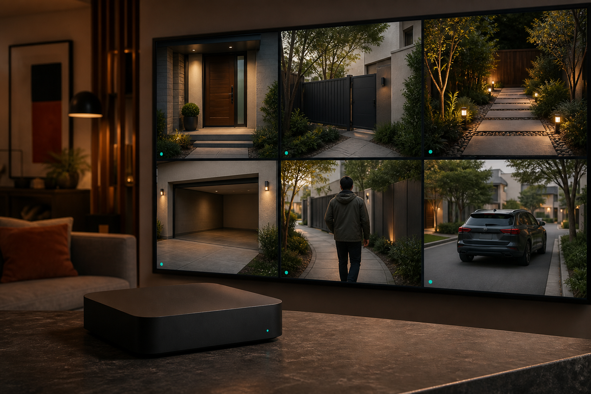
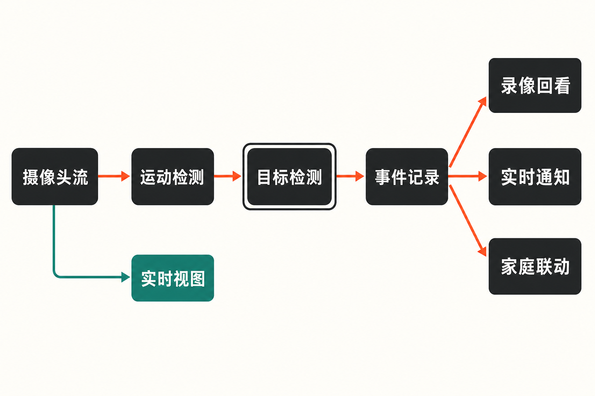

凌晨两点，院门外一片树影晃动，普通摄像头连续推送十几条告警；真正有人走近时，关键画面却淹没在通知里。另一种方案是购买云端识别服务，但这意味着持续上传视频、承担订阅费用，并把家庭影像交给第三方处理。

Frigate 瞄准的正是这个夹缝：让已有 IP 摄像头不只会“看见变化”，还可以在本地判断画面里出现的是人、车辆还是其他目标，并据此组织录像与告警。

## 30 秒认识项目

- **一句话定位：**面向 IP 摄像头、支持实时本地目标检测的开源网络视频录像机（NVR）
- **仓库地址：**[blakeblackshear/frigate](https://github.com/blakeblackshear/frigate)
- **许可证：**MIT；但 Frigate 名称、品牌及徽标属于商标，不包含在 MIT 授权内
- **主要语言：**GitHub 归类为 TypeScript；项目实际还包含以 Python 为主的后端和 TypeScript/React 前端
- **活跃度：**截至 **2026 年 9 月 2 日**，dev 分支页面显示约 6070 次提交、约 3.6k Fork、72 个开放 Issue 和 87 个 PR；可核实的近期提交日期为 2026 年 8 月 29 日。Star 数未能从资料中可靠取得，因此不列数字
- **版本状态：**截至同日，最新发布条目是 2026 年 8 月 30 日发布的 **v0.18.0-rc1 预发布版**，最近稳定版列表包含 0.17.2，详见[发布页](https://github.com/blakeblackshear/frigate/releases)

近期提交、Release、PR 和讨论共同说明项目仍在活跃维护。不过，这是对维护状态的判断，不等于对稳定性或代码质量的直接证明。



## 它解决的不是“录像”，而是录像太多

传统 NVR 的强项是持续保存视频，弱点是从数天录像中找出有意义的几秒。普通移动侦测虽然能缩小范围，却很容易被光影、雨雪和树叶触发。纯云端智能摄像头使用方便，但通常伴随视频外传、服务依赖和订阅约束。

根据[项目 README](https://raw.githubusercontent.com/blakeblackshear/frigate/master/README.md)，Frigate 在本地完成录像与推理，并先用开销较低的运动检测找出值得分析的画面区域，再调用目标检测。这使它与几类常见方案形成明显差异：

- 相比只录像的传统 NVR，它能按“检测到了什么”筛选和保留内容；
- 相比单纯移动侦测，它试图把“像素发生变化”提升为“画面中出现了目标”；
- 相比云端摄像头服务，核心录像和识别流程可以留在用户自己的设备上；
- 相比对每一帧、每一个区域都做推理的粗放方案，它利用运动区域减少不必要的 AI 计算。

> 这里需要区分事实与推断：**本地处理、运动区域筛选是官方明确说明的事实；隐私控制更强是由部署方式带来的合理推断，但最终是否安全，仍取决于端口暴露、账号、网络隔离和升级维护。**

## 四项核心能力，价值分别在哪里

### 1. 让目标成为录像索引

Frigate 支持实时目标检测、连续录像，以及基于已检测对象设置保留策略。实际价值不只是多一个识别框，而是把“某个时间有画面”变成“某个时间出现过某类目标”。对于门口、车库或仓储监控，这比拖动整天的时间轴更接近用户真正的检索需求。

### 2. 先找运动，再做 AI 推理

项目使用 OpenCV 处理运动检测，并通过 TensorFlow 等后端完成目标检测。目标检测运行在独立进程中，运动检测则负责筛出需要分析的区域。这一流程的价值在于控制多路视频的计算压力，同时尽量保持录像和实时查看的连续性。

但它并不意味着“低配机器也能随意接很多路摄像头”。[官方检测器文档](https://docs.frigate.video/configuration/object_detectors/)明确表示，默认 CPU 检测器主要用于测试，生产部署强烈建议采用 GPU 或 AI 加速器。

### 3. 同一套系统覆盖实时查看、回看与通知

Frigate 提供低延迟 Live View、Review Items、媒体浏览和通知能力，还能根据活动摄像头动态组合多路视图。WebRTC 与 MSE 用于低延迟播放；RTSP 重推流则可以减少多个客户端分别连接摄像头造成的压力。官方界面与功能概览可见[项目文档首页](https://docs.frigate.video/)。

### 4. 接入家庭自动化，而不被它完全绑定

Frigate 最初面向 Home Assistant 使用场景设计，支持 MQTT 通信及 Home Assistant 集成。MQTT 对 Frigate 本体是可选项；若要使用 Home Assistant 集成，两者需要连接同一个 MQTT Broker。

这意味着它既可以作为独立 NVR 使用，也能让“检测到人”成为自动化事件。不过，自动化链路越长，排错对象也越多：摄像头、Frigate、MQTT 和 Home Assistant 任一环节异常，都可能影响最终通知。

## 一帧画面如何变成可检索事件

来源能够支持的简化流程如下：IP 摄像头提供视频流；Frigate 接收视频后进行运动检测；存在值得分析的区域时，将相关画面交给独立目标检测进程；识别结果再用于录像保留、回看、通知以及 MQTT/Home Assistant 联动。实时画面还可通过 MSE、WebRTC 或 RTSP 重推流提供给客户端。

这不是完整源码级架构图，而是依据 README 和官方文档整理的功能数据流。具体解码方式、检测器和进程资源分配会随硬件与配置变化。



## 用 Docker Compose 跑起最小环境

[官方安装文档](https://docs.frigate.video/frigate/installation/)推荐 Docker Compose，并认为在裸机 Debian 系发行版上运行 Docker 可获得最佳性能；Windows 不受官方支持，虚拟机部署也不推荐。

下面保留官方安装方案的最小核心项。先建立配置与媒体目录，并准备 `config.yml`，再使用稳定镜像：

```yaml
services:
  frigate:
    container_name: frigate
    image: ghcr.io/blakeblackshear/frigate:stable
    restart: unless-stopped
    shm_size: "64mb"
    volumes:
      - ./config:/config
      - ./media:/media/frigate
    ports:
      - "8971:8971"
```

启动命令：

```bash
docker compose up -d
```

随后访问：

```text
http://宿主机地址:8971
```

这是最小启动骨架，还不能凭空发现摄像头。需要按照官方文档在 `config.yml` 中加入摄像头的 RTSP 输入。由于不同品牌的 RTSP 地址、认证方式和视频流名称并不一致，本文不虚构一个所谓通用地址。

端口也不能随意开放：8971 是带认证的 Web UI/API；5000 是内部无认证接口，官方要求谨慎暴露；8554 用于 RTSP，8555 用于 WebRTC。`shm_size` 只是示例起点，必须按摄像头数量和检测分辨率计算，过小可能导致 `Bus error`。GPU、Coral、Hailo 等硬件还需要对应镜像、驱动和设备映射，不能直接照搬别人的 Compose 文件。

## 优点、限制与成熟度

Frigate 的优势很具体：本地完成核心视频处理；用运动检测约束 AI 推理范围；把目标识别连接到录像保留和回看；兼容多种检测后端；同时提供实时查看、重推流及家庭自动化接口。MIT 许可证也降低了阅读和修改代码的门槛，但品牌和徽标并未随代码一并开放授权。

限制同样明显。纯 CPU 检测不适合正式生产；硬件加速涉及镜像、驱动、模型和设备映射。不同类型的目标检测器不能混用，例如不能同时让 OpenVINO 与 Coral 承担目标检测。部分模型需要自行下载或转换，而且尺寸、张量布局、数据类型和标签表必须匹配。Apple Silicon 的 NPU 不能直接从容器访问，需要在宿主机运行独立检测客户端。

成熟度方面，约 6070 次累计提交、持续更新的文档和近期 RC 发布，说明它已不是停留在概念阶段的实验仓库。但 0.18 RC1 仍明确标为预发布，并包含破坏性变更。官方要求升级前备份配置文件与 `frigate.db`；旧配置虽然会尝试自动迁移，仍可能需要手工调整。生产环境不应把 RC 标签误当稳定版。

风险还包括视频源稳定性和长期运维。[0.16 FAQ](https://github.com/blakeblackshear/frigate/discussions/18048)曾记录摄像头断连后内存增长与部分 Wi-Fi 摄像头或特定 ffmpeg 行为相关的报告；这份 FAQ 针对旧版本，不能直接推定新版本仍存在相同问题，但足以提醒用户：无线视频源、升级迁移和异常恢复必须纳入上线前验证。

## 谁适合尝试，谁应该谨慎

Frigate 适合已经拥有 RTSP IP 摄像头、愿意维护 Docker、重视本地处理，并希望把监控接入 Home Assistant 的家庭实验者或小型场所。若手头有兼容的 Intel 核显、Nvidia GPU、Coral、Hailo 等资源，探索价值更高。

它不适合只想插电即用、完全不愿处理 YAML、驱动和网络端口的人；也不适合把 Windows 桌面或一台资源紧张的纯 CPU 小主机视为无条件生产平台。对需要厂商承担端到端 SLA、合规审计和现场支持的组织，开源可控并不能替代正式服务保障。

## 结语

Frigate 最值得关注的地方，不是给监控画面再叠一层“AI”标签，而是重新安排视频处理顺序：先用便宜的运动判断缩小范围，再让目标检测参与录像、检索和自动化。本地化带来了更大的控制权，也把硬件选型、配置、安全和升级责任交还给用户。

> **编辑观点：**如果你已有 RTSP 摄像头、能维护 Docker，并接受为硬件加速投入时间，Frigate 值得用稳定版做一套小规模验证；如果需求只是省心看家，或没有持续运维能力，成熟的成品方案可能更合适。先接一两路摄像头验证识别、资源占用、断流恢复和升级备份，再决定是否扩大部署，比追逐仓库热度更可靠。

## 参考资料

1. [GitHub：blakeblackshear/frigate](https://github.com/blakeblackshear/frigate)
2. [Frigate 项目 README](https://raw.githubusercontent.com/blakeblackshear/frigate/master/README.md)
3. [Frigate 官方文档：Introduction](https://docs.frigate.video/)
4. [Frigate 官方文档：Installation](https://docs.frigate.video/frigate/installation/)
5. [Frigate 官方文档：Object Detectors](https://docs.frigate.video/configuration/object_detectors/)
6. [GitHub：Frigate Releases](https://github.com/blakeblackshear/frigate/releases)
7. [GitHub：dev 分支提交记录](https://github.com/blakeblackshear/frigate/commits/dev/)
8. [GitHub Discussion：Frigate 0.16 FAQ](https://github.com/blakeblackshear/frigate/discussions/18048)
