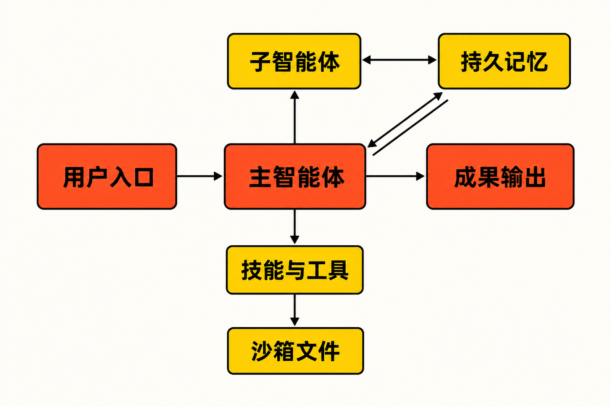

你要完成一份行业研究报告：先检索资料，再核对来源、运行数据处理脚本、生成图表，最后整理成网页或幻灯片。普通聊天助手可以回答其中某个问题，但当任务跨越几十个步骤、持续数十分钟，还涉及文件、代码和外部工具时，真正的难点已经不是“模型会不会回答”，而是任务能否被拆解、执行、隔离、保存和恢复。

这正是 DeerFlow 2.0 想解决的问题。它不是又一个聊天界面，也不只是把搜索结果拼成报告，而是试图给长时程智能体补齐执行基础设施。

## 30 秒认识项目

- **一句话定位：**面向分钟到小时级复杂任务的开源 SuperAgent Harness，由主智能体协调子智能体、工具、记忆、文件系统和沙箱。
- **仓库地址：**[bytedance/deer-flow](https://github.com/bytedance/deer-flow)
- **许可证：**[MIT License](https://github.com/bytedance/deer-flow/blob/main/LICENSE)
- **主要语言：**后端 Python、前端 TypeScript。
- **最新正式版：**v2.0.0，发布于 2026 年 6 月 25 日；截至 2026 年 8 月 14 日核实时仍为最新正式版本。
- **活跃度：**截至 2026 年 8 月 14 日 08:38，仓库约有 79.9k Stars、10.9k Forks、331 Watchers、575 个 Issues 和 385 个 Pull Requests；main 分支最新可见提交日期为 8 月 13 日。[提交记录](https://github.com/bytedance/deer-flow/commits/main/)

这些数字能说明关注度和开发活动较高，却不能直接证明稳定性、安全性或实际效果。

## 它解决的不是“回答”，而是“把事情做完”

常规大模型对话通常围绕一次请求和一次回复展开。复杂任务则要求系统在较长时间里维护目标、拆分工作、管理中间文件、调用外部服务，并在失败后保留可恢复的状态。

DeerFlow 2.0 将这类能力放进同一套运行框架：主智能体负责规划和协调，子智能体承担相对独立的工作，Skills 和工具提供具体能力，沙箱与文件系统承载执行过程，持久记忆则保存跨会话信息。[项目 README](https://github.com/bytedance/deer-flow/blob/main/README.md)

与几个常见替代方向相比，它的差异更容易看清：

- 相比普通聊天助手，它强调多步骤执行、文件产物和持久状态，而非只返回一段文字。
- 相比固定脚本或传统可视化工作流，它允许智能体根据任务动态规划，并通过 Skills 渐进加载能力；代价是行为更难完全预测。
- 相比团队从零拼接模型、搜索、代码执行、记忆和界面，它提供了较完整的开箱基础设施；代价是系统更重，也需要接受其既定架构和安全模型。
- 相比 DeerFlow 1.x，2.0 已从“深度研究框架”转向更通用的 SuperAgent Harness。官方明确说明二者不共享代码，旧版留在 `main-1.x` 分支，因此升级应被视为迁移，而非普通版本更新。[v2.0.0 发布说明](https://github.com/bytedance/deer-flow/releases)

最后一点是事实。至于这种转向是否成功，则仍需结合具体场景和长期维护情况判断。

## 四项核心能力，实际价值在哪里

### 1. 主智能体与子智能体协作

主智能体可以把复杂目标分派给子智能体，并追踪子智能体的用量和运行状态。实际价值不在于“智能体数量更多”，而在于研究、编码、材料整理等工作可以相对隔离地推进，减少单一上下文同时容纳所有细节的压力。

但多智能体也会引入状态一致性问题。近期已有用户报告可能出现记忆内容或人格污染；该 Issue 截至核实时仍处于 Open 状态，尚不能视为维护者确认的普遍缺陷，却值得测试者重点观察。[Issues 列表](https://github.com/bytedance/deer-flow/issues)

### 2. 沙箱、文件系统与代码执行

智能体可以读写文件、执行 Shell 和代码，把分析过程转化为报告、幻灯片、网页等实际产物。对需要加工数据或多轮修改文档的任务，这比只在对话框中生成文本更有意义。

相应地，风险也明显提高：能够写文件和执行命令的智能体，本质上获得了接近自动化程序的权限。官方因此默认仅绑定 `127.0.0.1`，并要求面向局域网或公网部署时增加身份认证、IP 白名单及网络隔离。

### 3. Skills、MCP 与外部工具扩展

Skills 按需加载，可以新增、替换或组合；系统还支持 MCP、网页搜索与抓取等工具。这使能力扩展不必全部写进一个庞大的提示词，也便于针对企业流程接入专用工具。

不过，Gateway 管理员注册并执行 stdio MCP 服务的权限，被官方明确视为等同于主机代码执行权限。换句话说，插件化降低了扩展门槛，却没有消除权限治理成本。

### 4. 记忆与持久化运行状态

长任务最怕进程中断后全部重来。DeerFlow 2.0 加入持久记忆、用户隔离的自定义智能体和持久化运行状态，使跨会话偏好与任务恢复成为可能。

这里也存在部署前提：发布说明提到，跨 worker 取消任务在无法完成时会返回 409，可靠运行依赖正确配置 RunStore；Docker Gateway 默认使用单 worker，以规避当时的多 worker 运行问题。对个人试用影响有限，对共享服务则是必须纳入设计的约束。

## 它如何运转



根据官方功能描述，可以把一次任务概括为以下流程：用户从 Web UI、TUI 或即时通信渠道提出目标；主智能体进行规划，将部分工作交给子智能体；执行过程中按需加载 Skills，调用搜索、MCP、Shell 或代码工具；文件操作进入沙箱和文件系统；记忆及 RunStore 保存必要状态；最终汇总为报告、幻灯片、网页、图像或视频等产物。

这是一种基于已公开组件关系的流程归纳，并非官方给出的严格调用时序。实际是否调用子智能体、搜索或多媒体工具，取决于任务和配置。

## 可复制的安装与最小使用方式

官方 README 提供的最短交互式起步方式是：

```bash
git clone https://github.com/bytedance/deer-flow.git
cd deer-flow
make setup
```

配置向导会要求选择模型提供商、可选搜索服务，以及沙箱、Shell、文件写入策略，并生成 `config.yaml` 和 `.env`。DeerFlow 不附送模型服务：至少需要配置一个受支持的 LLM，并提供相应 API Key，或连接自行部署的兼容服务。

配置完成后，Docker 路径运行：

```bash
make docker-start
```

本地开发则运行：

```bash
make dev
```

遇到问题可先检查环境：

```bash
make doctor
make support-bundle
```

更审慎的 Docker 安装流程是先执行 `make config`（仅在缺少配置时）、再执行 `make docker-init`，最后由使用者运行 `make docker-start`。需要注意，`docker-init` 只表示先决条件准备完毕，不等于服务已经构建并启动。[官方安装规范](https://github.com/bytedance/deer-flow/blob/main/Install.md)

官方建议本地评估或 Docker 开发至少从 4 vCPU、8GB 内存起步，2 vCPU、4GB 通常不足。安装后的最小使用方式，是从界面提交一个需要检索、整理并输出文件的任务；来源材料没有给出可保证复现的固定自然语言示例，因此这里不虚构具体效果。


## 优点、限制与成熟度

它的优势首先是完整度：智能体编排、工具、沙箱、记忆、文件产物和多种交互入口被放进统一框架。MIT 许可证也为修改和再分发留下了较大空间，但仍须保留版权及许可声明。

限制同样明确。系统需要外部模型和可能的搜索服务，成本、速率限制、数据政策与生成内容权利并不由 MIT 许可证一并解决。资源门槛高于轻量聊天应用；快速变化的 main 分支也不适合生产环境无条件跟随。

成熟度方面，可以确认的事实是：项目关注度高、近期提交频繁，v2.0.0 还加入了符号链接防护、MCP 敏感值遮蔽、跨站认证防护和 Skill 解压上限等安全加固。另一方面，公开讨论中仍有 Windows 安装、Setup 卡住、模型兼容和文档页面等未回答问题；Issue 中也存在记忆和渠道任务生命周期等待分诊的报告。[Discussions](https://github.com/bytedance/deer-flow/discussions)

据此判断，它更接近“快速演进、已有正式版本但仍需工程验证”的平台，而不是无需治理即可投入关键生产流程的成熟成品。这是基于维护节奏、部署约束和公开问题作出的编辑判断。

## 谁适合尝试，谁应该谨慎

DeerFlow 适合需要构建研究、编程、报告或内容生产型智能体的开发团队，也适合愿意管理模型密钥、容器、权限和运行成本的技术个人。它尤其适合作为长时程 Agent 的原型底座，用来验证子智能体、Skills、记忆和文件产物能否形成完整闭环。

它不适合只想获得一个轻量聊天工具的普通用户；不适合无法提供至少 4 vCPU、8GB 内存的环境；也不适合在没有身份认证、网络隔离和权限审计的情况下直接暴露到公网。涉及敏感数据、关键业务操作或多人共享时，应先完成威胁建模、最小权限配置、成本控制和故障恢复测试。

## 结语

DeerFlow 2.0 最值得关注的，不是它能否再生成一份报告，而是它把竞争焦点从“模型回答得多聪明”推进到“复杂任务能否可靠运行并留下成果”。其组件完整、扩展面广、维护活跃，但高权限、外部服务依赖和快速迭代也构成真实成本。

结论是：**值得技术团队小范围试用，但应把它当作需要部署和治理的智能体基础设施，而不是开箱即用的生产级员工。**优先固定正式 Release，在隔离环境中验证一个具体任务，再决定是否进入共享或生产场景。

## 参考资料

1. [DeerFlow GitHub 主仓库](https://github.com/bytedance/deer-flow)
2. [DeerFlow 2.0 README](https://github.com/bytedance/deer-flow/blob/main/README.md)
3. [官方安装规范 Install.md](https://github.com/bytedance/deer-flow/blob/main/Install.md)
4. [MIT License](https://github.com/bytedance/deer-flow/blob/main/LICENSE)
5. [GitHub Releases](https://github.com/bytedance/deer-flow/releases)
6. [main 分支提交记录](https://github.com/bytedance/deer-flow/commits/main/)
7. [GitHub Issues](https://github.com/bytedance/deer-flow/issues)
8. [GitHub Discussions](https://github.com/bytedance/deer-flow/discussions)
