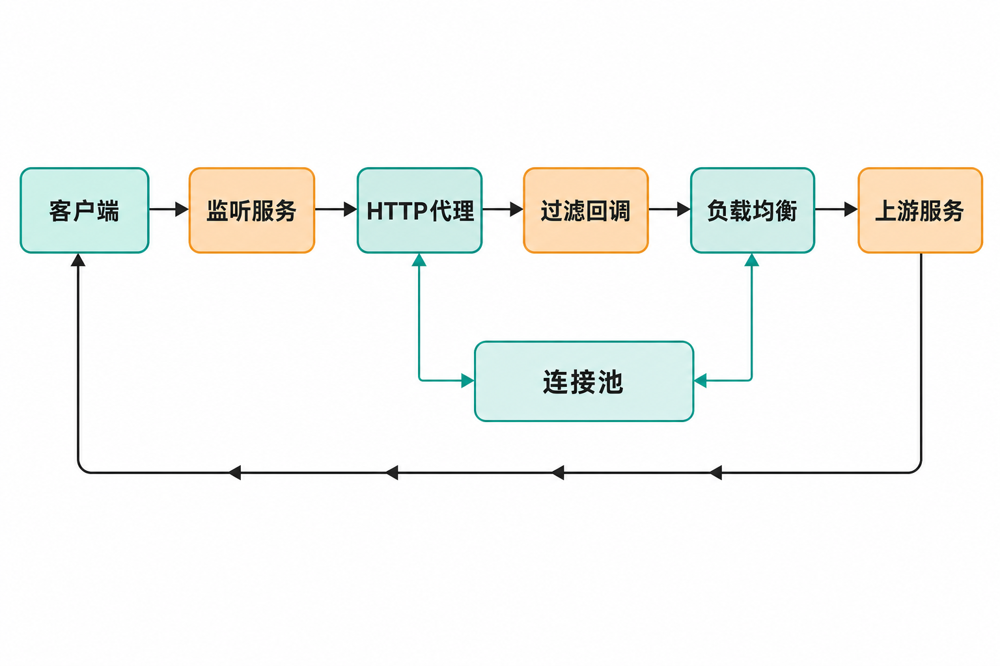

当一家公司要在代理层加入自定义路由、鉴权、限流、故障转移和监控逻辑时，常见做法是继续堆配置、编写扩展模块，或者干脆维护一套内部代理。

困难随之而来：配置型产品未必能表达复杂业务逻辑；使用 C/C++ 扩展又要承担内存安全风险；连接池、协议解析、优雅升级等基础设施如果从头实现，工程成本更高。

Cloudflare 开源的 Pingora，正是针对这类问题给出的答案。但理解它的第一步，是放弃“又一个 NGINX”的想象：Pingora 更接近一套用 Rust 构建可编程网络服务的底层框架。

## 30 秒认识项目

- **一句话定位：**面向高性能、安全敏感场景的 Rust 异步多线程网络服务框架，重点支持可编程 HTTP 代理。
- **仓库地址：**[cloudflare/pingora](https://github.com/cloudflare/pingora)
- **许可证：**Apache License 2.0
- **主要语言：**Rust
- **最新正式版：**0.8.1，发布于 2026 年 6 月 4 日；动态信息核实于 2026 年 8 月 15 日。
- **活跃度：**核实时仓库页面约有 1.7k Fork、720 次提交、199 个 Issue、107 个 Pull Request；主分支在 2026 年 7 月仍有密集提交。GitHub 页面未稳定呈现 Star 数，因此本文不报告未经核实的 Star，更不以热度代替工程判断。

上述数据来自[项目仓库](https://github.com/cloudflare/pingora)、[Releases 页面](https://github.com/cloudflare/pingora/releases)及[提交历史](https://github.com/cloudflare/pingora/commits/main/)，均会继续变化。


## 它解决的不是“转发请求”，而是“可控地转发请求”

反向代理的基本动作并不复杂：接收下游请求、选择上游、转发并返回响应。真正棘手的是，在大规模生产环境中把连接复用、超时、重试、健康检查、TLS、协议边界和无中断升级组合起来，同时允许业务加入自己的决策逻辑。

Pingora 把这些通用能力拆成多个 crate，包括 `pingora-core`、`pingora-proxy`、`pingora-http`、`pingora-load-balancing` 和 `pingora-cache`。开发者在框架提供的生命周期中实现过滤器或回调，而不必从套接字和协议解析起步。

与 NGINX、HAProxy 等配置驱动的成熟代理相比，Pingora 的差异不只是语言，而是抽象层级：前者更适合安装、配置后直接承担流量入口；Pingora 要求编写和维护 Rust 程序，换来更深的请求处理定制能力。

因此，**事实是** Pingora 是库和框架集合，并非开箱即用的完整代理产品。**本文的判断是**：如果需求主要是 TLS 终止、静态路由和常规负载均衡，成熟配置型代理通常更省事；只有当代理逻辑本身逐渐成为产品代码时，Pingora 的价值才会明显。

## 四项核心能力，以及它们的实际价值

### 1. 可编程的代理生命周期

Pingora 通过过滤器和回调开放请求处理阶段。开发者可以决定如何选择上游、跨阶段共享状态、返回错误，以及在哪里加入限流或观测逻辑。[官方用户指南](https://github.com/cloudflare/pingora/blob/main/docs/user_guide/index.md)列出了请求阶段、Peer、故障转移和限流等主题。

实际价值在于，复杂规则可以进入类型化代码和正常的软件测试流程，而不是不断膨胀成难以审查的代理配置。

### 2. 连接池与复用

框架提供上游连接池和连接复用。对存在大量短请求的服务，复用连接可以避免反复建立 TCP/TLS 连接的成本，也让代理层能够统一实施连接管理策略。

Cloudflare 在 README 中称，Pingora 已在其生产环境承载每秒超过 4000 万次互联网请求。这是[项目方披露的自身生产规模](https://github.com/cloudflare/pingora/blob/main/README.md)，能够证明框架经历过大规模场景，但不能推导出第三方部署也会获得相同吞吐或延迟。

### 3. 协议与上游治理能力

Pingora 支持 HTTP/1、HTTP/2、TLS、TCP、Unix Domain Socket，以及 gRPC、WebSocket 代理；同时提供可定制负载均衡、健康检查和故障转移。[Cloudflare 的开源公告](https://blog.cloudflare.com/pingora-open-source/)还把 HTTP/3 列为当时的路线图内容，因此不能把 HTTP/3 写成已经交付的正式能力。

这些能力的实际意义，是让团队能在同一个框架中实现“选哪个上游、失败后是否重试、连接怎样复用”等策略，而非拼装多套网络组件。

### 4. 面向生产运行的基础设施

官方文档覆盖配置、守护进程、systemd、Prometheus、错误日志、SIGTERM 优雅关闭，以及 Linux 上通过交接监听套接字实现的无中断升级。公告还列出 Syslog、Sentry 和 OpenTelemetry 集成。

这并不等于部署后自动具备完整运维体系，但它减少了自研网络服务时必须重复建设的基础部分。

## 一次请求如何经过 Pingora

从官方快速入门能够确认的主流程是：服务先监听端口；下游请求进入代理服务；实现 `ProxyHttp` 的对象执行请求生命周期逻辑；`upstream_peer()` 通过负载均衡器选择上游；框架建立或复用连接，把请求转发给目标服务，再将响应返回客户端。

在最小示例中，上游为 `1.1.1.1:443` 与 `1.0.0.1:443`，轮询选择器负责分配请求。继续扩展时，开发者可以加入健康检查、故障转移和过滤器。

这里需要区分边界：上述是文档能够支持的外部处理流程；异步运行时、线程模型等高级内部原理在用户指南中仍被标记为 WIP，不宜根据有限材料自行补全。



## 从零运行一个最小负载均衡器

下面步骤与代码来自[官方 Quick Start](https://github.com/cloudflare/pingora/blob/main/docs/quick_start.md)。先创建项目：

```bash
cargo new load_balancer
cd load_balancer
```

在 `Cargo.toml` 的依赖区加入：

```toml
[dependencies]
async-trait = "0.1"
pingora = { version = "0.8.0", features = ["openssl", "lb"] }
```

需要注意：官方教程仍固定在 0.8.0，而核实时最新正式版是 0.8.1。用于正式项目之前，应核对 crates.io、Release Notes 和依赖兼容性，不要机械改版本。

将 `src/main.rs` 写成官方示例所示的最小代理：

```rust
use async_trait::async_trait;
use pingora::prelude::*;
use std::sync::Arc;

struct LB(Arc<LoadBalancer<RoundRobin>>);

#[async_trait]
impl ProxyHttp for LB {
    type CTX = ();
    fn new_ctx(&self) -> Self::CTX {}

    async fn upstream_peer(
        &self,
        _session: &mut Session,
        _ctx: &mut Self::CTX,
    ) -> Result<Box<HttpPeer>> {
        let upstream = self.0.select(b"", 256).unwrap();
        Ok(Box::new(HttpPeer::new(
            upstream,
            true,
            "one.one.one.one".to_string(),
        )))
    }
}

fn main() {
    let mut server = Server::new(None).unwrap();
    server.bootstrap();

    let upstreams = LoadBalancer::try_from_iter([
        "1.1.1.1:443",
        "1.0.0.1:443",
    ]).unwrap();

    let mut proxy = http_proxy_service(
        &server.configuration,
        LB(Arc::new(upstreams)),
    );
    proxy.add_tcp("0.0.0.0:6188");
    server.add_service(proxy);
    server.run_forever();
}
```

启动并验证：

```bash
cargo run
curl 127.0.0.1:6188 -svo /dev/null
```

示例为 HTTPS 上游启用了 TLS。如果换成本地明文 HTTP 上游，需要在 `HttpPeer` 中关闭 TLS，否则文档指出会得到 502。

## 优点明确，限制同样不能略过

Pingora 的优势是组合式网络能力、Rust 的内存安全基础、细粒度编程接口，以及来自 Cloudflare 生产环境的实践背景。2026 年 7 月的提交仍涉及 HTTP/2、子请求、负载均衡、缓存和协议校验，说明项目处于活跃演进期。

但它还不是“稳定到可以忽略变化”的基础设施成品：

- 官方把代理缓存集成标为实验性，相关 API 高度易变。
- Linux 是一级支持平台；Unix/macOS 为尽力支持，Windows 仍属初步的社区维护状态。
- README 当前列出的 MSRV 为 Rust 1.85，并采用滚动六个月策略，升级工具链可能成为持续成本。
- 用户指南中的内部原理、线程模型、BoringSSL、自定义配置和 tracing 等高级章节仍是 WIP。
- [Issue 列表](https://github.com/cloudflare/pingora/issues)中存在协议边界、连接关闭、缓存一致性、文件描述符和依赖安全等报告。这些标题不能直接视为已确认缺陷，但上线前应逐项检查复现情况、维护者回应和修复版本。
- 通用正向代理不是项目的核心方向；相关请求曾以“不计划实现”关闭。若目标是企业上网代理，预计需要大量自定义工作——这是根据项目定位和 Issue 处理结果作出的推断。

最新的 0.8.1 是安全与维护版本，为默认 HTTP/2 服务端加入有界限制以缓解内存耗尽，并处理 rustls 相关依赖公告。这体现了维护响应，也提醒采用者：代理处于流量入口，依赖升级、资源上限和模糊测试不能省略。

## 谁适合尝试，谁应该谨慎

Pingora 适合已经使用 Rust，且需要开发反向代理、API 网关内核、边缘服务或高度定制流量入口的团队；尤其适合愿意承担代码维护、性能测试和协议安全审查的基础设施团队。

它不太适合只想通过配置快速上线网站代理的小团队，也不适合把 Windows 当作主要生产平台、强依赖稳定缓存 API，或期待现成控制台和完整发行包的用户。

## 结语：值得试，但应把它当框架评估

Pingora 值得尝试的理由，不是仓库数字，也不是“Cloudflare 同款”，而是它提供了一条清晰路线：以 Rust 为基础，把连接管理、代理生命周期和负载均衡等通用能力组合成可编程网络服务。

更稳妥的采用方式，是先选取一条低风险流量路径做原型，对吞吐、尾延迟、连接复用、重试语义、优雅升级和故障行为进行自己的验证，再决定是否进入核心链路。把它当成需要二次开发的框架，结论会更准确；把它当成无需工程投入的 NGINX 替代品，则很容易误判成本。

## 参考资料

1. [cloudflare/pingora 项目仓库](https://github.com/cloudflare/pingora)
2. [Pingora 官方 README](https://github.com/cloudflare/pingora/blob/main/README.md)
3. [Quick Start: load balancer](https://github.com/cloudflare/pingora/blob/main/docs/quick_start.md)
4. [Pingora User Guide](https://github.com/cloudflare/pingora/blob/main/docs/user_guide/index.md)
5. [Pingora Releases](https://github.com/cloudflare/pingora/releases)
6. [Pingora 主分支提交历史](https://github.com/cloudflare/pingora/commits/main/)
7. [Pingora Issues](https://github.com/cloudflare/pingora/issues)
8. [Cloudflare：Open sourcing Pingora](https://blog.cloudflare.com/pingora-open-source/)
