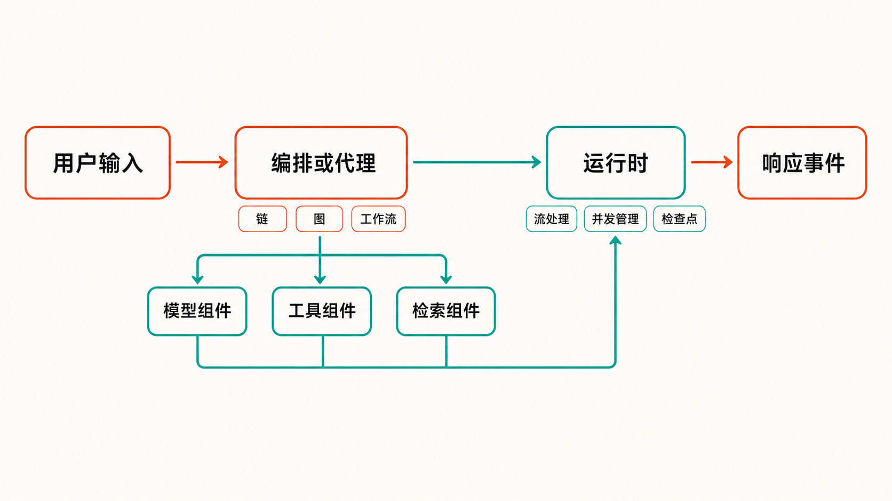

一个 Go 团队准备把大模型接进客服、知识库或内部自动化系统时，真正麻烦的往往不是发出第一次 API 请求。

随着需求增加，工程里很快会出现模型适配、提示词模板、工具调用、检索、流式输出、并发控制、失败恢复和运行观测。若还要让 Agent 自主选择工具，同时保证关键业务按固定流程执行，团队通常需要自己拼接多套 SDK，再维护一层内部框架。

[Eino](https://github.com/cloudwego/eino) 瞄准的正是这段“从模型调用到可维护 AI 应用”的工程距离。它由 CloudWeGo 开源，核心思路不是替开发者决定业务逻辑，而是为 Go 项目提供统一组件、确定性编排和 Agent 运行框架。

## 30 秒认识项目

- **一句话定位：**面向 Go 开发者的 LLM/AI 应用开发框架，在同一套运行体系中提供模型组件、工作流编排和 Agent Development Kit（ADK）。
- **仓库地址：**[cloudwego/eino](https://github.com/cloudwego/eino)
- **许可证：**[Apache License 2.0](https://raw.githubusercontent.com/cloudwego/eino/main/LICENSE-APACHE)
- **主要语言与环境：**Go，仓库要求 Go 1.18 及以上版本。
- **版本状态：**截至 2026 年 8 月 3 日核实，最新稳定版为 v0.9.13，发布时间为 2026 年 7 月 22 日；更新的 v0.10.0-alpha.13 发布于 7 月 27 日，但属于预发布版。[版本记录](https://github.com/cloudwego/eino/releases)
- **活跃度：**截至 2026 年 8 月 3 日 14:43（UTC+8），仓库页面约有 12.6k Stars、1.0k Forks、86 个开放 Issue、47 个 PR 和458次提交；5月至7月也持续出现维护提交。[提交记录](https://github.com/cloudwego/eino/commits/main/)

这些数字只能说明关注度和维护规模，不能单独证明稳定性、代码质量或生产适用性。


## 它解决的不是“调用模型”，而是应用工程问题

直接使用某家模型厂商的 SDK，适合单模型、单轮调用或快速验证。但当应用需要替换模型、接入检索器、注册工具、组合多个步骤时，业务代码容易与具体供应商接口缠在一起。

Eino 将 ChatModel、Tool、Retriever、Embedding、ChatTemplate 等能力抽象为组件，再由 Chain、Graph、Workflow 或 ADK 负责组织执行。它本身并不提供模型推理服务；实际运行仍要依赖 OpenAI、Ark、Claude、Gemini、Ollama 等实现、访问凭据和相应的 `eino-ext` 适配器。[官方总览](https://www.cloudwego.io/docs/eino/overview/)

与常见方案相比，可以从三个维度理解其差异：

第一，相比直接拼模型 SDK，它多了一层统一接口和运行时能力，代价是引入框架概念与依赖。

第二，相比只强调自主决策的 Agent 框架，它也提供确定性的图和工作流。需要循环推理时可以用 Agent；必须严格控制节点与路径时可以使用 Graph。

第三，项目明确借鉴了 LangChain、Google ADK 等框架，但 API、类型系统与工程规范强调符合 Go 的使用习惯。这是其最鲜明的定位，不代表它在功能或生态规模上必然超过这些替代方案。

## 四项核心能力，实际价值在哪里

### 1. 统一组件接口：降低替换与组合成本

模型、提示模板、检索器、向量化组件和工具使用统一抽象后，上层流程不必到处感知供应商的具体调用方式。其实际价值在于：团队可以把业务流程和外部服务适配分开维护。

不过，统一接口并不会消除供应商差异。模型支持的工具调用格式、流式行为和鉴权方式仍由具体适配器承担。

### 2. 三种编排方式：让控制力度匹配业务

Chain 适合顺序执行；Graph 支持带循环或无环的图；Workflow 则侧重结构体字段级映射的 DAG。编排层还能处理节点类型检查、流的拼接与合并、并发管理、回调注入和运行参数分派。[架构说明](https://www.cloudwego.io/docs/eino/overview/)

实际价值不是“画出更复杂的图”，而是把隐含在条件判断、goroutine 和回调里的执行关系显式化。对于审核、检索后生成、分支路由等流程，这通常比完全交给模型决策更可预测。

### 3. ADK：覆盖从单 Agent 到多 Agent

ADK 提供 ChatModelAgent，以及 Sequential、Parallel、Loop Agent，还包括 Deep Agent、Supervisor、Plan-Execute-Replan 和人机协同机制。工具通过 `ToolsConfig` 注册后，ChatModelAgent 可以判断何时调用工具、何时给出最终回答。[官方 README](https://github.com/cloudwego/eino/blob/main/README.md)

这让团队不必从零实现事件循环、上下文传递和中断恢复。但“会调用工具”不等于“调用一定正确”：工具权限、参数校验、超时与副作用控制仍是应用方责任。

### 4. 流处理、检查点与调试：处理生产环境的复杂路径

Eino 提供自动流处理、回调切面、并发管理、检查点和可观测性扩展接口。官方可视化调试插件还能展示 Graph/Chain 拓扑，从起点或指定节点运行，并查看节点输入、输出与耗时。[调试指南](https://www.cloudwego.io/docs/eino/core_modules/devops/visual_debug_plugin_guide/)

其价值在排错：当一次回答经过检索、模型和工具等多个节点时，开发者需要知道问题发生在哪一步，而不是只看到最终输出失败。

## 工作原理：组件、编排与运行时如何配合

从官方资料可以归纳出一条基本路径：输入先进入 Chain、Graph、Workflow 或 Agent；编排层根据节点和边分派任务；节点调用 ChatModel、Tool、Retriever 等组件；运行时处理流、并发、回调和检查点；最终产生响应或 Agent 事件。

核心仓库主要承载类型、组件接口、流机制、编排与 Agent 实现；具体模型等集成主要位于 `eino-ext`，完整案例则放在 `eino-examples`。这种拆分使核心框架与外部服务适配相对解耦，但也意味着安装核心包并不能直接获得可用模型。

Graph 的关键特征是先添加 Lambda、ChatModel 等节点和边，再编译并调用 `Invoke`；ADK 路径则是创建 ChatModel，把它交给 `adk.NewChatModelAgent`，再通过 `adk.NewRunner` 执行 `Query` 并逐个读取事件。



## 安装与最小使用路径

官方 README 给出的核心安装命令是：

```bash
go get github.com/cloudwego/eino@latest
```

若使用 OpenAI 等具体模型，还需安装对应的 `github.com/cloudwego/eino-ext` 模块，并配置该服务所需的 API Key。由于不同模型的模块路径和初始化参数不同，应从[官方 README](https://github.com/cloudwego/eino/blob/main/README.md)选择对应适配器，不宜凭空套用同一配置。

最小 Agent 使用顺序如下：

```text
创建 ChatModel
    ↓
adk.NewChatModelAgent
    ↓
adk.NewRunner
    ↓
runner.Query
    ↓
循环读取事件
```

如果目标是固定流程，则改用 `compose.NewGraph` 创建图，加入节点和边，完成编译后执行 `Invoke`。以上保留了官方资料能够核实的 API 与调用顺序；由于本任务来源没有收录完整可编译代码及具体模型配置，本文不补写未经来源验证的函数参数。复制生产代码时应直接采用官方 README 中与目标适配器匹配的完整示例，并锁定依赖版本。

## 优点、限制与潜在风险

Eino 的优势很明确：它针对 Go 技术栈；同时覆盖确定性工作流和自主 Agent；组件、流、并发、回调与检查点不是事后拼补，而是框架的一部分；近期仍有稳定版和预发布版持续更新。

但成熟度也要客观看。项目截至核实日仍未达到 1.0，v0.10 仍处于 alpha 阶段。历史上，工具参数描述曾从 OpenAPI 3.0 Schema Object 迁移至 JSON Schema Draft 2020-12，旧接口随后被移除；维护者还提醒出现编译错误时应同步升级相关 `eino-ext` 模块。[迁移讨论](https://github.com/cloudwego/eino/discussions/397)

**事实：**近期稳定版修复涉及流式工具输出、嵌套 Agent 取消作用域和 Graph 中断竞态，提交历史也出现并发 map panic、检查点恢复及事件处理修复。

**推断：**这说明维护响应积极，同时表明 Agent、流式处理、中断和恢复属于高复杂度区域，生产采用前需要覆盖这些路径的回归与压力测试。

**观点：**对关键业务，团队应锁定稳定版本，并把框架升级当作依赖迁移项目，而不是普通补丁更新。

工具安全同样不能外包给框架。DeepAgent 可以组合 Shell、Python、搜索等工具，但风险取决于应用授予的权限。涉及文件、命令、数据库或外部写操作时，应采用最小权限、参数校验、超时、审计和人工确认。

调试插件从 v0.1.9 起默认仅监听 `127.0.0.1`；若为远程调试显式开放默认端口 52538，访问控制和网络暴露风险需要由部署方处理。此外，接口类型字段默认可能显示 `{}`，自定义具体类型需通过 `devops.AppendType` 注册。

## 谁适合用，谁应该谨慎

Eino 更适合已经使用 Go、准备构建 RAG、工具型 Agent、多步骤生成流程，且希望兼顾自主决策与确定性控制的团队。对于愿意维护模型适配器、版本锁定和测试体系的后端团队，它值得进入技术验证清单。

如果只是做一次模型调用、短期原型，直接使用模型 SDK 可能更轻。如果团队主要使用其他语言，或高度依赖该语言已有的成熟插件生态，迁移到 Go 只为采用 Eino 未必划算。无法承受小版本兼容变化、又缺乏完整回归测试的关键系统，也不应直接跟随 `latest` 或 alpha 版本。

## 结语

Eino 真正值得关注的，不是它又封装了多少模型，而是它试图把 Go 团队经常自行解决的组件组合、图编排、Agent 运行、流处理与调试问题放进同一套工程体系。

截至 2026 年 8 月 3 日，它是一个维护活跃、方向清晰但仍在 1.0 之前快速演进的项目。结论不是“立即全面替换”，而是：如果你的 AI 应用已经超出单次模型调用，并且 Go 是主力技术栈，Eino 值得用锁定的稳定版做一个边界清晰的试点；验证重点应放在适配器兼容、流式与中断路径、工具权限以及升级成本上。

## 参考资料

1. [cloudwego/eino 项目仓库](https://github.com/cloudwego/eino)
2. [Eino 官方 README](https://github.com/cloudwego/eino/blob/main/README.md)
3. [Eino 官方总览](https://www.cloudwego.io/docs/eino/overview/)
4. [Eino Releases](https://github.com/cloudwego/eino/releases)
5. [主分支提交记录](https://github.com/cloudwego/eino/commits/main/)
6. [Apache License 2.0 原文](https://raw.githubusercontent.com/cloudwego/eino/main/LICENSE-APACHE)
7. [OpenAPI 3.0 至 JSON Schema 迁移讨论](https://github.com/cloudwego/eino/discussions/397)
8. [Eino Dev 可视化调试指南](https://www.cloudwego.io/docs/eino/core_modules/devops/visual_debug_plugin_guide/)
