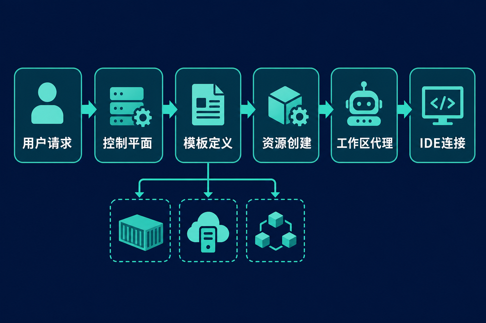

新员工入职第一天，常常不是写代码，而是安装 SDK、申请权限、配置数据库，再花半天追查“为什么这段代码只在我的电脑上报错”。远程开发和 AI 编程代理又放大了问题：代码、密钥和算力究竟放在哪里，团队是否看得见资源消耗，离职后环境能否及时收回？

Coder 给出的答案，不是再做一款在线编辑器，而是把开发环境变成由组织集中定义、按需创建和统一治理的基础设施。

## 30 秒认识项目

| 项目 | 信息 |
|---|---|
| 一句话定位 | 面向开发者与 AI 编程代理的自托管云开发环境平台 |
| 仓库 | [github.com/coder/coder](https://github.com/coder/coder) |
| 许可证 | 开源入口为 AGPL-3.0；仓库另含企业功能许可证，具体使用边界需分别核对 |
| 主要语言 | Go；Web 前端大量使用 TypeScript |
| 活跃度 | 约 1.4k Fork、15,555 次提交、766 个开放 Issue、约 184—189 个开放 PR；近期仍连续提交和发布 |
| 数据核实时间 | 2026 年 7 月 31 日 11:47（北京时间）；当次页面未正常显示 Star，故不写精确值 |

这些数字是维护规模的旁证，不是质量或生产可用性的直接证明。更值得关注的是，[主分支近期提交](https://github.com/coder/coder/commits/main/)覆盖工作区、模板界面和 AI agent 等多个子系统，同时项目维持不同发布通道。

## 它真正解决的是什么

Coder 试图解决的是“开发环境失控”：个人电脑配置难复现，云主机靠工单交付，容器平台又往往只给运维使用。它让管理员用 Terraform 模板定义环境，开发者从模板创建工作区，再通过熟悉的 IDE 接入。

与本地开发相比，差异在于代码与算力可以留在组织控制的基础设施中，环境也能重复创建。与手工分配云主机相比，模板降低了逐台配置和回收的成本。与直接给开发者 Kubernetes 权限相比，Coder 提供了一层面向工作区的产品界面和治理入口。与托管式云 IDE 相比，其关键取向是自托管：工作区可以运行在 Kubernetes Pod、云主机或 Docker 容器中。

> 上述比较是基于官方能力得出的分析，不意味着 Coder 在所有场景都更省钱或更安全。最终结果仍取决于模板、身份系统、网络边界和运维质量。

## 四项核心能力，以及实际价值

### 1. 用模板统一环境

Coder 的模板本质上是 Terraform 配置。管理员可以把计算资源、依赖和 Coder agent 一并固化，开发者无需从零拼装环境。实际价值不只是“一键启动”，而是把环境变更纳入可审查、可复用的基础设施代码，减少团队成员之间的配置漂移。

### 2. 工作区与使用工具解耦

开发者可以继续使用 VS Code、浏览器 IDE 或 JetBrains 工具，工作区则运行在远端基础设施。官方 README 还说明连接通过安全的 WireGuard 隧道建立，并提供 [VS Code 与 JetBrains 集成](https://github.com/coder/coder/blob/main/README.md)。这让团队能集中管理算力，而不必强迫所有人更换编辑器。

### 3. 按使用状态管理资源

Coder 支持自动停止空闲资源。对需要 GPU、大内存或大量临时环境的团队，这有机会减少忘记关机造成的浪费。不过，“支持自动停止”不等于成本必然下降；休眠规则、存储保留方式与云厂商计费仍需单独设计。这是基于功能边界作出的判断。

### 4. 为 AI 编程代理提供受控运行环境

官方将 AI agent 纳入同一套工作区体系：代理循环运行在自有控制平面中，工作区内无需保存 LLM API 密钥，并可集中做模型治理、成本跟踪和审计；模型来源包括 OpenAI、Anthropic、Google、Bedrock 及自托管模型。

其实际意义是给代理一个隔离、可回收的执行场所，而不是让它直接操作开发者笔记本。需要注意，支持某模型提供商并不等于支持该厂商的个人订阅凭据；[社区讨论](https://github.com/coder/coder/discussions)显示，认证方式和 Windows 工作区中的 agent 支持仍需按版本核实。

## 工作区是怎样创建出来的

根据[官方快速入门](https://coder.com/docs/get-started)，流程可以概括为：管理员准备 Terraform 模板；用户发起创建；provisioner 执行 Terraform；Docker、云主机或 Kubernetes 中生成工作区；预装的 Coder agent 建立连接；开发者再从 IDE 进入环境。

这意味着 Coder 更像“控制平面与入口”，而非替代底层云平台。模板负责声明基础设施，provisioner 负责落地，agent 负责工作区连接。相应地，Terraform 配置和底层平台故障也会直接影响体验。



## 十分钟跑起最小环境

官方本地路径要求至少 2 个 CPU 核心、4GB 内存，并已启动 Docker 兼容容器运行时。以下命令来自[官方 README](https://github.com/coder/coder/blob/main/README.md)：

```bash
curl -L https://coder.com/install.sh | sh
coder server
```

随后访问：

```text
http://localhost:3000
```

在网页中创建首个用户，选择 Docker 基础模板并创建工作区，最后连接 IDE，即构成最小使用闭环。

这套步骤适合本机体验，不应直接等同于生产部署。官方给出的生产启动形式是：

```bash
coder server --postgres-url <url> --access-url <url>
```

外部 PostgreSQL 要求 13 或更高版本。若 Docker daemon 未运行、socket 不在 `/var/run/docker.sock`，工作区可能创建失败；若 3000 端口被占用，服务也无法启动。

## 成熟度、优势与风险

从约 1.55 万次提交、持续发布和稳定分支回移修复来看，Coder 已不是早期概念验证项目。2026 年 7 月 31 日核实时，GitHub 标记的稳定 Latest 是 7 月 28 日发布的 [v2.34.7](https://github.com/coder/coder/releases/tag/v2.34.7)；版本号更高的 [v2.35.3](https://github.com/coder/coder/releases/tag/v2.35.3) 属于 mainline，并非当时的稳定 Latest。官方建议缺少 staging 环境的企业采用最新 stable，说明升级通道不能只看版本号大小。

它的优势很清楚：基础设施留在组织控制范围内；模板提高一致性；开发者仍可使用熟悉的 IDE；传统开发者与 AI 代理能够共用治理框架。

限制同样实际。首先，自托管把云、数据库、身份、模板和网络的责任交还给使用者，它不是免运维 SaaS。其次，AGPL 与企业专有功能并存，商业部署前需要审查具体功能和许可证。再次，负载均衡、WebSocket、CORS 与 Cloudflare Tunnel 等复杂网络拓扑在社区中仍有求助记录；这些只是风险线索，不能直接认定为普遍缺陷，但足以说明上线前需要验证。

还有具体的版本风险：一个截至核实时仍开放的 [Issue #27501](https://github.com/coder/coder/issues/27501) 报告，在 Ubuntu 24.04、Coder v2.34.6-arm64 和修改后的 AWS Linux 模板中，多个 `coder_env` 追加 PATH 可能清除系统原有路径并导致启动失败。它不能外推到所有模板，却提醒团队不要未经测试就改动关键环境变量。


## 谁适合，谁不适合

Coder 更适合已有云或 Kubernetes 能力、需要统一数十个以上开发环境、重视源码和算力控制，或准备让 AI 代理进入研发流程的组织。平台工程团队也能借它把环境交付做成标准化服务。

它不太适合只有少数开发者、以本地环境即可满足需求、没有人维护 Terraform 与底层平台的团队。若组织期望注册即用、完全不承担控制平面与网络运维，托管式开发环境通常更直接。对高度依赖 Windows 工作区或复杂代理网络的团队，也应先做针对性验证。

## 结语：值得试，但先把它当基础设施

Coder 值得试的原因，不是热度数字，而是它抓住了一个正在扩大的矛盾：开发者和 AI 代理都需要更强算力、更快交付，同时组织又需要控制代码、密钥与成本。

建议从非关键项目开始：先用 Docker 跑通最小流程，再制作一份真实业务模板，验证 IDE 连接、休眠恢复、身份权限、网络代理与版本升级。若这些环节能被现有平台团队稳定接住，Coder 才可能从“远程开发工具”变成长期的研发基础设施。

## 参考资料

1. [coder/coder 主仓库](https://github.com/coder/coder)
2. [官方 README](https://github.com/coder/coder/blob/main/README.md)
3. [官方 Get started 文档](https://coder.com/docs/get-started)
4. [Release v2.34.7](https://github.com/coder/coder/releases/tag/v2.34.7)
5. [Release v2.35.3](https://github.com/coder/coder/releases/tag/v2.35.3)
6. [main 分支提交历史](https://github.com/coder/coder/commits/main/)
7. [Issue #27501：AWS EC2 模板中的 PATH 问题](https://github.com/coder/coder/issues/27501)
8. [Coder Discussions](https://github.com/coder/coder/discussions)
