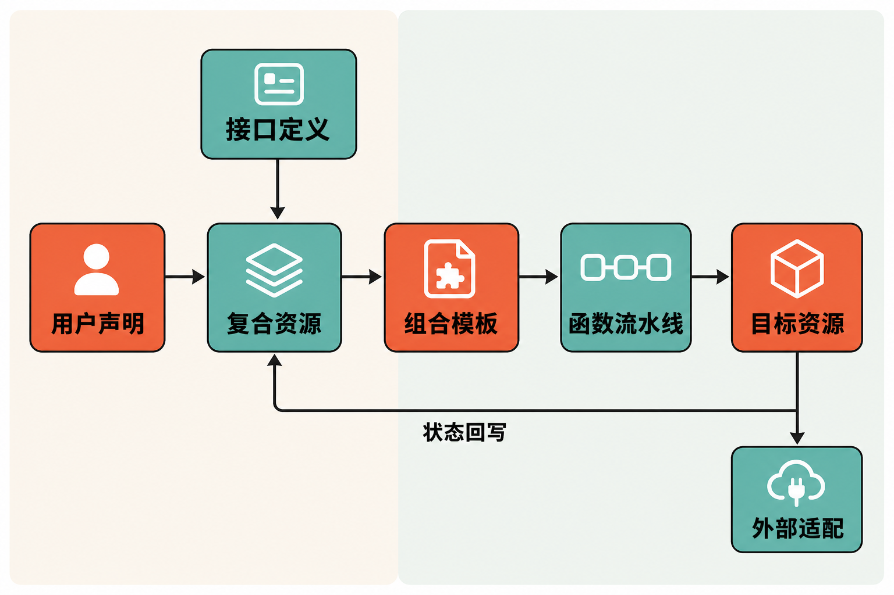

当开发团队申请一个“生产可用数据库”时，真正需要的往往不只是一台数据库：网络、权限、备份、监控和删除策略都要一起落地。若把这些细节直接暴露给开发者，学习成本很高；若全部交给平台团队人工处理，工单又会成为瓶颈。

Crossplane 试图解决的，正是“如何把复杂基础设施封装成简单、自助且持续受控的平台 API”。它并非独立云服务，而是运行在 Kubernetes 上的控制平面框架：平台团队定义 API，使用者提交声明，控制器持续推动实际状态接近期望状态。

## 30 秒认识项目

- **一句话定位：**在 Kubernetes 上构建云原生控制平面的框架，用声明式自定义 API 编排应用与基础设施。
- **仓库：**[crossplane/crossplane](https://github.com/crossplane/crossplane)
- **许可证：**Apache License 2.0
- **主要语言：**Go
- **项目归属：**仓库标明项目属于 CNCF。
- **当前版本：**截至 2026 年 8 月 20 日，GitHub 标记 v2.3.4 为 Latest；该版本发布于 2026 年 7 月 23 日。
- **活跃度：**截至同日，仓库页面约有 1.2k Fork、119 个开放 Issue、71 个开放 PR和约 9,077 次提交；主分支最新可见提交日期为 2026 年 8 月 18 日。资料未能可靠取得精确 Star 数，因此不作猜测。提交频率只能说明项目仍在维护，不能单独证明质量或生产成熟度。


## 它解决的不是“创建资源”，而是“提供平台能力”

传统脚本或一次性基础设施任务，通常关注一次执行是否成功。Crossplane 更接近 Kubernetes 的工作方式：用户声明想要什么，控制器持续观察并调谐实际状态。根据[项目 README](https://github.com/crossplane/crossplane/blob/main/README.md)，它面向平台 API 与持续调谐，而非仅仅执行一段基础设施脚本。

与直接向开发者暴露云厂商 API 相比，它允许平台团队设计更窄、更稳定的业务接口。例如，开发者只声明一个 `App`，底层可以由平台团队组合 Deployment、Service，乃至外部云资源。调用者不必理解每个底层对象。

与编写专用 Kubernetes Controller 相比，Crossplane 的差异是提供 XRD、Composition 和 Function 等通用构件。平台团队可以先用配置和函数流水线表达资源组合，而不必为每项平台能力从头实现完整控制器。

与一次性模板渲染相比，它还承担持续观察和状态回写。这是事实层面的机制差异。至于它能否降低团队总成本，则取决于平台规模、抽象是否稳定以及运维能力，属于组织层面的判断，不能由项目功能直接推出。

## 四项核心能力，以及它们的实际价值

### 1. Provider：把外部系统接入 Kubernetes 控制面

Provider 是 Crossplane 与云服务或其他外部系统之间的连接层。外部对象在 Kubernetes 中表现为 Managed Resource，控制器负责观察、创建和更新真实资源。

实际价值在于，团队可以沿用 Kubernetes 的声明式对象、权限体系与调谐模型管理不同后端。但这并不意味着云之间自动实现了完全可移植：不同服务的能力、字段和生命周期差异依然存在，Provider 凭据也必须妥善治理。

### 2. XRD：由平台团队定义自己的 API

CompositeResourceDefinition，简称 XRD，用于定义复合资源的类型和字段。平台团队可以创建 `App`、`Database` 或其他面向内部用户的资源类型，而不是要求用户直接填写底层云资源的全部参数。

它的价值是建立组织自己的“平台语言”：哪些参数允许用户决定，哪些安全和运维约束由平台统一设置，都可以体现在 API 边界中。

### 3. Composition：用一个声明组合多个资源

[官方 Composition 文档](https://docs.crossplane.io/latest/composition/compositions/)将它定义为把多个 Kubernetes 资源封装成单个可复用 Composite Resource 的模板。一个接口可以组合计算、存储和网络策略，也可以把自定义存储桶 API 映射为 AWS S3 Bucket Managed Resource。

这让前端 API 与底层实现相对分离：开发者继续申请同一种资源，平台团队则可调整其具体组合。但“隐藏复杂度”不等于“消灭复杂度”，资源依赖、就绪检查、删除策略与版本升级仍由平台侧承担。

### 4. Function Pipeline：为组合逻辑增加表达能力

Crossplane v2 的 Composition 采用 Function Pipeline 执行模型。来源材料显示，组合逻辑可使用 YAML、YAML 加 CEL、模板化 YAML、Python或 KCL；Composition 通过 `functionRef` 调用相应 Function。

这比静态模板更适合处理变换和条件逻辑。代价同样明确：外部 Function 会引入镜像、包版本、权限、供应链和调试责任。表达能力越强，平台团队越需要建立版本锁定、审计与回归测试机制。

## 一次声明如何变成真实资源

依据[官方入门示例](https://docs.crossplane.io/latest/get-started/get-started-with-composition/)，流程可以概括为：平台团队先用 XRD 定义 API，再用 Composition 绑定该类型并描述资源组合；用户提交 Composite Resource 后，Crossplane 执行 Function Pipeline，创建 Deployment、Service 或 Managed Resource，随后持续观察并将结果写回资源状态。



这里有两个角色：平台团队负责抽象和实现，使用者只消费 API。若 XRD 是“产品规格”，Composition 就是“交付配方”，Provider 则是操作外部系统的适配层。

需要强调的是，这是一种便于理解的编辑性类比；组件关系和调谐流程是来源支持的事实，类比本身属于本文解释。

## 安装与最小使用示例

Crossplane 必须安装到已有 Kubernetes 集群。根据[官方安装文档](https://docs.crossplane.io/latest/get-started/install/)，前置条件包括受支持的 Kubernetes 版本，以及 Helm v3.2.0 或更高版本。

官方给出的最小 Helm 安装步骤是：

```bash
helm repo add crossplane-stable https://charts.crossplane.io/stable
helm repo update
helm install crossplane \
  --namespace crossplane-system \
  --create-namespace \
  crossplane-stable/crossplane
```

验证核心 Pod：

```bash
kubectl get pods -n crossplane-system
```

应检查 `crossplane` 与 `crossplane-rbac-manager` 是否处于 `Running` 状态。

安装框架不等于平台已经可用。还需配置 XRD、Composition，以及场景需要的 Provider 或 Function。官方 Composition 入门中的最小用户资源核心内容如下：

```yaml
apiVersion: example.crossplane.io/v1
kind: App
metadata:
  name: my-app
spec:
  image: nginx
```

在已经完成官方示例所需 XRD、Composition 和 Function 配置后，将其保存为 `app.yaml` 并提交：

```bash
kubectl apply -f app.yaml
```

Crossplane 随后依据 Composition 创建 Deployment 与 Service，并把副本数、地址等观测结果写回 `App` 状态。这个例子也说明，Crossplane v2 的范围并不限于云基础设施，也能组合普通 Kubernetes 应用资源。

## 优点、限制与成熟度

它的主要优点是抽象边界清晰、声明式 API 可自助消费、底层实现能够独立演进，并且具有持续调谐能力。对于已经使用 Kubernetes、需要重复交付多项平台能力的团队，这套模型有明显吸引力。

但它会增加一层控制平面。团队仍要维护 Kubernetes、Crossplane 本体、Provider、Function、凭据和包版本；错误也可能横跨多个层次。抽象设计不当，还可能形成难以理解的内部 API。

项目仍在活跃演进。[v2.3.4 发布说明](https://github.com/crossplane/crossplane/releases/tag/v2.3.4)显示，该补丁修复了重复调谐最终触发 XR circuit breaker、`crossplane render` 处理异常等问题，并更新了多项安全相关依赖。官方版本表显示 v2.3 计划支持至 2027 年 2 月；v1.20 是 v1 最后一个次版本，仅接收关键修复，EOL 尚未确定。公开路线图只是近似计划，并非交付承诺。

供应链和升级风险也不能忽视。Provider 与 Function 本质上都是需要部署、授权和升级的软件包。私有镜像场景尤其应验证包身份与依赖解析。一个[仍开放的 Issue #6779](https://github.com/crossplane/crossplane/issues/6779)记录了 Crossplane 1.20.1 中，私有镜像 Provider 与依赖路径命名不一致时生成重复 Provider、使状态变为 `Unknown` 的案例。截至 2026 年 8 月 20 日，该问题仍在 Backlog。它不能被外推为 v2.3 的普遍故障，但足以提醒团队在隔离集群验证 Configuration 解析结果。

## 适合谁，不适合谁

Crossplane 更适合已经以 Kubernetes 为基础、有专门平台团队、需要向多个开发团队提供标准化自助 API，并愿意长期治理 Provider、Function 和资源生命周期的组织。多环境、重复交付和持续合规需求越强，它的抽象价值越容易体现。

如果团队只管理少量资源、没有 Kubernetes 基础，或需求只是偶尔执行一次部署，新增一套控制平面的收益可能覆盖不了运维成本。缺少平台 API 设计、升级测试和凭据治理能力的团队，也不宜直接把它放进关键生产路径。

## 结语：值得尝试，但应从一个窄场景开始

Crossplane 值得平台工程团队尝试，理由不是仓库热度，而是它把“资源交付”提升为“平台 API 设计与持续控制”。更稳妥的起点，是选择一种边界明确、可回滚的内部能力，先验证 XRD、Composition、状态回写、删除策略和升级流程，再决定是否扩大范围。

它不是隐藏所有云复杂度的魔法层，而是把复杂度集中交给平台团队治理。这个交换是否划算，才是采用 Crossplane 前最需要回答的问题。

## 参考资料

1. [crossplane/crossplane 主仓库](https://github.com/crossplane/crossplane)
2. [Crossplane README](https://github.com/crossplane/crossplane/blob/main/README.md)
3. [Install Crossplane](https://docs.crossplane.io/latest/get-started/install/)
4. [Get Started With Composition](https://docs.crossplane.io/latest/get-started/get-started-with-composition/)
5. [Compositions](https://docs.crossplane.io/latest/composition/compositions/)
6. [Crossplane v2.3.4 Release](https://github.com/crossplane/crossplane/releases/tag/v2.3.4)
7. [主分支提交记录](https://github.com/crossplane/crossplane/commits/main/)
8. [Issue #6779：Provider 依赖解析与重复安装](https://github.com/crossplane/crossplane/issues/6779)
