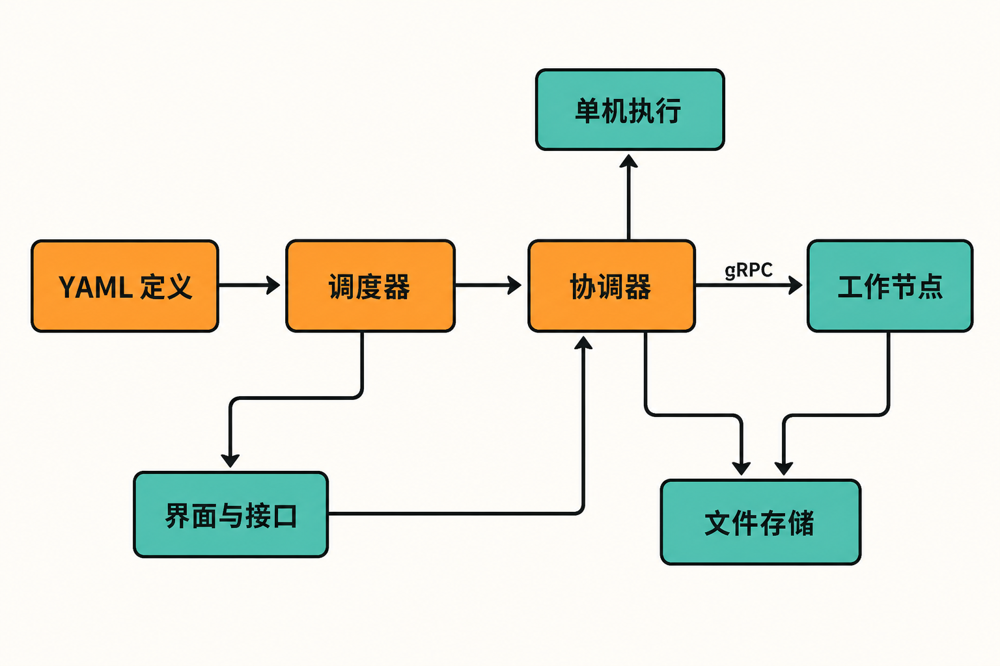

凌晨的备份脚本执行失败，第二天才有人从业务异常中发现；一个任务依赖另一个任务完成，团队只能在 crontab 里错开时间；脚本跑在几台服务器上，日志、重试和执行历史散落各处。继续给脚本叠加判断、锁文件和告警，维护成本会越来越高；换成完整的数据编排平台，又可能引入数据库、消息代理和一整套新运维工作。

开源项目 Dagu 瞄准的正是这段中间地带：不要求重写现有自动化逻辑，而是用声明式 YAML 把脚本、SSH 命令、容器任务和操作手册组织成有依赖关系的工作流，再补上调度、重试、日志、通知与 Web 界面。[项目仓库](https://github.com/dagucloud/dagu)将其定位为面向运维和内部自动化的本地优先工作流引擎。

## 30 秒认识项目

- **一句话定位：**一个可自托管的工作流编排器，用 DAG 管理已有命令、脚本和跨环境任务。
- **仓库地址：**[github.com/dagucloud/dagu](https://github.com/dagucloud/dagu)
- **许可证：**GNU GPLv3。社区自托管无需许可证密钥；SSO、RBAC、审计日志等能力另有付费自托管许可证。
- **主要语言：**Go；Web UI 使用 React/TypeScript。
- **活跃度：**截至 **2026 年 8 月 28 日 08:08（UTC+8）**，仓库页面约有 3.8k Stars、318 Forks、22 Watchers，约 56 个开放 Issue、2 个开放 PR。最新应用版本为 [v2.15.3](https://github.com/dagucloud/dagu/releases)，发布于 2026 年 8 月 25 日。

这些数字只能证明项目受到一定关注且近期仍在更新，不能直接证明软件质量。更值得注意的是，8 月 21 日至 25 日连续发布了 v2.15.0—v2.15.3，[提交记录](https://github.com/dagucloud/dagu/commits/main/)也显示近期存在多位外部贡献者，但主要维护活动仍较集中于核心维护者。

## 它解决的不是“如何写脚本”，而是“如何管脚本”

Cron 擅长按时间启动命令，却不天然表达复杂依赖、失败重试、人工确认、集中日志和运行历史。团队通常只能把这些控制逻辑继续写进 shell，最终得到一套隐形编排系统。

Dagu 的做法是保留脚本作为业务逻辑，把控制关系移到 YAML：哪个步骤先执行、失败后如何处理、能否并行、何时调度，由工作流定义负责。其价值不在于替代 Bash、Python 或 SQL，而在于给它们增加统一的生命周期管理。

与 Airflow 一类通常面向复杂数据管道的平台相比，Dagu 的核心部署不依赖外部 DBMS 或消息代理，一个二进制即可启动界面、API、调度和协调组件。这降低了个人服务器、小团队内网和边缘节点的起步门槛。

> **推断：**这种轻量取舍使 Dagu 更像“可逐步升级的 Cron”，而不是面向所有规模和可靠性等级的通用替代品。若组织已经拥有成熟的数据平台、数据库级状态管理和严格权限体系，迁移价值需要另行评估。

## 四项核心能力，实际价值在哪里

### 1. 把异构任务放进同一张依赖图

Dagu 可执行 shell、Docker、Kubernetes Job、SSH、SQL、HTTP 和 Sub-DAG，并支持并行步骤。实际意义是：任务不必因为运行位置或工具不同而被拆成多套调度体系。例如，本地生成文件、远程执行部署命令、随后调用 HTTP 接口，可以在一份 DAG 中表达先后关系。

### 2. 给定时任务补齐运行治理

项目支持重试、队列、并发控制、时区、任务重叠策略和补跑窗口，并提供逐步日志与历史记录。这些能力解决的不是“任务能不能启动”，而是重复触发怎么办、错过调度如何处理、失败发生在哪一步，以及后续如何追溯。

### 3. 把人工操作纳入流程

人工输入、通知和 Webhook 意味着工作流可以在自动步骤之间等待确认，而不必把审批过程放在聊天记录里。对于发布、数据修复和高风险运维，这能让人工决策与机器执行共享同一份运行历史。不过，企业级 SSO、RBAC 和审计能力涉及付费许可，不能把社区版本等同于完整的企业治理方案。

### 4. 从单机平滑扩展到 Worker

单机可把服务端、调度器、执行能力和文件存储放在同一节点。需要跨机器执行时，Coordinator 可通过 gRPC 将任务分发给按标签路由的 Worker。v2.15 系列还改进了 shared-nothing 模式中的文件依赖传输和嵌套 Sub-DAG 路由。[发布记录](https://github.com/dagucloud/dagu/releases)表明，分布式执行也是近期集中修复与增强的方向。

此外，Dagu 内置 MCP 服务，认证后的 AI 客户端可以检查工作流和运行记录、修改定义并控制执行。这是附加入口，而非项目的核心类别；把 Dagu 简化成“AI 工作流工具”会掩盖它更基础的运维编排定位。


## 工作原理：YAML 如何变成一次运行

依据[官方 README](https://github.com/dagucloud/dagu/blob/main/README.md)，用户先用 YAML 定义步骤及依赖；Scheduler 根据计划创建运行，Coordinator 负责协调执行。单机模式下，相关角色可由 `dagu start-all` 在一个进程内启动；分布式模式下，Coordinator 经 gRPC 将任务送至匹配标签的 Worker。执行状态、队列和日志默认落在文件系统，HTTP/UI Server 则提供界面与 API，供用户查看状态、日志和历史。

这里存在一个关键设计交换：文件存储减少了数据库和消息代理依赖，但持久化、容量、备份与恢复责任也随之交给使用者。“不用数据库”并不等于“不需要数据运维”。



## 从安装到跑通第一个 DAG

以下命令均来自[官方快速入门](https://docs.dagu.sh/getting-started/quickstart)。macOS 或 Linux 可执行：

```bash
curl -fsSL https://raw.githubusercontent.com/dagucloud/dagu/main/scripts/installer.sh | bash
dagu version
```

也可以选择 Homebrew：

```bash
brew install dagu
```

创建 `hello.yaml`：

```yaml
steps:
  - id: hello
    run: echo "hello from Dagu"
```

先校验，再执行：

```bash
dagu validate hello.yaml
dagu dry hello.yaml
dagu start hello.yaml
```

启动 Web 服务并指定当前目录为 DAG 目录：

```bash
dagu start-all --dags .
```

随后访问 `http://localhost:8080`，即可查看实时状态、步骤日志、历史记录和 YAML 编辑器。需要注意，首次对空 DAG 目录启动时会自动创建五个示例工作流；若不需要，可设置 `DAGU_SKIP_EXAMPLES=true`。

[安装文档](https://docs.dagu.sh/getting-started/installation/)显示，默认配置与工作流位于 `~/.config/dagu/`，日志和运行状态位于 `~/.local/share/dagu/`。进入生产环境前，应为这些目录明确设置权限、容量监控、备份与恢复方案。Docker 部署同样必须保留持久卷，否则容器删除时工作流、状态和日志可能一并消失。

## 优点、限制与成熟度

Dagu 的优点相当明确：部署依赖少；能复用已有脚本；从命令行到 Web UI 的路径短；既能单机运行，也预留了分布式 Worker；执行器覆盖常见运维环境。它非常适合先把散乱的 Cron 和操作手册纳入统一管理，再逐步增加治理能力。

限制也不能忽略。第一，本地文件是简化部署的基础，也是可靠性边界。长期开放的 [Issue #539](https://github.com/dagucloud/dagu/issues/539)讨论了磁盘写满、误删与节点故障风险；这只是社区提出的架构顾虑，并非已经确认发生的数据丢失事故，但足以提醒生产用户做好持久化和灾备。

第二，部分能力仍在演进。开放 Issue 中仍有通用事件触发需求、Sub-DAG 列表刷新和 YAML 错误展示问题；嵌入式 Go API 被官方标记为 Experimental，接口可能变化。v2.15.3 修复了 Worker 故障期间的调度器内存滞留、空队列扫描和服务关闭等问题。高频修复说明维护积极，也说明升级前需要阅读变更并在自身负载下验证。

第三，企业权限与合规不能只看开源核心。需要 SSO、细粒度 RBAC、审计日志或商业嵌入时，应先核实相应许可、功能范围与成本。

> **观点：**就材料反映的状态，Dagu 已不是只有概念演示的早期项目，但也不宜仅凭 Star 或连续发版就认定其具备大型关键业务所需的成熟度。成熟度应由故障恢复、存储可靠性、升级兼容性和团队可维护性共同检验。

## 谁值得尝试，谁应谨慎

它适合维护大量 Cron、shell、SSH 或容器任务的小型运维团队；适合需要在内网、边缘环境或个人服务器上快速获得 DAG、重试和可观测性的使用者；也适合作为现有脚本体系与重型编排平台之间的过渡层。

它不太适合把数据库级高可用、强事务状态和全托管持久化视为前提的关键业务；不适合默认要求完整企业身份治理、却不准备采购相应能力的组织；若团队已经深度依赖成熟数据平台的生态与算子，也不应仅为“更轻”而迁移。

## 结语

Dagu 最有价值的地方，不是创造一种新的任务语言，而是承认现实：多数团队已经拥有大量可以工作的脚本，真正缺少的是依赖管理、失败处理和统一追踪。

因此，它值得用一两个非关键工作流进行试点。若文件持久化、故障恢复、权限边界和升级策略都能满足要求，再扩大使用范围；若这些前提无法满足，低部署成本就不足以抵消生产风险。

## 参考资料

1. [dagucloud/dagu 项目仓库](https://github.com/dagucloud/dagu)
2. [Dagu 官方 README](https://github.com/dagucloud/dagu/blob/main/README.md)
3. [Dagu Quickstart](https://docs.dagu.sh/getting-started/quickstart)
4. [Dagu Installation](https://docs.dagu.sh/getting-started/installation/)
5. [Dagu Releases](https://github.com/dagucloud/dagu/releases)
6. [Dagu 提交记录](https://github.com/dagucloud/dagu/commits/main/)
7. [Dagu Issues](https://github.com/dagucloud/dagu/issues)
8. [Issue #539：About database supported](https://github.com/dagucloud/dagu/issues/539)
