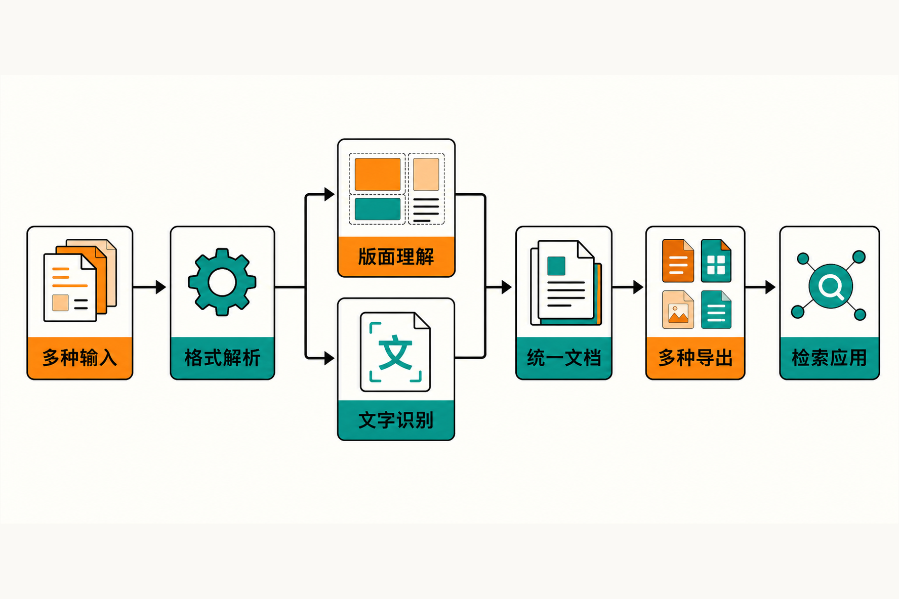

一份几十页的 PDF 交给普通文本提取器后，双栏内容可能左右串行，表格变成一堆错位字符，页眉页脚混进正文，图片与说明文字也失去关联。把这样的结果直接送入知识库，后续分块、检索和问答都会受到影响。

现实中的输入还不止 PDF：企业资料可能同时存在于 Word、PPT、Excel、网页、扫描图片甚至会议录音中。真正困难的并不是“读出字符”，而是保留标题层级、阅读顺序、表格关系和内容类型，并把不同来源转换成下游程序能够统一处理的结构。

这正是开源项目 Docling 试图解决的问题。

## 30 秒认识项目

- **一句话定位：**将 PDF、Office 文档、网页、图片和音视频等异构内容转换为统一的 `DoclingDocument`，再导出为适合生成式 AI、RAG、检索及数据处理的格式。
- **仓库地址：**[docling-project/docling](https://github.com/docling-project/docling)
- **许可证：**MIT；但所调用的外部模型仍须分别遵守其原始许可证。
- **主要语言：**Python。项目以 Python 包、API 和源码为核心，同时提供 CLI；由于核验时 GitHub Languages 比例未能展开，本文不提供未经确认的语言占比。
- **活跃度：**截至 **2026 年 8 月 5 日 08:14（北京时间）**，仓库约有 64.2k Stars、4.6k Forks 和 224 Watchers。最新版本为 **v2.118.0**，发布于 2026 年 8 月 3 日；主分支最近可见提交同样在 8 月 3 日。[Release 记录](https://github.com/docling-project/docling/releases)显示 7 月下旬连续发布多个版本，[提交历史](https://github.com/docling-project/docling/commits/main/)也呈现多人持续协作。

这些数字能够说明关注度和维护频率，却不能证明解析准确率、API 稳定性或生产质量。


## 它解决的不是 OCR，而是“文档结构断裂”

常见方案大致分成三类：纯文本提取器负责取出字符；OCR 负责识别扫描页；针对 PDF、Word 等格式的独立解析器各自输出不同结果。它们都可能成为处理链的一部分，但使用者往往还要自行解决格式适配、阅读顺序、表格复原、统一数据模型和下游导出。

Docling 的差异在于，它把这些环节组织成一套文档规范化框架。输入先由相应后端解析，再进入统一的 `DoclingDocument` 表达；下游不必为每一种输入格式重新设计数据结构。官方 README 将其定位为异构文档解析与高级 PDF 理解层，而非单纯 OCR 工具。[官方格式矩阵](https://docling-project.github.io/docling/usage/supported_formats/)还覆盖 PDF、Office Open XML、OpenDocument、HTML、EPUB、Markdown、LaTeX、CSV、图片、音视频及若干专业 XML。

**事实边界需要说清：**“支持某种格式”不等于其中所有语义都能无损还原。官方只明确将 Docling JSON 定义为 `DoclingDocument` 的无损序列化；Markdown、HTML等格式受自身表达能力限制，不能默认具备同等保真度。

## 四项核心能力，价值分别在哪里

### 1. 从字符提取推进到版面理解

Docling 的 PDF 能力涉及版面、阅读顺序、表格结构、代码、公式及图片分类，也可对扫描件使用 OCR。这意味着它关注的不只是“页面上有什么字”，还关注内容块之间的关系。

实际价值在于：进入 RAG 前，标题与段落不容易被无差别地打散，表格也有机会以结构化形式保留。这里使用“有机会”是刻意的——来源没有给出适用于所有文档的统一准确率，不能把能力列表推断成结果保证。

### 2. 用统一模型接住多种输入

PDF、DOCX、PPTX、XLSX、网页和图片可以汇入同一种中间表达，专业场景还覆盖 JATS、XBRL、USPTO、EBCDIC 等格式。这减少了下游程序围绕不同输入反复编写适配层的需要。

对企业知识库而言，其价值不只是“格式多”，而是转换之后可以采用相近的序列化、分块和检索流程。这是根据统一模型设计作出的工程判断，并非官方承诺的成本数据。

### 3. 输出面向人，也面向机器

项目可导出 Markdown、HTML、纯文本、JSON、DocTags、WebVTT、DocLang，以及面向 RAG 的 JSONL chunks。Markdown 便于人工阅读和内容发布；Docling JSON 适合保存完整内部表达；JSONL 分块则可以进入检索链路。

同一份解析结果由此能服务多个出口，而不必每次从原文件重新开始。不过，选择更易读的格式通常也意味着放弃一部分结构细节，生产系统应根据用途保留原始结果或无损 JSON。

### 4. 不止转换器，还有 AI 应用接口

官方资料列出 LangChain、LlamaIndex、CrewAI、Haystack 等集成，并提供 VLM 管线、MCP 与 `docling-serve` API 服务支持。[官方示例中心](https://docling-project.github.io/docling/examples/)还覆盖 Milvus、Weaviate、Qdrant 等 RAG 组合，以及图片标注、结构化抽取和 GPU 配置。

它的实际价值是降低“解析结果接入 AI 应用”的距离。但结构化信息抽取目前在官方示例中被标为 **beta**；README 中的元数据提取与复杂化学结构理解则仍属于“Coming soon”，不能当作已稳定交付功能。

## 工作流程：先统一，再导出

依据官方公开能力，Docling 的基本处理路径可以概括为：接收文件或 URL，根据格式进入相应解析后端；对 PDF 或扫描内容执行版面分析、阅读顺序判断及必要的 OCR、表格等处理；随后生成统一的 `DoclingDocument`；最后按使用场景导出 Markdown、HTML、JSON 或 RAG 分块。



标准管线之外，项目还支持 GraniteDocling 等 VLM 管线。音频可进入 ASR 流程；视频当前主要依靠额外依赖提取音轨并转录。不同管线需要不同模型、运行库和硬件条件，因此“本地运行”并不等于“零准备”：某些 AI 管线首次使用前仍要取得模型文件。

## 安装与最小使用示例

当前 README 要求 Python 3.10 或以上，支持 macOS、Linux、Windows，以及 x86_64、arm64。官方给出的标准安装命令是：

```bash
pip install docling
```

使用 uv 时，官方命令为：

```bash
uv add docling
```

最小 CLI 示例：

```bash
docling https://arxiv.org/pdf/2206.01062
```

最小 Python 示例：

```python
from docling.document_converter import DocumentConverter

source = "https://arxiv.org/pdf/2206.01062"
result = DocumentConverter().convert(source)
print(result.document.export_to_markdown())
```

以上命令均来自[项目 README](https://github.com/docling-project/docling/blob/main/README.md)及[官方安装文档](https://docling-project.github.io/docling/getting_started/installation/)。若要启用 ASR、VLM、EasyOCR、RapidOCR 或 Tesseract 等能力，还需按目标后端安装 extras、插件、模型或系统组件，不能假定默认包包含全部能力。

## 优点、限制与成熟度

Docling 的优势相当明确：输入与输出覆盖广；统一文档模型利于复用；PDF 处理不止停留在字符层；能够本地执行，适合敏感资料或隔离网络；并且与主流 RAG 框架存在官方示例。MIT 许可证也降低了项目代码的采用门槛。

但它不是一个轻量、无条件开箱即用的纯 Python 工具。模型能力依赖 PyTorch，CPU-only Linux 需要选择合适的软件源；旧版 DOC、XLS、PPT 需要 LibreOffice；音频要安装 ASR extra，视频还需要 ffmpeg。Intel Mac 与部分 OCR 后端存在额外兼容要求，Nemotron OCR 更被限定在 Linux x86_64、Python 3.12 和 CUDA 13.x。[官方安装说明](https://docling-project.github.io/docling/getting_started/installation/)列出了这些平台差异。

Python 3.14 兼容性也受到 PyTorch、PyArrow、lxml、ONNX Runtime、Numba 等底层依赖制约。[维护者跟踪 Issue #2479](https://github.com/docling-project/docling/issues/2479)在核验时仍处于开放状态，部分 OCR、VLM 或 ASR 组合可能缺少预编译 wheel。

从成熟度看，Docling 已有高频 Release、多人提交、广泛格式与生态集成，可视为活跃且功能覆盖较完整的项目；这是基于仓库活动作出的判断，不等于所有格式均已稳定。近期 Issue 中仍有表格抽取、ODT 超链接、JSON 往返和标签解析问题的用户报告。它们是应当纳入测试的风险线索，但在维护者复现前，也不能外推为所有用户都会遇到。

高频发布同样具有两面性：它证明项目仍在积极演进，也意味着团队升级时应锁定版本，对自有文档样本执行回归测试。外部模型许可证、模型文件来源、敏感数据保存方式和算力成本也需要单独评估。

## 谁适合尝试，谁不适合

Docling 更适合正在建设企业知识库、RAG、文档检索或批量内容规范化系统的 Python 团队；也适合必须在本地处理敏感文档，并愿意针对自身格式建立评测集的组织。面对复杂 PDF、扫描件、表格和混合 Office 资料时，它尤其值得列入技术选型清单。

如果需求只是从少量排版简单的 PDF 中取出纯文本，Docling 的依赖与管线可能过重。缺少 Python、模型部署和系统依赖维护能力的团队，或要求所有格式立即达到固定保真度、完全不做回归测试的场景，也不适合直接押注。依赖 Python 3.14 特定功能或受限硬件平台时，应先核对目标后端兼容性。

## 结语：值得试，但要用自己的文档回答最后一个问题

Docling 最值得关注的地方，不是 64.2k Stars，而是它把分散的格式解析、版面理解、统一表达和 AI 应用出口连接成了一条可组合的链路。它提供了比“PDF 转 Markdown”更完整的工程起点。

本文观点是：**对于复杂文档进入 RAG 或知识系统的场景，Docling 值得做一次小规模验证；但不应跳过样本评测就直接进入生产。**最可靠的采用方式，是固定版本，挑选包含双栏、扫描页、复杂表格、公式和异常文件的真实样本，对结构保留、耗时、资源占用及失败恢复逐项验证。项目解决了统一处理框架的问题，却不会替团队消除真实文档的复杂性。

## 参考资料

1. [GitHub：docling-project/docling](https://github.com/docling-project/docling)
2. [项目 README](https://github.com/docling-project/docling/blob/main/README.md)
3. [Docling 官方安装文档](https://docling-project.github.io/docling/getting_started/installation/)
4. [Docling 支持格式矩阵](https://docling-project.github.io/docling/usage/supported_formats/)
5. [Docling 官方示例中心](https://docling-project.github.io/docling/examples/)
6. [GitHub Releases](https://github.com/docling-project/docling/releases)
7. [GitHub 主分支提交记录](https://github.com/docling-project/docling/commits/main/)
8. [Python 3.14 兼容性跟踪 Issue #2479](https://github.com/docling-project/docling/issues/2479)
