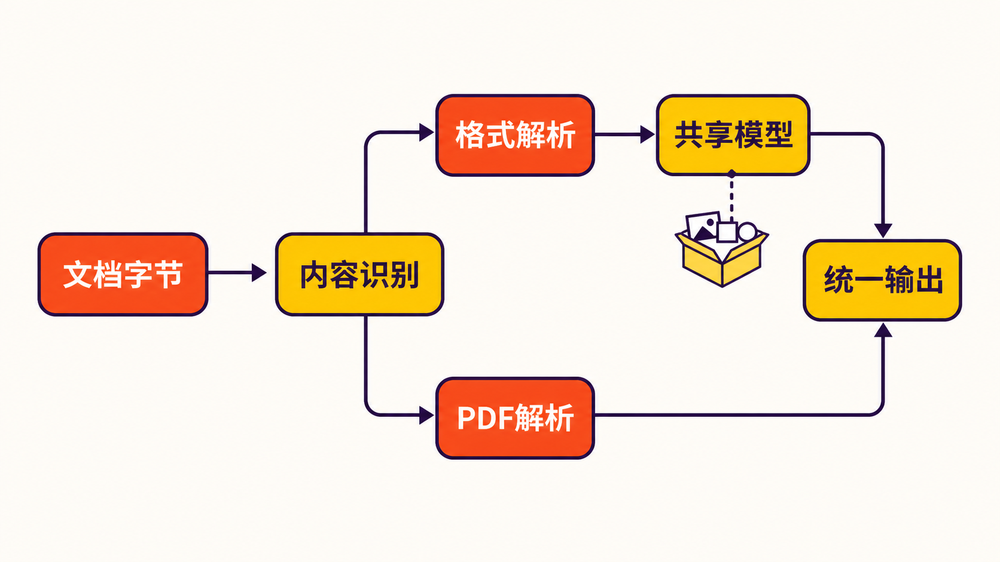

一份企业知识库的原始资料，往往不是整齐的网页：合同躺在 DOCX 里，销售数据装在 XLSX 里，培训内容是 PPTX，产品手册可能又是 EPUB 或 PDF。

真正棘手的并非“读取文件”本身，而是怎样把标题、列表、表格、链接、脚注乃至演讲者备注，转换成下游搜索、知识库和大模型更容易处理的一致结构。如果每种格式各接一套解析库，工程团队还要自行解决格式识别、错误分类、Markdown 转义和接口差异。

[firecrawl/anydoc](https://github.com/firecrawl/anydoc) 瞄准的正是这段文档预处理链路：把多种异构文件解析为共享文档模型，再统一输出 GitHub-Flavored Markdown（GFM）。它不是一套知识库，也不是 OCR 平台，而是进入这些系统之前的“格式归一化层”。

## 30 秒认识项目

- **一句话定位：**以 Rust 为核心、面向多语言环境的本地文档转 Markdown 工具。
- **仓库地址：**[github.com/firecrawl/anydoc](https://github.com/firecrawl/anydoc)
- **许可证：**[MIT License](https://github.com/firecrawl/anydoc/blob/main/LICENSE)，允许使用、修改和分发，但须保留版权与许可声明。
- **主要语言：**Rust；另有 Node.js、Python 与浏览器 WebAssembly 接口。
- **最新正式版本：**v0.2.0，于 2026 年 8 月 20 日发布。
- **活跃度快照：**截至 **2026 年 8 月 20 日 18:49（北京时间）**，仓库页面约有 17.3k Stars、993 Forks、116 次提交、25 个 Issues 和 35 个 Pull Requests；这些数字会持续变化，也不能单独证明软件质量。

从[提交记录](https://github.com/firecrawl/anydoc/commits/main/)看，项目在 2026 年 8 月上旬公开后连续修复 DOCX、RTF、表格及 URL 转义等问题，并于核实当日发布 v0.2.0。**事实判断**是近期开发活跃；**不能由此推出**它已具备长期稳定维护能力，因为公开历史仍然很短。

## 它解决的不是“转格式”，而是接口碎片化

anydoc 支持 DOC、DOCX、DOCM，PPT/PPTX 等演示文档，XLS、XLSX、XLSB，ODT、ODS、ODP，以及 RTF、EPUB、CSV 和文本型 PDF。按照[官方 README](https://github.com/firecrawl/anydoc/blob/main/README.md)，这些格式最终被转换为一致的 GFM，而不是让调用方分别理解每一种文件结构。

与常见方案的差异，可以分成三层理解：

1. **相比按格式拼装解析库：**anydoc 提供统一入口、共享文档模型和统一错误类型，调用方不必自行对齐各库的返回结构。这里的工程简化是根据其架构作出的**合理推断**，实际节省多少代码取决于已有技术栈。
2. **相比手工或办公软件导出：**它更适合批处理和程序化管道，可从 CLI、Node.js、Python、Rust 或浏览器调用；但官方材料没有给出与办公软件导出质量的独立对比，因此不能断言结果一定更好。
3. **相比托管 OCR 服务：**anydoc 可以在本地处理受支持的文本型文档，浏览器演示也声明文件通过 WASM 在设备内转换；但扫描版、纯图片 PDF 不在本地 OCR 能力范围内。

换句话说，它的价值重点不是创造新内容，而是减少进入检索、RAG 或内容迁移流程之前的格式分叉。

## 四项核心能力，实际价值在哪里

### 1. 一个入口覆盖多类办公与出版格式

统一接口意味着上游只需交付文件，下游便可主要围绕 Markdown 工作。标题、列表、表格、脚注、代码块、链接和演讲者备注等结构能够被保留，减少“正文读到了、层级却丢了”的问题。

它还根据文件内容特征识别格式，而不只依赖扩展名。实际价值在于：面对名称错误或缺少后缀的文件，系统仍有机会选择正确解析器。不过 CSV 没有可靠的内容签名，从标准输入或字节处理时仍须显式指定格式。

### 2. 共享 Document 模型保留更多中间信息

直接调用 `toMarkdown` 或 `to_markdown` 最省事；需要更精细控制时，则可取得共享 Document 模型及嵌入资产。图片二进制数据不能直接塞进普通 Markdown，因此通常保存在 `document.assets`，Markdown 中主要留下替代文本。

这项设计对需要自行上传图片、重写资源地址或做结构化审查的团队更有价值，但也意味着“转成 Markdown”不等于图片已经自动落盘并可直接显示。

### 3. 多语言绑定与浏览器本地转换

anydoc 同时提供 CLI、Node.js、Python、Rust 和 WASM 接口。Python 转换过程会释放 GIL，并附带类型存根；浏览器端则有[官方在线演示](https://firecrawl.github.io/anydoc/)，页面声明转换在设备内完成，文件不会离开用户设备。

这让同一转换核心能进入服务端任务、脚本和前端工具。但“本地执行”只说明其运行方式，不能替代组织自身对依赖、日志、缓存和文件生命周期的安全审计。


### 4. 把失败原因变成可处理的错误

项目定义了 Unsupported、Malformed、Encrypted、ResourceLimit、MissingPart 和 Io 等错误。对于批处理系统，区分“不支持”“文件损坏”“加密”与“资源超限”，比只返回转换失败更有操作价值：不同错误可以进入不同重试、告警或人工处理队列。

## 工作原理：先统一模型，再统一输出

根据官方架构说明，主流程可以概括为：

**文档字节 → 内容特征识别 → 对应格式解析器 → 共享 Document 模型 → GFM 序列化器**

PDF 是一个例外分支：由 `pdf-inspector` 直接生成 Markdown。对于其他格式，解析器先把标题、段落、列表、表格等内容映射到共享模型，再由同一个序列化层处理 Markdown 输出。

这种设计的潜在收益是，格式解析和 Markdown 渲染可以相对分离；这是基于架构的**推断**，不代表所有格式都会实现完全相同的语义保真度。文档格式之间原本就存在差异，例如工作表坐标、幻灯片边界和浮动图片都很难仅用 Markdown 完整表达。



## 安装与最小使用示例

以下命令均来自项目官方文档。

### 无需预装全局 CLI

```bash
npx @firecrawl/anydoc report.docx
```

将结果写入文件：

```bash
npx @firecrawl/anydoc slides.pptx -o slides.md
```

CSV 从标准输入读取时需明确格式：

```bash
npx @firecrawl/anydoc --format csv
```

### Python

安装：

```bash
pip install firecrawl-anydoc
```

最小示例：

```python
import anydoc

markdown = anydoc.to_markdown("report.docx")
print(markdown)
```

如果输入是无法可靠自动识别的 CSV 字节，可显式传入格式：

```python
markdown = anydoc.to_markdown_bytes(data, "csv")
```

Rust 项目也可使用官方给出的 `cargo add anydoc` 安装。正式接入前，应拿自己的真实文件建立回归样本，而不是只验证一个理想化示例。

## 优点、限制与成熟度：热度之外更该看什么

### 可以确认的优点

其一，支持格式较广，且提供统一模型和多语言接口；其二，MIT 许可证便于集成；其三，开发验证包含固定样本快照测试、变异测试及按格式设置的 `cargo-fuzz` 目标；其四，v0.2.0 已将 XLS、XLSX、XLSB 改为自研解析器，用统一的单元格模型和数字格式渲染器处理日期、货币与舍入。[发布说明](https://github.com/firecrawl/anydoc/releases/tag/v0.2.0)称该版本新增约 4400 行 Excel 读取代码，并移除了 `calamine` 及部分传递依赖。

### 必须正视的限制

- 扫描版或纯图片 PDF 不支持本地 OCR。[Python 官方文档](https://github.com/firecrawl/anydoc/blob/main/python/README.md)建议使用带 OCR 模型的托管 Firecrawl Parse，但该服务不属于这个 MIT 开源库。
- 加密、密码保护、结构损坏或超出资源限制的文档可能无法转换。
- HTML、MHTML、SingleFile 与 Jira 导出目前并非正式支持格式；给 HTML 文件改成 `.doc` 后缀也不会让它成为真正的 Word 文件。
- 图片资产不会因为调用 `to_markdown` 就自动生成外部图片文件。
- Markdown 本身无法完整承载所有源格式语义。工作表名称、原始坐标、幻灯片边界或复杂数字格式都应重点复核。

[问题追踪器](https://github.com/firecrawl/anydoc/issues)还出现过反引号转义、DOCX 图片、电子表格数字格式和旧式 DOC 等报告。它们是社区提交的问题线索，不应不加判断地视为所有版本均存在的确定缺陷。尤其 v0.2.0 已重写 Excel 解析器，但发布说明没有明确宣称某个百分比格式问题已全部解决，所以稳妥做法仍是用业务样本回归验证。

### 性能数字怎么看

README 称典型文档转换中位数低于 5 毫秒，但这是项目方自建基准，语料未公开，参与工具的计时口径也不完全一致。**事实**是官方公布了这一结果；**编辑观点**是，在独立复测前，不应把它当作采购或架构决策依据。

## 适合谁，不适合谁

anydoc 更适合需要构建本地文档摄取、企业搜索、RAG 预处理、内容迁移或批量归档工具的开发团队，也适合希望用同一核心覆盖 Rust、Node.js、Python 和浏览器环境的项目。

它不适合把扫描件 OCR 当作核心需求的场景，也不适合要求逐像素复刻排版、完整保留复杂表格坐标或直接获得可发布图文页面的用户。对于高合规环境，开源和本地运行降低了部分外传风险，但仍需自行完成依赖审计、资源限制、恶意文件隔离和输出校验。

## 结语：值得试，但应把它当作年轻的基础组件

anydoc 的方向很清楚：把异构文档先变成一致的中间模型，再输出 Markdown，从而收窄知识管道的入口。它的格式覆盖、多语言绑定、本地运行和宽松许可证，使其具备值得试用的工程价值。

但截至 2026 年 8 月 20 日，它仍是公开历史很短、快速迭代中的项目。我的结论是：**若你的核心需求是把文本型办公文档批量接入 Markdown 管道，值得用真实语料做一次小规模验证；若业务依赖 OCR、复杂排版或严格的数据溯源，则不宜直接把它视为开箱即用的生产终点。**是否采用，应由格式覆盖率、语义保真度、异常文件表现和持续维护情况共同决定，而不是由 Star 数决定。

## 参考资料

1. [firecrawl/anydoc 项目仓库](https://github.com/firecrawl/anydoc)
2. [anydoc 官方 README](https://github.com/firecrawl/anydoc/blob/main/README.md)
3. [anydoc 官方浏览器演示](https://firecrawl.github.io/anydoc/)
4. [Release v0.2.0：Excel goes in-house](https://github.com/firecrawl/anydoc/releases/tag/v0.2.0)
5. [anydoc 提交历史](https://github.com/firecrawl/anydoc/commits/main/)
6. [MIT License](https://github.com/firecrawl/anydoc/blob/main/LICENSE)
7. [anydoc Issues](https://github.com/firecrawl/anydoc/issues)
8. [anydoc Python 绑定官方文档](https://github.com/firecrawl/anydoc/blob/main/python/README.md)
