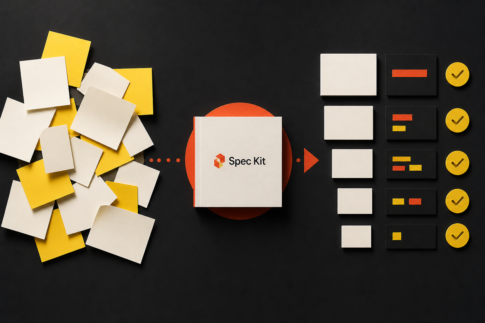
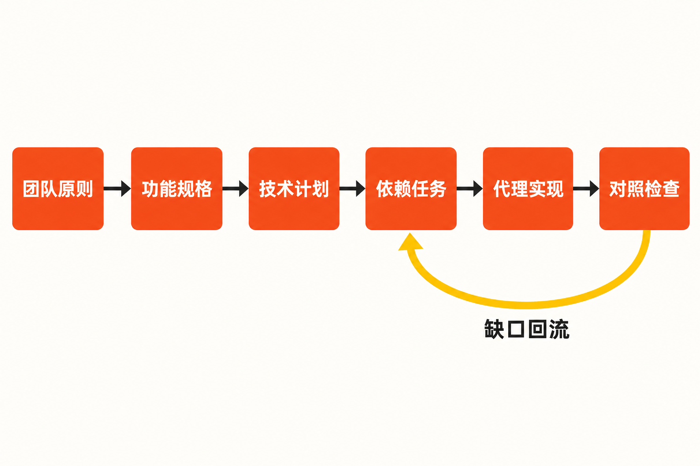

你让编码代理新增一个权限功能。第一轮，它写出了能运行的代码；第二轮补充审计要求，它改动了数据结构；第三轮再要求兼容旧接口，先前约定的边界却已逐渐消失。最终，代码似乎完成了，但没人能迅速回答：原始需求是什么？哪些约束已经落实？还有什么遗漏？

这不是单纯的模型能力问题。把一项复杂开发工作拆成连续的聊天提示，需求、架构决策和任务依赖很容易散落在对话里。GitHub 开源的 Spec Kit，正是针对这种“边聊边写、意图逐步丢失”的开发方式，提供一套规格驱动的代理工作流。

它并不替你写出绝对正确的软件。更准确地说，它试图在“人的意图”和“代理生成的代码”之间，加上一层可维护、可检查的结构。

## 30 秒认识项目

- **一句话定位：**一个以规格为持续输入、把需求依次转化为计划、任务和实现的开源代理流程工具包。
- **仓库地址：**[github/spec-kit](https://github.com/github/spec-kit)
- **许可证：**[MIT License](https://github.com/github/spec-kit/blob/main/LICENSE)，允许商业使用、修改与分发，但须保留版权和许可声明，软件按“现状”提供。
- **主要语言：**Python；仓库还包含 Shell、PowerShell、模板和文档资产。CLI 要求 Python 3.11+，支持 Linux、macOS 与 Windows。
- **最新稳定版本：**v1.0.4，GitHub 页面显示发布于 2026 年 9 月 2 日 21:06（页面时间）。
- **活跃度：**截至 **2026 年 9 月 3 日 00:02:15 UTC**，仓库约有 133.1k Stars、12.0k Forks、678 Watchers 和 1915 次提交；开放 Issue、PR 分别约为 138—140 个和 168—170 个，页面刷新会造成小幅变化。



这些数字只能说明项目受到广泛关注且协作频繁，不能直接证明代码质量或生产可靠性。更有意义的信号是：[v1.0.2、v1.0.3 和 v1.0.4 在三天内连续发布](https://github.com/github/spec-kit/releases)，显示维护节奏很快，但也提醒正式使用者固定版本并关注升级变化。

## 它要解决的，不只是“提示词写得不好”

Spec Kit 针对三个互相关联的问题：意图在多轮生成中流失；需求、设计与实现之间缺少可追踪关系；一次性提示难以形成可以重复执行的软件交付流程。

它与直接向 Copilot 或其他编码代理下达零散指令的差异，在于先把自然语言意图沉淀为规格，再逐层生成技术计划和依赖明确的任务，最后才进入实现。每个阶段留下 Markdown 工件，成为下一阶段的结构化上下文，而不是只依赖聊天记录。

与绑定某一个代理的模板方案相比，Spec Kit 更强调流程的可移植性。[官方文档在 2026 年 8 月 21 日列出 38 个编码代理集成](https://github.github.com/spec-kit/)，未列出的代理还可使用 generic integration。它同时提供 extensions、presets、workflows 和 bundles，让团队能够扩展甚至替换默认流程。

这里需要区分事实与判断：**事实**是它提供跨代理的规格工作流和扩展机制；**我们的判断**是，它更接近“代理开发的流程支架”，而不是另一个代码生成器，也不是传统项目管理系统的完整替代品。

## 四项核心能力，价值分别在哪里

### 1. 把模糊想法逐层压实

默认主链路是 **Spec → Plan → Tasks → Implement**。`specify` 描述要做什么，`plan` 形成技术栈与架构方案，`tasks` 输出按依赖排序的任务，`implement` 再根据这些工件执行。

实际价值在于减少代理过早跳进代码的概率。产品目标、技术选择和执行清单被分开表达，需求变化时也更容易判断需要回到哪一层修改，而不是在一段巨型提示里反复打补丁。

### 2. 给实现过程增加质量门

核心链路之外，还可以使用 `constitution`、`clarify`、`checklist`、`analyze` 和 `converge`。其中，constitution 用来固化安全、架构、文档等项目原则；analyze 只读检查 spec、plan 与 tasks 之间的冲突或遗漏；implement 会读取 checklist 状态；converge 则对照规格、计划和任务检查现有实现，把发现的缺口追加为新任务。

这让“生成完成”不再天然等于“需求完成”。不过，[官方快速入门明确说明 converge 需要循环执行直至收敛](https://github.github.com/spec-kit/quickstart.html)，因此它是一种复核机制，并非一次命令给出绝对正确答案。

### 3. 支持组织级规则，而不只服务单个功能

团队可以把长期约束写进 constitution，并通过预设、扩展和工作流封装惯例。官方文档还说明，组织可以托管自己的目录，控制成员能够发现和采用哪些扩展、预设及工作流；系统也支持离线、内网和隔离环境。

它的现实意义是：代码规范、安全原则或文档要求不必由每位成员在每次对话中重新描述。但规则能否有效，仍取决于团队是否写得清楚，以及模型是否正确理解。

### 4. 让规格成为可演进工件

早期用户曾在 [Issue #1191](https://github.com/github/spec-kit/issues/1191) 中集中反馈：修改既有规格容易生成重复分支或工件，就地更新路径不够明确。该 Issue 已关闭并关联后续工作，最新版文档也增加了 Evolving Specs 指引、converge 循环和可选 bug extension。

因此，较准确的结论不是“旧问题全部存在”或“已经彻底解决”，而是：项目已经把既有系统和规格演进纳入设计范围，但相关体验仍经历过明显调整，用户应依据当前版本文档验证自己的维护流程。

## 它是怎样工作的

从来源能够确认的主流程如下：

**团队原则 → 功能规格 → 技术计划 → 依赖任务 → 代理实现 → 对照检查 → 缺口回流**



各阶段主要通过 Markdown 工件传递上下文。`analyze` 在实现前检查规格、计划和任务的一致性；`converge` 在实现后寻找缺口，并将其转化为后续任务。这构成一个从意图到代码、再返回规格检查的闭环。

一个容易踩坑的细节是：当前活动 feature 由 `.specify/feature.json` 或 `SPECIFY_FEATURE_DIRECTORY` 决定，而不是只看当前 Git 分支。仅执行 `git checkout` 不会自动切换活动 feature。Git 本身也不是核心流程的硬依赖；编号 feature 分支来自可选的 git extension。

## 安装与最小使用示例

官方推荐通过 `uv` 安装 CLI：

```bash
uv tool install specify-cli
```

如果希望结果可复现，可固定到本文核实的 v1.0.4：

```bash
uv tool install specify-cli --from git+https://github.com/github/spec-kit.git@v1.0.4
```

以 GitHub Copilot 集成为例，初始化项目：

```bash
specify init my-project --integration copilot
cd my-project
```

随后在所选编码代理中依次执行：

```text
/speckit.specify
/speckit.plan
/speckit.tasks
/speckit.implement
/speckit.converge
```

这是最小链路。用于生产功能时，可在前面加入 `/speckit.constitution`，并根据需要使用 clarify、checklist 和 analyze。自动化环境初始化时应增加 `--non-interactive`。以上命令均来自[项目 README](https://github.com/github/spec-kit/blob/main/README.md)及官方快速入门，而不是本文自行设计的语法。

## 优点、限制与成熟度

它最明显的优点，是把原本散落在对话里的需求、决策和任务变成可审阅工件；流程可扩展且不锁定单一代理；MIT 许可证也便于组织修改与分发。

限制同样明确。README 直接提醒，项目高度依赖先进模型理解规格。因此 Spec Kit 能改善上下文组织，却不能保证实现正确、测试充分或系统安全。规格自身含糊时，结构化流程也可能只是把含糊内容稳定地传到后续阶段。

测试治理尤其不能外包给工具。[一则团队使用讨论](https://github.com/github/spec-kit/discussions/2295)显示，测试由谁编写、怎样贯穿各阶段，并没有由核心流程给出唯一答案。维护者指向社区扩展，并认可把 TDD 写入 constitution、specify 提示和可验证任务的做法。但该讨论参与者较少且状态为 Unanswered，只能证明这是一项真实问题和可行建议，不能当作完整官方测试标准。

社区扩展还带来供应链风险。README 明确要求用户在安装第三方扩展前审查源码、自行评估风险。再加上近期版本发布密集，以及 v1.0.4 仍在修复状态文件、工作流校验、脚本组合和非拉丁字符等健壮性问题，我们的判断是：**项目已经形成完整产品框架并保持高活跃度，但仍处在快速演进阶段。**生产采用宜固定 tag、小范围试点，并保留代码审查、自动化测试和人工验收。

## 适合谁，不适合谁

它适合已经使用编码代理、功能跨越多个模块、需要让产品意图和技术决策可追踪的个人与团队；也适合希望在多种代理之间复用开发流程，或需要在内网环境控制扩展来源的组织。

它不太适合只改一两行代码的即时任务，也不适合尚未建立基本需求评审和测试责任的团队。若期待安装后自动获得正确架构、完整测试和安全代码，Spec Kit 无法兑现这种预期。流程本身还会增加规格维护成本，对极短任务可能得不偿失。

## 结语：值得试，但别把流程当答案

Spec Kit 值得尝试的原因，不是它拥有多少 Star，而是它直面了 AI 编程中一个基础矛盾：代码生成越来越快，人的意图却未必被稳定保存。

对中大型功能，可以选取一个边界清楚、风险可控的需求试跑完整链路，观察规格是否真的减少返工、任务是否更易审阅、converge 是否能发现有效缺口。若收益超过维护工件的成本，再逐步沉淀 constitution 和内部预设。

它提供的是一套让人和代理更有秩序地合作的方法。规格可以约束生成，但不能代替判断；流程可以暴露遗漏，但不能替代验证。这也是评价 Spec Kit 时最应保留的边界。

## 参考资料

1. [github/spec-kit 官方仓库](https://github.com/github/spec-kit)
2. [spec-kit README](https://github.com/github/spec-kit/blob/main/README.md)
3. [Spec Kit 官方文档首页](https://github.github.com/spec-kit/)
4. [Quick Start Guide](https://github.github.com/spec-kit/quickstart.html)
5. [Spec Kit Releases](https://github.com/github/spec-kit/releases)
6. [MIT License](https://github.com/github/spec-kit/blob/main/LICENSE)
7. [Issue #1191：既有规格的更新与细化](https://github.com/github/spec-kit/issues/1191)
8. [Discussion #2295：团队流程与测试职责问题](https://github.com/github/spec-kit/discussions/2295)
