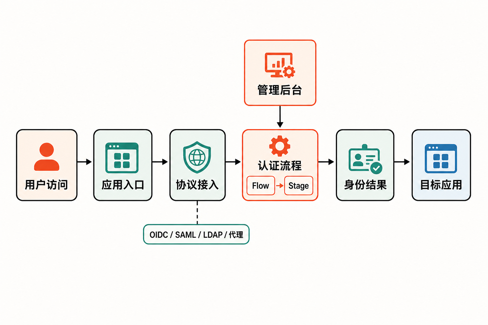

公司内部有 GitLab、监控平台、知识库和自建业务系统，家庭实验室里也可能跑着 NAS、影音库与各种管理面板。应用越多，登录入口就越分散：员工反复注册账户，管理员分别停用权限，密码策略和双因素认证也难以统一。

真正棘手的并不是“少输几次密码”，而是当人员离职、凭据泄露或权限变化时，管理者能否从一个地方及时收回访问权。

[authentik](https://github.com/goauthentik/authentik) 想解决的正是这类问题：在用户与应用之间增加一个自托管身份层，集中处理认证、授权和身份联合。它不是给某个应用换一张登录页，而是试图成为多个系统共同依赖的身份入口。

## 30 秒认识项目

- **一句话定位：**面向现代单点登录场景的自托管身份提供者（IdP），用于连接用户、身份源与不同协议的应用。
- **仓库地址：**[goauthentik/authentik](https://github.com/goauthentik/authentik)
- **许可证：**核心内容原则上采用 MIT，但并非整个仓库统一为 MIT；`website/`、企业模块和第三方组件另有条款。
- **主要语言：**GitHub 标注为 Python；仓库还包括 TypeScript Web UI、Go Outpost 与 Rust 原生组件。
- **活跃度：**截至 **2026 年 8 月 21 日 08:11（UTC+8）**，仓库约有 22.6k Stars、1.9k Forks；当时最新正式版本为 [2026.8.0](https://github.com/goauthentik/authentik/releases/tag/version%2F2026.8.0)，发布于 2026 年 8 月 18 日。主分支同期仍有多个模块的持续提交。

这些数字只能证明项目受到关注且仍在维护，不能单独证明安全性、稳定性或适合生产环境。


## 它解决什么问题

传统做法是让每个应用维护自己的用户、密码和多因素认证。成本不只来自重复配置，还来自身份生命周期被切碎：新员工要逐个开户，离职人员要逐个停权，审计事件也分散在不同系统。

authentik 通过 SAML、OAuth 2.0/OpenID Connect、LDAP、RADIUS、SCIM 和代理认证等方式，把支持不同接口的应用连接到统一身份层。用户可以从应用门户进入获授权的服务，管理员则集中管理用户、组、凭据、令牌、应用集成、事件和认证流程。

与几类常见替代方案相比，它的侧重点不同：

- **继续使用应用自带账户：**部署最省事，但账户、策略和离职回收仍然分散。
- **只在反向代理前增加登录：**适合保护部分没有现代认证能力的 Web 服务，但不能自然覆盖所有身份协议与用户生命周期场景。
- **采用托管身份服务：**通常减少自运维负担；authentik 的主要差异则是自托管，以及可以介入既有环境。

后两项比较属于基于项目定位的分析，不代表所有代理或托管产品都具备相同能力与边界。选择的关键不是功能表谁更长，而是团队愿意把多少身份基础设施掌握在自己手中，又能承担多少升级与安全运维责任。

## 四项核心能力，价值不只是一张功能清单

### 1. 一套入口连接多种协议

OAuth2/OIDC 和 SAML 可以连接现代 Web 或企业应用，LDAP、RADIUS 则覆盖不同年代和类型的系统，SCIM 用于身份供应相关场景，代理认证还能为部分缺少合适登录接口的应用补上一层保护。

实际价值在于渐进式整合：团队不必先把全部旧系统改造成同一种协议，便可以从最容易接入的应用开始收拢身份入口。

### 2. 用 Flow 和 Stage 组合认证过程

官方文档将 Flow 描述为由多个 Stage 组成的认证流程。管理员可以围绕登录、验证和策略安排不同阶段，而不是只能接受一套固定登录逻辑。

这意味着同一身份平台能够表达更细的流程差异，例如让不同入口执行不同验证步骤。需要注意的是，可组合性也会增加配置复杂度；流程越灵活，变更审核与回归验证就越重要。

### 3. 用户门户与集中管理

项目提供用户应用门户和管理后台。用户能在一个入口查看可访问应用，管理员则可以处理资料、密码、账户停用、密码重置与恢复等事项。

其实际价值是把“我能进入哪些系统”和“管理员如何管理身份”放进同一控制面。官方还提供管理员模拟用户能力，这有助于排查权限问题，但也意味着高权限操作应受到严格审计。

### 4. Outpost 把认证能力带到应用附近

从官方安装文档与社区讨论可以确认，authentik 可以管理 Outpost；默认 Compose 配置会让 worker 通过 Docker Socket 自动创建或更新托管 Outpost。若不需要自动管理，也可以移除该挂载并手动部署 Outpost。

它带来的价值是把代理等能力延伸至实际应用环境，但自动化便利需要用更大的宿主机访问面交换。这是部署时必须明确作出的安全选择。

## 它怎样工作

在来源能够支持的范围内，可以把典型流程概括为：

1. 用户访问应用，或先进入 authentik 应用门户；
2. 应用通过已配置的 Provider 或代理能力把认证交给 authentik；
3. authentik 按 Flow 中排列的 Stage 执行登录、验证与策略逻辑；
4. 认证成功后，通过 OIDC、SAML、LDAP、代理认证等适配方式向应用传递结果；
5. 管理员在后台维护用户、组、凭据、应用集成和事件。



这是一张便于理解的抽象流程，不代表所有协议都共享完全相同的报文、令牌和跳转机制。具体生产架构仍需按所选 Provider 与 Outpost 类型核对官方文档。

## 用 Docker Compose 跑起最小环境

官方将 Docker Compose 定位于测试和小规模生产场景，最低要求是 2 个 CPU 核心、2 GB 内存，以及 Docker Compose v2 或 Podman。

以下命令来自[官方 Docker Compose 指南](https://docs.goauthentik.io/install-config/install/docker-compose/)：

```bash
wget https://docs.goauthentik.io/compose.yml
echo "PG_PASS=$(openssl rand -base64 36 | tr -d '\n')" >> .env
echo "AUTHENTIK_SECRET_KEY=$(openssl rand -base64 60 | tr -d '\n')" >> .env
docker compose pull
docker compose up -d
```

服务启动后，访问：

```text
http://<服务器IP或主机名>:9000
```

然后为默认管理员 `akadmin` 设置密码。默认内部端口为 HTTP 9000 和 HTTPS 9443；如有需要，可通过 `COMPOSE_PORT_HTTP` 与 `COMPOSE_PORT_HTTPS` 调整暴露端口。

这只是“服务可启动”的最小示例，不等于生产配置。接入第一个业务应用时，还需在后台创建应用及相应 Provider，并按照目标应用支持的协议填写回调地址或相关连接参数；现有资料没有提供可跨应用通用的一组参数，因此不在这里虚构配置。

升级时应重新下载 `compose.yml`，因为该文件静态引用下载时的最新版本。官方还明确警告不要向容器挂载 `/etc/timezone` 或 `/etc/localtime`，否则可能引发 OAuth、SAML 的时间相关认证问题。

## 优点、限制与成熟度

**优点是覆盖面和可组合性。** authentik 能把多种协议、身份对象、应用门户与认证流程放在同一体系内，也提供从 Compose 到 Kubernetes Helm、AWS CloudFormation 和 DigitalOcean Marketplace 的多种部署入口。

**限制首先是复杂度。** 身份系统位于访问链路的关键位置，Provider、证书、回调地址、时间同步或 Flow 配置出错，都可能扩大为多个应用无法登录。仓库中持续存在大量 Issue 和 Pull Request，既反映项目规模与活跃度，也提醒团队在升级前查看已知问题。

**许可证边界需要逐目录判断。** [仓库许可证说明](https://github.com/goauthentik/authentik/blob/main/LICENSE)显示，除特别列出的内容外采用 MIT；`website/` 使用 CC BY-SA 4.0，`authentik/enterprise/` 适用独立 Enterprise License，第三方组件遵循各自条款。项目同时提供永久免费的开源基础版本和包含额外功能、支持中心的 source-available Enterprise 版本，采购或二次分发时不能笼统地说“全部 MIT”。

**生产风险不应回避。** 默认 Compose 把 Docker Socket 挂载给 worker，以便自动管理 Outpost。官方文档和[维护者参与的讨论](https://github.com/goauthentik/authentik/discussions/5417)均确认，这会扩大对宿主机 Docker API 的访问面。可选做法包括使用 Docker Socket Proxy，或取消自动管理、手动部署 Outpost。

从发布与提交记录判断，authentik 是一个持续维护、覆盖多个身份协议的成熟工程项目；但“成熟”不等于零风险。身份平台还是潜在的单点故障和高价值攻击目标。生产采用前，应规划备份、升级回滚、高可用、密钥保护、管理员权限控制与应急登录路径。上述风险判断是基于其基础设施位置作出的工程分析，并非来源声称项目发生过相应事故。

## 适合谁，不适合谁

它更适合已经拥有多个内部或自托管应用，希望统一登录和身份策略，并具备容器、反向代理、证书及身份协议运维能力的团队；家庭实验室用户也可以从 Compose 开始，但仍要认真处理公网暴露与高权限接口。

如果只有一两个应用、没有专人维护身份基础设施，或者业务更看重托管 SLA 和厂商代运维，自建 authentik 可能增加的复杂度大于收益。若目标只是临时给一个后台增加简单访问保护，完整 IdP 也可能过重。

## 结语：值得尝试，但先从非关键应用开始

authentik 值得进入自托管身份平台的候选名单。它真正有吸引力的地方，不是 Star 数，而是能通过多协议、Flow/Stage 和 Outpost，把新旧应用逐步纳入统一入口。

更稳妥的尝试方式，是先在隔离环境中接入一个非关键应用，验证登录、登出、账户停用、恢复与升级流程，再决定是否承载更多系统。若团队无法为这个新的身份中枢提供持续维护和故障预案，那么“不自建”同样是专业而合理的结论。

## 参考资料

1. [goauthentik/authentik 主仓库](https://github.com/goauthentik/authentik)
2. [项目官方 README](https://raw.githubusercontent.com/goauthentik/authentik/main/README.md)
3. [authentik 官方文档首页](https://docs.goauthentik.io/)
4. [Docker Compose 安装指南](https://docs.goauthentik.io/install-config/install/docker-compose/)
5. [仓库 LICENSE](https://github.com/goauthentik/authentik/blob/main/LICENSE)
6. [Release 2026.8.0](https://github.com/goauthentik/authentik/releases/tag/version%2F2026.8.0)
7. [主分支提交记录](https://github.com/goauthentik/authentik/commits/main/)
8. [Docker Socket 与 Outpost 讨论](https://github.com/goauthentik/authentik/discussions/5417)
