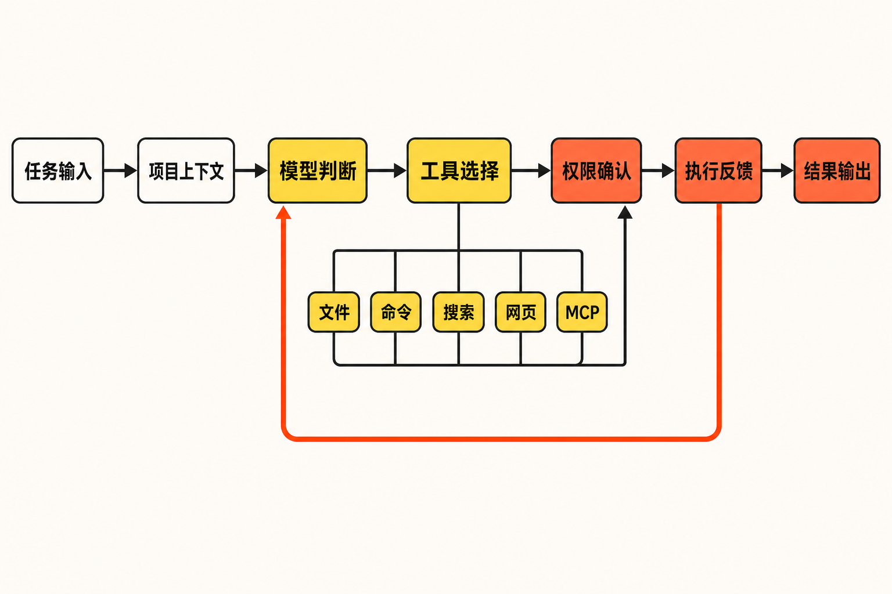

当你接手一个陌生代码库，真正耗时的往往不是“写一段代码”，而是先弄清目录结构、找到关键入口、追踪调用关系，再把修改落到文件里并运行测试。

普通网页聊天工具可以解释粘贴进去的片段，却看不到完整工作区；传统 Shell 脚本可以稳定执行命令，却很难理解自然语言任务。开发者于是频繁地在浏览器、编辑器和终端之间搬运上下文。

Gemini CLI 试图缩短这条链路：让模型进入终端，在获得许可后读取项目、修改文件、执行 Shell 命令，并把同一套能力用于交互式开发或非交互自动化。它的价值不只是“在命令行里聊天”，而是让语言模型与真实工程环境发生受控连接。

## 30 秒认识项目

- **一句话定位：**将 Gemini 模型带入终端、能够调用本地及外部工具的开源 AI Agent。
- **仓库地址：**[google-gemini/gemini-cli](https://github.com/google-gemini/gemini-cli)
- **许可证：**Apache License 2.0
- **主要语言：**TypeScript
- **最新稳定版：**v0.57.0，发布于 2026 年 8 月 25 日
- **活跃度：**约 106.8k Stars、14.5k Forks、579 Watchers、6,391 次提交；main 分支最新可见提交日期为 2026 年 8 月 28 日
- **数据核实时间：**2026 年 8 月 31 日 15:03（北京时间）

以上仓库数据会持续变化。Star 只能说明关注度，不能单独证明代码质量、安全性或生产适用性。项目同时维护 Stable、Preview 和 Nightly 三条发布通道；核实时最新可见 Nightly 为 `v0.59.0-nightly.20260831.g0bd1d4397`。[版本与发布时间可在 Releases 页面核对](https://github.com/google-gemini/gemini-cli/releases)。


## 它解决的不是问答，而是“上下文与执行断裂”

Gemini CLI 面向的是发生在真实工作目录里的任务：理解和生成代码、编辑文件、执行命令、调试问题、联网检索，以及把模型接入脚本或工程流程。[项目仓库列出的能力](https://github.com/google-gemini/gemini-cli)还包括多模态输入、网页抓取、会话检查点、MCP、扩展和 GitHub 工作流集成。

与网页聊天相比，它少了一层手工复制上下文的过程，并能在授权后真正操作文件和命令。与固定 Shell 脚本相比，它更适合目标明确、步骤却需要根据环境动态决定的任务。与只嵌在编辑器里的助手相比，它可以留在终端工作流中，也能通过非交互模式被其他程序调用。

这里需要明确区分事实与推断：上述功能范围来自官方资料；“减少上下文搬运”“适合动态步骤”是根据这些能力作出的工作流推断，并不意味着它在每个项目中都比替代方案更快、更准。

## 四项核心能力，实际价值在哪里

### 1. 直接理解和修改工作区

用户可以在当前目录启动 `gemini`，让它分析代码库、生成或编辑代码。官方入门示例还覆盖了重命名图片、合并 CSV 和生成测试等任务。

实际价值在于，模型面对的不再只是孤立代码片段，而是目录、文件和任务描述组成的工作现场。`GEMINI.md` 还可用于提供项目上下文，帮助团队显式写下约定，而不是每次重新解释。

### 2. 文件与 Shell 工具形成执行闭环

Gemini CLI 能使用文件系统和 Shell 工具。官方入门文档显示，在读取、写入或执行命令之前，CLI 会请求相应权限。这意味着它可以从“解释应该怎么做”继续走到“执行操作并读取结果”。

审批机制是关键边界，但不能被理解为绝对安全保证。用户仍需检查命令内容、文件影响范围及外部输入，尤其不应把未经审阅的高权限操作交给模型。

### 3. 交互模式与脚本自动化共用一套入口

除了终端对话，它还支持 `-p` 非交互调用。这使代码库解释、批量分析或工程流程集成成为可能。官方故障排查文档列出了认证错误 41、输入错误 42、沙箱错误 44、配置错误 52、回合上限错误 53 等退出码，说明自动化调用应当按程序而非聊天窗口来处理异常。

换言之，真正可复制的自动化不能只写一条提示词，还要处理认证、超时、退出码和结果波动。

### 4. MCP、扩展与联网能力扩大工具边界

项目支持 MCP、扩展系统、Google Search grounding 和网页抓取。MCP Server 可以通过命令启停，扩展也有独立的安装和管理能力。[维护者周报展示了相关官方界面与操作](https://github.com/google-gemini/gemini-cli/discussions/18341)。

它的实际意义是：CLI 不必把所有能力内置在核心程序中，可以连接外部工具和数据源。但连接越多，权限、配置和供应链边界也越复杂，扩展能力应按最小权限原则启用。

## 它是怎样工作的

根据官方资料，可以把一次典型任务概括为以下流程：用户在当前目录输入自然语言任务；CLI 组合当前工作区和 `GEMINI.md` 等上下文；Gemini 模型判断是否需要文件、Shell、搜索、网页、MCP 或扩展工具；涉及读取、写入或命令执行时进入权限确认；工具返回结果后，模型继续推理并输出答案或修改结果；需要时可借助会话检查点保留进度。

这是对公开能力的流程化整理，不是官方公布的完整内部实现图。来源没有披露的模型服务内部调度、数据保存周期或所有安全机制，不应凭空补齐。



## 安装与最小使用示例

官方故障排查文档要求 **Node.js 20 或更高版本**。标准安装方式是：

```bash
npm install -g @google/gemini-cli
gemini
```

启动后选择 `Sign in with Google`，在浏览器中完成登录，再回到终端输入任务。部分组织账户还需要设置 `GOOGLE_CLOUD_PROJECT`。项目也支持 Gemini API Key 和 Vertex AI 认证。[完整认证与安装说明见官方 README](https://github.com/google-gemini/gemini-cli/blob/main/README.md)。

如果只想临时运行，无需全局安装：

```bash
npx @google/gemini-cli
```

官方给出的非交互最小示例是：

```bash
gemini -p "Explain the architecture of this codebase"
```

示例输出会随模型和项目环境变化，不能当作确定性结果。用于流水线时，还应捕获退出码并验证生成内容。

## 优点、限制与成熟度

优点很清楚：它覆盖从理解上下文到执行工具的闭环；交互和自动化入口兼具；MCP 与扩展提供了可扩展性；Apache 2.0 许可证也便于阅读、修改和集成代码。

从提交和发布节奏看，项目处于积极维护状态：2026 年 8 月持续出现 Stable、Preview 和 Nightly，近期提交还涉及工作区信任、受限模式及 MCP Server 过滤等安全边界。这是“维护活跃”的证据，但也反映系统仍在快速变化。官方明确提示 Preview 可能发生回归，Nightly 可能包含尚未验证的问题，生产环境更适合优先评估 Stable。

实际限制包括 Node.js 版本门槛、全局 npm binary 的 PATH 配置、无效 `settings.json`、MCP 端口冲突，以及沙箱对项目目录或临时目录之外写入的限制。存在 `CI`、`CONTINUOUS_INTEGRATION` 或 `CI_` 前缀环境变量时，CLI 还可能误判运行环境而不进入交互模式。[这些问题均见官方故障排查文档](https://github.com/google-gemini/gemini-cli/blob/main/docs/resources/troubleshooting.md)。

公开 Issue 还提供了一个值得留意的个案：在 Gemini CLI 0.46.0 的 Linux 环境中，不可读取的 `.env` 被报告会导致扩展加载失败。该问题核实时仍处于 Open，但已标记 Stale，且没有关联修复分支，因此[这份用户报告](https://github.com/google-gemini/gemini-cli/issues/27894)不能直接证明最新 v0.57.0 仍受影响；采用扩展和沙箱组合的团队应在目标环境复验。

另外，近期 Nightly 曾修复 MCP OAuth 元数据发现与认证中的 SSRF，并强化受限模式下的工作区信任。我的观点是：这类工具的风险重点不只是“模型会不会答错”，还包括它能访问什么、执行什么，以及外部工具链是否可信。

## 适合谁，不适合谁

它适合终端使用频繁、需要理解陌生代码库、希望把 AI 接入脚本，或愿意配置 MCP 与扩展的开发者和工程团队。对于有权限治理能力、能够审阅命令和生成差异的团队，它值得先在非关键仓库或隔离环境中试用。

它不太适合不熟悉命令行和权限提示的普通用户，也不适合要求结果完全确定、无法容忍模型输出波动的关键流程。缺乏隔离、审计和人工复核条件时，也不应直接赋予它广泛文件系统或 Shell 权限。

## 结语

Gemini CLI 最值得关注的地方，不是把聊天框换成黑底终端，而是把模型、项目上下文、工具调用和自动化入口放进同一条链路。它已经具备活跃维护、稳定发布通道和较完整的工具生态，但快速迭代、配置复杂度和执行权限也构成了真实成本。

结论是：**值得尝试，但应从 Stable 版、低权限和可回滚任务开始。**先验证它能否减少团队的上下文搬运和重复操作，再决定是否进入自动化流水线；这比依据 Star 数或演示效果作判断更可靠。

## 参考资料

1. [Gemini CLI 项目仓库](https://github.com/google-gemini/gemini-cli)
2. [官方 README](https://github.com/google-gemini/gemini-cli/blob/main/README.md)
3. [官方入门文档](https://github.com/google-gemini/gemini-cli/blob/main/docs/get-started/index.md)
4. [官方 Releases 列表](https://github.com/google-gemini/gemini-cli/releases)
5. [main 分支提交记录](https://github.com/google-gemini/gemini-cli/commits/main/)
6. [官方故障排查文档](https://github.com/google-gemini/gemini-cli/blob/main/docs/resources/troubleshooting.md)
7. [扩展与沙箱权限问题 #27894](https://github.com/google-gemini/gemini-cli/issues/27894)
8. [维护者周报：Gemini CLI v0.27.0](https://github.com/google-gemini/gemini-cli/discussions/18341)
