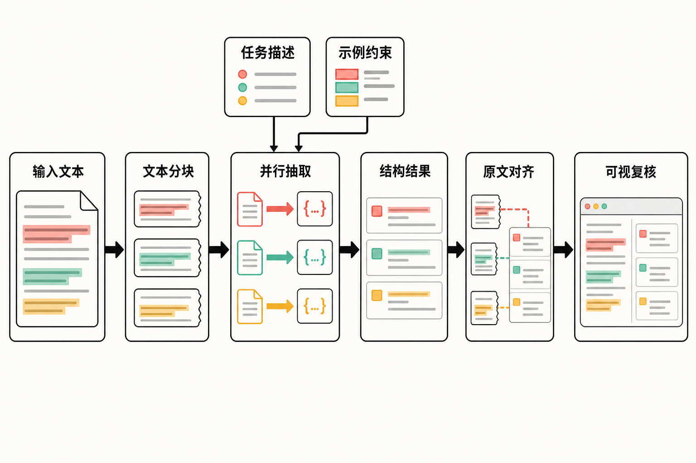

一份几十页的合同、病历或研究报告摆在面前，你想提取人物、条款、诊断描述及其关系。让大模型返回 JSON 并不难，真正麻烦的是下一步：这个字段究竟来自原文哪一句？模型有没有把示例里的内容带进结果？复核人员如何快速判断它抽对了没有？

这正是 [Google 开源项目 LangExtract](https://github.com/google/langextract) 试图解决的问题。它不是另一套聊天框架，而是一层面向“非结构化文本到可追溯结构化数据”的 Python 工具：调用大语言模型完成抽取，同时尽量把每个结果重新定位到原文字符区间。

## 30 秒认识项目

- **一句话定位：**用 LLM 从非结构化文本中抽取结构化信息，并将抽取项定位回原文。
- **仓库：**[google/langextract](https://github.com/google/langextract)
- **许可证：**Apache License 2.0
- **主要语言：**Python；PyPI 要求 Python 3.10 及以上。
- **最新版本：**v1.6.0，2026 年 7 月 2 日发布。[GitHub Releases](https://github.com/google/langextract/releases) 与 [PyPI](https://pypi.org/project/langextract/) 的版本、日期和提交相互吻合。
- **活跃度：**截至 **2026 年 8 月 9 日 08:06（北京时间）**，仓库约有 38.0k Stars、2.7k Forks、168 Watchers、75 个开放 Issue、45 个开放 Pull Request和173次提交；最近可见提交日期为2026年7月25日。[提交记录](https://github.com/google/langextract/commits/main/)

这些数字只能说明项目获得较高关注、仍有人维护，不能证明其准确率或生产稳定性。仓库中的测试、基准、CI、tox 和预提交配置是较积极的工程信号，同样不能替代业务数据评测。

## 它解决的不是“输出 JSON”，而是“结果能否复核”

传统规则和正则表达式的优势是确定、便宜、容易审计，但面对表达多样、上下文相关或关系复杂的文本时，维护成本会迅速上升。直接调用通用 LLM 更灵活，却可能生成格式不一致的内容，甚至给出原文中不存在的答案。

LangExtract 处在二者之间：使用模型理解语言，通过任务描述和 few-shot 示例约束抽取结构，再把抽取文本与原文对齐。结果不仅包含类别和属性，还可以带有字符区间，供程序定位、展示或人工复核。

它与常见“提示词加 JSON”方案的关键差异因此不是能否生成结构化对象，而是围绕抽取任务补齐了**对齐、长文处理、可视化和模型适配**。但需要明确：可定位只证明一段文字能在原文中找到，不证明模型赋予它的类别、属性或关系一定正确。Google 的[项目发布说明](https://developers.googleblog.com/en/introducing-langextract-a-gemini-powered-information-extraction-library/)也强调，推断属性会受模型能力、提示词和示例质量显著影响。

## 五项核心能力，实际价值在哪里

### 1. 抽取结果回指原文

LangExtract 会尝试把结果对齐到原文的精确字符区间。这让审核界面可以高亮证据，也使下游系统能够保存“字段—出处”的对应关系。

这项能力还有一个现实用途：官方文档提醒，模型偶尔可能从示例而不是待处理文本中抽取内容。无法在输入中定位的结果会得到 `char_interval=None`，调用方可以将其过滤或送入复核队列。[README](https://github.com/google/langextract/blob/main/README.md)


### 2. 以示例约束抽取结构

使用者需要描述任务，并提供至少一个高质量 few-shot 示例。示例中的 `Extraction` 可以定义类别、抽取文本和属性，帮助模型理解“抽什么、怎样归类、需要哪些附加信息”。

实际价值是：领域专家能用少量标注表达业务规则，不必一开始就训练专用模型。相应代价是，示例不是装饰品，而是行为规格的一部分。示例存在遗漏、歧义或顺序问题，错误会传递到真实输入。

### 3. 面向长文档的分块、并行和多轮抽取

单次模型调用受到上下文窗口和输出长度限制。LangExtract 可以切分长文档，用多个 worker 并行处理，并执行多次 extraction passes，提高分散在长文本中实体的召回机会。

这适合报告、长篇叙事和批量文档。但“多轮”不是免费提升：它会增加模型调用次数、费用和等待时间，还可能产生重复结果。并发参数也应结合供应商限流策略设置。

### 4. 交互式 HTML 可视化

项目可以将标注结果保存为 JSONL，再生成独立 HTML，在原文中高亮不同类型的抽取项。对需要人工验收的流程而言，可视化比孤立的 JSON 更有价值：审阅者不必在原文与表格间反复搜索。

它尤其适合作为原型验证和标注质检工具，但来源材料没有证明这套页面具备完整的团队权限、任务分发或审计能力。把它视为抽取结果查看器，比把它视为现成的数据治理平台更准确。

### 5. 多模型后端与插件机制

核心提供商包括 Gemini 和本地 Ollama；OpenAI 代码随包提供，但其 SDK 是可选依赖。第三方提供商还可以通过 Python entry points 注册并按需发现。[Provider 文档](https://github.com/google/langextract/blob/main/langextract/providers/README.md)

这减少了应用代码与单一模型供应商的绑定，本地 Ollama 也为不希望把文本发送到云端的场景提供了选择。不过，不同后端对 Schema、模型 ID 和响应格式的支持并不完全一致；插件的兼容性、依赖安全和持续维护还要由插件作者与使用者共同承担。

## 工作流程：模型抽取之后，还要做一次原文对齐

根据官方概念图和文档，核心流程可以概括为：

**输入文本 → 分块 → 并行调用 LLM → 结构化抽取 → 回对原文字符区间 → JSONL／HTML 可视化。**

任务描述和 few-shot 示例共同约束模型输出；长文本可通过多轮抽取增加覆盖范围。随后，系统把模型返回的抽取文本映射回输入，而不是只保留模型生成的结构化字段。

这套设计提升的是可追溯性，并没有消除模型判断错误。生产系统仍需验证缺失区间、空响应、重复项和业务约束，必要时加入人工审核。



## 安装与最小示例

官方基础安装命令为：

```bash
pip install langextract
```

如果使用 OpenAI 后端，官方提供的可选依赖安装方式是：

```bash
pip install "langextract[openai]"
```

下面是依照官方 README 的核心 API 组织的最小示例。云端模型还需要配置相应 API Key；示例值应替换为当前环境实际可用的模型 ID。

```python
import langextract as lx

prompt = "提取人物，并标注人物的身份。"

examples = [
    lx.data.ExampleData(
        text="李明是一名工程师。",
        extractions=[
            lx.data.Extraction(
                extraction_class="人物",
                extraction_text="李明",
                attributes={"身份": "工程师"},
            )
        ],
    )
]

result = lx.extract(
    text_or_documents="王敏是一名记者。",
    prompt_description=prompt,
    examples=examples,
    model_id="你的模型ID",
)

print(result.extractions)
```

若需要复核界面，可继续使用 `lx.io.save_annotated_documents` 保存 JSONL，并用 `lx.visualize` 生成独立 HTML。官方建议示例抽取文本尽量逐字来自示例原文，并按出现顺序排列。

## 优点、限制与潜在风险

LangExtract 的优势相当明确：它把信息抽取中常被忽略的“证据位置”变成一等数据；任务描述和示例降低了领域原型的门槛；长文处理和可视化形成了较完整的验证闭环；多后端则保留了一定部署选择权。

但它仍处于快速迭代阶段。v1.3.0 至 v1.6.0 连续加入重试、结构化输出 Schema、OpenAI Batch API、自定义 `output_schema` 和 Ollama 兼容更新，说明能力正在扩展，也意味着接口、默认模型和提供商行为可能继续变化。**编辑判断：**生产部署宜锁定版本，并在升级前进行回归测试。

还要警惕“空成功”。一个截至核实日仍开放的[社区 Issue #508](https://github.com/google/langextract/issues/508)报告称，Gemini 实时路径遇到安全拦截、拒答或非正常停止时，可能返回 `score=1.0, output=None`，而不是抛出异常。这是一份社区问题报告，并非已确认覆盖所有版本和路径的官方结论；但它足以提示调用方不能只看是否发生异常，还应验证输出非空、检查停止原因，并监控内容过滤和重试。

敏感数据是另一层风险。云端 Gemini 或 OpenAI 需要把文本交给相应服务处理；是否合规取决于数据类型、部署方式和服务条款。本地 Ollama 不需要云端密钥，但本地运行不自动等于模型效果、系统权限和日志管理都符合要求。

项目仓库还明确声明，LangExtract 不是 Google 正式支持的产品。医疗演示只用于展示基础能力，不是获批医疗产品，也不能用于诊断、治疗建议或医疗意见。

## 谁适合用，谁不适合用

它适合已有大量非结构化文本、需要抽取实体或关系，并且重视原文证据的研发团队；也适合研究人员、数据工程师和领域专家快速验证抽取规则。合同条款整理、研究文献标注、客服记录分析及需人工复核的报告处理，都是与其能力匹配的方向。

如果任务完全可以用稳定正则解决，或者对毫秒级时延、严格确定性和零模型误差有硬性要求，引入它可能得不偿失。缺少高质量示例、无法建立评测集、不能接受模型调用成本的团队，也不应把它直接接入关键业务。医疗决策等高风险场景更不能把它当作无需复核的自动判断系统。

## 结语：值得试，但先把它当作“可审计的抽取工具箱”

LangExtract 最值得关注的地方，不是又让 LLM 多生成一种 JSON，而是把抽取结果、原文证据与人工复核连接起来。它提供了一个方向清晰、工程组件较完整的开源起点。

**结论属于编辑观点：**如果你的痛点是长文本抽取结果难以追溯，LangExtract 值得用脱敏样本做一次小规模验证；如果目标是无人监管地处理高风险信息，它目前不足以成为准确性保证。是否进入生产环境，应由业务评测集上的准确率、召回率、空响应比例、成本和人工复核效率决定，而不是由 Star 数决定。

## 参考资料

1. [google/langextract 项目仓库](https://github.com/google/langextract)
2. [LangExtract README](https://github.com/google/langextract/blob/main/README.md)
3. [LangExtract Provider System](https://github.com/google/langextract/blob/main/langextract/providers/README.md)
4. [GitHub Releases](https://github.com/google/langextract/releases)
5. [主分支提交记录](https://github.com/google/langextract/commits/main/)
6. [Issue #508：安全拦截或拒答可能返回空成功](https://github.com/google/langextract/issues/508)
7. [PyPI：langextract](https://pypi.org/project/langextract/)
8. [Google Developers Blog：Introducing LangExtract](https://developers.googleblog.com/en/introducing-langextract-a-gemini-powered-information-extraction-library/)
