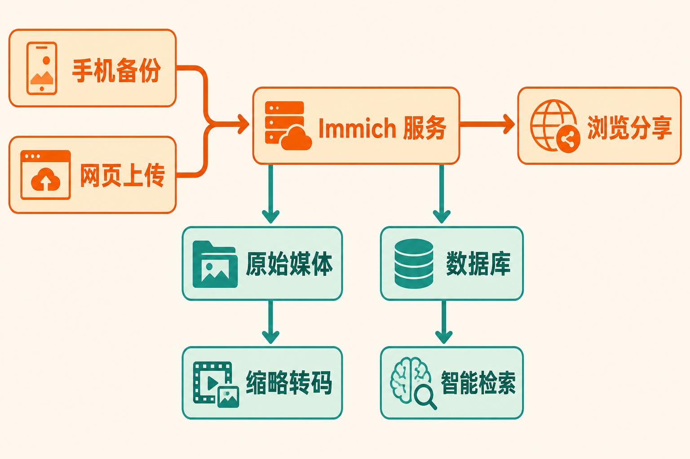

手机里有几万张照片，旧电脑还有多年的家庭影像，伴侣和父母又各自使用不同设备。真正棘手的通常不是“有没有地方存”，而是照片能否自动归集、按人物或内容找到、方便家人查看，同时不把唯一副本交给某个云服务。

Immich 瞄准的正是这个场景：在自己的服务器上搭建一套照片与视频管理系统，以接近现代云相册的方式完成备份、浏览、搜索和分享。不过，“数据在自己手中”也意味着硬件、升级和备份责任一并回到用户手中。

## 30 秒认识项目

- **一句话定位：**面向个人服务器的高性能、自托管照片与视频管理方案
- **仓库地址：**[immich-app/immich](https://github.com/immich-app/immich)
- **许可证：**AGPL-3.0；商标与转售仍受项目政策约束，不能把开源等同于品牌可任意使用
- **主要语言与框架：**Web 和服务端涉及 TypeScript、Svelte/SvelteKit、NestJS、Node.js；移动端采用 Flutter/Dart，机器学习组件还涉及 Python
- **活跃度：**截至 **2026 年 8 月 10 日 08:21（UTC+8）**，仓库约有 110.1k Stars、6.5k Forks、344 Watchers、482 个开放 Issue；最新核实提交日期为 2026 年 8 月 8 日。Star 只能说明关注度，不能证明稳定性
- **版本：**截至同一核实日期，最新正式版为 [v3.1.0](https://github.com/immich-app/immich/releases/tag/v3.1.0)，发布于 2026 年 7 月 29 日


## 它解决的不是“存储”，而是照片管理闭环

把照片复制到 NAS，只解决了文件落盘。用户仍要面对手机自动上传、重复文件、时间线浏览、人物与内容检索、家庭共享、RAW 与动态照片兼容等问题。Immich 将这些能力组合成 Web、移动客户端和服务器协同的完整流程。

与公共云相册相比，Immich 的核心差异是部署位置和控制权：媒体文件及管理服务运行在用户掌控的基础设施上。代价也很直接——用户需要准备服务器、配置 Docker、安排容量、处理升级，并为原始文件建立独立备份。

与普通文件夹或 NAS 文件共享相比，Immich 增加了面向照片的时间线、EXIF 与地图、相册、人物和对象检索等体验。它不是简单的文件浏览器，也不意味着可以取代底层备份系统。

这里可以作出一个**推断**：Immich 的竞争力不在某个单点功能，而在于把“自动进入图库—生成索引—检索整理—跨端查看—家庭分享”串成闭环。这个判断来自其功能组合，并非官方给出的市场结论。

## 四项真正有用的核心能力

### 1. 手机备份，把手工搬运变成持续归档

移动端支持照片和视频上传、后台备份及重复文件预防。Android 在 v3 改用周期任务调度器，可在后台上传整个图库；iOS 则让同步和上传并行，以利用有限的后台运行时间。

实际价值是减少“等手机存满才集中导出”的遗漏风险。但后台并不等于即时：iOS 的执行时间仍由系统控制，即使开启 Background App Refresh、关闭低电量模式，也不能保证固定调度。

### 2. 从时间线升级为可检索的个人影像库

项目支持 EXIF 和地图、对象与人脸识别、CLIP 搜索，以及 RAW、Live Photo、Motion Photo 等格式。它让“找出几年前在海边拍的狗”这类需求有机会从逐年翻相册变成搜索任务。

机器学习能力也带来资源要求。官方最低配置为 6GB 内存、2 核 CPU；4GB 环境只能考虑关闭机器学习。若进程出现 SIGKILL/137，通常指向内存不足；SIGILL/132 则通常意味着 CPU 不兼容。

### 3. 多用户、共享相册与伙伴共享

多用户、共享相册和伙伴共享，使它不只是个人图库，也能承载家庭内部的影像协作。照片仍可集中管理，不必为了分享而在聊天软件中反复压缩和转发。

需要注意的是，这种便利以服务器持续可用和正确管理账户为前提。Immich 也支持 OAuth 与 API Key，但公开到互联网后的认证、网络和运维安全仍由部署者负责。

### 4. 自动化与完整性检查

v3 的 Workflows 由触发器、过滤条件和动作构成，既有可视化界面，也支持 JSON 编辑和配置分享。完整性报告则能发现未被跟踪的文件、数据库引用但磁盘缺失的文件，以及校验和不匹配。

前者适合把重复整理动作规则化，后者帮助管理员发现“数据库认为文件存在，磁盘上却没有”的异常。它们提升了大图库的可维护性，但不能代替独立备份。

## 工作流程：一张照片如何进入 Immich

根据官方文档能够确认的流程是：手机或 Web 将媒体上传到服务器的存储位置；服务端保存图库信息并生成供浏览、检索使用的派生数据；用户再通过 Web 或移动端浏览、搜索和共享。机器学习参与对象、人脸与 CLIP 检索，PostgreSQL 保存数据库信息。

官方还说明，Immich 不修改原始文件，元数据编辑保存在 XMP sidecar 和数据库中。缩略图和转码视频平均可能额外占用图库容量的 10%—20%。实验性的 HLS 实时转码目前只在 Web 端实现，并需要较强服务器，官方建议使用硬件加速。



## 最小安装：从 Docker Compose 起步

以下命令和变量来自[官方 Quick start](https://docs.immich.app/overview/quick-start/)。先确认主机至少有 6GB 内存、2 核 CPU和 Docker，并使用新版 `docker compose` 插件，而不是已不受支持的 `docker-compose` 命令。

```bash
mkdir ./immich-app
cd ./immich-app
wget -O docker-compose.yml https://github.com/immich-app/immich/releases/latest/download/docker-compose.yml
wget -O .env https://github.com/immich-app/immich/releases/latest/download/example.env
```

编辑 `.env`，至少设置：

```dotenv
UPLOAD_LOCATION=./library
DB_DATA_LOCATION=./postgres
IMMICH_VERSION=v3
DB_PASSWORD=change-me
```

其中数据库密码应替换为随机值。随后启动：

```bash
docker compose up -d
```

浏览器访问：

```text
http://<machine-ip-address>:2283
```

第一个注册用户会成为管理员。此后可从 Web 上传照片；移动端则填写同一 Server Endpoint，登录并选择需要备份的相册。

数据库目录应放在本地 SSD，不能放在网络共享上。Windows 的 NTFS、exFAT/FAT32，以及 WSL 的 `/mnt` 主机挂载，都不适合作为 PostgreSQL 数据目录。官方推荐配置为 8GB 内存、4 核 CPU；数据库通常占 1—3GB。

## 优点、限制与成熟度

Immich 的优势很明确：功能覆盖从采集、整理到分享；支持多端和多用户；提供机器学习检索；项目维护活跃；AGPL-3.0 也给予用户查看、部署和修改代码的权利。

但它并非“装完即忘”的家电。移动端与服务器的主、次版本应保持一致，而应用商店审核可能让客户端更新晚于服务器，造成暂时无法登录。v3 包含 API 与依赖迁移的破坏性变化，并停止支持 pgvecto.rs；v3.1.0 又停止支持 iOS 14。升级前阅读发布说明和迁移指南不是可选项。

成熟度方面，**事实**是项目拥有持续提交、正式发布与完整文档；**观点**是它已经具备日常家庭图库所需的广度，但快速演进仍要求管理员保持维护意识。提交频繁说明开发活跃，不等于所有升级都没有风险。

最大的风险是误把它当成唯一备份。内置数据库备份只覆盖元数据和用户信息，不包含 `UPLOAD_LOCATION` 中的原始照片和视频。官方明确建议珍贵照片遵循 3-2-1 原则。清空 Immich 回收站还会删除被丢弃的原始文件，因此恢复方案必须在故障发生前准备好。

## 适合谁，不适合谁

Immich 适合已有 NAS、家用服务器或 Linux/Docker 经验，希望统一管理家庭照片，并愿意自行负责容量、备份和升级的人；也适合重视数据控制权、需要多用户共享和智能检索的家庭或小团队。

它不适合没有稳定服务器、无法接受定期维护、只想购买“无需管理”的云服务体验的人；也不适合把单机硬盘当永久安全仓库，或必须继续使用 iOS 14 的用户。较老的 amd64 处理器也要留意：v3 机器学习容器至少要求 x86-64-v2，否则只能停留在已经不受支持的 v2.7.5。

## 结语：值得试，但先设计退出与恢复路径

Immich 值得拥有自托管基础设施的用户尝试。它的价值不是“免费复刻一个云相册”，而是用可控的服务器换取照片管理与数据掌控权。

不过，正确的尝试顺序应是：先确认硬件和文件系统，再部署测试图库，验证手机同步与检索，最后建立原始文件的独立备份后才迁入重要照片。若不愿承担这套责任，成熟的托管云相册依然是更合适的选择。

## 参考资料

1. [GitHub：immich-app/immich 仓库](https://github.com/immich-app/immich)
2. [GitHub：Release v3.1.0](https://github.com/immich-app/immich/releases/tag/v3.1.0)
3. [GitHub：主分支提交记录](https://github.com/immich-app/immich/commits/main/)
4. [Immich Documentation：Quick start](https://docs.immich.app/overview/quick-start/)
5. [Immich Documentation：Requirements](https://docs.immich.app/install/requirements/)
6. [Immich Documentation：FAQ](https://docs.immich.app/FAQ/)
7. [Immich Blog：Release v3.0.0](https://immich.app/blog/v3.0.0-release)
