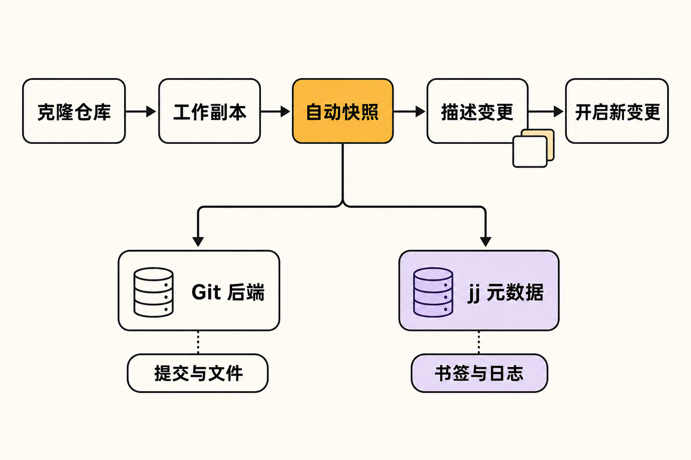

你正在同时处理两个需求：第一项改到一半，第二项必须紧急插入；随后又发现三次提交前混入了调试代码。按照常见 Git 工作流，你可能需要在 `add`、`commit`、`stash`、切换分支、变基和解决冲突之间来回穿梭，还得时刻确认 HEAD、工作区与暂存区分别处于什么状态。

问题并不一定是 Git 做不到，而是它把多种中间状态交给用户管理。Jujutsu 试图改变的，正是这一层交互模型：保留 Git 存储与协作生态，同时把“正在编辑的内容”“历史改写”和“撤销误操作”组织成另一套逻辑。

它不是 Git 的皮肤，也不是又一种 Git 命令别名。理解 Jujutsu，关键不是背新命令，而是接受一个不同的起点：**工作副本本身就是一个持续更新的提交。**

## 30 秒认识项目

- **一句话定位：**Jujutsu（命令名 `jj`）是面向软件项目、当前以 Git 仓库存放提交和文件的 Git 兼容版本控制系统。
- **仓库地址：**[`jj-vcs/jj`](https://github.com/jj-vcs/jj)
- **许可证：**Apache License 2.0。官方 Logo 另有 Creative Commons 授权说明，不能与代码许可证混同。
- **主要语言：**Rust；main 分支工作区采用 Rust 2024 edition。
- **版本与活跃度：**截至 **2026 年 8 月 28 日**，main 工作区版本及最新正式版均为 v0.44.0，正式版发布于 2026 年 8 月 6 日；仓库约有 11,644 次提交、1.2k Fork、810 个开放 Issue 和 403 个 Pull Request。可见的 main 最新提交日期为 2026 年 8 月 21 日，近期有多位贡献者持续提交代码、测试和文档。[发布记录](https://github.com/jj-vcs/jj/releases)与[提交历史](https://github.com/jj-vcs/jj/commits/main/)显示项目仍在活跃演进。
- **Star：**核实时仓库页面未成功呈现该数值，本文不作推测。上述动态数字也只代表核实当时，不能单独证明软件质量。


## 它要解决的，不是 Git 的存储问题

Jujutsu 将用户界面和版本控制算法与底层存储解耦。目前，它用 Git 仓库保存提交和文件，但 bookmarks——可近似理解为 Git 分支——以及其他高层元数据由 jj 自行保存。[官方 README](https://raw.githubusercontent.com/jj-vcs/jj/main/README.md)还说明，这套设计吸收了 Git 的存储兼容性、Mercurial/Sapling 的 revset 与匿名分支，以及 Darcs 将冲突作为一等对象的思路。

因此，与常见替代方案相比，差异可以这样理解：

- **对比直接使用 Git：**jj 没有要求用户显式维护 index/暂存区；文件变化会在下一条 jj 命令执行时自动快照到当前工作副本提交。它还用操作日志记录仓库操作，为历史改写提供统一撤销路径。
- **对比 Git GUI：**图形客户端通常降低 Git 命令的使用门槛，但底层仍是工作区、暂存区、提交和分支那套状态机。jj 改的是数据与操作模型，不只是呈现方式。
- **对比另建一套完全独立的 VCS：**jj 当前利用 Git 作为存储后端，因而能接入现有 Git 仓库；但这不代表纯 Git 工具能识别 jj 保存的全部高层元数据。

最后一点尤其重要：**“Git 兼容”是有边界的。**把它理解成“任何时候都能由 Git 无损接管全部 jj 状态”，会高估现阶段的互操作能力。

## 四项核心能力，价值在哪里

### 1. 自动快照：减少中间状态管理

在 jj 中，工作副本对应一个真实提交。直接修改文件后，下一条 jj 命令会捕获变化，无需先执行类似 `git add` 的步骤。完成当前变更时运行 `jj new`，即可创建下一项变更。

实际价值不只是少敲一个命令，而是工作副本、暂存内容、stash 和普通提交之间的界线被简化了。开发者可以更专注于“当前变更是什么”，少花精力判断内容究竟停在哪一层。

### 2. 稳定的 change ID：把“变更”与提交版本分开

Git 的 commit ID 会在 amend、rebase 等历史改写后变化。jj 另外提供稳定的 change ID，用来标识持续修订中的同一项变更；底层 commit ID 仍可随改写更新。

这让“我正在完善哪项工作”与“它当前落成哪个提交对象”不再是同一个问题。**观点：**对于频繁整理本地历史、反复修改补丁栈的开发者，这是 jj 最有辨识度的设计之一。

### 3. 操作日志与 undo：让改写历史不再像单程票

项目会记录仓库操作，并支持 undo。其价值在于，历史改写不必完全依赖用户提前创建备份分支，误操作也有更明确的回退依据。

但“可撤销”不应被理解为“永不丢数据”的保证。外部工具修改仓库、尚未覆盖的边界情况，以及已经推送到远端并被他人依赖的历史，都可能扩大恢复问题的范围。

### 4. 一等冲突：允许冲突进入后续历史

传统流程往往要求用户先解决冲突，才能继续推进。jj 把冲突作为可记录、可传递的对象，因而可以先调整变更顺序或继续操作，再在合适的位置解决冲突。

实际价值是把“冲突发生”与“必须立即解决”拆开，尤其适合重新组织多项依赖变更。不过，这项能力仍有实现边界：截至核实日，公开的 [Issue #9868](https://github.com/jj-vcs/jj/issues/9868) 仍记录着一个字节级案例——在 jj-lib 0.43.0 中，以回车字节结尾且没有换行的内容，经 Git 风格冲突标记往返解析后可能丢失末尾 CR。它不能证明常规文本冲突不可靠，却足以提醒特殊行尾、二进制或生成文件用户先做真实仓库验证。

此外，revset 查询语言和模板化输出让复杂版本集合可以被筛选、组合和定制展示。这对大型历史或高级自动化很有价值，但也意味着熟练使用 jj 仍存在一条新的学习曲线。

## 工作原理：一次编辑如何流动

根据[官方教程](https://docs.jj-vcs.dev/latest/tutorial/)，最小流程是：从 Git 远端克隆后，jj 建立自己的工作副本提交；用户修改文件，下一条 jj 命令触发自动快照；`jj st` 或 `jj diff` 检查状态与差异；`jj describe` 描述当前变更；完成后用 `jj new` 开启下一项变更。

底层可分为两层：Git 后端保存提交与文件对象；jj 层管理 bookmarks、操作日志等高层信息。change ID 稳定地指向“同一项变更”，commit ID 则可随着改写而变化。



这也解释了为何网络克隆命令仍写作 `jj git clone`：官方教程明确表示，目前没有原生 jj 仓库的网络克隆，远端交换仍走 Git 路径。

## 安装与最小使用示例

运行时要求 Git 2.41.0 或更高版本。使用 Cargo 安装正式版时，官方给出的通用命令是：

```bash
cargo install --locked --bin jj jj-cli
```

也可以按平台安装：

```bash
# macOS / Homebrew
brew install jj

# Windows / winget
winget install jj-vcs.jj

# Arch Linux
pacman -S jujutsu
```

main 源码当前要求 Rust 1.89。若只想使用正式发布版本，可优先选预编译包或系统包管理器，具体路径见[官方安装文档](https://docs.jj-vcs.dev/latest/install-and-setup/)。首次使用先配置身份：

```bash
jj config set --user user.name "Your Name"
jj config set --user user.email "your.email@example.com"
```

随后复制官方教程的最小工作流：

```bash
jj git clone https://github.com/octocat/Hello-World
cd Hello-World
jj st
jj describe
# 此处直接编辑文件
jj st
jj diff
jj new
```

其中 `jj describe` 为当前变更填写描述，修改文件无需 `add`；`jj new` 表示当前变更告一段落，开始下一项工作。需要把当前变化压入父提交时，可用 `jj squash`；需要回到旧提交继续修改，可用 `jj edit <commit>`。

## 优点、限制与成熟度

**优点是明确的：**自动快照降低了暂存区管理成本；change ID 更贴合持续修订的工作方式；操作日志为历史改写提供安全网；一等冲突让复杂变更可以更灵活地重排；Git 后端则降低了迁移到全新存储生态的门槛。

**限制也同样明确：**项目 README 仍称其相对年轻，还有大量工作待完成。v0.44.0 虽已稳定 Git tag 的拉取、跟踪与推送，却也带来命令参数及默认行为变化，例如旧的 `jj git clone --fetch-tags=...` 被 `--tag=PATTERN` 取代，`jj git push --all` 也会推送所有 tags。[v0.44.0 发布说明](https://github.com/jj-vcs/jj/releases)表明，升级前阅读 changelog 仍是必要步骤。

成熟度不能只看版本号。连续发布与近期提交支持“维护活跃”这一事实；810 个开放 Issue 则只说明公开问题与需求规模，既不能直接判定质量差，也不能证明所有关键场景已成熟。

**风险推断：**由于 jj 的高层元数据并非全部存入 Git，严重依赖 Git 专用 GUI、钩子、脚本或审计流程的团队，迁移成本可能高于个人开发者。这个判断来自其存储边界，而不是本文做过兼容性实测。大型单体仓库、特殊行尾、二进制和生成文件，也应先以副本进行基准测试与恢复演练。

## 谁适合尝试，谁应当观望

jj 适合已经熟悉 Git、经常 rebase 或 amend、维护多项并行变更，并愿意学习新模型的开发者。个人项目、实验性分支或低风险仓库，是更稳妥的切入点。

它暂时不太适合只想逐字替换 Git 命令、无法调整既有工具链，或要求所有元数据都被纯 Git 客户端完整理解的团队。对升级稳定性和流程认证要求严格的组织，也不宜仅凭社区热度直接切换。

## 结语

Jujutsu 最值得关注的地方，不是“少写几条 Git 命令”，而是它重新定义了版本控制中的基本对象：工作副本是提交，变更拥有稳定身份，冲突可以继续流动，仓库操作本身也进入可追溯历史。

**结论：值得尝试，但应从低风险仓库开始。**它已经具备清晰的设计主张、持续维护和可复制的基本工作流；与此同时，年轻项目的行为变更、Git 兼容边界与公开的冲突边缘问题，都决定了它更适合渐进验证，而不是未经评估的团队级替换。

## 参考资料

1. [jj-vcs/jj GitHub 仓库](https://github.com/jj-vcs/jj)
2. [Jujutsu 官方 README](https://raw.githubusercontent.com/jj-vcs/jj/main/README.md)
3. [Cargo workspace 清单](https://github.com/jj-vcs/jj/blob/main/Cargo.toml)
4. [官方安装与配置文档](https://docs.jj-vcs.dev/latest/install-and-setup/)
5. [官方教程与整体概览](https://docs.jj-vcs.dev/latest/tutorial/)
6. [Jujutsu Releases](https://github.com/jj-vcs/jj/releases)
7. [main 分支提交历史](https://github.com/jj-vcs/jj/commits/main/)
8. [Issue #9868：冲突解析中的末尾 CR 问题](https://github.com/jj-vcs/jj/issues/9868)
