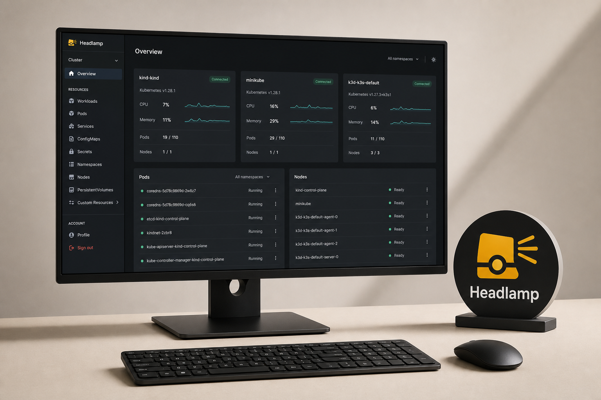
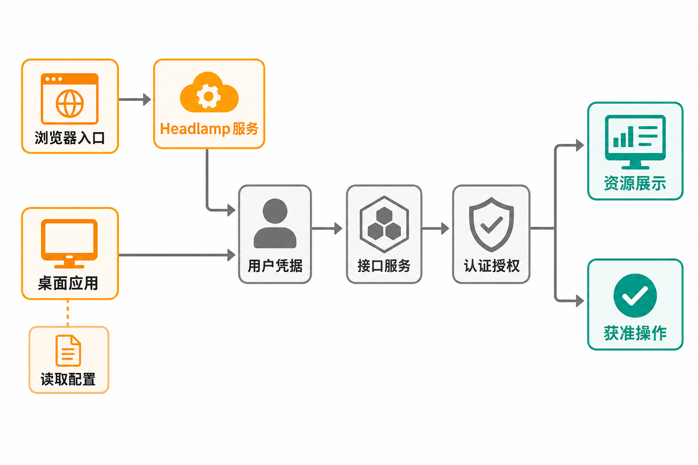

一个开发者说“Pod 起不来”，排查者往往要先切换 kubeconfig 上下文，再依次查看工作负载、事件和日志；需要进入容器时，还要继续执行 exec。若团队同时管理多个集群，操作链会更长。命令行本身没有问题，问题在于：并非每个需要观察 Kubernetes 状态的人，都能熟练、准确地完成这套操作。

Headlamp 试图把这些分散动作收进一个图形界面，但它并不是绕开 Kubernetes 的“万能控制台”。它仍然使用用户凭据访问 API Server，并受 RBAC 约束。这也是理解该项目价值与风险的起点。

## 30 秒认识项目

- **一句话定位：** Kubernetes SIG UI 旗下、厂商中立且支持插件扩展的 Kubernetes 图形界面，可在集群内运行，也可作为桌面应用读取 kubeconfig。
- **仓库地址：** [kubernetes-sigs/headlamp](https://github.com/kubernetes-sigs/headlamp)
- **许可证：** Apache License 2.0
- **主要语言与形态：** TypeScript/React 前端、Go 后端，并包含 Electron 桌面应用、Helm Chart 和 Kubernetes 清单。
- **最新正式版本：** v0.45.0，发布于 2026 年 8 月 20 日；对应提交为 `0e9fe81`。
- **活跃度：** 截至 **2026 年 8 月 31 日 16:10（Asia/Shanghai）**，仓库约有 7.2k Stars、1.1k Forks、27 Watchers 和 10,150 次提交；8 月 30 日仍有新 Issue 提交。[版本记录](https://github.com/kubernetes-sigs/headlamp/releases)与[Issue 列表](https://github.com/kubernetes-sigs/headlamp/issues)显示近期维护仍在继续。

这些数字只能说明关注度、协作规模和近期活动，不能直接证明质量或生产成熟度。



## 它解决的不是“没有界面”，而是操作上下文割裂

Headlamp 覆盖资源查看与编辑、日志、容器终端、创建、更新和删除等常见动作，并提供多集群切换。其现实价值在于，让资源状态、关联信息和操作入口出现在相对连续的视觉路径中。

与直接使用 kubectl 或原始 API 相比，它降低了查询和导航门槛，也更适合需要查看集群、但不以命令行为主要工作方式的开发者。代价是多引入了一层界面、认证配置与发布管理，复杂问题最终仍可能需要回到 Kubernetes 原生工具。

与传统 Kubernetes Dashboard 思路相比，Headlamp 的明显差异是桌面运行形态、多集群能力和官方支持的插件机制。[官方 README](https://github.com/kubernetes-sigs/headlamp/blob/main/README.md)也将交互式管理、排障和扩展能力放在核心位置。

**观点：** Headlamp 更适合被视为 Kubernetes API 的可视化操作层，而不是 kubectl 的完全替代品。前者能提升团队日常操作效率，后者仍是自动化、精确复现和深度排障的重要基础。

## 四项核心能力，价值分别在哪里

### 1. 一个入口查看和操作多个集群

桌面版可从默认位置读取 kubeconfig，并允许用户监控、切换多个集群；集群内部署则可向团队提供统一 Web 地址。实际价值是减少频繁切换工具和上下文造成的误操作，但每个集群仍须具备有效凭据和正确权限。

### 2. 从资源状态走到日志和终端

Headlamp 不只展示资源列表，还支持日志、exec 容器终端以及带文档的资源编辑器。对排查者而言，这把“发现异常—查看详情—读取日志—进入容器”的路径集中在一个界面中。涉及写操作时，仍应执行团队既有的变更审批与审计规则。

### 3. 让界面响应真实权限

编辑、删除或扩缩容等按钮会依据 Kubernetes RBAC 显示。权限不足时，部分控件可能消失；资源显示不完整也可能是令牌权限过少，而非前端损坏。[官方 FAQ](https://headlamp.dev/docs/latest/faq/)还指出，只有特定命名空间权限的用户，应在集群设置中配置可访问命名空间，否则可能持续看到 Access Denied。

实际价值是界面不会天然获得超出用户身份的能力。不过，近期 Issue 记录了部分批量操作没有像单项操作一样按 RBAC 隐藏的情况。因此，按钮是否出现不能替代 API Server 侧的权限控制。

### 4. 用插件承接平台差异

插件可接入特定平台、云原生项目或内部工作流，使 Headlamp 不必把每种企业需求都固化到核心代码中。对平台团队而言，这提供了构建内部控制台入口的可能。

这里需要区分事实和推断：**事实**是插件开发属于官方支持的核心机制；**推断**是插件可能减少自建整套 Kubernetes 前端的工作量。实际收益仍取决于插件质量、升级兼容性和团队维护能力。

## 工作原理：界面之下仍是 Kubernetes 权限链

官方资料能够支持的基本流程是：用户通过浏览器访问集群内 Headlamp，或在桌面应用中加载 kubeconfig；Headlamp 使用 ServiceAccount 令牌、客户端证书或相应认证配置访问 Kubernetes API Server；API Server 完成认证与 RBAC 授权，再返回允许查看的资源或执行获准操作。



集群内模式与桌面模式的主要区别在入口和凭据来源，而不是另造一套权限体系。FAQ 称令牌可能保存在浏览器本地存储，但不会存入 Headlamp 后端。这意味着浏览器终端安全、令牌有效期和最小权限配置都属于部署边界，而不是安装完成后的可选优化。

## 用 Helm 跑起最小实例

以下命令均来自[官方集群内安装文档](https://headlamp.dev/docs/latest/installation/in-cluster/)。先添加 Chart 仓库并安装：

```bash
helm repo add headlamp https://kubernetes-sigs.github.io/headlamp/
helm install my-headlamp headlamp/headlamp --namespace kube-system
```

再把服务临时转发到本机：

```bash
kubectl port-forward -n kube-system service/my-headlamp 8080:80
```

浏览器访问：

```text
http://localhost:8080
```

如果不使用 Helm，官方也提供简单清单：

```bash
kubectl apply -f https://raw.githubusercontent.com/kubernetes-sigs/headlamp/main/kubernetes-headlamp.yaml
kubectl port-forward -n kube-system service/headlamp 8080:80
```

官方要求部署前审阅并按环境修改该清单。更重要的是，服务启动不等于授权完成：用户还需要适当 RBAC 权限的 ServiceAccount 令牌，或正确配置 OIDC。生产环境不应为了省事直接授予 `cluster-admin`。通过 Ingress 对外开放时，还要自行核验域名、TLS、认证和网络边界。

## 优点、限制与成熟度

Headlamp 的优势比较明确：两种运行形态覆盖个人和团队场景；多集群、日志、终端和编辑能力形成较完整的日常操作链；插件机制为内部平台扩展留下空间；Apache 2.0 许可证也便于在遵守条款的前提下修改和再分发。

成熟度方面，官方称通常尝试每月发布一个功能版本，必要时穿插修复版本。v0.44.0 于 2026 年 7 月 29 日发布，v0.45.0 于 8 月 20 日发布；后者包含安全修复及 31 项缺陷修复。发布说明还称桌面启动内存经多项隔离测量合计下降约 60 MiB RSS。上述数据是官方发布记录，不等同于本文独立性能测试。

限制也不能忽略：v0.44.0 才持续针对数万 Pod 场景优化资源图、分页、轮询和 Brotli 传输，说明大规模集群性能仍需按真实负载验证；Cluster Inventory 自动发现处于实验阶段，API 和行为可能变化。

认证是更值得提前验证的风险。截至 2026 年 8 月 31 日仍开放的 [Issue #5402](https://github.com/kubernetes-sigs/headlamp/issues/5402) 记录了 EKS、GKE 环境中 exec credential 与 OIDC/SSO 的集成限制：浏览器登录成功，并不保证 API Server 接受同一身份。Issue 中部分根因仍被标为待复现或假设，因此它是风险线索，而不是所有部署必然失败的证据。

近期 Issue 还涉及 OIDC 刷新后继续转发过期凭据、WebSocket 重连未使用新令牌、特定资源类型触发 Resource Map 崩溃等报告。Issue 不等于维护者已确认缺陷，但足以提醒采用者：上线前应按照自己的集群版本、认证方式、资源规模和浏览器环境进行验证。

## 谁适合用，谁不适合用

它适合已经使用 Kubernetes、希望给开发者和运维人员提供统一可视入口的团队；也适合拥有多个 kubeconfig、需要跨集群查看状态的个人，以及愿意维护插件的平台工程团队。

它不适合把图形界面当作权限边界、希望零配置接通复杂企业 SSO 的组织；也不适合完全依赖声明式 GitOps、禁止人工在线变更，且没有资源浏览需求的环境。若团队缺少 RBAC、令牌生命周期、Ingress 与升级治理能力，部署一个控制台反而会扩大维护面。

## 结语：值得尝试，但先验证身份链

**本文结论：值得进入候选清单，适合从非生产集群或桌面版开始尝试。** Headlamp 的价值不在于替代 Kubernetes，而在于把高频观察和排障动作组织成更易理解的界面；其真正的采用门槛，也不在 Helm 命令，而在认证、RBAC、规模与升级兼容性。

建议试用时优先验证三件事：目标集群的登录与令牌刷新是否稳定；最小权限用户看到的资源和操作是否符合预期；在真实资源规模下，资源图、日志和多集群轮询是否可接受。只有这三关通过，漂亮的界面才会成为生产力，而不是新的故障入口。

## 参考资料

1. [GitHub：kubernetes-sigs/headlamp 仓库](https://github.com/kubernetes-sigs/headlamp)
2. [Headlamp 官方 README](https://github.com/kubernetes-sigs/headlamp/blob/main/README.md)
3. [Headlamp Releases](https://github.com/kubernetes-sigs/headlamp/releases)
4. [Headlamp 官方文档：Introduction](https://headlamp.dev/docs/latest/)
5. [Headlamp 官方文档：In-cluster 安装](https://headlamp.dev/docs/latest/installation/in-cluster/)
6. [Headlamp 官方文档：FAQ](https://headlamp.dev/docs/latest/faq/)
7. [GitHub Issue #5402：EKS/GKE 认证集成讨论](https://github.com/kubernetes-sigs/headlamp/issues/5402)
8. [Headlamp Issues 列表](https://github.com/kubernetes-sigs/headlamp/issues)
