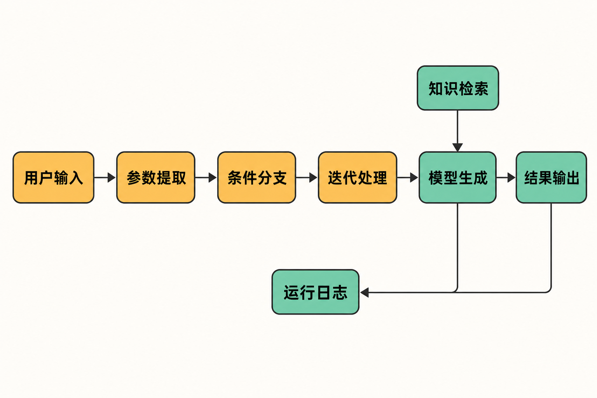

一个常见的 AI 项目困境是：演示版聊天机器人只用几天就能完成，真正交付却要补上文档检索、模型切换、工具调用、权限配置、日志追踪、API 封装和部署运维。每一项都不神秘，但拼在一起，团队很快就会陷入重复造轮子。

Dify 瞄准的正是这段“从 Demo 到应用”的距离。它没有创造新的大模型，而是试图把原本散落在不同框架和服务里的能力，收进一个可视化、可部署的应用平台。

## 30 秒认识项目

- **一句话定位：**面向 LLM 应用和 Agentic 工作流的开源开发平台，集成工作流、RAG、Agent、模型管理、可观测性与应用 API。
- **仓库地址：**[langgenius/dify](https://github.com/langgenius/dify)
- **许可证：**以 Apache License 2.0 为基础、附加商业及品牌条件的自定义许可证，并非未经修改的标准 Apache-2.0。
- **主要语言：**GitHub 标记为 TypeScript；仓库结构显示后端大量使用 Python，前端采用 Next.js/TypeScript。
- **最新稳定版：**截至 2026 年 8 月 6 日核实为 [v1.16.1](https://github.com/langgenius/dify/releases/tag/1.16.1)，发布于 2026 年 7 月 28 日。
- **活跃度：**截至 2026 年 8 月 6 日 08:02（Asia/Shanghai），GitHub API 显示 151,452 Stars、23,904 Forks、820 Subscribers；最近一次 push 为 2026 年 8 月 5 日。页面约有 291 个开放 Issue、654 个开放 PR。

这些数字只能说明关注度和协作活动旺盛，不能直接证明代码质量、安全性或生产适用性。


## 它解决的不是“调用模型”，而是应用工程

直接调用模型 API，适合需求单一、工程团队能够自行维护全部基础设施的项目；使用通用自动化工具，适合以 SaaS 连接和业务流程编排为核心的任务；纯代码型 AI 框架则通常给予开发者更细的控制力。

Dify 的差异在于，它围绕 AI 应用提供了相对完整的统一工作区：模型、提示词、知识库、工作流、Agent、日志和发布接口可以在同一套抽象中组合。非后端成员可以参与编排与调试，开发者又能通过 API 把结果接进网站、企业系统或其他产品。

这里需要区分事实与判断：**事实**是官方仓库列出了上述能力；**编辑判断**是，这种集成更适合希望快速形成跨角色协作闭环的团队，但不会天然优于针对单一场景深度定制的代码方案。

## 五项核心能力，价值分别在哪里

### 1. 可视化工作流：把隐含逻辑变成执行图

官方快速教程把用户输入、参数提取、条件分支、迭代、模板和输出连成有类型变量传递的执行图。例如，同一份产品草稿可以按目标平台分支，再分别生成 Twitter 与 LinkedIn 内容。

实际价值不只是“少写代码”，而是让输入、分支和节点依赖变得可检查。产品、运营与开发人员更容易围绕同一流程讨论。但流程一旦复杂，节点数量、变量映射和异常路径仍会形成新的维护成本。

### 2. 统一模型接入：降低更换供应商的摩擦

Dify 支持数十家推理服务商以及兼容 OpenAI API 的模型，并提供集中管理入口。这有利于团队比较模型，或避免把应用逻辑完全绑定在一个供应商上。

不过，统一入口不等于模型行为一致。官方教程明确提醒，不同模型会产生不同结果；社区 Issue 也出现过特定模型提供商参数兼容问题。因此，切换模型后仍需重新验证提示词、工具调用和输出质量。

### 3. RAG：把私有资料带入生成流程

平台提供文档摄取、切分、检索和上下文注入，可用于内部知识问答、客服辅助或资料驱动的内容生产。它减少了团队自行拼装解析、向量检索和工作流接口的工作。

但 RAG 不是上传文件后自动正确。文本清洗、切分策略、召回结果、文件传递和模型能力都会影响答案。v1.16.1 的修复范围仍包括 RAG 清洗、切分和外部知识验证，说明这部分能力活跃，也意味着升级需要回归测试。

### 4. Agent 与工具扩展：让模型执行受控动作

Dify 支持 Function Calling、ReAct Agent 和工具扩展，使模型不只回答问题，还能根据流程调用外部能力。适合信息查询、任务分派或带工具的业务助手。

风险也更高：模型作出的工具选择可能不稳定，外部接口失败还会放大链路复杂度。v1.16.1 专门强化了 Agent 本地沙箱、代理 ACL 和令牌认证，这说明隔离与鉴权不是可选装饰，而是部署 Agent 时必须审查的安全边界。

### 5. 日志、观测与应用 API：补齐交付最后一公里

工作流运行日志有助于定位失败节点，平台还集成 Opik、Langfuse、Arize Phoenix 等观测方案；应用可以通过 API 对外提供服务。相比把调试信息散落在不同脚本里，这更利于形成开发、发布、观察、修正的循环。

但日志会带来存储和查询成本。近期一个用户 Issue 报告在约 740GB 数据库下日志页面非常缓慢。这是用户报告，不是维护者确认的普遍缺陷，却足以提醒大规模使用者提前规划归档、索引和容量。

## 它如何运转：从输入到发布

依据官方教程，Dify 的核心可以理解为一张变量驱动的执行图：用户提交文本或文件，节点提取结构化参数，条件分支决定路径，迭代节点逐项处理，模型或模板节点生成结果，最后由输出节点交付。测试通过后，再通过 Publish > Publish Update 发布。

知识库可以在模型生成前提供检索上下文，Agent 节点可以调用工具；运行记录则用于观察和排错。这是依据官方材料做出的流程归纳，不代表所有 Dify 应用都必须使用全部节点。



## 可复制的本地安装

官方 README 给出的最低要求是 2 核 CPU、4 GiB 内存，并安装 Docker 与 Docker Compose 2.24.0 或更高版本。取得官方仓库后，最短启动步骤如下：

```bash
cd dify/docker
cp .env.example .env
docker compose up -d
docker compose ps
```

随后访问：

```text
http://localhost/install
```

完成管理员初始化。服务应显示为 `Up` 或 `healthy`；一次性任务 `init_permissions` 完成后显示 `Exited` 属正常情况。以上命令和检查方法来自[官方 Docker Compose 部署文档](https://docs.dify.ai/en/self-host/deploy/quick-start/docker-compose)与[官方 README](https://raw.githubusercontent.com/langgenius/dify/main/README.md)。

需要注意，默认编排不是一个轻量单容器：它会启动 7 个核心服务、8 个依赖组件和一个权限初始化任务。官方对 macOS Docker 虚拟机建议至少分配 2 vCPU、8 GiB 内存；这比 README 的最低门槛更接近实际试用配置。

### 最小使用示例

进入控制台后，可以按[官方快速教程](https://docs.dify.ai/en/quick-start)建立一个内容生成工作流：

1. 创建用户输入字段，例如草稿、语气、目标平台和语言；
2. 用参数提取节点整理输入；
3. 用 IF/ELSE 按目标平台分支；
4. 在迭代及模板节点中生成各平台内容；
5. 测试输出后，选择 **Publish > Publish Update**。

这不是性能测试或本文亲自实测结论，而是官方文档所示的最小应用路径。

## 优点、限制与成熟度

Dify 的优势很明确：能力覆盖完整，可视化流程便于跨角色协作，模型与知识库集中管理，自托管和 API 发布也给团队留下了集成空间。项目创建于 2023 年，至核实日仍频繁更新；v1.16.1 集中处理安全和跨模块缺陷，显示维护者仍在持续加固系统。

限制同样不能略过。

第一，自托管有现实运维负担。容器数量较多，生产环境还要自行审查环境变量、网络隔离、持久化、备份和升级。官方要求升级前阅读目标 Release，并比较新旧 `.env.example` 与 `.env`。

第二，许可证不是标准 Apache-2.0。根据[项目许可证](https://raw.githubusercontent.com/langgenius/dify/main/LICENSE)，商业使用本身被允许，但未经书面授权不得用其源码运营多租户环境；一个 workspace 被定义为一个 tenant。使用 Dify 前端时也不得移除或修改其 Logo 和版权信息。准备提供 SaaS、白标或多租户服务的公司应先完成法律审查。

第三，兼容性与升级风险客观存在。2026 年 8 月 5 日的[Issue 列表](https://github.com/langgenius/dify/issues)包含 Docker 页面启动、外部知识端点、MCP 互操作和模型提供商兼容等用户报告。另有一则[社区讨论](https://github.com/langgenius/dify/discussions/32353)称，多模态 RAG 工作流从 1.11.4 升至 1.13.0 后图片上下文丢失，回退后恢复。该讨论已关闭但未获官方回答，因此只能视作升级风险线索，不能当成已确认根因。

综合来看，**编辑观点**是：Dify 已明显超出概念验证阶段，但“功能成熟”不等于每种组合路径都稳定。其广泛能力、密集修复和较大的 Issue/PR 队列共同表明，它更像一个快速演进的平台，而不是无需治理的成品软件。

## 谁适合，谁不适合

Dify 适合希望快速搭建内部知识助手、内容流程、客服辅助或工具型 Agent，并愿意对模型效果和基础设施负责的产品与研发团队；也适合用可视化流程促进产品、运营和工程协作的组织。

它不太适合资源极少、只需要一次简单模型调用的项目；不适合不愿维护多组件系统的团队；对强白标、多租户 SaaS、严格审计或极致性能场景，也不应在未完成许可证、安全和容量评估前直接采用。

## 结语：值得试，但要把它当平台而非魔法

Dify 最有价值的地方，不是把大模型调用包装成几个按钮，而是把应用逻辑、知识、工具、日志和发布串成一条较完整的工程链路。它能显著缩短验证路径，却不能替团队做模型评估、安全治理、数据管理和升级回归。

因此，结论是：**值得用一个边界清楚、数据不敏感的真实场景做小规模试点。**如果试点进入生产，再围绕许可证、版本锁定、备份恢复、外部工具权限、日志容量和端到端回归建立正式清单。对 Dify 最合理的期待，不是“一键生成可靠 AI 应用”，而是用更低的协作成本，把可靠性问题提早暴露出来。

## 参考资料

1. [langgenius/dify GitHub 仓库](https://github.com/langgenius/dify)
2. [Dify 官方 README](https://raw.githubusercontent.com/langgenius/dify/main/README.md)
3. [Dify Open Source License](https://raw.githubusercontent.com/langgenius/dify/main/LICENSE)
4. [Deploy Dify with Docker Compose](https://docs.dify.ai/en/self-host/deploy/quick-start/docker-compose)
5. [30-Minute Quick Start](https://docs.dify.ai/en/quick-start)
6. [Release v1.16.1](https://github.com/langgenius/dify/releases/tag/1.16.1)
7. [Dify GitHub Issues](https://github.com/langgenius/dify/issues)
8. [Discussion #32353：多模态 RAG 升级问题报告](https://github.com/langgenius/dify/discussions/32353)
