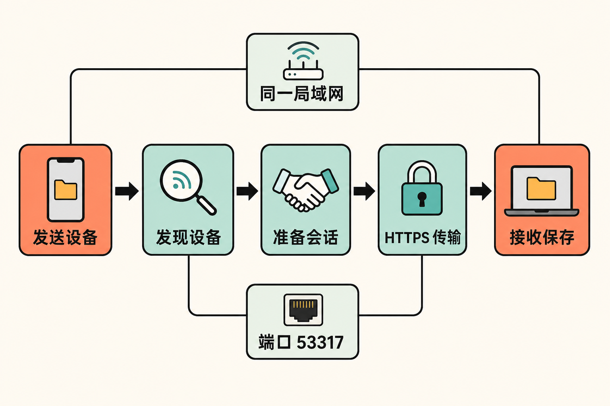

手机里有一段刚拍的视频，几分钟后要放进 Windows 电脑上的演示文稿。常见选择并不少：登录聊天软件、上传网盘、寻找数据线，或者先绕到另一台同品牌设备。然而，当文件较大、网络无法访问互联网，或设备分别属于苹果、Android、Windows 和 Linux 生态时，一次本应简单的传输，很容易变成账号、云端与兼容性的组合题。

LocalSend 试图把问题缩回最基本的范围：如果两台设备就在同一个局域网内，能否让它们直接发现彼此并传送文件？

答案是可以，但它并非“任何网络环境下都能自动成功”的魔法工具。理解它的价值，也要理解其边界。

## 30 秒认识项目

- **一句话定位：**在同一局域网内，让不同操作系统设备直接传输文件和文本的开源工具，可视为跨平台的 AirDrop 替代方案。
- **仓库地址：**[localsend/localsend](https://github.com/localsend/localsend)
- **许可证：**[Apache License 2.0](https://github.com/localsend/localsend/blob/main/LICENSE)
- **主要语言与技术：**Dart/Flutter 与 Rust；仓库同时包含 Flutter 应用、Rust 软件包和 CLI。
- **支持平台：**Windows、macOS、Linux、Android、iOS，另有 Fire OS 分发渠道。
- **活跃度：**截至 **2026 年 8 月 13 日**，仓库页面显示约 4.9k Fork、961 个 Issue、92 个 PR 和 2,077 次提交；最新版本为 **v1.18.1**，于 **2026 年 8 月 12 日**发布。由于来源页面未能可靠读取 Star 数，本文不作推测。

这些数字只能说明项目规模和当前活动情况，不能单独证明可靠性。更有意义的信号是：官方在 8 月 10 日发布 v1.18.0，完成核心网络与文件 I/O 的 Rust 重写并首次提供 CLI；两天后又发布移动端热修复版 v1.18.1。[发布记录](https://github.com/localsend/localsend/releases)表明，项目在核实日期仍处于维护状态。


## 它解决的不是“发文件”，而是传输链路的依赖

LocalSend 面向的核心问题，是跨平台近距离传输往往依赖云服务、账号体系或单一厂商生态。

与聊天软件和网盘相比，LocalSend 的数据传输发生在本地网络内，不需要先上传第三方服务器，也不要求注册或登录。与 AirDrop 一类生态内能力相比，它覆盖 Windows、macOS、Linux、Android 和 iOS。与数据线、U 盘相比，它省去了物理介质，但要求设备能够在同一局域网中互相访问。

这里需要严格区分事实和判断：

- **事实：**官方说明 LocalSend 不支持经互联网直接传输，数据不会离开本地网络，传输使用 HTTPS，并可附加 PIN 验证。[官网说明](https://localsend.org/)
- **推断：**少一次云端中转，通常意味着传输不再受公网带宽和云端存储流程制约，也减少了文件交给第三方服务处理的环节。
- **边界：**“本地传输”不等于在任何局域网内都天然安全，更不等于可以忽略接收确认、PIN、防火墙和网络可信度。

## 四项核心能力，实际价值在哪里

### 1. 跨平台设备发现

安装后，同一局域网中的设备可以发现彼此，用户不必手动查询 IP 地址。这项能力的实际价值不是少输入几个字符，而是让手机、电脑和平板之间形成相对一致的操作方式，不再为每组系统寻找不同工具。

不过，发现机制依赖网络条件。路由器的 AP Isolation、组播限制、Windows 公用网络设置，以及苹果系统的本地网络权限，都可能让两台“连着同一个 Wi-Fi”的设备彼此不可见。

### 2. 文件与文本共用一条本地通道

LocalSend 不只发送文件，也支持文本。文件适合照片、视频和文档；文本则适合把链接、地址或临时内容从手机送到电脑。文件默认进入接收设备的 Downloads 文件夹，也可在设置中修改保存目录。

这让它更接近一个轻量的跨设备投递入口，而不是完整的云盘：它负责当下发送，不负责长期同步、历史版本或异地访问。

### 3. HTTPS 加密与 PIN 验证

项目通过 HTTPS 传输，并由设备现场生成 TLS/SSL 证书，不依赖第三方服务器。用户还可以启用 PIN 验证，降低误发给同一网络中陌生设备的概率。

其实际价值在公共或多人网络中更明显。但从风险控制角度看，用户仍应核对接收方、谨慎接受未知文件，并尽量在可信局域网中使用；加密传输无法替代对文件来源的判断。

### 4. 公开协议与共享 Rust 核心

官方维护了独立的 [LocalSend Protocol 仓库](https://github.com/localsend/protocol)，当前文档标题为 Protocol v2.2，采用 REST API，并保留协议演进资料。这意味着 LocalSend 不只是一个封闭 GUI，而有公开的互操作基础。

v1.18.0 又让 CLI 与 Flutter 应用共用同一个 Rust 库，并完成核心网络和文件 I/O 的 Rust 重写。**事实**是官方将目标表述为提高传输速度；在没有本文来源支持的基准测试前，不能进一步宣称它具体快了多少。

## 一次传输是怎样完成的

在来源能够支持的范围内，可将流程概括为四步：

1. 两台设备接入可互访的同一局域网；
2. LocalSend 通过局域网发现附近设备；
3. 发送方选择文件或文本并指定接收设备，双方准备传输会话；
4. 内容通过基于 REST API 的 HTTPS 连接直接传送，接收端确认并保存。



默认使用 **53317** 端口，TCP 和 UDP 的入站、出站通信都可能影响工作。公开协议解决的是客户端如何发现、协商和传输，并不能绕过路由器隔离或主机防火墙。

## 安装与最小使用示例

普通用户优先选择官方列出的应用商店或包管理器渠道。项目提供 Winget、Homebrew、Flathub、Play Store、App Store、F-Droid、APK、DEB 和 AppImage 等选项。官方特别提示：应用本身没有自动更新，因此通过商店或包管理器安装更便于后续更新。[安装说明](https://github.com/localsend/localsend/blob/main/README.md)

开发者如需从源码运行，应先准备 Flutter、Rust，以及可选但官方推荐的 FVM。随后执行 README 给出的命令：

```bash
git clone https://github.com/localsend/localsend.git
cd localsend/app
flutter pub get
flutter run
```

项目使用 `.fvmrc` 指定 Flutter 版本；版本不匹配可能导致构建失败。

最小使用流程也很直接：在两台设备上启动 LocalSend，确保它们处于同一可互访局域网；在发送端选择文件或文本，再选择出现的接收设备；接收端确认后，文件默认保存到 Downloads。若设备不出现，应先检查本地网络权限、网络隔离和 53317 端口，而不是立即判断应用损坏。

## 优点、限制与成熟度

LocalSend 的优点相当明确：跨五类主流系统；无需账号；不经过第三方服务器；文件和文本共用一套交互；协议公开；Apache 2.0 许可证也为审查、修改和再分发提供了清晰基础。

它的限制同样不能略过：

- 只能直接服务于本地网络场景，不能替代远程网盘或互联网文件投递。
- 网络发现容易受到防火墙、AP Isolation、组播和系统权限影响。
- 官方最低要求为 Android 5.0、iOS 12、macOS 11 和 Windows 10；Windows 7 最后支持版本是 v1.15.4。
- 应用没有内建自动更新，手动下载安装包的用户需要自行关注新版本。
- “开源”不代表二次分发没有义务。企业使用或改造时仍需检查 NOTICE、修改声明及依赖组件许可证。

防火墙问题尤其值得强调。一个仍处于开放状态的 [Issue #3172](https://github.com/localsend/localsend/issues/3172)指出，Linux 在 nftables、ufw 或 firewalld 默认拒绝入站连接时，界面可能看似正常，却无法被其他设备发现，当前诊断反馈也不够直观。早期的 [Ubuntu 案例](https://github.com/localsend/localsend/discussions/573)则显示，用户若在错误的防火墙工具里添加规则，问题依旧存在。

这说明项目已具备完整产品形态和持续发布能力，但网络异常诊断仍有改进空间。**本文观点是：**它的成熟度足以承担个人和小团队的日常近距离传输，但在受管企业网络中，部署顺畅程度更多取决于网络策略，而不只是客户端本身。

## 适合谁，不适合谁

LocalSend 适合同时使用 Android、iPhone、Windows、Mac 或 Linux 的个人；适合不愿借助聊天软件和云盘中转文件的人；也适合局域网可控、希望减少外部服务依赖的小团队。公开协议和 CLI 对希望做自动化或兼容客户端的开发者也有价值。

它不适合需要跨城市、跨公网传文件的人，不适合追求云端同步、版本管理和长期归档的团队，也不适合无法调整防火墙或网络隔离策略、却要求零配置稳定发现设备的受管环境。

## 结语：值得尝试，但先确认网络边界

LocalSend 值得尝试的理由，不是仓库数字够大，而是它把一个高频问题定义得足够克制：在附近设备之间，提供跨平台、免账号、无云端中转的直接传输。

这种克制也决定了它的边界。它不是网盘，不解决异地同步；它使用加密，但不能替用户判断陌生文件；它尽量简化发现过程，却无法改变局域网的防火墙和隔离规则。

如果你的需求正是“把眼前这台设备上的内容交给旁边另一台设备”，它是一项成本很低、逻辑透明的选择。若需求已经越过同一局域网，则应寻找远程传输或协作存储方案，而不是强行让 LocalSend 承担它没有承诺的角色。

## 参考资料

1. [LocalSend 主仓库](https://github.com/localsend/localsend)
2. [LocalSend 官方 README](https://github.com/localsend/localsend/blob/main/README.md)
3. [LocalSend Releases](https://github.com/localsend/localsend/releases)
4. [Apache License 2.0 许可证原文](https://github.com/localsend/localsend/blob/main/LICENSE)
5. [LocalSend 官方网站](https://localsend.org/)
6. [LocalSend Protocol 官方仓库](https://github.com/localsend/protocol)
7. [防火墙诊断功能提案 Issue #3172](https://github.com/localsend/localsend/issues/3172)
8. [Ubuntu 接收故障 Discussion #573](https://github.com/localsend/localsend/discussions/573)
