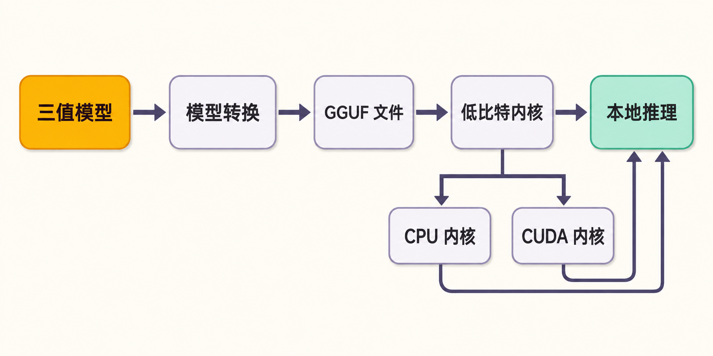

一台没有高端显卡的电脑，能否在本地运行大模型？

传统方案通常在两个方向之间取舍：要么把 FP16 模型压缩成 8-bit、4-bit，牺牲一定精度来降低内存和计算负担；要么调用云端 API，把硬件成本换成持续费用、网络依赖和数据外发。Microsoft 开源的 BitNet——仓库中的实现称为 **bitnet.cpp**——探索了第三条路：模型在训练阶段就采用极低比特权重，再为这种结构设计专门的推理内核。

这不是“任何大模型一键压成 1 bit”的万能工具，而是一套面向原生 1-bit、尤其是 1.58-bit 三值权重模型的推理框架。

## 30 秒认识项目

- **一句话定位：**面向 1-bit 大模型的官方推理框架，以专用低比特内核在 CPU、边缘设备及特定 GPU 上执行推理。
- **仓库地址：**[microsoft/BitNet](https://github.com/microsoft/BitNet)
- **许可证：**[MIT](https://github.com/microsoft/BitNet/blob/main/LICENSE)，允许商业使用和修改，但须保留版权与许可声明。
- **主要语言：**以 C/C++ 为核心，配有 Python 构建、转换和运行脚本，以及 CUDA 内核。
- **活跃度：**截至 **2026 年 9 月 3 日 08:23（北京时间）**，约 40.2k Stars、3.7k Forks、355 Watchers，另有 203 个 Issues、116 个 Pull Requests；[main 分支最新可见提交](https://github.com/microsoft/BitNet/commits/main/)为 2026 年 7 月 27 日。

这些数字说明关注和协作程度较高，却不能单独证明代码质量或生产成熟度。


## 它真正要解决的，不只是模型文件太大

低比特权重只有在计算内核能够利用其表示方式时，才可能转化为实际速度和能耗收益。如果仍将权重还原成高精度数值再计算，存储节省未必能充分兑现为推理效率。

bitnet.cpp 的差异正在这里：它不是只提供模型格式，而是围绕三值权重提供 I2_S、TL1、TL2 等专用 CPU 内核，并为官方 2.4B 模型提供特定 CUDA 实现。项目基于 llama.cpp，同时采用了 T-MAC 首创的查找表方法。[官方 README](https://github.com/microsoft/BitNet/blob/main/README.md?plain=1)将其目标概括为在通用硬件上高效运行 1-bit LLM。

与常见方案相比：

- **相对 FP16 推理：**权重表示和相应计算更轻，目标是降低内存、延迟与能耗。
- **相对训练后 4-bit/8-bit 量化：**BitNet 的代表模型是原生三值权重模型，而不是把普通高精度模型简单压缩后直接获得同等支持。
- **相对云端 API：**可服务于本地或边缘推理，但安装、编译、模型兼容和硬件适配需要使用者自行承担。
- **相对 llama.cpp 的通用量化生态：**bitnet.cpp 的覆盖范围更窄，优势来自针对特定权重结构的专门优化。

因此，笔者的判断是：BitNet 更像一条软硬件协同优化路线的工程样板，而非现阶段通用本地模型工具的替代品。

## 四项核心能力，以及它们的实际价值

### 1. 为三值权重设计 CPU 内核

I2_S、TL1、TL2 等内核让框架不必把 1.58-bit 模型完全当作普通高精度模型处理。实际价值是：即使没有独立显卡，也有机会在 x86 或 ARM CPU 上获得可用的生成速度，并降低内存与能源压力。

项目方报告，相对 FP16 llama.cpp，其测试中 x86 加速为 2.37—6.17 倍、能耗降低 71.9%—82.2%；ARM 加速为 1.37—5.07 倍、能耗降低 55.4%—70.0%。这些是**官方特定硬件和基准条件下的结果**，不能推断每台电脑都会得到相同收益。

### 2. 提供从模型下载到对话推理的完整路径

仓库提供模型下载、环境构建、格式处理和推理脚本，降低了研究者拼接多个工具的成本。官方主模型 BitNet-b1.58-2B-4T 约有 2.4B 参数，使用 4 万亿 token 训练，并面向聊天场景提供 CPU 与官方 GPU 路径。

### 3. 针对官方模型的 CUDA 内核

[GPU 文档](https://github.com/microsoft/BitNet/blob/main/gpu/README.md)描述了 W2A8 GEMV：权重以 2 bit 存储，激活使用 8 bit，并通过权重重排、访存与解码优化降低延迟。这对希望研究低比特 CUDA 推理的开发者很有价值。

边界也很明确：该内核专门适配 BitNet-b1.58-2B-4T，不能据此认为任意三值模型、嵌入模型都能直接获得 GPU 加速。

### 4. 从生成模型扩展到向量嵌入

项目已加入 0.6B 和 270M 的 1-bit embedding 模型支持，可用于文本向量生成。官方测试在 Intel Xeon Platinum 8573C、8 线程、关闭 OpenMP的条件下，分别报告 1.42—2.28 倍和 1.32—1.74 倍加速。

[嵌入模型指南](https://github.com/microsoft/BitNet/blob/main/docs/bitnet-embeddings-i2s-guide.md)也诚实展示了限制：序列越长，未量化的 attention 所占计算比重越高，I2_S 相对 F16 的收益会下降；两款嵌入模型目前只在支持矩阵中标注了 x86 I2_S。

## 工作原理：低比特不是一个孤立开关

来源能够支持的流程可概括为：

**原生三值模型 → 转换或下载 GGUF → 按目标硬件选择低比特内核 → 构建 bitnet.cpp → 加载模型执行推理。**

CPU 路径依托 llama.cpp 的工程基础，以 I2_S、TL1 或 TL2 等内核处理低比特权重；GPU 路径则针对官方 2.4B 模型，把权重转换、重排后交给 W2A8 CUDA 内核。换言之，模型结构、文件格式、内核和硬件必须匹配，不能只看“1-bit”标签。



## 可复制的 CPU 安装与最小示例

以下命令来自[官方仓库文档](https://github.com/microsoft/BitNet)。基础要求包括 Python 3.10 以上、CMake 3.22 以上和 Clang 18 以上，官方推荐使用 Conda。

```bash
git clone --recursive https://github.com/microsoft/BitNet.git
cd BitNet
conda create -n bitnet-cpp python=3.10
conda activate bitnet-cpp
pip install -r requirements.txt
```

下载官方 GGUF 模型并构建 I2_S 路径：

```bash
huggingface-cli download microsoft/BitNet-b1.58-2B-4T-gguf \
  --local-dir models/BitNet-b1.58-2B-4T
python setup_env.py -md models/BitNet-b1.58-2B-4T -q i2_s
```

运行最小对话示例：

```bash
python run_inference.py \
  -m models/BitNet-b1.58-2B-4T/ggml-model-i2_s.gguf \
  -p "You are a helpful assistant" -cnv
```

Windows 用户还需从正确初始化的 Visual Studio 2022 Developer Command Prompt 或 PowerShell 构建。README 同时提示，上游 llama.cpp 的变化可能造成 `log.cpp` 中 `std::chrono` 相关构建失败。

## 优点、限制与成熟度风险

BitNet 的优点很集中：技术目标清晰；代码采用 MIT 许可证；CPU、特定 GPU和嵌入模型已有公开路径；并且官方把性能边界、支持矩阵和命令写进了文档。它适合作为研究“原生低比特模型如何兑现系统收益”的工程入口。

但成熟度不能只看 Star。首先，截至 2026 年 9 月 3 日，[GitHub Releases 页面](https://github.com/microsoft/BitNet/releases)仍为空。README 虽记录“1.0”于 2024 年 10 月 17 日发布，却没有对应的 GitHub Release 或预编译资产。生产部署若跟随 main 和变化中的 llama.cpp 子模块，存在可复现性风险；固定已验证的提交和模型文件更稳妥。这是基于仓库状态给出的工程建议，而非官方承诺。

其次，模型文件本身出现了值得警惕的社区报告。2026 年 8 月提交的[Issue #608](https://github.com/microsoft/BitNet/issues/608)称，当前部分官方 2B-4T checkpoint 含全零 MLP 权重，可能生成无意义内容；报告还提到新 U8 checkpoint 与现有转换器的兼容问题。该 Issue 在核验时仍为 Open，证据来自用户提交，**尚不能写成 Microsoft 已确认的事故结论**。但它会影响 README 推荐的最短运行路径，因此下载前应核验 Issue 状态、模型版本与文件哈希。

最后，仓库的 MIT 许可证只覆盖相应代码，不会自动替代模型权重、训练数据和第三方依赖各自的许可。商业部署必须分别审查。

## 谁适合尝试，谁应该观望

**适合尝试：**研究低比特 LLM 的工程师；希望在 x86、ARM 或边缘设备上评估本地推理的团队；研究定制 CPU/CUDA 内核、模型格式和软硬件协同优化的人；能够自行编译、固定依赖并验证模型文件的开发者。

**不太适合：**期待下载即用桌面软件的普通用户；希望把任意 Hugging Face 模型一键变成 1-bit 并获得同等加速的人；需要稳定版本、预编译二进制、广泛硬件矩阵和明确服务等级的生产系统；无法承担模型正确性与许可证核验的业务。

## 结语：值得研究，生产采用要慢一步

BitNet 值得尝试，但“尝试”的含义应当明确：它已经是理解和验证原生低比特推理的一项重要开源工程，却还不是无条件替换成熟推理栈的成品。

对研究者和基础设施团队，它的价值在于把模型表示、格式、内核和硬件连成了一条可观察的链路；对生产团队，更合理的顺序是先复现实测、确认 checkpoint 正确性、固定提交与依赖，再决定是否进入业务。真正值得关注的，不是“1.58-bit”这个醒目数字本身，而是这种模型与系统共同设计的方法能否持续扩展到更多模型、任务和硬件。

## 参考资料

1. [microsoft/BitNet 官方仓库](https://github.com/microsoft/BitNet)
2. [BitNet 官方 README](https://github.com/microsoft/BitNet/blob/main/README.md?plain=1)
3. [GitHub Releases 页面](https://github.com/microsoft/BitNet/releases)
4. [main 分支提交记录](https://github.com/microsoft/BitNet/commits/main/)
5. [MIT License](https://github.com/microsoft/BitNet/blob/main/LICENSE)
6. [BitNet GPU 推理内核文档](https://github.com/microsoft/BitNet/blob/main/gpu/README.md)
7. [BitNet Embeddings I2_S 指南](https://github.com/microsoft/BitNet/blob/main/docs/bitnet-embeddings-i2s-guide.md)
8. [Issue #608：checkpoint 权重异常报告](https://github.com/microsoft/BitNet/issues/608)
