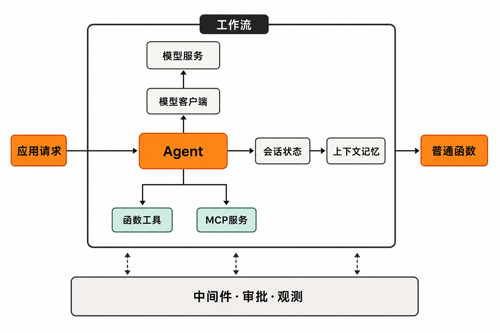

一个客服 Agent 在演示环境里运行顺畅：它能查询订单、调用退款工具，还能连续对话。但进入生产环境后，问题马上变了——服务中断后如何恢复任务？谁批准高风险工具调用？多 Agent 交接失败怎样定位？换模型是否要重写业务代码？会话状态放在哪里？

真正困难的往往不是“让模型回答一次”，而是把模型、工具、状态和业务流程组装成一个可以运行、观察和治理的系统。

Microsoft Agent Framework 瞄准的正是这段距离。它不是一个现成的万能 Agent，也不是单纯的模型 SDK，而是一组构建及编排 Agent 应用的基础抽象。

## 30 秒认识项目

- **一句话定位：**面向生产场景的开源 Agent 构建与多 Agent 工作流框架，统一模型接入、工具调用、会话状态、编排和可观测性。
- **仓库地址：**[`microsoft/agent-framework`](https://github.com/microsoft/agent-framework)
- **许可证：**[MIT License](https://github.com/microsoft/agent-framework/blob/main/LICENSE)
- **主要语言：**Python、C#/.NET；Go SDK 已转至独立仓库，且仍处于 public preview。
- **活跃度：**截至 **2026 年 8 月 25 日 16:29（北京时间）**，仓库约有 13.1k Stars、2.2k Forks、111 Watchers、2849 次提交、495 个开放 Issue 和 115 个开放 PR。主分支最新可见提交日期为 2026 年 8 月 24 日。[提交记录](https://github.com/microsoft/agent-framework/commits/main/)
- **版本：**截至同一核实时间，Releases 页面最新标记版本为 .NET 1.19.0，最近的 Python 版本为 1.15.0；两种语言采用独立版本序列。[版本记录](https://github.com/microsoft/agent-framework/releases)

这些数据说明项目受到关注且仍在频繁开发，但不能单独证明稳定性或工程质量。开放事项较多，也意味着使用者需要认真做版本验证。

## 它解决的不是“调用模型”，而是系统拼装

只做一次问答时，模型客户端加一段提示词已经足够。复杂应用则还要处理函数工具、MCP 服务、上下文、长期记忆、会话持久化、重试、人工审批、链路追踪，以及多个 Agent 之间的协作。

不使用统一框架，团队通常需要自行拼接这些部件。短期看灵活，长期却容易形成多套状态格式、异常处理方式和观测逻辑。Agent Framework 的选择，是以共同的 Agent、会话、上下文提供器、中间件和工作流抽象承载它们。

与普通模型 SDK 相比，它覆盖了调用层之上的状态和编排；与手写函数链相比，它适合包含非确定性判断、工具选择和多轮状态的任务；与 AutoGen、Semantic Kernel 的关系也不是简单并列——[微软将它定位为两者的下一代继任框架](https://learn.microsoft.com/en-us/agent-framework/overview/)。

> 需要强调一个边界：如果任务能够由普通函数确定性完成，官方并不建议为了“Agent 化”而引入 Agent。流程越确定，显式代码通常越容易测试和维护。

## 五项核心能力，实际价值在哪里

### 1. 用统一 Agent 抽象隔离模型差异

框架可连接 Microsoft Foundry、Azure OpenAI、OpenAI、Anthropic、Ollama 等提供商。其价值不是列出更多模型名称，而是让业务逻辑尽量围绕统一 Agent 接口组织，为模型替换和混合部署保留空间。

但“统一接口”不等于能力完全相同。语言、提供商和集成包之间存在功能差异，迁移前仍需验证工具调用、状态管理及流式响应等具体行为。

### 2. 把函数工具与 MCP 纳入执行过程

Agent 可以调用普通函数工具和 MCP 服务，使模型从“生成文字”扩展到查询系统或执行动作。框架同时提供中间件和工具审批能力，可在执行前后插入鉴权、审计或人工确认。

实际价值在于：高风险动作不必完全埋在提示词里约束，而能在代码执行边界增加控制。不过，现有 Discussions 仍有人提出工具审批公共查询与响应 API 不够便利，这应列入 PoC 检查清单。

### 3. 显式管理多轮状态与持久记忆

官方入门路线从 Session 保持多轮状态，继续延伸到上下文提供器、持久记忆和状态持久化。这样一来，对话历史和业务上下文不必全部塞进一次请求。

近期 .NET 1.19.0 还加入了 Azure Blob Storage 会话持久化，以及 Foundry 托管 Agent 状态持久化等能力。对长任务而言，价值是为中断恢复和跨请求延续状态提供正式结构，而不只是依赖进程内变量。

### 4. 让多 Agent 协作拥有可读的流程

Workflows 支持函数式和图式 API，可以用显式路径连接 Agent 与普通函数，并表达顺序、并发、handoff 和群组协作等模式。相比让 Agent 仅凭提示词自由决定下一步，显式图更容易确定责任边界，也便于定位失败节点。

这是一种折中：在需要推理的节点保留 Agent，在必须遵守规则的部分使用确定性函数和连线。

### 5. 为复杂任务提供 Harness Agent

Harness Agent 集成规划、待办跟踪、上下文压缩、文件访问、记忆、工具审批和可观测能力，适合步骤多、持续时间长、需要管理上下文的任务。

它的价值是减少重复搭建执行“外壳”的工作。但能力越集中，升级和排障影响面也越大。近期 Issue 中仍出现依赖注入参数、Skill 资源发现和本地模型思考模式控制等需求，说明高级扩展接口还在完善。


## 工作原理：非确定性节点放进确定性骨架

按照[官方架构概览](https://learn.microsoft.com/en-us/agent-framework/overview/)，一次典型执行可以概括为：应用把请求交给 Agent；Agent 通过模型客户端访问模型，并按需要调用函数工具或 MCP 服务；Session 与上下文提供器维护当前会话及记忆；中间件在关键位置加入审批、治理或观测；复杂任务再由 Workflow 连接多个 Agent 和普通函数。

因此，框架最值得关注的设计不是“多 Agent 数量”，而是把非确定性能力放入一条可显式描述的流程。OpenTelemetry 支持则为跨模型、工具和工作流节点追踪问题提供基础。

这是基于官方组件关系得出的工程判断，而不是对所有应用效果的保证：采用显式工作流通常有助于排障，但最终可维护性仍取决于流程设计和观测配置。



## 安装与最小上手路径

下面命令来自[官方 README](https://github.com/microsoft/agent-framework/blob/main/README.md)。Python 用户可先安装核心包：

```bash
pip install agent-framework
```

官方 Foundry 示例要求先完成 Azure CLI 登录：

```bash
az login
```

随后需要配置 Foundry 项目端点和模型部署名。最小代码的官方结构是：创建 `AzureCliCredential`，交给 `FoundryChatClient`，以该客户端创建 `Agent`，最后异步调用：

```python
response = await agent.run("请用一句话说明你的能力")
print(response)
```

这里没有补写来源材料未保留的导入路径、构造参数或环境变量名称，以免把可能随版本变化的代码伪装成可运行示例。复制使用时，应从 README 的 Python 示例复制对应版本的完整 `Agent`、`FoundryChatClient` 和 `AzureCliCredential` 初始化代码，再接入上面的 `run` 调用。

.NET 核心包的官方安装命令是：

```bash
dotnet add package Microsoft.Agents.AI
```

Foundry 场景还需要 `Microsoft.Agents.AI.Foundry`、`Azure.AI.Projects` 和 `Azure.Identity`。官方最小路径是通过 `AIProjectClient(...).AsAIAgent(...)` 创建 `AIAgent`，再调用 `RunAsync(...)`。

另一个容易踩坑的细节是：框架不会自动加载 `.env`。Python 应显式调用 `load_dotenv()`，或者在 Shell、IDE 中设置环境变量。生产环境也不宜无条件依赖 `DefaultAzureCredential` 的整套回退探测，否则可能增加认证延迟或使用到非预期凭据。

## 优点、限制与潜在风险

它的优势相当清楚：Agent、状态、工具和工作流被纳入同一体系；Python 与 .NET 是主要支持方向；模型提供商选择较多；同时覆盖人工介入、持久化和 OpenTelemetry 等生产问题。MIT 许可证也降低了采用和修改门槛，但需要保留版权与许可声明。

成熟度则需要分层判断。**事实是**，项目在 2026 年 8 月仍保持高频提交，并持续发布 Python 与 .NET 版本；最新 .NET Release 同时出现明确的破坏性变更。**由此可以合理推断**，框架正在快速成熟，但接口和行为尚未完全稳定，生产团队应锁定版本、阅读变更记录并做回归测试。

语言支持也不对称。Go 仍处于 public preview，尚缺声明式 Agent、RAG、CodeAct 和函数式工作流；一等 JavaScript/TypeScript 支持则仍是社区需求，不能当作已交付路线图。

[官方 Issue 列表](https://github.com/microsoft/agent-framework/issues)还显示，服务端历史与内存历史提供器的配合、部分 MCP Skill 资源格式，以及若干 Harness Agent 扩展接口仍有待完善。开放 Issue 只是风险线索，不代表每个用户都会遇到，但适合转化为采用前的专项测试。

安全方面，框架并不会替应用承担全部责任。官方要求开发者自行实现内容过滤、元提示词以及负责任 AI、安全、可靠性和质量保障。接入第三方 MCP 服务器、Agent、代码或非 Azure Direct 模型时，许可、费用、数据流向和合规责任也由使用者承担。工具拥有真实写入或支付权限时，应配置最小权限、审批和审计，而不能仅依赖模型“自觉”。

## 适合谁，不适合谁

它更适合已有 Python 或 .NET 技术栈，准备构建多轮、有状态、需调用工具，或涉及多个 Agent 和人工审批的团队；尤其适合希望把 AutoGen、Semantic Kernel 经验迁移到微软新一代统一框架，并愿意投入工程验证的项目。

它不适合仅做单次文本生成的轻量应用，也不适合能够用确定性函数清楚解决的任务。高度依赖 JavaScript/TypeScript、一开始就要求 Go 功能齐平，或无法接受快速版本变化的团队，也应谨慎选择。

## 结语：值得试，但先把它当工程框架

Microsoft Agent Framework 最有价值的地方，不是再造一个会聊天的 Agent，而是尝试为模型、工具、状态、工作流和治理建立共同边界。

我的观点是：如果团队已经遇到状态恢复、复杂编排、人工审批或多模型适配问题，它值得进入 PoC；如果需求只是给模型套一层接口，引入整套框架反而可能增加复杂度。尝试时应从一条真实业务流程开始，固定版本，对关键工具设置审批，并用 Issue 中暴露的问题制定测试清单，再决定是否进入生产。

## 参考资料

1. [microsoft/agent-framework 主仓库](https://github.com/microsoft/agent-framework)
2. [Microsoft Agent Framework README](https://github.com/microsoft/agent-framework/blob/main/README.md)
3. [Microsoft Agent Framework Overview](https://learn.microsoft.com/en-us/agent-framework/overview/)
4. [Get started with Agent Framework](https://learn.microsoft.com/en-us/agent-framework/get-started/)
5. [官方 Releases 页面](https://github.com/microsoft/agent-framework/releases)
6. [主分支 Commits 页面](https://github.com/microsoft/agent-framework/commits/main/)
7. [项目 LICENSE](https://github.com/microsoft/agent-framework/blob/main/LICENSE)
8. [官方 Issues 页面](https://github.com/microsoft/agent-framework/issues)
