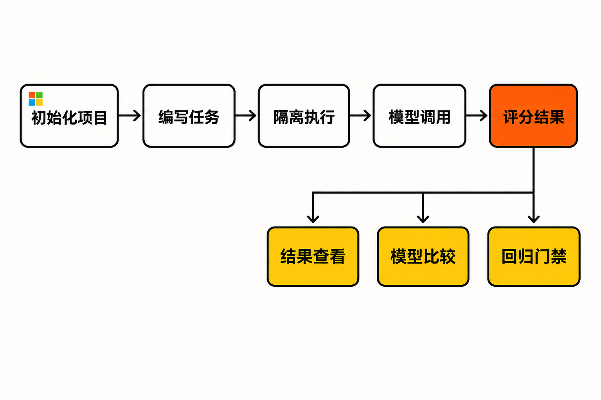

一个 Agent Skill 在演示里正确触发，并不等于它已经可靠。

换一个模型，它还会被调用吗？面对表达方式不同的任务，输出是否仍然合格？工具名称调用正确，但参数错了，评测能否识别？一次修改节省了 Token，还是以降低通过率为代价？

如果团队仍靠人工对话、截图和零散脚本回答这些问题，Skill 开发很容易停留在“看起来能用”。微软开源的 Waza，瞄准的正是这段从演示走向可重复评测的距离。


## 30 秒认识项目

- **一句话定位：**用于创建、测试和评估 AI Agent Skills 的开源 CLI 与框架，把执行、评分、比较和回归检测纳入同一工作流。
- **仓库地址：**[microsoft/waza](https://github.com/microsoft/waza)
- **许可证：**[MIT License](https://github.com/microsoft/waza/blob/main/LICENSE)，版权方为 Microsoft Corporation。
- **主要语言：**Go；仓库还包含 React 前端和 Astro 文档站。来源未提供可靠的语言占比，因此不写具体百分比。
- **版本与活跃度：**截至 **2026 年 8 月 12 日 08:07（UTC+8）**，最新独立 CLI Release 为 v0.38.5；仓库页面显示约 1.2k Stars、72 Forks、7 个开放 Issue、22 个 Pull Request、832 次提交。最近一次 main 分支提交和最新 Release 均在 2026 年 8 月 7 日。[Release 页面](https://github.com/microsoft/waza/releases)与[提交记录](https://github.com/microsoft/waza/commits/main/)显示项目近期持续迭代。

以上数字只能说明关注度和近期维护活动，不能直接证明软件质量、稳定性或长期维护承诺。

## 它解决的不是“写 Skill”，而是“证明 Skill 有效”

官方文档归纳了 Agent Skill 开发中的几类缺口：缺少一致的规范检查、触发测试、跨模型评测，以及 Token 预算约束工具。Waza 尝试将项目初始化、Skill 开发、真实执行、评分和结果分析放进一套命令体系。[官方 About 页面](https://microsoft.github.io/waza/about/)将其设计原则概括为临时隔离工作区、可插拔验证器、跨模型支持、本地优先和可观测性。

常见替代方式通常有三类：人工反复聊天、团队自建评测脚本，或只在 CI 中进行格式检查。它们并非无效，但关注层次不同：人工测试适合探索，却难以稳定复现；自建脚本灵活，却要自行维护任务组织、评分、缓存和报告；静态检查能发现结构问题，却不能回答 Skill 在真实模型执行中表现如何。

**事实：**Waza 同时提供 `init`、`new`、`check`、`run`、`grade`、`compare` 和 `gate` 等命令，并包含执行器、grader、Web Dashboard、Schema 与 CI 工作流。

**推断：**它最有价值的场景不是替代所有定制评测平台，而是为尚未形成统一评测基础设施的团队提供标准起点。

## 四项核心能力，价值分别在哪里

### 1. 把评测变成可以版本管理的工程资产

`waza init` 会生成 `skills`、`evals`、GitHub Actions 工作流和 `.gitignore` 等结构；评测配置通常由 `evals/{skill-name}/eval.yaml` 引用 `tasks/*.yaml`。[入门文档](https://microsoft.github.io/waza/getting-started/)给出了这条项目组织路径。

实际价值在于：Skill、任务和 CI 配置能够随代码共同评审。团队讨论的对象不再只是“这次回答不错”，而是可追踪的任务定义与通过条件。

### 2. 将真实模型执行与评分串起来

Waza 不只做静态合规检查，还能运行评测任务，再由 grader 判断结果。其能力面包括多轮与并行测试、评测缓存、快照回放、对抗测试和 MCP mock。

这使团队能够分别观察“模型是否执行了任务”与“结果是否满足要求”。不过评分器本身仍是测试设计的一部分；一个过于宽松或错误的 grader，不会因为接入框架就自动变得可信。

### 3. 比较模型与版本，设置回归门禁

`compare` 和 `gate` 对应两个实际问题：不同模型在同一组任务上的差异，以及新版本是否跌破团队设定的基线。跨模型支持也属于官方列出的设计方向。

**观点：**这比单看一次总通过率更重要。Skill 的变化可能同时影响成功率、Token 使用与执行成本，只有固定任务集上的连续比较，才更接近工程意义上的质量管理。

### 4. 让失败过程可追踪，而非只留下红叉

项目提供本地 Web Dashboard，`waza serve` 可启动仪表盘。官方 Dashboard 文档称其能够查看任务通过状态、模型、Token、成本和时间线。项目也支持 OpenTelemetry。

实际价值是把失败定位从“任务未通过”推进到“在哪一步、以何种工具调用或资源消耗失败”。但来源没有提供可核验的官方界面截图，因此本文不把第三方图片或普通 GitHub 图标冒充产品截图。

## 工作流程：从 Skill 到回归结论

依据官方命令与目录说明，Waza 的主流程可以概括为：先创建项目和 Skill，再编写评测任务；运行时为每个任务准备新的临时工作区，由执行器调用模型或相关工具；grader 根据预期条件评分，结果随后用于查看、比较或 CI 门禁。



这里需要谨慎区分：上述流程由现有文档支持；具体执行器内部策略、调度细节以及路线图中的未交付能力，不能在缺少材料时进一步推演。

## 安装与最小使用路径

官方推荐预编译二进制。macOS、Linux 或使用 Bash 的 Windows 环境可执行：

```bash
curl -fsSL https://raw.githubusercontent.com/microsoft/waza/main/install.sh | bash
```

原生 Windows PowerShell：

```powershell
irm https://raw.githubusercontent.com/microsoft/waza/main/install.ps1 | iex
```

随后按官方快速入门流程创建项目：

```bash
waza init my-project
cd my-project
waza new skill my-skill
```

在生成的 `skills` 与 `evals` 目录中补充 `SKILL.md` 和评测任务后，执行：

```bash
waza run my-skill
waza check my-skill
```

这些命令均来自[仓库 README](https://github.com/microsoft/waza/blob/main/README.md)与官方入门文档。任务 YAML 的具体内容会取决于 Skill，因此不在缺少官方完整样例的情况下虚构字段。

源码构建要求 Go 1.26+，还需执行 Git LFS 初始化与拉取，再运行 `go build -o waza ./cmd/waza`。README 明确说明，由于仓库使用 Git LFS 保存嵌入式 Copilot CLI 相关产物，不能直接通过 `go install` 安装。

## 优点、限制与成熟度

Waza 的明显优点是工作流完整：单一 Go 二进制覆盖跨平台分发，又把脚手架、执行、评分、对比、门禁和结果查看连接起来；MIT 许可也为修改和集成提供了宽松条件。

但它并不是“零依赖、零风险”的本地测试器。`copilot-sdk` 执行器会使用随 Waza 打包的 GitHub Copilot CLI，并在首次使用时解压到用户缓存；真实评测仍可能涉及外部服务、凭据、模型费用和数据边界。运行包含敏感内容的任务前，需要审查模型权限和测试数据。

网络暴露也要谨慎：`waza serve` 的 JSON-RPC TCP 模式默认只绑定回环地址，而允许远程绑定的选项被官方明确标注为**无身份验证**。不应未经隔离就暴露在不可信网络中。

项目仍处于 0.x 版本。近期连续发布说明维护活跃，却也意味着接口和行为可能继续变化。一个有代表性的案例是：v0.38.4 的 `tool_calls` grader 在带 `args` 条件时可能读取错误字段，导致正确参数被判失败；[Issue #474](https://github.com/microsoft/waza/issues/474)给出了完整复现。问题已经在 v0.38.5 修复，因此不能把它描述成最新版仍存在的缺陷，但它提醒采用者：升级后也要用自己的基准任务验证 grader 行为。

此外，MIT 许可证明确按“原样”提供软件，不包含适用性担保。路线图中的进行中或计划项目，也不应被当成已交付能力。

## 谁适合用，谁不适合用

Waza 更适合正在开发 Agent Skills、希望建立可重复回归测试的个人与团队；也适合需要比较不同模型，或希望把质量门禁接入 GitHub Actions 的工程组织。对尚未搭建评测平台的团队，它尤其值得作为低成本起点。

它不太适合只想手工试几次提示词的轻量用户；不能接受外部模型、Copilot CLI 或凭据依赖的严格离线环境，也应先确认执行器边界。已经拥有成熟内部评测平台、复杂权限治理和定制统计体系的组织，则需要评估集成收益是否高于迁移成本。

## 结语：值得试，但要把它当作评测工具链，而非质量保证书

**结论：值得尝试。**理由不是 Star 数，也不是微软背书，而是 Waza 已经把 Agent Skill 评测中经常分散的环节组织成一条可运行、可进入 CI 的路径。

更稳妥的采用方式，是先选择少量非敏感任务建立基线，固定 Waza 版本，检查 grader 是否真正表达业务要求，再逐步加入跨模型比较和门禁。Waza 可以降低评测工程的启动成本，但最终决定结果是否可信的，仍然是任务覆盖、评分规则、权限控制和持续回归纪律。

## 参考资料

1. [microsoft/waza GitHub 仓库](https://github.com/microsoft/waza)
2. [Waza README](https://github.com/microsoft/waza/blob/main/README.md)
3. [Waza Getting Started](https://microsoft.github.io/waza/getting-started/)
4. [Waza About](https://microsoft.github.io/waza/about/)
5. [Waza Releases](https://github.com/microsoft/waza/releases)
6. [main 分支提交记录](https://github.com/microsoft/waza/commits/main/)
7. [MIT License](https://github.com/microsoft/waza/blob/main/LICENSE)
8. [Issue #474：tool_calls 参数评分问题](https://github.com/microsoft/waza/issues/474)
9. [Dashboard Explore 文档](https://microsoft.github.io/waza/guides/dashboard-explore/)
