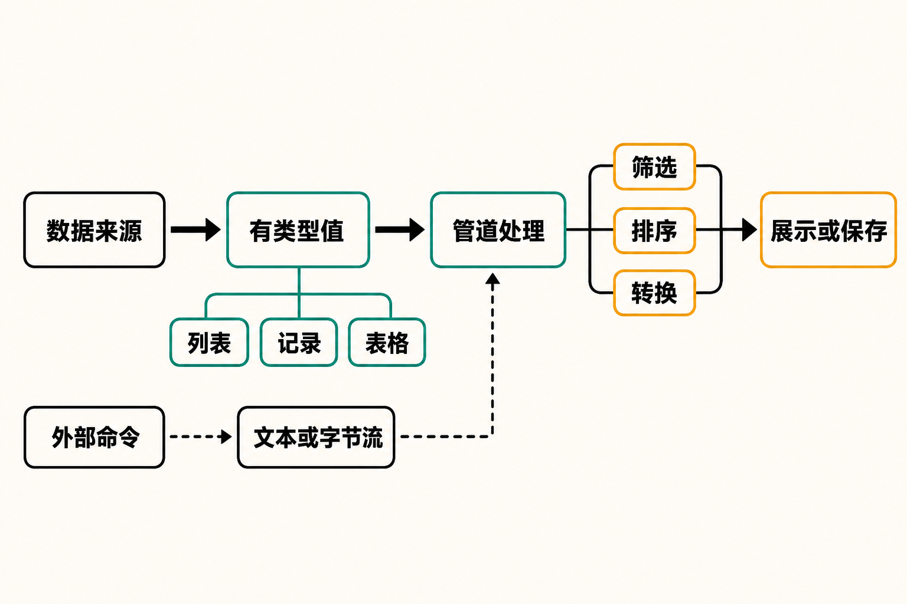

你想从当前目录找出所有文件夹。在传统 Shell 中，`ls` 的输出首先是给人看的文本；一旦要筛选、排序或继续交给脚本，往往需要 `grep`、`awk`、`cut` 等工具重新识别其中的列。输出格式、空格甚至本地化设置发生变化，都可能让解析逻辑失效。

如果面对的是 JSON、Excel、SQLite 查询结果或 Web API，问题会更明显：数据本来有字段和类型，进入命令行后却常被压成字符串，随后再被解析一次。

Nushell 想改变的正是这一层。它保留 Unix 管道“让小工具协同工作”的思想，但让管道传递列表、记录、表格等有类型的数据，而不只是文本。[官方 Book](https://www.nushell.sh/book/)将它同时定义为 Shell 和编程语言。这不是给 Bash 换一套外观，而是重新设计命令行中的数据模型。

## 30 秒认识项目

- **一句话定位：**以结构化数据为核心、跨平台运行的 Shell 与编程语言
- **仓库地址：**[github.com/nushell/nushell](https://github.com/nushell/nushell)
- **许可证：**MIT
- **主要语言：**Rust；仓库采用 Cargo workspace，但来源没有可靠语言占比，本文不作比例推断
- **平台：**Linux、macOS、BSD 与 Windows
- **最新正式版本：**0.115.0，发布页显示于 2026 年 8 月 15 日发布
- **关注度快照：**约 40.3k Stars、2.2k Forks、206 Watchers
- **数据核实时间：**2026 年 8 月 16 日 08:15（UTC+8）

上述仓库数字与版本都属于动态数据。[GitHub 仓库](https://github.com/nushell/nushell)的 Stars 只能反映关注度，不能直接证明可靠性；更有意义的活跃信号是，[发布页](https://github.com/nushell/nushell/releases)在 2026 年 7 月至 8 月间连续列出 0.114.0、0.114.1 和 0.115.0。不过，发布频率同样不等于稳定性。


## 它解决的不是“命令太少”，而是数据反复丢失结构

传统 Unix Shell 的优势是生态庞大、POSIX 习惯成熟、几乎无处不在。但多数管道围绕文本组织：前一条命令负责打印，后一条命令再猜测其格式。Nushell 的内置命令则尽量输出有字段、有类型的值，后续命令可以直接按列筛选和转换。

它与 Bash、zsh 的核心差异因此不在提示符，而在管道语义。Bash 更适合调用既有 Unix 工具和运行传统脚本；Nushell 更强调让数据结构贯穿加载、变换和保存过程。

它也容易让人想到 PowerShell。官方资料明确表示其设计参考了 PowerShell，同时还吸收传统 Shell、TypeScript、函数式编程和系统编程的经验。基于这些事实，可以作出一个**推断**：Nushell 与 PowerShell 都在反思纯文本管道，但 Nushell 选择了独立语言、Rust 实现和一致的跨平台体验，并不是 PowerShell 的语法复刻。

## 四项核心能力，价值在哪里

### 1. 结构化管道：少写脆弱的文本解析

在 Nushell 中，`ls` 可以产生带 `name`、`type` 等字段的表格，`where` 直接按字段过滤。实际价值是，脚本表达的是“选择目录”，而不是“从若干字符中猜出目录”。这让简单的数据处理更接近数据库查询或表格操作。

但边界也要说清楚：外部程序仍可能输出普通文本或字节流，Nushell 不可能自动理解所有第三方命令的格式。结构化优势在其内置命令和已被正确解析的数据上最明显。

### 2. 多种数据源进入同一套操作方式

[项目官网](https://www.nushell.sh/)列出 JSON、YAML、SQLite、Excel、文件、数据库和 Web API 等数据来源。它们进入 Nu 后，可继续使用统一的选择、过滤、排序和转换命令。

真正的价值不是“支持格式多”，而是减少工具切换：查看目录、检查接口返回值和整理表格数据，可以沿用相近的数据操作思路。对经常写一次性运维脚本或数据清洗命令的人，这比记住多套专用语法更重要。

### 3. 类型与错误诊断：让问题更早暴露

官网展示了类型错误诊断，强调失败时指出位置和原因。有类型数据意味着数字、字符串、记录和列表不必都伪装成文本。由此可以**合理推断**，一部分字段拼错或类型不匹配的问题能够在管道更前面被发现，而不是在很长的流水线末端表现为错误结果。

这不代表脚本会自动正确；数据缺失、外部命令异常和业务逻辑错误仍需处理。类型系统降低的是一类错误的隐蔽性，而不是全部风险。

### 4. Shell 之外还有脚本、模块和插件

官方 Book 覆盖脚本、模块、控制流、测试、并行和插件；官网也说明插件可扩展命令能力。因此 Nushell 不只适合交互式查询，也试图承接可复用自动化任务。

这项能力的现实意义是：用户可以从一条管道开始，再逐步整理成函数、模块或插件。但插件也扩大了依赖与兼容性管理范围；官方安装文档特别提醒，通过 Cargo 安装时，默认插件需要另外安装。

## 一条命令在 Nu 中怎样流动

根据 README 与官方 Book，能够确定的流程是：命令或数据源先产生值，值以字符串、列表、记录或表格等形式进入管道；中间命令加载、筛选、排序或转换；结果再展示或保存。



以目录查询为例，`ls` 不是先打印一段等待拆分的文字，而是输出结构化表格；`where` 读取其中的 `type` 字段，仅保留目录；终端最后负责把结果渲染成可读表格。

需要避免把这幅逻辑流程图误解为完整内部架构。现有来源能支持数据如何经过管道，却不足以严谨描述解析器、执行引擎或插件协议的全部内部模块，本文不进一步推演。

## 安装与最小示例

以下命令均来自[官方安装文档](https://www.nushell.sh/book/installation.html)。macOS 或已安装 Homebrew 的 Linux 可执行：

```bash
brew install nushell
nu
```

Windows 可使用：

```powershell
winget install nushell
nu
```

已有 Rust 工具链的用户也可执行：

```bash
cargo install nu --locked
nu
```

进入 Nu 后，用官方 Book 给出的最小示例筛选当前目录中的文件夹：

```nu
ls | where type == dir
```

这里的关键不是命令更短，而是 `where` 读取真实字段。配置文件位置可在 Nu 中查询：

```nu
$nu.config-path
```

如需可复现环境，官方还给出容器模板：

```bash
docker run -it --rm ghcr.io/nushell/nushell:<version>-<distro>
```

其中 `<version>` 与 `<distro>` 必须替换为实际标签，不能原样执行。

## 优点、限制与成熟度

Nushell 的优点相当明确：结构化管道降低文本解析负担；同一套数据操作覆盖多种来源；跨平台设计减少系统之间的体验差异；类型与错误信息提高复杂管道的可读性；脚本和插件又为进一步自动化留出空间。

限制同样是设计的一部分。首先，[默认 Shell 文档](https://www.nushell.sh/book/default_shell.html)明确说明 Nushell **不以 POSIX 兼容为目标**。Bash、zsh 脚本及配置不能假定可直接运行，依赖 POSIX 登录 Shell 的程序也可能出现问题。稳妥做法是先将 Nu 作为终端中的可选 Shell，而不是立刻修改系统登录 Shell。

其次，结构化管道没有消灭传统输出流。一个已关闭的[社区 Issue](https://github.com/nushell/nushell/issues/18203)记录了 `o>`、`e>`、`e+o>` 等标准输出和错误输出重定向写法的可发现性问题。这项讨论不能代表官方承诺，但能说明外部命令、字节流和错误流仍有专门语义，学习成本并未归零。

成熟度方面，仓库 README 称项目已达到 MVP 水平，并被部分用户日常使用；同时明确提醒，某些命令仍可能不稳定，设计也会继续变化。结合持续发布记录，较准确的判断是：它不是停留在概念展示阶段的玩具，但也不应被当成完全冻结、兼容性永久不变的基础设施。

潜在风险主要有三类：语言和配置迁移成本；版本演进带来的脚本兼容风险；将其设为登录 Shell 后对既有工具链的影响。正式用于团队自动化前，应固定版本、保留传统 Shell 入口，并在目标平台验证外部命令行为。

## 谁适合尝试，谁不必急着迁移

Nushell 适合经常处理 JSON、表格、API 返回值和文件清单的开发者，也适合愿意学习新语言模型、希望在 Windows、macOS 与 Linux 间获得更一致体验的人。对数据工程、运维探索和个人效率工具而言，它尤其值得作为第二 Shell 试用。

如果团队高度依赖 POSIX 脚本、生产环境只提供 Bash，或者首要目标是零迁移成本与长期语法稳定，那么 Nushell 暂时不适合直接替代现有默认 Shell。偶尔运行几条系统命令的普通用户，也未必能收回学习成本。

## 结语

**本文观点：值得尝试，但更适合从“第二 Shell”开始。** Nushell 最有价值之处不是命令数量，也不是 GitHub 热度，而是把管道里的数据从“等待再次解析的字符串”恢复为带字段和类型的值。这一改变足以改善许多日常任务，却也要求用户接受非 POSIX 语法和仍在演进的生态。

先用 `ls | where type == dir` 体验它的数据模型，再尝试 JSON 或 API 数据；等现有脚本、插件和外部程序都验证无误后，再考虑扩大使用范围。这比因为新鲜感直接替换登录 Shell更符合它目前的成熟度。

## 参考资料

1. [GitHub：nushell/nushell](https://github.com/nushell/nushell)
2. [Nushell README](https://raw.githubusercontent.com/nushell/nushell/main/README.md)
3. [Nushell Book：Introduction](https://www.nushell.sh/book/)
4. [Nushell Book：Installing Nu](https://www.nushell.sh/book/installation.html)
5. [GitHub：Nushell Releases](https://github.com/nushell/nushell/releases)
6. [Nushell 官方网站](https://www.nushell.sh/)
7. [Nushell Book：Default Shell](https://www.nushell.sh/book/default_shell.html)
8. [GitHub Issue #18203](https://github.com/nushell/nushell/issues/18203)
