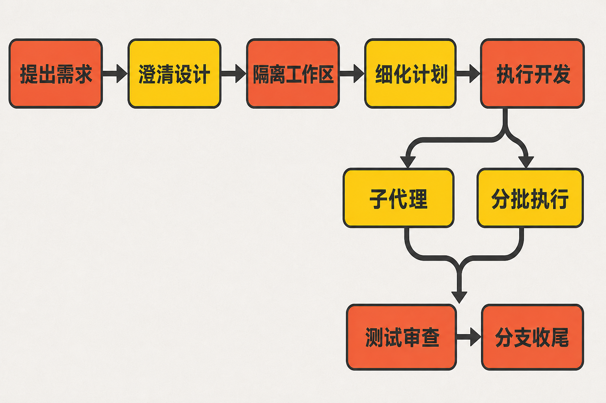

# Superpowers 深度解析：给编程智能体装上一条“软件工程流水线”

你让编程智能体“给后台增加一个导出按钮”。几分钟后，它已经改了十几个文件——但导出格式没有确认，原有测试没有运行，代码还直接写进了当前分支。等你发现需求理解错了，返工成本可能比自己写更高。

这类问题并不完全来自模型不会写代码，而是模型太容易跳过软件工程过程：尚未澄清就实现，尚未验证就宣布完成，遇到测试失败便凭直觉反复修改。

开源项目 [obra/superpowers](https://github.com/obra/superpowers) 瞄准的正是这段缺口。它不提供新的大模型，也不是一款独立 IDE，而是把一套开发纪律封装成可组合技能，交给 Claude Code、Codex、OpenCode、Cursor、Gemini CLI 等编程智能体执行。

## 30 秒认识项目

| 项目 | 信息 |
|---|---|
| 一句话定位 | 面向编程智能体的软件开发方法论与技能框架 |
| 仓库 | [github.com/obra/superpowers](https://github.com/obra/superpowers) |
| 许可证 | MIT |
| 主要语言 | Shell；另含 JavaScript、Python、HTML 等适配及测试代码 |
| 最新正式版 | v6.2.0，版本说明日期为 2026 年 7 月 23 日 |
| 活跃度 | 约 680 次提交、约 24k Fork、约 149—150 个开放 Issue；最后可见提交为 2026 年 7 月 28 日 |
| 数据核实时间 | 2026 年 8 月 9 日 08:26（UTC+8） |

Star 数需要格外谨慎：GitHub 动态页面在资料采集时没有稳定显示精确值；搜索引擎约三周前的快照约为 255k Star、22.8k Fork。因此本文不把它当成实时数据，更不把 Star 数等同于工程质量。


## 它解决的不是“不会生成代码”，而是“不会守流程”

常见的智能体使用方式，是给出一句自然语言指令，然后让模型自主修改仓库。优势是快，问题是过程很难预测。另一种办法是团队自己维护提示词、检查清单和脚本，但这些规则往往散落在文档里，是否执行仍取决于当次对话。

Superpowers 的差异，是把开发过程拆成具有触发条件和操作要求的技能：先澄清需求并确认设计，再建立隔离工作区、编写细粒度计划、逐项实施、测试和审查，最后处理分支。项目 README 因而把它定义为一套“完整的软件开发方法论”，而不只是提示词合集。[官方仓库](https://github.com/obra/superpowers)

事实层面，它提供的是 Markdown 技能、启动指令以及不同宿主的适配层。由此可以作出一个合理推断：它真正增加的不是模型知识，而是模型行动的约束和可检查性。编辑观点是，这种思路比继续堆叠一句“请认真测试”更接近真实软件团队的工作方式。

## 四项核心能力，价值都落在“减少失控”

### 1. 先把模糊需求变成经确认的设计

`brainstorming` 技能要求智能体在动手前探索用户意图、提出问题并呈现设计。实际价值是把最昂贵的错误——做出一个实现完整但方向错误的功能——尽量拦在代码产生之前。

对于界面、布局、配色或架构等视觉问题，项目还提供可选的浏览器视觉伴侣；服务端监视内容目录，把最新 HTML 呈现在浏览器中，并将点击选择写入独立状态目录。官方同时强调，API 权衡、文字需求等非视觉问题仍应留在终端讨论。[视觉伴侣文档](https://github.com/obra/superpowers/blob/main/skills/brainstorming/visual-companion.md)

### 2. 把大任务拆成可以验证的小步

设计确认后，工作流使用 Git worktree 创建隔离环境，再由 `writing-plans` 生成实施计划。计划不是一句“完成登录功能”，而是落实到文件、步骤、测试和预期结果。

这减少了智能体长时间执行后偏离目标的概率，也让人类可以在真正改代码前审阅路线。隔离工作树则降低未完成修改污染当前分支的风险。

### 3. 用 TDD 和系统化调试约束“凭感觉修复”

项目明确采用 RED—GREEN—REFACTOR：先写会失败的测试，确认失败，再写最小实现使其通过，最后重构。配套的系统化调试技能要求先寻找根因，而不是连续尝试未经验证的补丁。

它不能保证测试一定正确，也不能替代代码所有者判断；但它把“运行了什么验证、结果是什么”变成完成任务前必须面对的问题。其价值是提高过程可追溯性，而不是凭空提高模型智力。

### 4. 让实施、审查和修复形成闭环

计划可以交给子代理驱动开发，也可以按计划分批执行。实现后进入代码审查、问题修复和分支收尾。

[v6.2.0](https://github.com/obra/superpowers/releases/tag/v6.2.0) 将子代理开发状态按计划隔离到 `.superpowers/sdd/<plan-basename>/`，避免新计划误读旧进度；审查修复会恢复原实现代理，并设置最多五轮的熔断和控制器裁决。这里的意义不是“多代理一定更好”，而是长任务至少有了状态边界和停止条件。

## 工作原理：技能链，而不是黑盒代理

官方资料能够支持的主流程如下：

```text
用户提出需求
    ↓
需求澄清与设计确认（brainstorming）
    ↓
隔离工作区（using-git-worktrees）
    ↓
细化实施计划（writing-plans）
    ↓
子代理开发 / 分批执行
    ↓
测试驱动与系统化调试
    ↓
代码审查、完成前验证
    ↓
分支收尾
```



宿主负责对话、工具调用和技能发现，Superpowers 则提供技能内容及适配机制。以 OpenCode 为例，插件通过消息转换 hook 注入引导上下文，并通过 config hook 注册技能目录。[OpenCode 官方文档](https://github.com/obra/superpowers/blob/main/docs/README.opencode.md)

因此，它更像铺在模型与代码仓库之间的一条流程轨道。模型仍会犯错，轨道的作用是增加检查点、隔离区和回退机会。

## 可复制安装：以 OpenCode 为例

以下配置和验证语句均来自项目的 OpenCode 官方文档。

在 `opencode.json` 中加入：

```json
{
  "plugin": [
    "superpowers@git+https://github.com/obra/superpowers.git"
  ]
}
```

重启 OpenCode 后，发送最小验证提示：

```text
Tell me about your superpowers
```

若希望避免上游更新导致行为变化，可在地址末尾添加版本 tag；官方文档给出的示例形式是 `#v5.0.3`。具体采用哪个版本，应结合项目当前 Release 和兼容性决定，而不是机械复制旧 tag。

安装完成后，可以从一个真实需求开始：

```text
我想为现有项目增加一个功能。请先澄清需求并给出设计，不要立即修改代码。
```

相关技能会按宿主机制触发。需要注意，每个宿主必须分别安装；在 Codex 或 Claude Code 中安装，并不会自动让 OpenCode 获得插件。Claude Code 的官方安装命令则是：

```text
/plugin install superpowers@claude-plugins-official
```

## 优点、限制与成熟度

它的优点很明确：流程覆盖从需求到收尾；技能文本可读，便于审查其要求；支持多个主流编程智能体；MIT 许可证降低了研究和二次使用门槛。2026 年 6—7 月连续发布 v6.0.0 至 v6.2.0，且最新发布后仍有提交，说明近期维护频繁。[提交历史](https://github.com/obra/superpowers/commits/main)

但活跃不等于稳定。频繁发布、Windows hook、缓存、打包和宿主兼容性修复，也说明跨平台适配仍在演进。OpenCode/Bun 的锁文件或缓存可能导致重启后没有更新；部分 Windows 构建还可能遇到 git 路径或缓存问题。

第二个代价是上下文和流程开销。一位 Claude Code 用户报告，每个会话自动注入的 `using-superpowers` 内容约为 5.4KB、约 1300 tokens；这是 Issue 作者的测量，不是适用于所有宿主的官方基准。维护方关闭了改为纯手动加载的建议，后续版本压缩了 bootstrap，而 Codex 已因原生技能发现移除 SessionStart hook。[Issue #1456](https://github.com/obra/superpowers/issues/1456)

第三个限制是自定义扩展点。一个截至核验时仍开放的 enhancement Issue 指出，用户尚难在“计划执行后”“审查后”或“合并前”等固定节点插入团队专属技能。安全审查、合规检查等流程可能需要外部编排、个人插件或维护 fork；这属于用户报告的现状，不代表维护方已经承诺解决。[Issue #1566](https://github.com/obra/superpowers/issues/1566)

此外，可选视觉伴侣会从 Prime Radiant 网站加载带版本信息的徽标。README 提供 `SUPERPOWERS_DISABLE_TELEMETRY` 等关闭方式。对网络访问、隐私或供应链有严格要求的团队，应先审查相关脚本、远程依赖和宿主权限。

## 谁适合用，谁不适合用

它适合正在使用编程智能体完成多文件功能、重构或缺陷修复的开发者，也适合希望统一“先设计、再计划、后实现”纪律的小团队。尤其当返工成本高、任务持续时间长、需要测试和审查记录时，这套流程的价值更明显。

它不太适合一次性的微小修改、对 token 和响应时延极度敏感的任务，也不能直接满足已有复杂安全与合规流水线、却又不愿维护额外编排层的组织。如果现有团队已经通过 CI、代码所有者、模板和内部代理平台严密落实同类流程，新增一层技能框架的边际收益也可能有限。

## 结语：值得试，但应把它当流程工具

Superpowers 值得尝试，理由不是庞大的 Star 数，而是它对一个真实问题给出了结构化答案：编程智能体需要的不只是生成能力，还需要停下来提问、按计划执行、证明结果并接受审查。

建议从一个中等规模、测试边界清楚的非关键任务开始，固定版本，记录 token、耗时、返工和人工介入情况，再决定是否推广。把它当成“自动保证正确”的魔法会失望；把它当成一套可审阅的软件工程护栏，定位则更准确。

## 参考资料

1. [obra/superpowers 官方仓库](https://github.com/obra/superpowers)
2. [Superpowers v6.2.0 Release](https://github.com/obra/superpowers/releases/tag/v6.2.0)
3. [main 分支提交历史](https://github.com/obra/superpowers/commits/main)
4. [OpenCode 安装、使用与故障排查文档](https://github.com/obra/superpowers/blob/main/docs/README.opencode.md)
5. [Visual Companion Guide](https://github.com/obra/superpowers/blob/main/skills/brainstorming/visual-companion.md)
6. [Issue #1456：自动注入的上下文开销](https://github.com/obra/superpowers/issues/1456)
7. [Issue #951：Codex CLI 动态启停需求](https://github.com/obra/superpowers/issues/951)
8. [Issue #1566：用户自定义生命周期扩展点](https://github.com/obra/superpowers/issues/1566)
