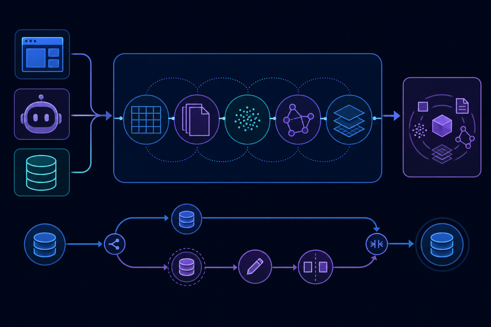
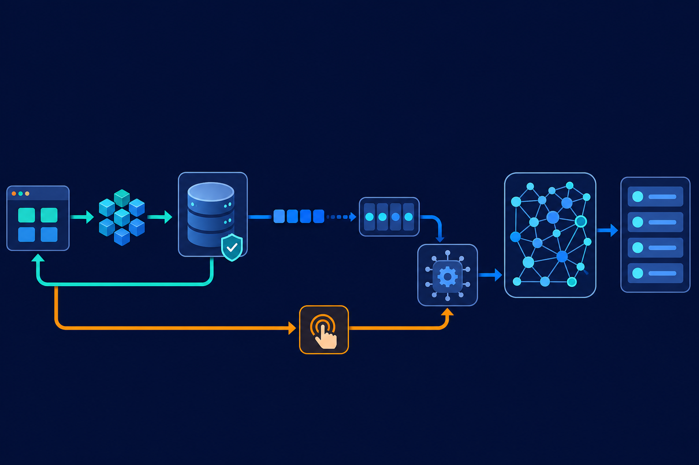

一个企业知识助手要回答“找出华东区、价格低于预算、且与故障描述最相关的设备记录”，背后可能同时查询业务数据库、向量库和全文搜索引擎。团队不仅要同步多份数据，还要处理事务边界、权限以及检索结果不一致的问题。如果 Agent 还要尝试修改数据，开发者又得增加隔离环境和回滚机制。

[oceanbase/seekdb](https://github.com/oceanbase/seekdb) 想解决的，正是这种 AI 应用数据栈碎片化问题：把关系数据、向量、全文、JSON 和 GIS 放进同一个数据库，以 SQL 或统一 API 完成存储与检索，并通过数据库分支支持 Agent 的隔离试错。

这不是简单地给传统数据库贴上“AI”标签，也不是只有向量检索的轻量组件。它更值得关注的地方，是试图把搜索、事务和 Agent 状态管理放到同一套数据底座里。

## 30 秒认识项目

- **一句话定位：** 面向 AI 应用与 Agent 的多模态搜索数据库，在统一引擎中提供关系处理、向量检索、全文搜索和事务能力。
- **仓库：** [github.com/oceanbase/seekdb](https://github.com/oceanbase/seekdb)
- **许可证：** Apache License 2.0
- **主要语言：** C++
- **最新正式版本：** V1.3.0，发布于 2026 年 5 月 25 日。[版本记录](https://github.com/oceanbase/seekdb/releases)
- **活跃度：** 截至 2026 年 7 月 31 日 11:46（北京时间），仓库约有 2.9k Stars、309 Forks、17 Watchers；GitHub 导航显示约 337 个 Issues、108 个 Pull Requests。以上均为动态数据，只能说明关注和协作活动，不能证明生产成熟度。

## 它解决的不是“能否搜索”，而是数据链路过长

常见 AI 检索系统会组合关系数据库、专用向量库、全文搜索服务和模型调用层。每个组件都可能足够成熟，但组合之后会产生新的工程成本：数据需要复制和同步；多路检索结果需要融合；一次业务操作可能跨越不同事务边界；本地原型与服务化部署还可能使用两套基础设施。

seekdb 的选择是单引擎路线。官方能力矩阵覆盖关系型数据、向量、全文、JSON、GIS及相应索引，并支持混合搜索和库内 AI 函数；部署上同时提供进程内嵌入式模式和客户端/服务器模式。[官方概览](http://www.oceanbase.ai/docs/seekdb-overview/)

**事实：** seekdb 能在同一条 SQL 中组合全文匹配、标量过滤和向量距离排序，并使用 MySQL 协议连接。

**推断：** 对数据类型多、但不希望维护多套搜索基础设施的团队，这种统一路线有望减少同步任务与中间服务。

**观点：** 它的真正对手不只是某一款向量数据库，而是“关系库＋向量库＋搜索引擎”这一整套组合方案。统一引擎的优势是链路短；代价则是团队必须验证每项能力是否都能满足自己的规模、兼容性和稳定性要求。

## 四项核心能力，实际价值在哪里

### 1. 一条 SQL 完成混合检索

seekdb 可以先用标量条件限定业务范围，再做全文匹配，并以向量距离排序。实际价值在于：租户、时间、权限、价格等确定性条件，不必在向量召回后交给应用层二次筛选；关键词和语义信号也能在同一查询中组合。

这适合企业知识检索、商品搜索和 RAG 等场景，尤其适用于“语义相似”不能替代严格业务约束的任务。

### 2. 关系、向量与半结构化数据共存

项目支持关系数据、向量、全文、JSON 和 GIS。这样，文档的向量、正文、结构化属性和空间信息可以留在同一数据系统中，并由对应索引服务不同查询需求。

它的价值不在于数据类型清单有多长，而在于减少跨系统关联。例如，Agent 查到一段相似文本后，可以继续使用同一数据上下文读取业务字段，而不必依赖应用层拼接多份结果。

### 3. FORK 与 MERGE 提供数据库级沙箱

seekdb 提供 `FORK DATABASE`、`FORK TABLE` 和 `MERGE TABLE`，并以写时复制降低创建隔离副本的成本。对 Agent 而言，这意味着可以在分支中尝试修改、比较差异，再决定是否合并，而不是直接操作主数据。

**推断：** 这种机制可能适合代码 Agent、规划系统或需要“试做—检查—提交”的自动化流程。

**边界：** 来源确认了 FORK/MERGE 能力，但没有提供足以支撑普遍性能结论的测试条件，因此不能据此断言它在所有大规模场景中都比传统沙箱方案更快或更省资源。

### 4. 嵌入式起步，再连接远程服务

`pyseekdb` 可在进程内运行，不要求先启动独立数据库服务器；同一 SDK 也能连接远程 seekdb 或 OceanBase 服务。[Python 快速入门](http://docs.seekdb.ai/seekdb/pyseekdb-sdk-get-started/)

这为本地 AI/ML 原型提供了较低门槛，也保留了转向服务器部署的路径。不过，“接口连续”不等于生产迁移零成本，容量规划、权限、备份和升级仍需单独验证。

## 数据怎样流过 seekdb



来源能够确认的核心流程是：应用通过 SDK、MySQL 客户端或 SQL 接入；数据进入统一引擎并接受 ACID 事务管理；关系、全文、向量、JSON/GIS 等索引服务不同查询；查询层组合关键词、标量条件与向量距离；Agent 如需试写，则可在 FORK 出的数据库或表分支中操作，再通过 MERGE 合并。

V1.3.0 还改变了向量写入路径：默认的 `sync_mode=async` 使用 Change Stream 将事务写入与 HNSW 索引维护解耦。事务提交后，向量索引可以在后台刷新，因此最新数据未必立刻出现在近似向量检索结果中。要求写后立即可检索时，需要调用 `dbms_index_manager.refresh()`；SDK 对应提供 `Collection.refresh_index()`。[V1.3.0 Release](https://github.com/oceanbase/seekdb/releases)



这是一项明确的吞吐与新鲜度取舍，而不是可以忽略的实现细节。

## 安装与最小查询

最快的官方路径是 Python 嵌入式模式。当前文档要求 Python 3.11 或更高版本；支持 Linux、macOS、Windows及 x86_64、aarch64，Linux 还要求 glibc 2.28 或更高。

```bash
pip install -U pyseekdb
```

如果要阅读或编译内核，官方开发者指南给出的命令是：

```bash
git clone https://github.com/oceanbase/seekdb.git
cd seekdb
bash build.sh debug --init --make
```

部署单实例后，官方给出的最小连接方式为：

```bash
mysql -uroot -h127.0.0.1 -P10000
```

以下 SQL 体现官方 README 所确认的最小混合检索结构；表名、字段名、查询词和向量值需替换为自己的数据：

```sql
SELECT *
FROM documents
WHERE MATCH(content) AGAINST('database')
  AND category = 'technical'
ORDER BY l2_distance(embedding, '[0.1, 0.2, 0.3]') APPROXIMATE
LIMIT 10;
```

这里同时出现全文匹配、结构化过滤和向量距离排序。源码构建还依赖受支持的操作系统、GLIBC 与 C++ 工具链，若目的只是验证产品，预编译包或 `pyseekdb` 更直接。[构建指南](https://oceanbase.github.io/seekdb/build-and-run/)

## 优点、限制与成熟度

**优点：** 能力组合清晰；支持 ACID 事务和 MySQL 协议；混合检索减少应用层拼接；嵌入式与服务器部署覆盖从原型到服务的不同阶段；FORK/MERGE 对 Agent 隔离试错有明确价值。Apache 2.0 许可证也方便开发者评估和二次开发。

**限制：** V1.3.0 默认异步维护向量索引，必须设计写后可见性策略。更重要的是，官方明确说明 V1.0.x、V1.1.0、V1.2.0 都不能原地升级到 V1.3.0，只能借助 OBDUMPER/OBLOADER 或 `mysqldump` 做逻辑迁移。这会增加停机窗口、容量准备与回滚设计的复杂度。[更新日志](http://docs.seekdb.ai/seekdb/V1.1.0/changelog/)

**成熟度事实：** 项目在 2026 年 7 月仍持续处理编译、内存、协议、日志和索引相关问题。公开问题包括 macOS 编译缺少 curl 依赖、MySQL 握手包中的 autocommit 状态，以及删除租户时某向量索引路径的内存泄漏。[Issues 列表](https://github.com/oceanbase/seekdb/issues)

**风险判断：** 这些问题不能推出所有用户都会遇到故障，但说明跨平台构建、MySQL 边缘兼容及向量索引生命周期仍在打磨。再加上 Issue 创建受限，企业采用前应确认缺陷反馈渠道、升级方案、备份恢复和可观测性，而不是只看 Star 数或官方性能图。

## 适合谁，不适合谁

seekdb 适合希望快速验证 RAG、语义搜索、知识助手或 Agent 状态存储，并且同时需要结构化条件、全文与向量检索的团队；也适合愿意深入评估数据库内核、希望减少数据组件数量的开发者。

它不太适合只需简单键值存取、已经拥有成熟多引擎平台且迁移收益有限的组织，也不适合无法接受写后检索短暂延迟、逻辑迁移升级或仍在演进的兼容边界，却又不愿投入验证成本的关键业务。

## 结语：值得试，但要从真实查询开始

**观点结论：** seekdb 值得进入 AI 数据基础设施的候选名单。理由不是它同时拥有许多功能，而是它把混合检索、事务、嵌入式部署和 Agent 沙箱组织成了一条相对完整的路线。

但现阶段更稳妥的做法，是拿真实数据验证三件事：混合查询能否表达业务约束，异步索引的新鲜度是否可接受，升级与故障反馈流程是否符合生产要求。验证通过后，“少维护几套系统”才会成为实际收益；否则，统一引擎也可能只是把复杂性集中到了一个仍在快速演进的内核里。

## 参考资料

1. [oceanbase/seekdb GitHub 仓库](https://github.com/oceanbase/seekdb)
2. [seekdb Releases](https://github.com/oceanbase/seekdb/releases)
3. [seekdb Changelog](http://docs.seekdb.ai/seekdb/V1.1.0/changelog/)
4. [pyseekdb Quick Start](http://docs.seekdb.ai/seekdb/pyseekdb-sdk-get-started/)
5. [Get the code, build and run](https://oceanbase.github.io/seekdb/build-and-run/)
6. [What is seekdb](http://www.oceanbase.ai/docs/seekdb-overview/)
7. [seekdb Issues](https://github.com/oceanbase/seekdb/issues)
8. [seekdb 官方下载页](https://www.seekdb.ai/download)
