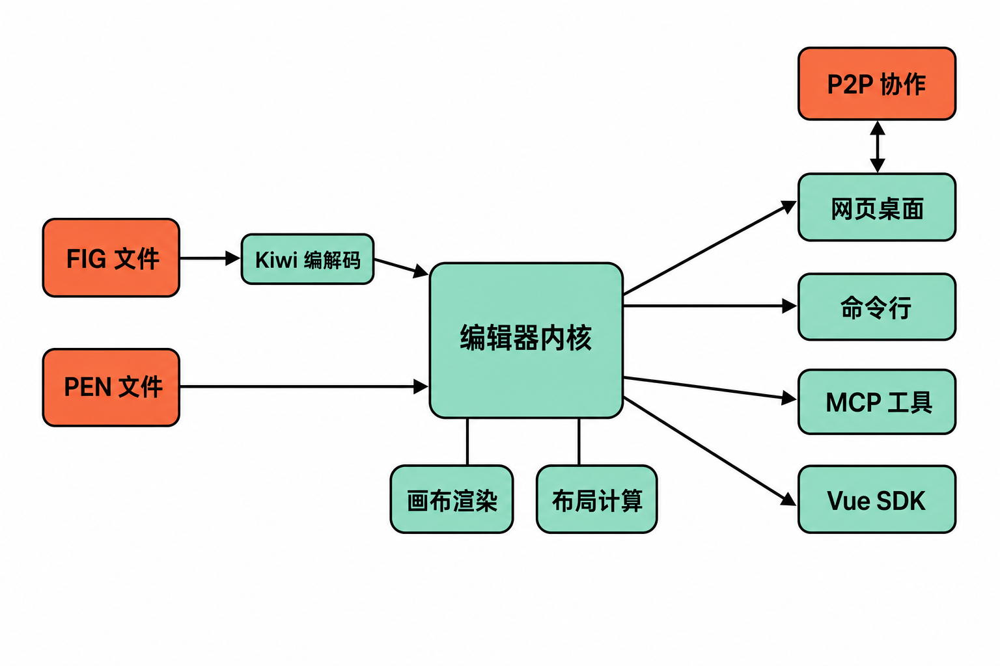

设计稿里有几十个页面，研发想批量找出所有文本节点；团队准备换一套设计令牌，需要先统计颜色和重复样式；AI 代理生成了一批界面，还要把结果写回设计文件。

在常见设计工具中，这些任务往往意味着安装插件、导出中间格式，或者反复进行人工操作。问题不只是“画图软件是否开源”，更在于设计文件能否像代码一样被查询、修改、检查和纳入自动化流程。

OpenPencil 瞄准的正是这个缺口。它既是一款能够打开设计文件的编辑器，也把文件编解码器、命令行工具、MCP 服务和编辑器 SDK 放进了同一个开源项目。不过，在讨论它能否成为 Figma 的替代品之前，更值得先理解：它真正不同的地方，是把“设计工具”变成了一套可编程基础设施。

## 30 秒认识项目

- **一句话定位：**可读写 `.fig` 与 `.pen` 文件、面向 AI 和自动化工作流的开源设计编辑器及工具包。
- **仓库地址：**[open-pencil/open-pencil](https://github.com/open-pencil/open-pencil)
- **许可证：**MIT，官方说明编辑器、引擎、文件编解码器和 CLI 均采用该许可证。
- **主要语言：**GitHub 将其归类为以 TypeScript 为主；项目还使用 Vue 3、Tailwind CSS 4、Skia/CanvasKit WASM、Yoga WASM、Tauri v2、WebRTC/Yjs，以及桌面端所需的 Rust。
- **最新版本：**v0.14.0，发布于 2026 年 8 月 11 日。
- **活跃度：**截至 **2026 年 8 月 12 日 10:56（北京时间）**，仓库约有 7.7k Stars、745 Forks、52 Watchers；8 月 10 日仍有多位贡献者提交修复，8 月 11 日发布了新版本。[Release 记录](https://github.com/open-pencil/open-pencil/releases)和[提交历史](https://github.com/open-pencil/open-pencil/commits/master/)比单独的 Star 数更能说明近期维护状态。

上述数字只是特定时点的快照。关注度不等于软件质量，更不能替代兼容性、稳定性和安全审查。


## 它要解决的，不只是“有没有开源 Figma”

OpenPencil 的直接定位是开源设计编辑器，但其问题意识可以拆成三层。

第一层是**文件控制权**。官方称项目可通过 Kiwi 二进制编解码器往返处理 `.fig` 文件，并支持与 Figma 复制粘贴。这意味着用户不必先把设计完全转换成另一种内部格式，至少在项目声明支持的范围内，可以继续围绕现有文件工作。[官方首页](https://openpencil.dev/)

第二层是**自动化接口**。传统可视化编辑器主要服务鼠标和键盘操作；OpenPencil 同时提供 CLI、Figma Plugin API、MCP 和 Vue SDK，让脚本、CI 系统及 AI 客户端也能参与设计文件的读写。

第三层是**部署与嵌入**。它既有网页应用和桌面程序，也允许开发者把无头编辑能力嵌入自己的 Vue 应用。因此，它与常见替代方案的差异并非单纯“免费对收费”，而是覆盖了编辑器、自动化工具和二次开发组件三个层面。

需要明确的是：把它概括成“设计领域的代码基础设施”是本文基于这些接口形态作出的**分析判断**，不是项目方给出的成熟度承诺。官方反而明确表示项目仍处于积极开发阶段，目前可用，但功能演进中仍有粗糙之处。

## 四项核心能力，实际价值在哪里

### 1. 直接处理 `.fig` 与 `.pen`

OpenPencil 能读取和写入 `.fig`、`.pen`，还支持跨应用复制节点。它的实际价值是降低迁移和试用成本：团队可以先拿现有设计文件验证兼容性，而不是先完成一次全面格式迁移。

但“支持格式”不应被理解为所有文件和效果都能百分之百还原。近期提交仍在处理 `.fig` 延迟填充、组件实例渲染、文本保存和字形轮廓等问题，这说明兼容层仍在持续完善。

### 2. CLI 把设计检查带进工程流程

官方 CLI 可以查看节点树、搜索文本节点、导出图片、分析颜色和重复模式，并支持 JSON 输出。对团队而言，这让设计检查不再局限于编辑器界面：脚本可以读取结构化结果，CI 也可以据此执行后续规则。

例如，批量寻找文本节点可用于内容盘点；分析颜色和重复模式可辅助整理设计令牌；导出命令则适合生成预览或构建产物。这里的关键词是“辅助”：来源没有证明它已经提供完整的企业级设计治理方案。

### 3. MCP 与 90 多项工具面向 AI 代理

OpenPencil 的 MCP 服务通过 stdio 和 HTTP 提供 90 多项工具，可供 Claude Code、Cursor、Windsurf 等客户端读写设计文件。[功能文档](https://openpencil.dev/guide/features)

相比只能生成一张效果图的模型，这套接口试图让 AI 操作真实的设计节点：查询对象、修改属性、检查结果，再继续下一步。其价值在于把代理接入可回溯的文件工作流，而不是停留在一次性图片生成。

这也带来新的风险：代理调用返回成功，不代表视觉结果一定完整。后文提到的 SVG 图元丢失问题，正说明自动化流程仍需增加结果校验。

### 4. SDK 让编辑器成为应用组件

项目提供框架无关的核心编辑器，以及 `@open-pencil/vue` 无头组件和组合式函数。开发者可创建编辑器实例，把它挂载到 canvas，再围绕自身业务构建界面。[SDK 入门文档](https://openpencil.dev/programmable/sdk/getting-started)

这使 OpenPencil 不只适合终端用户，也可能用于品牌素材编辑器、模板系统或内部设计工具。这里的“可能用于”属于**应用场景推断**；材料只证明 SDK 的分层与嵌入方式，并未提供这些场景的生产案例。

## 它如何工作：从文件到人、脚本与代理

依据官方材料，可以确认的流程是：`.fig` 文件由 Kiwi 编解码能力处理，`.pen` 也是原生读写对象；核心编辑器负责设计数据和画布能力；网页端、Tauri 桌面端、CLI、MCP 与 Vue SDK 从不同入口使用这些能力。

渲染相关技术包括 Skia/CanvasKit WASM，布局使用 Yoga WASM；桌面程序采用 Tauri v2。协作层则基于 WebRTC P2P 与 Yjs，提供实时光标、在线状态和跟随视图，并使用 IndexedDB 进行本地持久化。官方将其描述为无服务器的点对点协作，但来源没有给出复杂网络环境、大团队并发或长期会话的性能数据，因此不能据此推断其协作能力已经等同于成熟商业平台。



## 安装与最小使用示例

最快的体验路径是不安装软件，直接访问 `app.openpencil.dev`。官方也提供适用于 macOS Apple Silicon/Intel、Windows x64/ARM 和 Linux x64 的预编译桌面包；macOS 用户还可执行：

```bash
brew install openpencil
```

如果重点是自动分析设计文件，可以安装官方 CLI：

```bash
npm install -g @open-pencil/cli
```

随后使用官方示例命令查看节点树、寻找文本节点和导出 PNG：

```bash
openpencil tree design.fig
openpencil find design.pen --type TEXT
openpencil export design.fig -f png
```

希望从源码启动编辑器，则需要先安装 Bun：

```bash
git clone https://github.com/open-pencil/open-pencil.git
cd open-pencil
bun install
bun run dev
```

编辑器默认在 `http://localhost:1420` 打开。构建桌面应用还需要 Rust 与对应平台依赖。以上命令均来自[官方入门文档](https://openpencil.dev/guide/getting-started)或仓库 README。

## 优点、限制与成熟度

OpenPencil 当前最鲜明的优点，是把文件兼容、可视化编辑、CLI、AI 接口和嵌入式 SDK 放在一套 MIT 许可的代码中。桌面版无需账户、支持离线；P2P 协作减少了对中心协作服务的依赖。对希望审查代码、保留本地文件或探索设计自动化的团队，这些特征具有实际吸引力。

但它仍明显处于快速演进期。v0.14.0 对 Core SDK、Vue SDK、CLI 和 MCP SDK 都包含破坏性命名或导入路径变更。**事实是 API 发生了破坏性变化；由此判断集成方应锁定版本、先看迁移说明，是风险控制建议。**

一个更具体的边界来自公开的 [Issue #452](https://github.com/open-pencil/open-pencil/issues/452)：在 JSX/SVG 渲染中，`circle`、`ellipse`、`rect`、`line` 和 `polygon` 等非 `path` 图元可能被静默丢弃。复现案例输入四个元素，最终只输出一个节点，且没有警告。截至 2026 年 8 月 12 日，该 Issue 仍未关闭，也没有关联修复 PR。

在问题修复前，自动化流程可先把常用 SVG 图元转换为 path，并比较输入元素数和输出节点数。这是 Issue 中给出的临时规避思路，不代表正式修复。

Issues 列表还出现文件损坏、组件实例同步、RTL 文字、插件 API 缺口等报告，但每项都需要独立复现，不能推断所有用户都会遭遇。更稳妥的成熟度判断是：**它已经具备可操作的产品形态和活跃维护，但尚不适合未经验证便接管关键生产设计流程。**这是综合 Release、提交历史、官方状态说明与公开问题形成的编辑判断。

## 谁适合尝试，谁应谨慎

OpenPencil 适合三类人：希望研究 `.fig` 文件与设计自动化的开发者；需要用 CLI 或 AI 代理批量检查、修改设计的技术型设计团队；准备在自有产品中嵌入画布或设计编辑能力的 Vue 开发者。

它暂时不适合要求与现有商业设计平台完全等价、不能承受格式偏差的团队；不适合没有升级测试能力，却准备长期依赖当前 SDK API 的项目；也不适合把 AI 调用“成功”直接视为设计结果正确的无人值守流程。

## 结语：值得试，但先从副本和非关键流程开始

OpenPencil 值得尝试的原因，不是 7.7k Stars，也不是“开源 Figma”这个醒目标签，而是它把设计文件带入了 CLI、MCP、SDK 和自动检查能够触达的范围。这个方向一旦成立，设计稿就不再只是人工打开的画布，也可以成为工程系统中的可查询资产。

现阶段最合理的方式，是用文件副本验证 `.fig` 往返效果，从节点查询、批量导出或内部实验工具开始，并为 CLI、MCP 和 SDK 锁定版本。若结果需要进入生产，还应增加节点数量、视觉输出和关键属性校验。

结论是：**值得技术团队进行小范围试用，但还不宜在缺少回滚和验证机制的情况下替换关键设计工作流。**

## 参考资料

1. [GitHub：open-pencil/open-pencil 主仓库与 README](https://github.com/open-pencil/open-pencil)
2. [OpenPencil 官方首页](https://openpencil.dev/)
3. [OpenPencil：Getting Started](https://openpencil.dev/guide/getting-started)
4. [OpenPencil：Features](https://openpencil.dev/guide/features)
5. [OpenPencil：SDK Getting Started](https://openpencil.dev/programmable/sdk/getting-started)
6. [GitHub：OpenPencil Releases](https://github.com/open-pencil/open-pencil/releases)
7. [GitHub：master 分支提交历史](https://github.com/open-pencil/open-pencil/commits/master/)
8. [GitHub Issue #452：SVG 基本图元被静默丢弃](https://github.com/open-pencil/open-pencil/issues/452)
