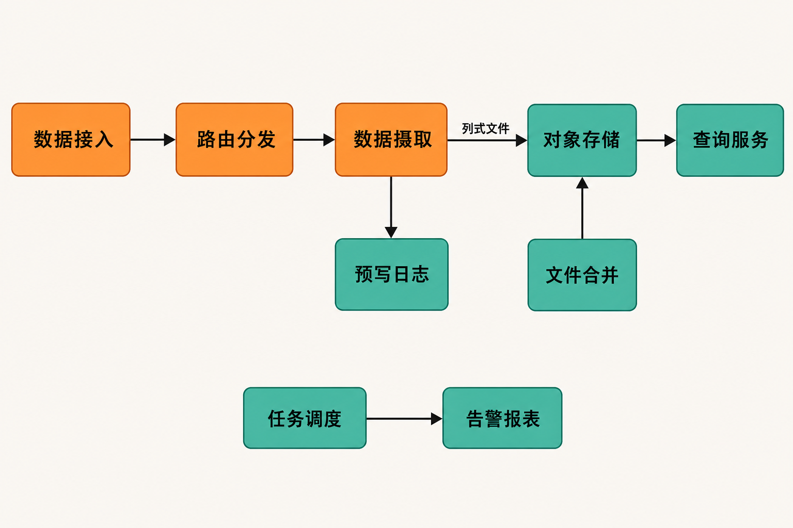

凌晨，线上接口延迟突然升高。值班工程师先在日志系统里找错误，再切到指标平台查看资源曲线，随后打开追踪系统定位慢调用；如果故障发生在浏览器端，还要去第四套工具查前端报错和用户会话。

真正消耗时间的，往往不是输入一条查询语句，而是在不同数据模型、账号和时间轴之间反复切换。OpenObserve 想解决的正是这个问题：把日志、指标、链路追踪以及前端观测集中到同一套平台，同时控制遥测数据的长期保存成本。

它不是给 Elasticsearch 换一层界面，也不只是“又一个日志搜索工具”。更准确地说，这是一个仍在快速演进、试图覆盖可观测性主要环节的开源统一后端。

## 30 秒认识项目

- **一句话定位**：面向日志、指标、追踪、真实用户监控（RUM）及 AI/LLM 场景的统一可观测性平台。
- **仓库地址**：[openobserve/openobserve](https://github.com/openobserve/openobserve)
- **许可证**：AGPL-3.0。
- **主要语言**：按仓库代码量统计，TypeScript 约占 37.8%，Rust 约占 28.1%，另有 Vue 和 JavaScript；后端以 Rust 构建，但不宜把整个仓库简单称为“纯 Rust 项目”。
- **活跃度**：截至 **2026 年 9 月 1 日**，仓库约有 19k Stars、1.1k Forks、540 余个未关闭 Issue 及 30 余个 Pull Request；2026 年 8 月下旬仍有多位贡献者持续提交。[提交记录](https://github.com/openobserve/openobserve/commits/main/)显示项目维护活跃，但这不等于缺陷少或接口稳定。
- **版本状态**：截至同日，GitHub 标记的最新版为 2026 年 8 月 28 日发布的 v1.0.0-rc1，它仍是候选版；最近稳定补丁版为 8 月 17 日发布的 v0.92.2。[发布记录](https://github.com/openobserve/openobserve/releases)

> Star 只能反映关注度，不能代替容量测试、故障演练和版本评估。

## 它解决的，不只是“日志放在哪里”

传统方案常按数据类型拆分：Elasticsearch 处理日志，Prometheus 保存指标，Jaeger 承接追踪，再叠加告警、仪表盘和前端监控工具。它们各自成熟，但团队也要承担多套存储、权限、升级和关联查询的成本。

OpenObserve 的差异在于两个方向。

第一是**统一**。官方列出的能力覆盖日志全文检索、SQL 分析、指标、PromQL、分布式追踪、RUM、会话回放、告警、仪表盘和摄取管道，并支持 OpenTelemetry 等数据入口。[官方仓库说明](https://github.com/openobserve/openobserve/blob/main/README.md?plain=1)

第二是**存储路径**。数据最终以 Parquet 列式文件写入本地磁盘或兼容 S3 的对象存储，而不是把昂贵的本地搜索节点当作唯一长期载体。项目方宣称，相较 Elasticsearch 最多可降低 140 倍存储成本，并以约四分之一硬件获得更好查询性能。这里必须明确：**这是厂商声明，不是独立基准结论**。真实结果会受到字段基数、查询跨度、索引、缓存和对象存储延迟影响。

编辑判断是：OpenObserve 最值得关注的不是“功能数量更多”，而是它尝试在统一体验与低成本留存之间建立新的平衡。代价则是，部分成熟专用工具的生态深度、运维经验和稳定边界未必能被立即复制。


## 四项核心能力，实际价值在哪里

### 1. 一处关联多类遥测数据

日志和追踪可使用 SQL，指标既支持 SQL，也支持 PromQL。对值班人员来说，价值不是少打开几个网页，而是能在相近的权限体系和时间范围中完成排障，降低跨系统对齐时间戳与标签的成本。

### 2. 将对象存储纳入核心架构

单节点可以使用 SQLite 加本地磁盘，也能组合 S3、GCS、MinIO 或 Azure Blob。对象存储带来耐久性与容量弹性，但读取延迟和外部依赖也会增加。它更适合需要保留大量历史遥测数据、又不要求所有数据始终驻留在高性能本地节点中的团队。

### 3. 从采集到告警形成闭环

系统不仅保存数据，还提供摄取转换管道、搜索、仪表盘、告警与报表调度。其实际意义是减少额外拼装服务。不过，“功能在同一平台”并不自动等于“每项能力都与专用产品一样成熟”，关键路径仍需单独验证。

### 4. 覆盖浏览器与 AI/LLM 场景

RUM、前端错误、会话回放及 AI/LLM 可观测性，让它不再局限于服务器日志。对于同时维护 Web 应用和后端服务的团队，这有利于把用户侧异常与服务端追踪放进统一调查路径。另一方面，公开 Issue 中仍能看到 RUM 与 trace 关联问题，因此采用方不能只核对功能列表。

## 数据如何流动

根据[官方架构文档](https://openobserve.ai/docs/architecture/)，高可用模式包含五类角色：Router 接收并路由请求；Ingester 先把在途数据写入 WAL 和内存表，再转换为 Parquet 并刷新至对象存储；Compactor 合并小文件并执行保留策略；Querier 负责查询；Scheduler 执行告警和报表任务。



单节点把这些能力收在一个实例内，适合试用或轻量负载。生产级 HA 则要求 Kubernetes/Helm、对象存储、PostgreSQL 和 NATS，而且遥测数据不能使用本地磁盘保存。由此可以推断：它能“一条命令启动”，但不能据此认为大规模生产部署也是单体运维。

## 从零启动：官方最小路径

下面命令来自[官方 README](https://github.com/openobserve/openobserve/blob/main/README.md?plain=1)，用于本地单节点体验。先把示例账号和密码改成自己的值：

```bash
docker run -v $PWD/data:/data \
  -e ZO_DATA_DIR="/data" \
  -p 5080:5080 \
  -e ZO_ROOT_USER_EMAIL="root@example.com" \
  -e ZO_ROOT_USER_PASSWORD="Complexpass#123" \
  public.ecr.aws/zinclabs/openobserve:latest
```

启动后访问：

```text
http://localhost:5080
```

按照[官方入门文档](https://openobserve.ai/docs/getting-started/)，自托管实例可通过 Basic Auth，向以下接口 POST JSON 数据：

```text
http://localhost:5080/api/default/default/_json
```

导入官方样例日志后，在 Logs 页面选择 `default` 流，可执行：

```sql
level='error'
```

也可以全文匹配：

```sql
match_all('error')
```

这些步骤只构成单节点验证，不是生产配置。正式使用还应固定镜像版本，避免长期跟随 `latest`，并另外完成持久化、备份、访问控制、容量压测与高可用设计。

## 优点、限制与风险

优点很清楚：覆盖面广；单节点进入门槛低；SQL、PromQL 和 Web UI 对常见运维习惯较友好；Parquet 加对象存储为海量历史数据提供了不同于传统本地索引集群的成本路径。

但限制同样具体。

其一，README 明确说明，已摄取数据不能原地修改或逐条删除，只能依照保留策略整段清除。这有利于日志完整性，却可能不满足需要精确删除个人数据或纠正敏感字段的治理场景。

其二，AGPL-3.0 允许商业使用，但通过网络提供修改版服务时可能产生源代码提供义务。具体影响应由采用方结合修改、分发及部署方式进行合规审查。

其三，HA 并不“轻”：Kubernetes、对象存储、PostgreSQL 与 NATS 都会进入故障域。统一产品减少了前台工具数量，却未必减少所有后台运维工作。

其四，项目处于快速迭代期。截至 2026 年 9 月 1 日，公开问题涉及滚动重启状态判断、RUM trace_id 关联、Datadog 仪表盘导入、自托管 OIDC/SSO 和告警历史等。[Issue 列表](https://github.com/openobserve/openobserve/issues)中的报告多数当时仍处于 Open 状态，它们不代表所有版本必然受影响，却足以提示团队按目标版本回归关键路径。

其五，老旧硬件可能存在指令集兼容问题。维护者曾建议以至少 2 核 CPU、4GB 内存作为起点，但强调不存在固定最低门槛；2009 年的 Xeon E5520 曾因缺少所需指令而出现 `Illegal instruction`。[相关讨论](https://github.com/openobserve/openobserve/discussions/4963) 这只是起步建议，不是容量保证。

## 谁适合尝试，谁应谨慎

它适合日志增长快、长期存储费用敏感，希望统一日志、指标、追踪和前端观测，又愿意投入时间验证新平台的中小型及平台工程团队。正在建设 OpenTelemetry 数据链路、希望先用单节点完成概念验证的团队，也有较低的试用门槛。

它不太适合要求产品接口长期冻结、没有 Kubernetes 与外部依赖运维能力，或必须对单条历史数据进行修改和精确删除的组织。如果团队已围绕 Elasticsearch、Prometheus、Jaeger 建立成熟流程，迁移收益也应以真实数据和查询负载计算，而不是依据项目方的最高倍数宣传。

## 结语

OpenObserve 提供了一个有吸引力的方向：用统一查询与产品体验减少可观测性工具割裂，再用 Parquet 和对象存储重新处理长期留存成本。它已经不是只能展示概念的玩具项目，但候选版本、公开缺陷、AGPL 义务及复杂的 HA 依赖，也说明它不能靠一条 Docker 命令直接跨入生产环境。

> **编辑结论：值得试，但应从旁路接入或非关键业务的概念验证开始。** 用自己的遥测数据比较摄取吞吐、常用查询延迟、对象存储费用和故障恢复，再决定是否替换现有系统。对基础设施项目而言，这些结果远比 Star 数更有说服力。

## 参考资料

1. [OpenObserve GitHub 仓库](https://github.com/openobserve/openobserve)
2. [OpenObserve 官方 README](https://github.com/openobserve/openobserve/blob/main/README.md?plain=1)
3. [官方入门文档](https://openobserve.ai/docs/getting-started/)
4. [官方架构与部署模式](https://openobserve.ai/docs/architecture/)
5. [GitHub Releases](https://github.com/openobserve/openobserve/releases)
6. [主分支提交记录](https://github.com/openobserve/openobserve/commits/main/)
7. [GitHub Issues](https://github.com/openobserve/openobserve/issues)
8. [最低系统要求讨论](https://github.com/openobserve/openobserve/discussions/4963)
