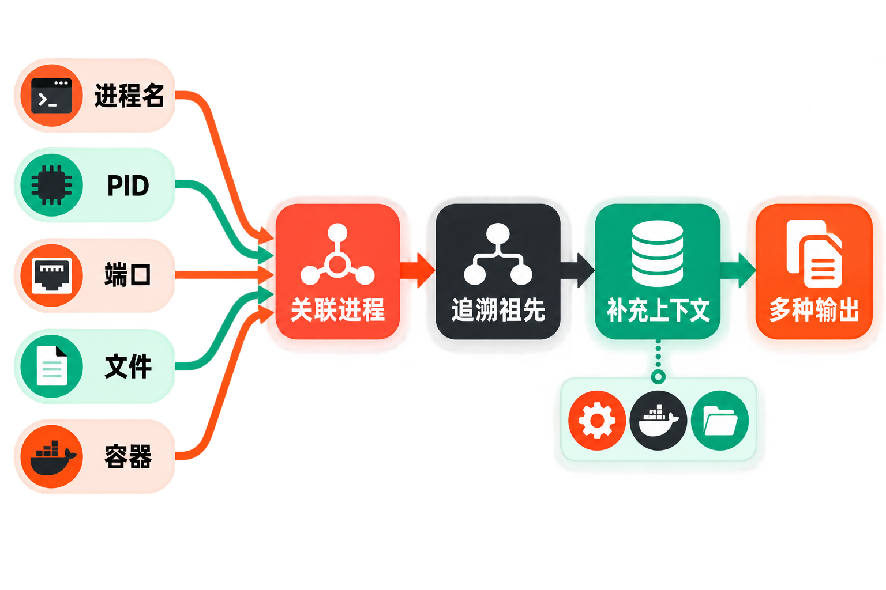

# witr 深度解析：把“谁启动了它”变成一条可读的因果链

凌晨发布服务后，5000 端口突然被占用。你用 `ss` 找到 PID，再用 `ps` 查看命令行，接着翻 `systemctl`，又怀疑它其实来自 Docker。每件工具都回答了一小部分问题，却没有直接说明：**这个进程究竟由谁启动，为什么还在运行？**

这正是系统排障中常见的断点。操作系统保存了进程、端口、服务和容器等信息，但它们散落在不同接口和命令里。人在压力下不得不手动拼接证据，既慢，也容易把“看到相关对象”误当成“找到了启动原因”。

开源项目 [witr](https://github.com/pranshuparmar/witr) 的名称来自“Why Is This Running?”。它试图把上述调查压缩为一次查询：从名称、PID、端口、文件或容器出发，找到关联进程，再向上追溯启动链及上下文。

## 30 秒认识项目

| 项目 | 已核实信息 |
|---|---|
| 一句话定位 | 解释进程、端口、文件占用或容器为何运行的跨平台 CLI/TUI |
| 仓库 | [pranshuparmar/witr](https://github.com/pranshuparmar/witr) |
| 主要语言 | Go |
| 许可证 | [Apache License 2.0](https://github.com/pranshuparmar/witr/blob/main/LICENSE) |
| 最新正式版 | [v0.3.3](https://github.com/pranshuparmar/witr/releases/tag/v0.3.3)，发布于 2026 年 6 月 24 日 |
| 活跃度 | 588 次提交、752 个 Fork、6 个开放 Issue、5 个开放 PR；最新可核实提交为 2026 年 8 月 8 日 |
| 数据核实时间 | 2026 年 8 月 21 日 08:32（北京时间） |

Star 数在本次打开的 GitHub 页面中未成功渲染，因此不引用第三方估算。即使数字可见，Star 和 Fork 也只能反映关注与传播，不能代替可靠性、安全性或生产适用性评估。


## 它补上的不是命令，而是解释层

`ps`、`top`、`lsof`、`ss`、`systemctl` 和 `docker ps` 都是成熟工具，却各自观察不同对象。witr 的差异不在于取代它们，而在于围绕一个问题组织信息：先确定目标对应哪个进程，再结合父子进程、服务管理器、容器运行时、工作目录和环境等线索，形成可读的启动来源说明。

**事实：**项目支持按进程名称、PID、端口、被占用文件和容器查询，也能显示祖先链。[官方 README](https://github.com/pranshuparmar/witr/blob/main/README.md) 将 Linux、macOS、Windows 和 FreeBSD 列为支持平台。

**推断：**这种统一入口最有价值的地方，是降低排障时的工具切换与上下文丢失；它并没有创造操作系统里不存在的因果证据。

**观点：**与其把 witr 理解成“更漂亮的 ps”，不如把它看作系统状态之上的解释器。传统命令适合精确取证，witr 更适合建立第一版问题地图，二者是互补关系。

## 五项核心能力，以及各自的实际价值

### 1. 从多种线索回到同一个进程

你不必预先知道 PID。`witr nginx` 可按名称查找，`witr --port 5432` 可从端口定位进程，`witr --file /var/lib/dpkg/lock` 可追踪文件占用，`witr --container redis` 则从容器入口调查。对用户而言，这意味着可以从“眼前看到的异常”开始，而不是先学习底层对象如何关联。

默认名称匹配可能产生多个结果；[CLI 文档](https://github.com/pranshuparmar/witr/blob/main/docs/cli/witr.md) 提供 `--exact` 来避免子串匹配歧义，也允许混用名称、PID 与端口，例如 `witr nginx --pid 1234 --port 8080`。

### 2. 把进程祖先关系变成启动线索

找到目标进程只是第一步。witr 会向上展示祖先链、启动来源和上下文；`--tree` 侧重完整祖先树，`--short` 则输出单行链路。实际价值在于快速判断目标是由交互式 shell、服务管理器、容器运行时，还是其他父进程拉起。

但这里必须强调边界：父子链是重要证据，不必然等于完整的业务因果。进程可能失去父进程，PID 也可能被回收复用；项目当前开放 Issue 已明确记录这些问题。

### 3. 同时服务于人和脚本

标准文本适合阅读，树形输出适合看关系，`--json` 可交给程序处理，`--no-color` 便于用于管道和 CI，`--verbose` 会增加内存、I/O、文件描述符等信息。换言之，它既能成为终端里的临时排障工具，也能作为自动化流程中的诊断数据源。

`witr --port 5000 --short` 是一个典型脚本化入口：输出紧凑，不需要解析整屏交互界面。不过，在把结果用于自动处置前，仍应校验权限缺失、目标退出及 PID 变化等异常情况。

### 4. 用 TUI 浏览持续变化的现场

不带参数或使用 `-i` 会进入交互式 TUI。界面包含 Processes、Ports、Containers、Locks 四个页签，支持筛选、排序和自动刷新；Unix 平台还能发送信号或调整进程优先级。

它的价值不只是“更好看”。当进程或端口不断变化时，持续刷新的统一界面能减少反复敲命令。不过，发送信号和修改优先级属于有副作用的操作，生产环境中应先确认目标身份与权限边界。

### 5. 将容器纳入同一调查路径

README 列出的容器环境包括 Docker、Podman、nerdctl、K8s/crictl、Incus、LXC、LXD 和 FreeBSD jails，并支持按名称、镜像、命令或 Compose 元数据匹配。它适合处理“宿主机看见一个进程，但人只知道容器名”这类断层。

这不意味着 witr 已经成为完整的容器可观测平台。开放 Issue 中仍有“更详细 Docker 服务信息”等功能请求，不能把尚未完成的设想当作现成功能。

## 它如何工作：从目标到解释

根据仓库说明，witr 的可确认流程可以概括为：

1. 接收进程名、PID、端口、文件或容器作为查询入口；
2. 将端口、文件占用和容器等对象映射到关联进程；
3. 沿父进程关系向上追溯祖先链；
4. 结合服务管理器、容器运行时、环境和工作目录等上下文；
5. 以文本、树形、短格式、JSON 或 TUI 呈现。



**推断：**这个流程本质上是“对象解析—关系追踪—上下文补充—结果呈现”。由于来源没有提供足以确认内部包级调用关系的详细架构说明，本文不进一步推演其代码模块或缓存机制。

## 安装与最小使用示例

官方文档给出的 Unix 快速安装方式是：

```bash
curl -fsSL https://raw.githubusercontent.com/pranshuparmar/witr/main/install.sh | bash
```

管道执行远程脚本虽然方便，但会直接运行网络内容；对生产机器或安全要求较高的环境，更稳妥的做法是先阅读脚本，或从 [v0.3.3 发布页](https://github.com/pranshuparmar/witr/releases/tag/v0.3.3) 选择对应资产并核对校验和。

若本机已有 Go，也可使用官方列出的命令：

```bash
go install github.com/pranshuparmar/witr/cmd/witr@latest
```

安装后验证：

```bash
witr --version
```

最小查询：

```bash
witr nginx
witr --pid 1234
witr --port 5432
witr --file /var/lib/dpkg/lock
witr --container redis
```

用于脚本的简短输出：

```bash
witr --port 5000 --short
```

以上命令均来自项目 README 或官方 CLI 文档。项目还提供 Homebrew、APT、Conda、Winget、NPM 和 Nix 等安装途径，并支持 Bash、Zsh、Fish 与 PowerShell 补全。

## 优点、限制与成熟度

优点很明确：查询入口统一；结果围绕“为何运行”组织；兼顾 CLI、TUI 与 JSON；覆盖四种操作系统和多类容器运行时；Apache 2.0 许可证也允许在满足版权、许可证文本和变更声明等条件下修改、分发及商业使用。

限制同样不能淡化。首先，各平台能力并不等价，Linux 功能最完整；Windows 的 Locks 页签和 Process Actions 不可用。其次，Linux/FreeBSD 的系统目录、macOS 的部分进程以及 Windows 的其他用户或系统服务可能需要提权；macOS 即使用 `sudo`，仍可能受 System Integrity Protection 限制。

更关键的是，[开放 Issue](https://github.com/pranshuparmar/witr/issues) 显示，Windows TUI 可能漏掉 TCP LISTEN 端口，“Toggle All”可能破坏界面；祖先遍历也需要更稳健地处理 PID 回收复用和失去父进程的情况。其中部分问题被列入 0.3.4 里程碑。因为祖先链正是项目的核心价值，这些不是无关紧要的界面瑕疵，而是采用前应针对目标平台验证的边界。

成熟度方面，最新正式版仍为 v0.3.3，而发布后 main 分支已有 39 次提交；最近一次可核实提交发生在 2026 年 8 月 8 日。[提交历史](https://github.com/pranshuparmar/witr/commits/main/) 表明项目仍在维护，但“持续开发”不等于“所有平台已经稳定”。生产部署应区分正式 Release 和尚未发布的 main 代码。

许可证也明确软件按“原样”提供、不附带保证。特别是在允许 TUI 发送信号、调整优先级或以高权限运行时，不应把开源许可证误解为安全背书。

## 适合谁，不适合谁

witr 适合经常排查端口冲突、残留服务、文件锁和容器进程的开发者、运维与 SRE；也适合希望给诊断脚本增加 JSON 数据源，或者还不熟悉多套系统命令、需要先建立调查路径的用户。

它不适合替代完整的日志、指标、链路追踪和审计系统；不适合把一次查询结果直接当作不可争辩的根因；也不适合未经目标平台验证便接入自动终止进程等高风险流程。Windows 用户尤其需要先评估当前端口页签问题，macOS 用户则要接受 SIP 带来的信息盲区。

## 结语：值得试，但要把它当作调查起点

**编辑结论：值得尝试。**理由不在于仓库热度，而在于它抓住了一个真实且高频的断点：系统能够展示状态，却很少主动解释状态之间的关系。witr 把多种入口收束到进程及其祖先链，能明显改善第一轮排障的组织方式。

但最恰当的使用姿势，是让它负责快速建立线索，再用原生命令、日志和平台工具复核关键结论。它已经是一把有明确用途的诊断工具，却还不是跨平台、无盲区的“根因裁判”。

## 参考资料

- [GitHub 仓库：pranshuparmar/witr](https://github.com/pranshuparmar/witr)
- [项目 README](https://github.com/pranshuparmar/witr/blob/main/README.md)
- [witr CLI 官方文档](https://github.com/pranshuparmar/witr/blob/main/docs/cli/witr.md)
- [Release v0.3.3](https://github.com/pranshuparmar/witr/releases/tag/v0.3.3)
- [main 分支提交历史](https://github.com/pranshuparmar/witr/commits/main/)
- [开放 Issues](https://github.com/pranshuparmar/witr/issues)
- [Apache License 2.0](https://github.com/pranshuparmar/witr/blob/main/LICENSE)
