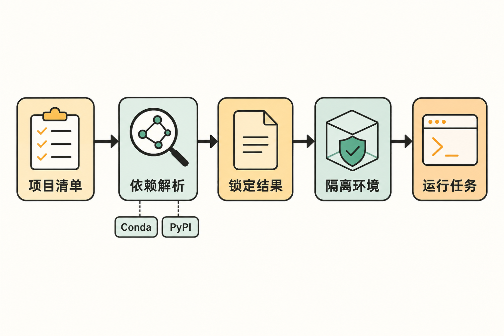

一个数据项目同时依赖 Python、某个 C/C++ 库和命令行工具。开发者在 macOS 上把环境调通，CI 跑在 Linux，另一位同事使用 Windows。此时，真正难管理的往往不只是 Python 包版本：系统级依赖从哪里安装、不同平台怎样解析、测试命令如何统一、环境能否准确重建，都会变成协作成本。

传统做法通常是把 Conda、pip、虚拟环境、Shell 脚本和 CI 配置拼接起来。每件工具都能解决一部分问题，但项目状态可能散落在多个文件和口头约定里。Pixi 的切入点，正是把这些环节收进一个以“项目”为中心的工作流。

## 30 秒认识项目

- **一句话定位：**建立在 Conda 生态和 rattler 库之上的跨平台、多语言包管理器与工作流工具，用类似 Cargo、npm 的项目体验统一依赖、环境、锁文件和任务。
- **仓库地址：**[prefix-dev/pixi](https://github.com/prefix-dev/pixi/)
- **许可证：**[BSD 3-Clause](https://github.com/prefix-dev/pixi/blob/main/LICENSE)
- **主要语言：**Rust；项目 README 称其完全使用 Rust 编写。
- **支持平台：**Linux、macOS（包括 Apple Silicon）和 Windows。
- **活跃度：**截至 **2026 年 9 月 4 日 08:02（北京时间）**，仓库页面显示约 559 个 Fork、550 个开放 Issue、118 个开放 PR；GitHub 页面未可靠呈现精确 Star 数，因此本文不作推测。最新版本为 [v0.79.0](https://github.com/prefix-dev/pixi/releases)，发布于 2026 年 9 月 3 日；v0.78.0 则发布于 8 月 28 日。

**事实边界：**这些数据说明项目近期仍有密集开发和用户参与，但发布快、Issue 多或 Star 多，都不能单独证明软件质量与稳定性。

## 它真正要解决的，不只是“装 Python 包”

Pixi 面向的是完整工作区。按照[官方基础使用指南](https://pixi.prefix.dev/latest/getting_started/)，一个工作区可以同时描述依赖、任务以及一个或多个环境。它既能管理 Python，也能通过 Conda 生态处理 C/C++、R 等不同语言的软件包，并通过 uv 集成 PyPI。

这使它与几类常见方案形成了侧重点差异：只管理某一种语言依赖的工具，关注点通常停留在语言包；单独使用环境管理器，可以创建隔离环境，却仍可能需要额外脚本承载测试、构建和运行命令；手工混合 Conda 与 PyPI，则需要团队自己维持解析顺序、锁定结果和平台一致性。Pixi 希望用一个清单、一个锁文件和统一命令覆盖整个链条。

这里应明确区分：**Pixi 能统一这些信息是官方文档支持的事实；它能否减少某个团队的维护成本，则是基于团队原有流程的合理推断，不是普遍保证。**

## 五项核心能力，价值分别在哪里

### 1. 自动维护锁文件

Pixi 会维护 `pixi.lock`，把解析后的依赖状态固定下来。实际价值不是多生成一个文件，而是让本地开发、同事机器与 CI 有机会依据同一结果重建环境，降低“声明相同、实际安装不同”的概率。

对跨平台项目而言，这一点尤其关键：环境不再只存在于某位开发者的机器上，而成为可以随项目审查和版本控制的状态。

### 2. 同时衔接 Conda 与 PyPI

Pixi 默认使用 conda-forge；[官方文档](https://pixi.prefix.dev/latest/)称该渠道包含超过 30,000 个软件包。项目还支持 `pyproject.toml`，并通过 uv 集成 PyPI。

实际价值在于：需要 Python 库、编译工具和系统级依赖的项目，不必把每一类依赖拆成完全独立的操作入口。但“能够混合”并不意味着所有迁移路径都没有风险，后文会谈到相应 Issue。

### 3. 多环境与跨平台工作区

一个工作区可以配置多个环境，也可以承载跨平台任务。这适合把开发、测试或其他用途的依赖集合放在同一项目语境下，而不是复制多套互不关联的环境说明。

**推断：**对于需要覆盖多个操作系统的团队，这种集中描述方式更利于代码审查；但最终可移植性仍要靠目标平台 CI 验证，不能只看清单形式。

### 4. 把任务执行纳入环境

`pixi run` 既能执行清单里定义的任务，也能在当前环境中运行任意命令；`pixi shell` 可进入环境 Shell。测试命令、构建命令与它们所需的依赖因此可以放在同一工作区中。

它的实际价值是把“执行什么”和“在什么环境执行”连接起来，减少团队成员先手工激活环境、再寻找脚本的步骤。官方还提供 `list`、`tree` 检查依赖，以及 `clean` 删除本机环境。

### 5. 项目依赖与全局工具兼顾

除项目环境外，Pixi 也能把命令行工具安装进彼此隔离的全局环境，并支持一次性执行。环境中的包文件可通过硬链接或 reflink 共享，以降低重复占用的磁盘空间。

这让 Pixi 不只服务于单个仓库，也能承担部分开发工具管理职责。不过，全局工具与项目依赖用途不同，团队仍应明确哪些内容必须进入项目清单，避免本地全局状态变成隐性前提。


## 从清单到执行：Pixi 的工作流程

在来源能够支持的范围内，Pixi 的核心流程可以概括为：开发者在 `pixi.toml` 或受支持的 `pyproject.toml` 中声明依赖、平台与任务；Pixi 从默认的 conda-forge以及通过 uv 接入的 PyPI解析依赖；结果写入 `pixi.lock`；随后创建隔离环境，并通过 `pixi run` 或 `pixi shell` 使用它。



```text
项目清单
   ↓
Conda / PyPI 依赖解析
   ↓
pixi.lock 锁定结果
   ↓
创建并验证隔离环境
   ↓
pixi run / pixi shell
```

需要注意，本文没有把未被材料说明的内部模块、缓存算法或求解细节画进流程；“基于 rattler”是仓库明确给出的项目背景，但仅凭现有资料不足以进一步拆解内部调用层次。

## 安装与最小使用示例

以下命令均来自[官方安装文档](https://pixi.prefix.dev/latest/installation/)和官方 README。

Linux 或 macOS：

```bash
curl -fsSL https://pixi.sh/install.sh | sh
```

Windows PowerShell：

```powershell
powershell -ExecutionPolicy Bypass -c "irm -useb https://pixi.sh/install.ps1 | iex"
```

安装器默认将二进制放在 `~/.pixi/bin`，Windows 对应 `%UserProfile%\.pixi\bin`，并修改 `PATH`。直接把远程脚本交给 Shell 执行存在通用供应链风险；官方文档提供脚本源码，也支持通过 `PIXI_VERSION` 固定版本。对生产环境，更稳妥的做法是先审查脚本并固定版本。

创建一个最小项目：

```bash
pixi init
pixi add python numpy pytest
pixi task add test 'pytest -s'
pixi run test
```

如果只想验证最短链路，[官方首页示例](https://pixi.prefix.dev/latest/)是：

```bash
pixi init hello-world
cd hello-world
pixi add python
pixi run python -c 'print("Hello World!")'
```

需要从源码安装时，仓库给出的命令为：

```bash
cargo install --locked --git https://github.com/prefix-dev/pixi.git pixi
```

项目已不再发布到 crates.io，原因是它依赖尚未发布的 crate，因此不能把常规 `cargo install pixi` 当作当前官方路径。

## 优点、限制与成熟度

Pixi 的明显优点，是把跨语言依赖、环境隔离、锁文件、任务和多平台支持放进一套项目模型；它又能利用 Conda 的软件包范围和 PyPI 生态。BSD 3-Clause 许可证也允许在满足保留版权、条件和免责声明等要求后修改与再分发。

成熟度方面，v0.79.0 与 v0.78.0 相隔不到一周，最新版本还加入了 `pixi install --script`、`pixi workspace dependencies add`，并改善 RISC-V 默认虚拟包支持。这证明维护活跃，**但版本号仍处于 0.x，且高频发布不等于接口已经完全稳定——后半句是风险判断，不是官方承诺。**

风险也不能略过。项目的[近期 Issue 列表](https://github.com/prefix-dev/pixi/issues)出现了交叉编译、不同编译器环境共享源码构建结果、win-arm64 环境损坏，以及把 PyPI 依赖改为 Conda 依赖后环境中 Python 包损坏等报告。这些问题不代表所有用户都会遇到，却提示源码构建、较少见平台和混合依赖迁移需要专门测试。

另一个仍开放的 [Issue #6606](https://github.com/prefix-dev/pixi/issues/6606)指出：项目目前缺少一种不污染共享清单与锁文件、又能按机器启用的本地开发环境机制。本地 editable 路径可能让没有对应仓库的同事执行 Pixi 命令时遇到路径错误；真实路径进入锁文件，又可能削弱团队和 CI 的可移植性。对于大量使用本地源码覆盖的团队，这是实际采用前必须验证的边界。

## 适合谁，不适合谁

Pixi 更适合以下场景：依赖跨越 Python 与系统级软件包；团队同时覆盖 Linux、macOS 或 Windows；希望把测试、构建等命令和环境一起版本化；或者正在为 Conda/PyPI 混合项目寻找统一入口。

它未必适合依赖极少、单语言工具链已经稳定的项目；也不适合要求所有工作流接口长期冻结，却没有资源跟踪 0.x 版本变化的团队。重度依赖本机 editable 路径、win-arm64 或复杂交叉编译的项目，至少不应未经 CI 验证便直接全面迁移。

## 结语：值得试，但先从一条真实链路开始

**本文观点：Pixi 值得尝试，尤其值得多语言、跨平台和科研计算类项目做小范围验证。**它最有价值的地方不是又提供一个安装命令，而是尝试把“依赖是什么、解析成什么、在哪个环境运行、怎样执行任务”收束为可审查的项目状态。

更现实的采用方式，是先选一个包含真实依赖、测试任务和目标平台 CI 的非关键项目，检查锁文件差异、Conda/PyPI 迁移以及缓存和源码构建行为，再决定是否扩大使用范围。Pixi 已表现出明确的产品方向和活跃维护，但能否成为团队基础设施，最终应由自己的平台矩阵和复现结果回答。

## 参考资料

1. [GitHub：prefix-dev/pixi 仓库与 README](https://github.com/prefix-dev/pixi/)
2. [Pixi 官方文档首页](https://pixi.prefix.dev/latest/)
3. [Pixi 官方安装文档](https://pixi.prefix.dev/latest/installation/)
4. [Pixi 基础使用指南](https://pixi.prefix.dev/latest/getting_started/)
5. [Pixi GitHub Releases](https://github.com/prefix-dev/pixi/releases)
6. [Pixi BSD 3-Clause 许可证](https://github.com/prefix-dev/pixi/blob/main/LICENSE)
7. [Issue #6606：按机器启用本地环境的限制](https://github.com/prefix-dev/pixi/issues/6606)
8. [Pixi 开放 Issue 列表](https://github.com/prefix-dev/pixi/issues)
