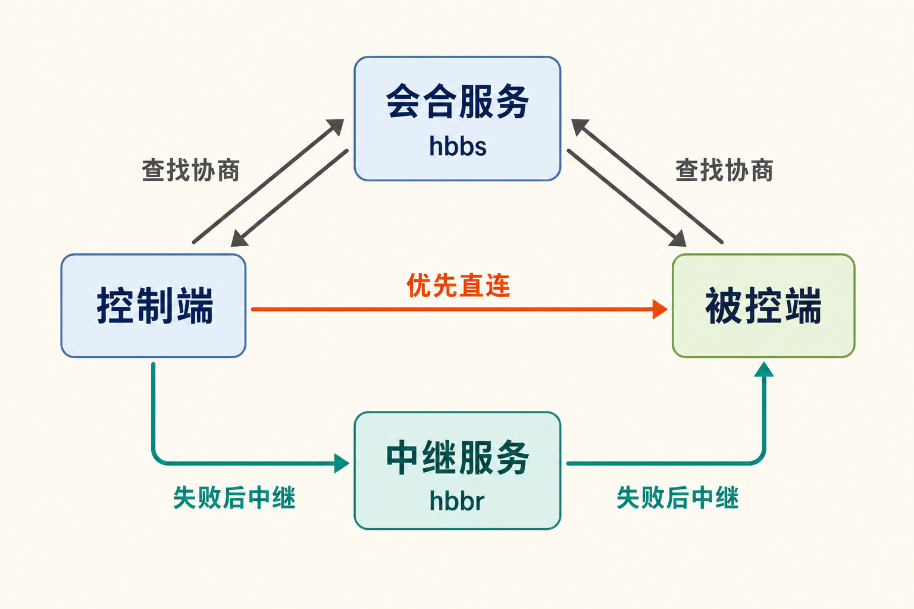

人在外地，办公室电脑上的文件却急着要用；父母面对系统弹窗说不清问题，你只能隔着电话猜；企业 IT 需要维护分散设备，又不希望远程连接完全依赖第三方平台。

这些场景的难点不只是“能否看到另一台电脑”，还包括连接如何建立、失败后流量经过哪里、谁管理基础设施，以及出问题时能否继续掌控系统。RustDesk 切入的正是这组问题：提供跨平台远程控制，同时允许用户自建连接所需的会合与中继服务。

## 30 秒认识项目

- **一句话定位：**支持自托管连接基础设施的开源跨平台远程桌面应用。
- **仓库地址：**[rustdesk/rustdesk](https://github.com/rustdesk/rustdesk)
- **许可证：**AGPL-3.0
- **主要语言：**Rust；当前桌面 GUI 使用 Flutter。
- **稳定版本：**1.4.9，发布于 2026 年 7 月 6 日；nightly 是每日构建的预发布通道，不能与稳定版混为一谈。[发布记录](https://github.com/rustdesk/rustdesk/releases)
- **活跃度：**截至 2026 年 8 月 11 日 08:11（北京时间），GitHub API 返回 120019 Stars、18377 Forks、129 个开放 Issue/PR；仓库在 8 月 10 日仍有代码推送，且未归档。


Star 和 Fork 只能说明关注与传播规模，不能证明稳定性、安全性或企业适用性。更有意义的成熟度信号，是项目仍在更新、存在稳定发布通道，并提供多个平台的构建资产和 SHA-256 校验值。

## 它真正解决的，不只是“远程控制”

常见商业远控方案通常把客户端、账号体系、会合服务和中继网络打包提供，优势是部署省事，代价则是基础设施选择权有限。RustDesk 也允许客户端默认连接其公共服务，但用户还可以部署或自行实现会合、信令和中继服务器，从而控制连接入口及相关数据路径。[官方 README](https://raw.githubusercontent.com/rustdesk/rustdesk/master/README.md)

因此，它与 TeamViewer、AnyDesk、Splashtop 等常见替代方案的核心差异，不宜简单概括成“免费”。更准确地说，是**把远程桌面客户端与可自托管的连接基础设施结合起来**。

这里也要划清边界。自托管不等于所有流量必然经过自家服务器：客户端会尝试建立直接连接，失败后才经中继服务转发。反过来，自托管也不自动等于安全合规；服务器暴露、密钥管理、客户端权限、升级和日志治理仍由部署者负责。

## 四项核心能力，以及它们的实际价值

### 1. 跨平台远程画面与输入控制

RustDesk 覆盖 Windows、macOS、多类 Linux 发行版、Android、iOS 和 Web 等入口，提供画面传输及键鼠控制。实际价值是让技术支持人员可以从不同终端接入异构设备，不必把所有机器统一到一个桌面系统。

但平台支持不是完全对称的。官方明确注明，iOS 设备不能作为被控制端；不同操作系统还涉及屏幕录制、辅助功能和输入控制授权。[客户端文档](https://rustdesk.com/docs/en/client/)

### 2. 文件、剪贴板与音频协同

远程维护往往不仅要“看屏幕”，还需要传送安装包、复制命令或听取远端声音。RustDesk 将文件传输、剪贴板同步和音频整合进连接流程，减少在远控软件、聊天工具和网盘之间反复切换。

这类便利也扩大了权限面：剪贴板和文件能力可能接触敏感信息。实际部署时应按人员与场景授予权限，而不是默认全部开放。

### 3. TCP 隧道

TCP 隧道可把远端网络中的特定 TCP 服务映射到本地。它的价值在于：一些维护任务并不需要完整桌面，只需要访问特定端口或内部服务。此时隧道能提供更聚焦的通道。

这同时意味着更高的网络治理要求。开放哪些目标、由谁使用、是否留下审计记录，都应进入企业的访问控制设计。

### 4. 自建会合与中继服务

RustDesk 的 OSS 服务端由 `hbbs` 和 `hbbr` 承担不同职责：前者负责 ID、会合及信令，后者在直接连接失败时中继流量。小规模部署可以在客户端手工填写 ID Server 与公钥 Key；Relay Server 通常可留空，由客户端推断。[客户端配置说明](https://rustdesk.com/docs/en/self-host/client-configuration/)

实际价值是组织不必把连接入口完全交给外部平台，也能根据网络和地域安排服务器。不过，账号登录、Web 控制台、API Server、自定义客户端生成器等能力涉及 Server Pro，不能笼统算作免费 OSS 服务端的功能。

## 一次连接是怎样建立的

依据官方文档，可以把流程简化为：

1. 被控端启动客户端，获得设备 ID，并向 `hbbs` 注册可达信息；
2. 控制端输入远端 ID，通过 `hbbs` 查找并协商连接；
3. 条件允许时，两端尝试直接连接；
4. 直接连接失败，则由 `hbbr` 转发远程桌面流量；
5. 被控端批准请求，或控制端提供密码后进入会话。



这揭示了容量规划的重点：基础会合服务的硬件需求不高，但中继流量会消耗服务器带宽。官方估算，1920×1080 场景的中继流量约为 30 KB/s—3 MB/s，办公场景约 100 KB/s；这是官方估算范围，不是所有环境的固定实测值。[OSS 服务端安装文档](https://rustdesk.com/docs/en/self-host/rustdesk-server-oss/install/)

## 安装与最小使用示例

如果只是体验客户端，最短路径无需先建服务器：Windows 下载官方 EXE，macOS 下载 DMG、拖入 Applications，并根据系统提示授予权限。两端运行客户端后，控制端输入被控端显示的 ID，再由对方批准，或输入对方提供的密码。

若要搭建 OSS 服务端，官方给出的 Docker Compose 最小命令是：

```bash
bash <(wget -qO- https://get.docker.com)
wget rustdesk.com/oss.yml -O compose.yml
sudo docker compose up -d
```

随后在客户端的网络设置中填写 `hbbs` 的域名或 IP，例如 `hbbs.example.com`，并填写服务端首次运行生成的 `id_ed25519.pub` 公钥。该 Key 用于建立加密连接，不是 Server Pro 的商业许可证密钥。

官方文档称通常需要开放 TCP 21114—21119 和 UDP 21116，但生产环境应根据实际部署收窄规则，而不是机械开放整个范围。上述第一条命令还会从网络获取脚本并直接执行；**笔者观点**是，安全敏感环境应先审阅脚本，并遵循组织既有的 Docker 安装与变更流程。

## 优点、限制与潜在风险

RustDesk 的优点比较明确：客户端跨平台，既能借助公共服务快速使用，也保留自建基础设施的路径；稳定版提供 EXE、MSI、DEB、RPM、AppImage、DMG、APK 等资产；文件传输、剪贴板、TCP 隧道等能力覆盖了常见远程支持流程。

限制也同样具体。首先，现代桌面 GUI 已使用 Flutter，README 中较简单的手工教程针对已弃用的 Sciter 构建；要进行现代 Flutter 源码构建，应参考项目 CI，不能把 `cargo run` 理解成所有平台的完整生产构建指南。

其次，平台兼容性仍需逐环境验收。近期开放 Issue 涉及 Linux Wayland 登录屏幕捕获、多显示器指针缩放与点击偏移、多 GPU 画面，以及 macOS 多显示器窗口边界等问题。[Issue 列表](https://github.com/rustdesk/rustdesk/issues)中的内容是用户报告，并不代表维护者已确认每一项缺陷；但从风险管理角度，可以推断 Wayland、登录前无人值守访问及复杂多显示器组合属于部署前重点测试区域。

再次，远控软件天然具有较高权限，也可能被用于未经授权的访问和隐私侵犯。部署者应处理强密码、密钥保管、系统权限、防火墙、版本升级和人员授权等问题。AGPL-3.0 也意味着二次开发及网络服务场景需要认真评估相应的许可证义务。

## 适合谁，又不适合谁

RustDesk 更适合愿意管理服务器和网络策略的个人、家庭技术支持者、中小团队，以及希望掌控远控基础设施的组织。它也适合作为实验平台，用来理解会合、P2P 直连和中继之间的关系。

它不太适合完全不想维护服务端、需要开箱即用的统一账号审计与商业 SLA，或尚未完成合规评估的大型组织。以 iOS 设备作为被控端的需求也无法由它满足。对于高度依赖 Wayland 登录前控制、复杂多屏或多 GPU 环境的团队，更不应跳过验证阶段。

## 结语：值得试，但不要把自托管当成万能答案

**事实层面**，RustDesk 已具备活跃仓库、稳定发布、跨平台客户端和可自托管的 OSS 会合/中继服务。**合理推断**是，它已经超出个人玩具范畴，但复杂桌面环境仍有明显的验收成本。

**本文观点**：如果你的主要矛盾是希望减少对第三方远控基础设施的依赖，RustDesk 值得用少量设备做受控试点；如果你追求零运维、完整企业管理能力和明确 SLA，则应把商业远控产品及 RustDesk Server Pro 一并纳入比较。最稳妥的结论不是“立刻全面替换”，而是先验证网络可达性、中继带宽、目标操作系统兼容性和权限治理，再决定是否扩大部署。

## 参考资料

1. [rustdesk/rustdesk 项目仓库](https://github.com/rustdesk/rustdesk)
2. [RustDesk README](https://raw.githubusercontent.com/rustdesk/rustdesk/master/README.md)
3. [RustDesk Releases](https://github.com/rustdesk/rustdesk/releases)
4. [RustDesk 客户端文档](https://rustdesk.com/docs/en/client/)
5. [RustDesk Server OSS 安装文档](https://rustdesk.com/docs/en/self-host/rustdesk-server-oss/install/)
6. [RustDesk 客户端自托管配置](https://rustdesk.com/docs/en/self-host/client-configuration/)
7. [rustdesk/rustdesk Issues](https://github.com/rustdesk/rustdesk/issues)
8. [RustDesk 官方网站](https://rustdesk.com/)
