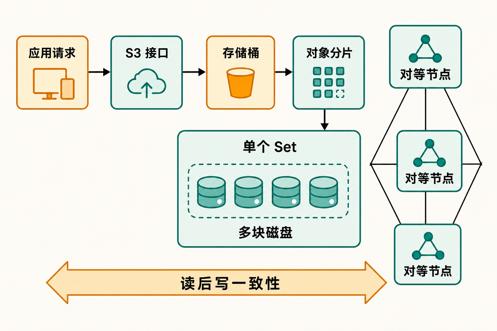

当图片、日志、备份和模型文件不断增加，团队常会遇到一个现实选择：继续依赖公有云对象存储，还是在自己的服务器上部署一套兼容 S3 的系统？

自建意味着数据位置、成本结构和运维节奏更可控，却也会带来扩容、磁盘故障、权限、安全更新以及客户端兼容等问题。尤其当现有程序已经围绕 S3 API 开发时，替换存储底座不能只看“能否上传文件”，还要看签名、分页、复制、恢复和一致性等细节。

RustFS 正是在这个场景中出现的项目：它试图用 Rust 构建一套可自行部署、兼容 S3、能够从单机走向分布式的对象存储系统。它受到较高关注，也正在快速推进 1.0；但“热门”和“可放心承载生产数据”仍是两个问题。

## 30 秒认识项目

- **一句话定位：** 面向私有云、数据湖、AI 和大数据负载的 Rust 对象存储系统，以 S3 兼容接口降低应用接入与迁移成本。
- **仓库地址：** [github.com/rustfs/rustfs](https://github.com/rustfs/rustfs)
- **许可证：** [Apache License 2.0](https://github.com/rustfs/rustfs/blob/main/LICENSE)，许可证同时声明软件按“AS IS”提供，不附带担保。
- **主要语言：** Rust；仓库仍可能包含 Shell、Dockerfile 等辅助内容。
- **最新版本：** [1.0.0-rc.1](https://github.com/rustfs/rustfs/releases)，GitHub 显示发布于 2026 年 8 月 8 日 09:49，仍是候选发布版，不是 GA。
- **活跃度快照：** 截至 2026 年 8 月 10 日 08:06（UTC+8），约 30.8k Stars、1.4k Forks、84 Watchers；Issue 页面约有 54 个开放 Issue、14 个开放 Pull Request。数字会变化，且不能替代稳定性判断。


从 beta.11、beta.12 到 rc.1，不到三周连续发布，说明维护节奏很快。另一面是，rc.1 的更新仍覆盖存储层、Kubernetes 节点发现、KMS、身份权限、对象复制、扫描恢复和可观测性等广泛模块。这更像一辆正在进入量产前综合调校的车，而不是已经多年稳定运行的平台。

## 它解决的不是“存文件”，而是自建 S3 底座

RustFS 的首要价值，是让已有 S3 工具链面对一个可自行部署的后端。应用不必为每种本地存储重新设计接口，团队也可以把数据留在自有基础设施中，并从单节点逐步走向多节点、多磁盘部署。

与直接使用本地文件系统相比，它增加了 Bucket、对象接口、版本控制、复制和事件通知等面向对象存储的能力。与公有云 S3 相比，它把硬件、容量规划、故障处理和升级责任交还给使用者。与 MinIO、Ceph 等常见替代方案相比，RustFS 的差异点是 Rust 实现、S3 兼容定位以及无独立 Master 的对等架构；官方架构文档也明确说其设计受到 MinIO 启发。

这里必须划清事实边界：项目方把 RustFS 描述为高度或“100%”兼容 S3，但公开 Issue 中仍能看到预签名 HEAD 请求签名失败、ListObjectsV2 分页异常等报告。因此，**事实**是它以 S3 兼容为目标并已实现大量相关功能；“能够无差别替换所有 S3 后端”则不能仅凭项目表述成立。

## 四项核心能力，分别带来什么价值

### 1. S3 接口与对象管理

项目列出的能力包括核心 S3 操作、上传下载、对象版本控制和 Bucket 复制。实际价值在于，已有 SDK、备份工具或数据处理程序有机会继续沿用熟悉的 S3 访问方式，而不用直接操作磁盘目录。

但兼容性不是一个简单开关。请求签名、条件请求、分页令牌和第三方客户端行为，都可能暴露边缘差异。正式迁移前应建立自己的兼容用例，而不能只验证一次上传和下载。

### 2. 从单盘试用到多节点多盘

[官方安装文档](https://docs.rustfs.com/installation/linux/)列出单节点单盘、单节点多盘和多节点多盘三种模式。单节点单盘适合快速了解接口或小规模用途；多盘和多节点则面向容量与容错需求。

这种路径让团队可以先在隔离环境验证，再决定是否扩大拓扑。不过 README 在核实时仍把分布式模式标为“测试中”。这是评估成熟度时比 Star 数更重要的信息。

### 3. 纠删码、分片与位腐败保护

RustFS 把若干磁盘组成 Set，对象被放入某一个 Set，并以分片形式存储。官方还列出位腐败保护能力。其实际意义是，系统不只是把完整文件复制到某个目录，而是围绕多盘冗余与损坏检测组织数据。

需要注意，一个对象位于单个 Set 内；集群可以拥有多个 Set，而每个 Set 的磁盘数固定，磁盘应尽可能跨节点分布。这会直接影响硬件规划、故障域设计和后续扩容方式。

### 4. 事件、复制与生态接入

事件通知可以把对象变化交给后续处理流程，Bucket 复制可服务于数据副本或跨环境同步。项目还列出了 Helm、Keystone、Swift API 和多租户等方向。

不过这些能力的完成度并不一致：截至核实时，生命周期管理、分布式模式和 RustFS KMS 被标为“测试中”，Swift 元数据操作为“部分支持”。因此更准确的理解是：RustFS 正在铺设完整对象存储平台所需的能力面，但部分模块仍需要逐项验证。

## 数据怎样流过 RustFS

[官方架构文档](https://docs.rustfs.com/concepts/architecture)描述了一种对等结构：系统不设置独立 Master、专用元数据节点或专用数据节点，所有节点地位相同。这样可以减少额外角色和元数据单点，但并不意味着系统天然免维护。



逻辑上，应用通过 S3 API 访问 Bucket，Bucket 容纳对象；存储层把磁盘组成 Set，对象分片写入一个 Set 内的多块磁盘。官方声明单机和分布式模式均采用 read-after-write，也就是写入完成后随即读取应看到新数据。

基于这些来源可以作出一个**分析性推断**：RustFS 希望用统一节点角色降低部署理解成本，再通过 Set 和纠删码处理多盘数据。但实际可承受的节点或磁盘故障范围、恢复时间和性能曲线，仍需结合具体拓扑测试，现有材料不足以给出统一数字。

## 最小安装：先把它当成验证环境

官方提供了安装脚本快捷方式：

```bash
curl -O https://rustfs.com/install_rustfs.sh && bash install_rustfs.sh
```

这条命令来自官方文档，但会下载并立即执行远程脚本。更审慎的做法是先下载、阅读脚本、核验来源和版本，再执行；生产环境还应固定版本。

仓库 README 给出的 Docker 最小启动命令是：

```bash
docker run -d -p 9000:9000 -p 9001:9001 -v $(pwd)/data:/data -v $(pwd)/logs:/logs rustfs/rustfs:latest
```

执行前需建立 `data`、`logs` 目录，并确保容器用户 UID/GID 10001 可以读写。默认 S3/API 端口为 9000，控制台端口为 9001。这个示例足以启动一个最小环境并从控制台观察服务，但 `latest` 不适合长期生产部署；应改为经过验证的固定版本标签。

来源材料没有给出可安全照抄的默认凭据或完整客户端命令，因此本文不补造上传示例。验证时至少应覆盖建桶、上传下载、预签名请求、分页列举、版本控制、权限和故障恢复，而不是只看控制台能否打开。

## 优点、限制与潜在风险

RustFS 的优点很清楚：Rust 实现、Apache-2.0 许可、S3 接口、从单机到分布式的部署形态，以及无独立中心节点的架构。持续发布和公开讨论也让项目变化较容易追踪。

限制同样需要正面写出。第一，最新版本仍是 RC，部分关键能力处于测试中或部分支持状态。第二，公开 Issue 已涉及磁盘更换后分片状态、节点故障时修复状态接口返回 500、预签名 HEAD 兼容、内存增长和列表分页等问题。[Issue 列表](https://github.com/rustfs/rustfs/issues)中的报告不等于全部已被维护者确认，也可能随后修复，但它们足以说明生产验证不能省略。

第三是安全配置。发布说明及[安全公告入口](https://github.com/rustfs/rustfs/security/advisories)记录了默认秘密值可能导致节点间 RPC 密钥可预测的问题。beta.9 起相关场景改为失败关闭；多节点需要设置一致的 `RUSTFS_RPC_SECRET`，并避免把相应端口暴露给不可信网络。升级、密钥轮换和网络隔离应进入日常运维流程。

第四是迁移风险。社区讨论中出现过升级后的 RPC 签名错误，以及旧 Linux 发行版缺少所需 GLIBC 版本的问题。即使项目方提供从 MinIO 替换二进制的方案，也应先备份，并核验数据格式、权限、生命周期、复制、客户端行为和回滚路径。

我的**观点**是：RustFS 最值得关注的地方不是“Rust 一定更快”，而是它正在尝试提供另一套开放的 S3 存储实现。来源中没有独立基准，官方演示也不能代替同硬件、同数据集、同持久化策略下的对照测试，因此本文不作性能领先结论。

## 谁适合尝试，谁应暂缓

它适合有自建对象存储需求、熟悉容器和 Linux 运维，并愿意投入时间做 S3 兼容、故障恢复与安全验证的团队；也适合开发者在实验环境研究 Rust 存储系统、无中心节点和纠删码组织方式。

它不适合没有存储运维能力、要求开箱即用 SLA，或无法接受 RC 阶段升级与兼容性变化的团队。对于已有稳定生产集群、又缺少完整迁移和回滚演练的组织，直接替换尤其不合适。

## 结语

RustFS 已经不是只有概念和几行示例的早期仓库：它具备明确架构、相当宽的功能面和活跃发布节奏。但截至 2026 年 8 月 10 日，它仍站在 1.0 GA 之前，公开问题也触及恢复、兼容性、资源占用与安全配置。

因此结论是：**值得进入技术选型的验证清单，但尚不应仅凭热度或项目方性能表述直接承载关键生产数据。** 最合理的尝试方式，是固定版本、隔离部署，用真实客户端和故障场景建立验收矩阵，再根据修复速度、升级体验和数据恢复结果决定下一步。

## 参考资料

1. [rustfs/rustfs 项目仓库及 README](https://github.com/rustfs/rustfs)
2. [RustFS Releases](https://github.com/rustfs/rustfs/releases)
3. [RustFS Architecture](https://docs.rustfs.com/concepts/architecture)
4. [RustFS Linux 安装文档](https://docs.rustfs.com/installation/linux/)
5. [Apache License 2.0 — RustFS LICENSE](https://github.com/rustfs/rustfs/blob/main/LICENSE)
6. [RustFS Issues](https://github.com/rustfs/rustfs/issues)
7. [RustFS Discussions](https://github.com/orgs/rustfs/discussions)
8. [RustFS Security Advisories](https://github.com/rustfs/rustfs/security/advisories)
