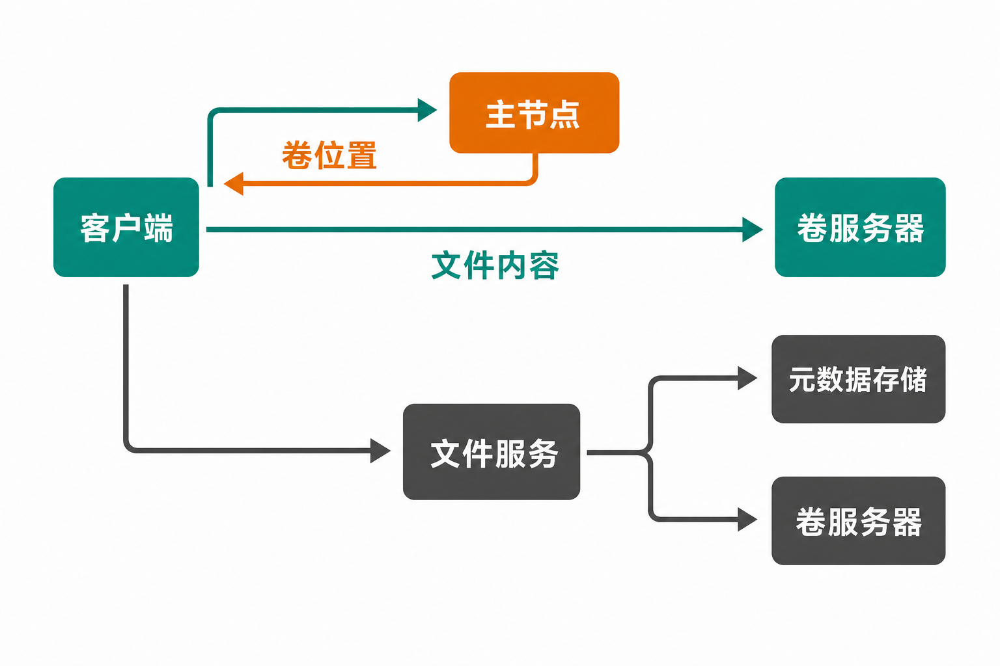

图片、日志切片、模型训练样本、邮件附件……当这些对象从百万级增长到十亿级，麻烦往往不只是磁盘不够。

传统文件系统需要集中维护庞大的文件名、目录和位置索引。小文件数量越多，元数据查询、随机访问与扩容迁移越容易成为瓶颈。团队可能改用对象存储，却又要面对原有 POSIX 程序、Hadoop 任务或 WebDAV 客户端的适配成本。

[SeaweedFS](https://github.com/seaweedfs/seaweedfs) 给出的答案，是先把文件组织进较大的“卷”，再以卷作为定位与分布单元：Master 不必追踪每一个文件，只维护相对稳定的卷与节点关系。这个设计很有针对性，但它并不等于一套可以免运维、直接替代所有存储系统的万能方案。

## 30 秒认识项目

| 项目 | 信息 |
|---|---|
| 一句话定位 | 面向海量文件的分布式 Blob Store，并通过上层组件提供文件系统、S3 和数据湖接口 |
| 仓库 | [seaweedfs/seaweedfs](https://github.com/seaweedfs/seaweedfs) |
| 许可证 | [Apache License 2.0](https://github.com/seaweedfs/seaweedfs/blob/master/LICENSE) |
| 主要语言 | Go；近期版本也包含 Rust Volume Server 相关实现 |
| 最新正式版 | 4.40，发布于 2026 年 7 月 20 日 |
| GitHub 数据 | 约 33.9k Stars、2.9k Forks、525 Watchers、668 个开放 Issues |
| 活跃度 | 2026 年 7 月 26—30 日持续有提交，7 月内多次发布正式版本 |
| 核实时间 | 2026 年 8 月 3 日 |

以上版本与 GitHub 数字均为动态信息，来自核实当日的[仓库页面](https://github.com/seaweedfs/seaweedfs)、[发布页](https://github.com/seaweedfs/seaweedfs/releases)和[提交记录](https://github.com/seaweedfs/seaweedfs/commits/master/)。它们只能证明关注度与近期维护状态，不能证明数据可靠性或工程质量。


## 它真正想解决什么问题

SeaweedFS 首先解决的是海量文件下的元数据扩展问题。

按照[官方 README](https://raw.githubusercontent.com/seaweedfs/seaweedfs/master/README.md)描述，Master 维护的是“卷在哪里”，而不是“每个文件在哪里”；具体文件键、偏移和大小由 Volume Server 管理。卷定位信息容易缓存，读文件通常只需一次磁盘读取，官方将其描述为 O(1) 访问。

这与常见方案有三点差异：

- 相比依赖集中式文件元数据服务的传统文件系统，它有意缩小 Master 需要管理的状态规模。
- 相比只提供对象 API 的存储，Filer 又补回目录、POSIX 属性等文件语义，并提供 FUSE、WebDAV 等入口。
- 相比把所有能力绑定在单一元数据库上，Filer Store 可以接入不同元数据后端，但选择、部署和维护后端的责任也随之交给使用者。

这里要明确边界：这是设计层面的差异，不代表 SeaweedFS 在所有负载下必然更快。吞吐、延迟、故障恢复和兼容性仍需用自己的文件尺寸、并发模型与硬件进行验证。

## 五项核心能力，价值分别在哪里

### 1. 用卷降低海量小文件的定位成本

Master 只追踪 Volume Server 上的卷，文件细节留在卷内。实际价值是：文件数急剧增长时，中央协调层不必同步膨胀成逐文件索引。

这也是 SeaweedFS 最有辨识度的能力。它不是单纯增加缓存，而是改变元数据管理的粒度。

### 2. 一份数据，多种访问入口

项目提供 S3 兼容 API、FUSE、WebDAV 和 Hadoop 接口；Filer 则为底层 Blob Store 增加目录与 POSIX 属性。团队可以让对象型应用使用 S3，让部分旧程序继续面对文件与目录，而不必为每类入口建立完全独立的存储孤岛。

“兼容”不应被理解为对其他产品全部行为的逐项复刻。尤其是 IAM、ACL、生命周期和边界错误处理，生产迁移前仍要做协议测试。

### 3. 面向故障域的数据保护

开源项目列出了机架或数据中心感知复制、Master 自动故障转移、纠删码、跨集群复制，以及 AES256-GCM 加密等能力。它们让系统可以从单机试验扩展到更复杂的拓扑，并在容量成本与副本保护之间做选择。

但部分数据恢复、自愈、可定制纠删码和自动 EC 修复能力属于 Enterprise Edition，不能算作 Apache-2.0 开源版默认功能。开源版与商业版的能力边界应在选型时单独核对。

### 4. 冷热数据分层

SeaweedFS 支持把数据分层到云端存储，并提供 TTL、压缩与空间回收能力。对日志、归档或长期保留内容，这意味着本地高性能介质不必永久承担全部容量。

实际收益取决于远端费用、恢复时延和访问模式；“能分层”并不自动等于“成本更低”。

### 5. 从对象存储延伸到数据湖

项目内置 Iceberg REST Catalog，并列出 Spark、Trino、Dremio、DuckDB、RisingWave 等集成。其意义是 SeaweedFS 不再只服务图片、附件等普通对象，也试图进入分析型数据基础设施。

这是事实上的产品边界扩张。至于是否足以替代已经成熟运行的数据湖底座，则属于需要验证的选型判断，不能从功能清单直接得出结论。

## 数据怎样流动：Master、Volume Server 与 Filer

最小化理解可以分成两条路径。

直接写入 Blob Store 时，客户端先向 Master 申请文件 ID 和目标卷位置，再把内容写入对应的 Volume Server；读取时根据文件 ID 找到卷位置，然后直接访问 Volume Server。Master 负责卷级协调，数据本身不经过它。

需要目录、POSIX 属性或 S3 等上层语义时，请求先进入 Filer 或相应网关。Filer 把文件内容交给底层 Volume Server，并把目录和文件元数据写入所选 Filer Store。由此带来的好处是数据面与文件语义分层；代价是生产系统多了一套需要高可用、备份和一致性设计的元数据后端。



上述流程依据仓库说明及[官方 Wiki](https://github.com/seaweedfs/seaweedfs/wiki)整理。更复杂的复制、纠删码和远端存储流程，应以对应生产部署文档为准。

## 五分钟跑通最小示例

官方把 `weed mini` 定位为试用、开发、学习和单节点场景。它会一并启动 S3、Master、Volume、Filer、WebDAV 与管理界面，不应直接当作高可靠生产拓扑。

先安装最新命令行程序：

```bash
go install github.com/seaweedfs/seaweedfs/weed@latest
```

也可以从[正式发布页](https://github.com/seaweedfs/seaweedfs/releases)下载对应平台的二进制。准备数据目录后，按官方最小示例设置凭据并启动：

```bash
export AWS_ACCESS_KEY_ID=admin
export AWS_SECRET_ACCESS_KEY=secret
export S3_BUCKET=my-bucket
./weed mini -dir=/data
```

S3 端点为：

```text
http://localhost:8333
```

若只想用 Docker，官方 README 给出的最小命令是：

```bash
docker run -p 8333:8333 \
  -e AWS_ACCESS_KEY_ID=admin \
  -e AWS_SECRET_ACCESS_KEY=secret \
  -e S3_BUCKET=my-bucket \
  chrislusf/seaweedfs
```

安全提醒：官方说明，未设置 AWS 凭据时，开发模式会匿名 `Allow All`。因此，示例端口不应在无认证状态下暴露到公网；示例中的 `admin/secret` 也必须在真实部署中替换。

若要从源码安装，官方步骤是：

```bash
git clone https://github.com/seaweedfs/seaweedfs
cd seaweedfs/weed
make install
```

## 优点、限制与成熟度

SeaweedFS 的优点很集中：卷级元数据模型瞄准了小文件规模问题；接口覆盖广；复制、纠删码与分层存储让部署形态有较大弹性；Apache-2.0 也便于企业按许可证条款使用与修改。

成熟度方面，项目拥有较完整的 Wiki，覆盖入门、生产部署、组件、API、复制、元数据后端和运维配置。截至 2026 年 8 月 3 日，最近可验证提交为 7 月 30 日，版本 4.40 之前的 7 月 6 日、10 日和20 日也均有正式发布。事实是项目仍在活跃维护；编辑判断是，快速发布同时提高了升级前做兼容与回归测试的必要性。

限制同样明确。README 提醒，增加或删除服务器不会自动触发数据再平衡，管理员必须执行相应命令。对于持续扩容的大集群，这不是小细节，而是一项需要流程化的日常运维工作。

[4.40 版本说明](https://github.com/seaweedfs/seaweedfs/releases)修复了 Filer 备份在特定瞬时错误下可能静默遗漏数据、Mount 空间不足时无限等待，以及 ACL、纠删码拓扑和数据边界校验等问题。这些修复不代表当前版本存在相同故障，但提醒团队：备份不能只看任务成功，必须做恢复验证；升级也要覆盖 S3、Filer、Mount 和 EC 路径。

社区中还有用户讨论密钥轮换、跨站点元数据同步、备份和生命周期等问题，其中一些尚未得到答复。这些只能视为待验证事项，不能直接定性为项目缺陷。一则[开放 Issue](https://github.com/seaweedfs/seaweedfs/issues/7506)中，一名自述管理大规模集群的用户还提到均衡、卷修复、审计和副本差异检查需求；这是单一用户经验，不具有普遍证明力，却很适合转化为部署前的故障演练清单。

## 适合谁，不适合谁

SeaweedFS 更适合这些团队：文件数量巨大、小文件明显拖累现有架构；需要同时提供 S3 与文件接口；愿意维护 Master、Volume Server、Filer 和元数据后端；并且有能力验证故障恢复、再平衡和升级流程。

它不太适合只需保存少量文件、希望完全托管免运维的团队；也不适合把“兼容 S3”直接等同于无需迁移测试，或没有资源维护元数据库、备份与容量均衡的组织。对强依赖商业版自愈能力的场景，还必须先核对许可和版本边界。

## 结语：值得试，但先把它当系统而不是软件包

SeaweedFS 值得进入海量小文件、混合访问协议和自建对象存储项目的候选名单。它最有价值的地方，不是 Star 数或接口数量，而是以“卷”重画了文件定位与中央元数据之间的边界。

结论也应保持克制：可以用 `weed mini` 快速验证应用适配，但生产决策至少要经过协议兼容、节点故障、备份恢复、磁盘耗尽、扩缩容再平衡和版本升级测试。只有当团队愿意承担这些系统工程工作时，SeaweedFS 的架构优势才可能转化为真实收益。

## 参考资料

1. [SeaweedFS GitHub 仓库](https://github.com/seaweedfs/seaweedfs)
2. [SeaweedFS 官方 README](https://raw.githubusercontent.com/seaweedfs/seaweedfs/master/README.md)
3. [SeaweedFS 官方 Wiki](https://github.com/seaweedfs/seaweedfs/wiki)
4. [SeaweedFS Releases](https://github.com/seaweedfs/seaweedfs/releases)
5. [SeaweedFS 提交记录](https://github.com/seaweedfs/seaweedfs/commits/master/)
6. [Apache License 2.0 许可证文件](https://github.com/seaweedfs/seaweedfs/blob/master/LICENSE)
7. [SeaweedFS GitHub Discussions](https://github.com/seaweedfs/seaweedfs/discussions)
8. [社区大规模运维工具讨论 Issue #7506](https://github.com/seaweedfs/seaweedfs/issues/7506)
