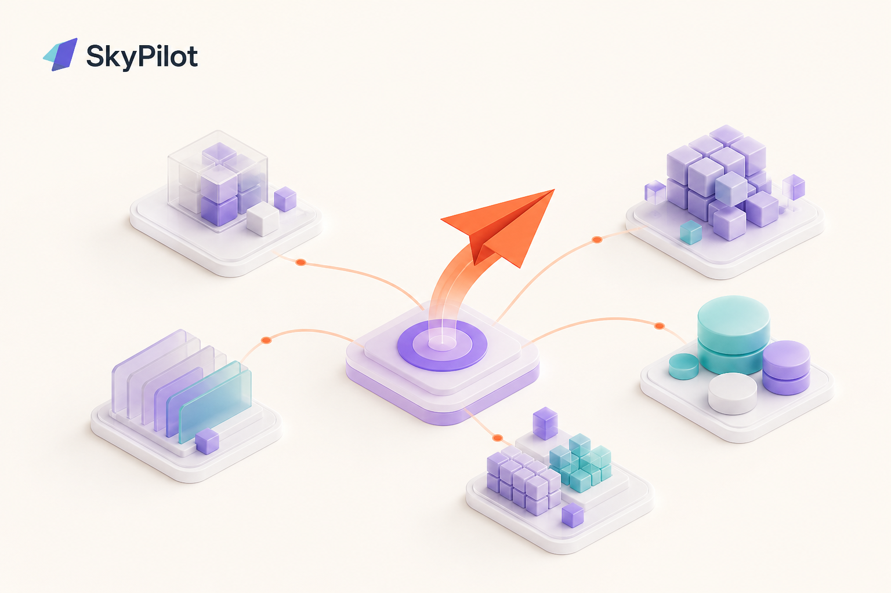
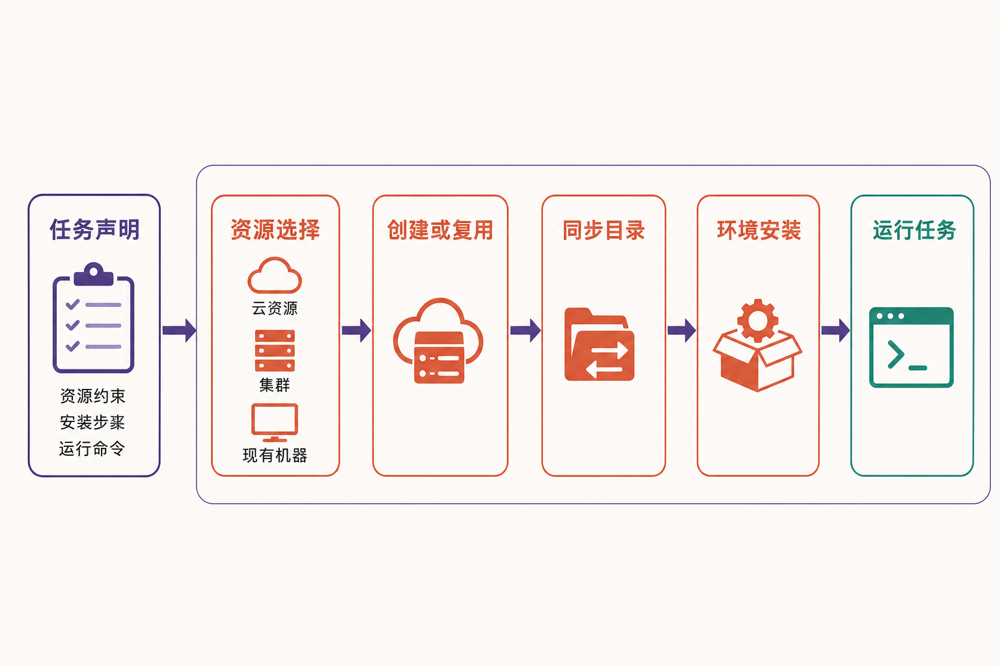

训练任务已经写好，真正让团队头疼的却可能是“去哪里跑”：A 云的 GPU 暂时无货，B 云还有容量，但实例名称、镜像、网络和启动方式全不一样；公司内部另有 Kubernetes 和 Slurm 集群，研究人员又不想为每套基础设施维护一组脚本。

更麻烦的是，选到机器只是开始。多节点任务要同时拿到资源，训练中断后要恢复，空闲 GPU 要及时释放，多名用户还会争抢同一批设备。团队若直接对接每一家云和每一种集群，基础设施差异很快就会渗入任务代码。

[SkyPilot](https://github.com/skypilot-org/skypilot) 瞄准的正是这层复杂性：在工作负载与底层算力之间增加一个统一的编排层。不过，它并不是“所有云问题的一键解法”，更适合被理解为一套面向 AI 任务的资源抽象和调度工具。

## 30 秒认识项目

- **一句话定位：**用统一的 YAML、Python API 和命令行，在多家云、Kubernetes、Slurm 及现有机器上运行、管理和扩缩 AI 工作负载。
- **仓库地址：**[skypilot-org/skypilot](https://github.com/skypilot-org/skypilot)
- **许可证：**Apache License 2.0
- **主要语言：**Python
- **稳定版本：**v0.13.0，2026 年 7 月 22 日发布；v0.13.1rc1 是候选版本，不能与稳定版混为一谈。[版本记录](https://github.com/skypilot-org/skypilot/releases)
- **活跃度：**截至 2026 年 9 月 2 日 08:02（UTC+8），仓库约有 10.5k Stars、1.2k Forks、77 Watchers 和 5725 次提交；组织页另显示约 131 个开放 Issue、262 个 Pull Request，主仓库于 9 月 1 日更新。

这些数字能说明项目受到关注且仍在持续维护，却不能直接证明软件质量，更不能证明每个后端都具有相同成熟度。



## 它解决的不是“缺 GPU”，而是算力接口碎片化

SkyPilot 不生产算力，也不会替用户消除云配额。它解决的是：当算力分布在不同环境中时，如何用相对一致的方式描述任务、寻找资源、启动集群并管理运行过程。

一个任务可以声明所需资源、节点数、工作目录、环境安装步骤和运行命令。SkyPilot 再根据这些约束选择基础设施、创建资源、同步代码、执行安装并启动任务。[官方 README](https://github.com/skypilot-org/skypilot/blob/master/README.md) 列出的后端包括 Kubernetes、Slurm、AWS、GCP、Azure、OCI、CoreWeave、Nebius、Lambda Cloud 和 RunPod 等。

与直接使用单一云厂商的控制台或 SDK 相比，它牺牲了一部分后端原生表达能力，换来跨环境的一致入口；与直接编写 Kubernetes YAML 或 Slurm 脚本相比，它把资源搜索、云实例创建和任务生命周期纳入同一工作流；与托管式 AI 平台相比，SkyPilot 采用 BYOC 模式，资源仍建立在用户自己的云账户、VPC 和集群中。

**事实边界：**官方材料支持“统一接口”和“多后端选择”，但不能由此推导出不同后端完全等价。账户权限、区域容量、配额和具体集成功能仍会影响结果。

## 五项核心能力，价值分别在哪里

### 1. 用任务描述隔离基础设施差异

用户把资源需求、`setup` 和 `run` 写进 YAML，也可以通过 Python SDK 构造同一任务。这意味着训练入口不必与某家云的实例 API 紧密绑定。

实际价值在于迁移成本：团队需要调整的主要是资源约束和后端配置，而不是重写整条启动脚本。它尤其适合频繁切换 GPU 型号、区域或资源池的研发工作。

### 2. 跨基础设施选择资源并进行容量故障转移

当用户不锁定具体基础设施时，SkyPilot 可按约束寻找价格较低且可用的资源；若某处没有容量，项目也提供自动故障转移能力。

这不是“保证拿到 GPU”。更准确的理解是：它扩大候选资源范围，并自动化一部分重试与切换工作。若所有候选账户都缺少配额或容量，编排层本身无法创造资源。

### 3. 管理长时间运行的作业

项目提供作业队列、自动恢复、Gang Scheduling 和多节点任务支持。对训练任务来说，价值不只是“把命令发出去”，还包括协调多节点同时启动，并在中断场景中管理作业恢复。

这将部分运行控制从零散的 shell 脚本提升到任务层。不过，恢复效果仍取决于应用是否正确保存检查点，来源材料并未支持“任意程序均可无损恢复”的说法。

### 4. 减少空闲资源与共享集群浪费

Autostop 可在集群空闲后停止或销毁资源；Binpacking 与智能调度则帮助共享集群把工作负载装入已有容量。

两者处理的是不同浪费：前者减少无人使用却持续计费的资源，后者改善多人共享时的资源碎片。v0.13.0 还加入每实例小时成本上限，为资源选择增加成本约束。[发布说明](https://github.com/skypilot-org/skypilot/releases)

### 5. 从单次任务扩展到服务与批处理

README 将模型服务、多集群管理列为项目能力；v0.13.0 又加入 Sky Batch、Hugging Face 存储、生命周期钩子和 GKE Autopilot 支持。这表明项目边界已超出单次训练启动器，正在覆盖更完整的 AI 工作负载生命周期。

**编辑观点：**能力面扩大有利于平台团队统一入口，但也增加测试矩阵。采用者应优先验证自己真正使用的后端与功能组合，而不是把功能列表等同于全部可生产使用。

## 一次任务是怎样运行的

从官方 README 可以归纳出一条清晰流程：用户先以 YAML 或 Python 声明任务与资源约束；SkyPilot 在已配置的基础设施中进行资源选择；随后创建或复用集群，同步工作目录，执行 `setup`，最后运行 `run` 中的命令。



其关键设计是把“任务想要什么”与“具体在哪运行”分开。用户仍持有底层账户和网络，SkyPilot 负责把声明转换为对应环境中的资源与执行动作。

这里也存在治理含义：既然它能代表用户创建和释放基础设施，凭据范围、API Server 部署方式、日志与升级流程都需要纳入组织的安全和运维规范。这是基于其 BYOC 与资源控制方式得出的风险判断，并非官方对安全性的承诺。

## 安装与最小示例

官方[安装文档](https://docs.skypilot.ai/en/latest/getting-started/installation.html)建议在虚拟环境中使用 Python 3.9—3.13。以下命令来自官方文档，以 Python 3.10 和 `uv` 为例：

```bash
uv venv --seed --python 3.10
source .venv/bin/activate
uv pip install skypilot
```

如果要连接 Kubernetes、AWS 和 GCP，应安装对应 extras：

```bash
uv pip install "skypilot[kubernetes,aws,gcp]"
sky check
```

`sky check` 用于核验云凭据和依赖。第一次使用 GPU 云账户时，还可能需要另行申请实例配额。

然后把官方[快速入门](https://docs.skypilot.ai/en/latest/getting-started/quickstart.html)中的最小任务结构保存为 `hello_sky.yaml`：

```yaml
resources:
  accelerators: T4:1

setup: |
  pip install numpy

run: |
  echo "Hello, SkyPilot!"
  nvidia-smi
```

启动任务：

```bash
sky launch -c mycluster hello_sky.yaml
```

若 `mycluster` 已存在，命令会复用它。示例未指定具体云，SkyPilot 可依据约束选择资源；实际结果仍取决于已配置的云、权限、配额和实时容量。生产环境若要求版本可复现，应结合发布记录固定稳定版本，而不是默认安装候选版。

## 优点、限制与成熟度

SkyPilot 最突出的优点是把资源选择、集群生命周期和任务执行放进同一个抽象层，同时保留 BYOC 的账户边界。YAML 与 Python 两种入口也方便研究人员和平台工程团队从不同层级接入。

从维护证据看，项目在核实日前一天仍有更新，提交、Issue、PR 和 Release 均保持活动，可以判断其开发活跃。然而，活跃不等于已经消除生产风险。[开放 Issue](https://github.com/skypilot-org/skypilot/issues) 中仍有 API Server 文件描述符泄漏、本地容器环境 PID 耗尽、Kubernetes 非 root 用户执行 rsync 权限异常，以及 Slurm 配置影响 Kubernetes 检测等报告。它们是特定用户提交且尚未在本文中复现，不能扩大成所有部署必然遇到的问题，但足以提示采用者进行针对性验证。

[社区讨论](https://github.com/skypilot-org/skypilot/discussions) 还显示，头节点与工作节点分别指定资源、异构 Job Groups、共享资源配额模型，以及全局强制 Autostop 等问题曾处于未解决或未回答状态。这说明复杂的多用户治理和异构拓扑仍可能需要额外工程。

此外，v0.13.0 存在配置键更名和旧接口弃用状态。持续升级的团队需要阅读兼容性说明，并按官方文档在本地模式升级后执行 `sky api stop`，让新版本生效。

## 谁适合，谁不适合

SkyPilot 更适合三类用户：需要在多家云之间寻找 GPU 容量的 AI 团队；同时维护云、Kubernetes 或 Slurm 的平台团队；以及希望把训练、批处理或模型服务统一为任务接口的组织。

如果团队长期只使用一种稳定基础设施，现有调度系统已经满足需求，引入新的编排层未必划算。对底层云原生特性高度依赖、要求复杂异构节点拓扑，或没有能力管理云凭据、配额与 API Server 的团队，也不宜仅凭快速入门直接进入生产。

## 结语：值得试，但应从一个真实任务开始

SkyPilot 值得尝试的理由，不是 Star 数，也不是支持后端的数量，而是它抓住了 AI 基础设施中的一个真实矛盾：工作负载希望保持统一，算力供给却日益分散。

建议用一个具备检查点、成本可控的非关键训练任务做概念验证，依次检查目标后端的凭据、容量切换、故障恢复、Autostop 和日志资源占用，再决定是否扩大使用范围。对多云或混合集群团队，它可能显著减少重复编排；对单一、稳定且已有成熟调度体系的团队，它更可能是一层额外复杂度。

最终结论是：**适合有真实跨基础设施需求的团队试用，但进入生产前必须按后端、版本和工作负载逐项验证。**

## 参考资料

1. [GitHub：skypilot-org/skypilot](https://github.com/skypilot-org/skypilot)
2. [SkyPilot README](https://github.com/skypilot-org/skypilot/blob/master/README.md)
3. [SkyPilot GitHub 组织页](https://github.com/skypilot-org)
4. [官方安装文档](https://docs.skypilot.ai/en/latest/getting-started/installation.html)
5. [官方快速入门](https://docs.skypilot.ai/en/latest/getting-started/quickstart.html)
6. [SkyPilot Releases](https://github.com/skypilot-org/skypilot/releases)
7. [SkyPilot Issues](https://github.com/skypilot-org/skypilot/issues)
8. [SkyPilot Discussions](https://github.com/skypilot-org/skypilot/discussions)
