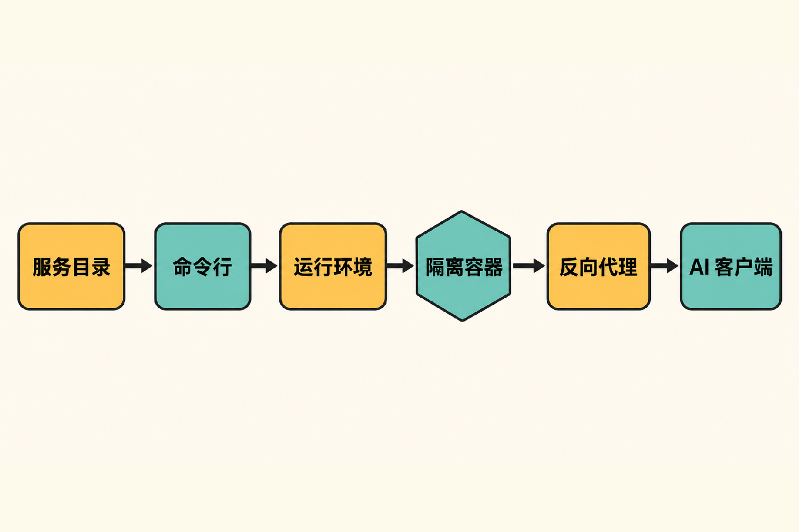

当团队准备把一个 MCP 服务器接入 AI 编程工具时，真正麻烦的往往不是“能不能调用工具”，而是后面的一连串问题：这段第三方代码能访问哪些文件？API Key 放在哪里？它可以连接哪些网络地址？多个客户端如何配置？进入 Kubernetes 后，认证、审计和故障排查又由谁负责？

直接运行脚本可以快速验证功能，却把依赖、凭据和权限边界留给使用者逐项处理。容器能解决一部分隔离问题，但镜像启动、客户端连接、代理和运维仍需自行拼装。

[ToolHive](https://github.com/stacklok/toolhive) 瞄准的正是这一层：它不负责教开发者编写 MCP 工具，而是负责让已有 MCP 服务器以较一致的方式运行、接入和接受治理。

## 30 秒认识项目

- **一句话定位：**用于安全运行、连接和管理 MCP 服务器的开源平台。
- **仓库地址：**[stacklok/toolhive](https://github.com/stacklok/toolhive)
- **许可证：**Apache License 2.0
- **主要语言：**Go；仓库根目录包含 `go.mod` 与 `go.sum`。
- **最新版本：**v0.43.0，发布于 2026 年 8 月 14 日 15:58 UTC。
- **活跃度快照：**约 2.0k Stars、278 Forks、15 Watchers、321 个开放 Issue、54 个 Pull Request、累计 4,149 次提交。
- **数据核实时间：**2026 年 8 月 16 日 08:02:28（UTC+8）。

这些数字只能说明项目受到关注且仍在频繁变化，不能直接证明代码质量或安全性。更值得注意的是，[Release 记录](https://github.com/stacklok/toolhive/releases)显示 v0.41.0、v0.42.0、v0.42.1 和 v0.43.0 在不到三周内相继发布：维护活跃，但升级节奏也需要使用者跟进。

## 它解决的不是“开发 MCP”，而是“运行 MCP”

ToolHive 面对的核心矛盾，是 MCP 服务器容易启动，却不容易在可控边界内长期运行。按照[官方文档](https://docs.stacklok.com/toolhive)，其 Runtime 将服务器放进隔离容器，并围绕文件、网络、秘密和权限增加控制；代理层则向 AI 客户端提供通信入口。

与几种常见做法相比，它的差异更容易看清：

- **直接运行 npm、Python 或其他进程：**路径最短，但依赖、凭据和进程权限由使用者自行管理。
- **手工使用 Docker 或 Podman：**获得容器边界，却仍需自行处理启动参数、端口、代理和客户端配置。
- **自建 Kubernetes 部署：**灵活度高，但认证、路由、目录、审计和生命周期管理需要额外工程投入。
- **ToolHive：**尝试把以上环节收敛到 CLI、Runtime、Registry、Virtual MCP Server、Portal 与 Operator 组成的平台中。

这里需要明确一个边界：ToolHive 不是新的 MCP Server SDK，也不会替第三方服务器消除其自身漏洞。**事实**是它提供隔离和治理机制；**判断**是这些机制可以缩小误配置面；但最终安全水平仍取决于镜像来源、权限策略、秘密配置和日常运维。

## 四项核心能力，价值在哪里


### 1. 每个服务器独立运行，缩小默认暴露面

官方 README 说明，每个 MCP 服务器运行在隔离容器内。对开发者而言，实际价值不只是“用了容器”，而是无需为每个服务器重复编写一套启动和代理脚本。启动过程中，ToolHive 会拉取镜像、应用安全设置、后台运行容器，并建立反向代理。

采用 OCI 容器也让镜像签名、SBOM、证明和漏洞扫描等供应链能力有了标准载体。不过，[项目发起者的背景文章](https://stacklok.com/blog/toolhive-making-mcp-servers-easy-secure-and-fun/)只是说明这些能力可以被利用，并不意味着每个镜像都已自动完成验证。

### 2. Registry 把“能找到”变成“可策展”

Registry Server 可以从官方 MCP Registry、其他公共目录和自定义文件汇集服务器或技能，并提供 API、分组和预设配置。它对平台团队的意义，是建立内部可见的候选目录，而不是让每位员工各自搜索和维护安装说明。

但“进入目录”不等于“持续安全认证”。社区中关于策展服务器运行时验证范围的讨论在核验时仍未得到回答。因此，更稳妥的做法是把 Registry 看作发现与配置入口，而不是安全背书。

### 3. 统一客户端接入，减少重复配置

ToolHive 支持连接 Claude Code、Cursor、GitHub Copilot 等客户端，也可通过 `thv client setup` 写入受支持客户端的配置。这对同时使用多个 AI 工具的个人或团队很实用：服务器的运行方式和客户端连接方式可以分离，不必在每个客户端里重复维护底层进程参数。

部分客户端仍需重启才能读取新配置，特定 MCP 服务器也可能存在兼容性问题，因此“支持某客户端”不应被理解为所有组合均无需调试。

### 4. 从本地 CLI 延伸到 Kubernetes 治理

本地 CLI 适合个人使用与自动化；Kubernetes Operator 面向共享、多用户环境。Operator 中的 Virtual MCP Server 可以聚合多个后端，集中处理认证、授权、路由、审计、工具过滤和工作流编排。

这让平台团队能够向客户端提供较稳定的统一入口，而把后端选择和访问策略留在平台侧。官方还提供 Portal：桌面应用用于发现、安装和连接，浏览器 Cloud UI 则面向 Registry Server。

需要注意，README 将开源能力与 Stacklok 的商业增强能力作了区分。集中管理、身份提供商集成和生产加固等商业能力，不能全部算作开源仓库开箱即得的功能。

## 工作流程：客户端并不直接接触服务器进程

在本地模式中，用户先通过 CLI 从 Registry 选择服务器；Runtime 调用 Docker、Podman 或 Colima 启动隔离容器，再创建反向代理；AI 客户端连接代理，由代理转发 MCP 请求。默认端口动态分配，也可以用 `--proxy-port` 固定。

在 Kubernetes 场景中，Operator 负责工作负载，Virtual MCP Server 可作为多个 MCP 后端之前的聚合网关。认证、授权、路由和审计可以集中发生在这一层。该架构的价值在于把客户端、治理入口与实际服务器解耦，但组件增多也会扩大配置和排障范围。



## 安装与最小使用示例

以下命令来自[官方 CLI Quickstart](https://docs.stacklok.com/toolhive/guides-cli/quickstart)。本地容器模式需要先启动 Docker、Podman 或 Colima。

macOS 或 Linux 使用 Homebrew：

```bash
brew tap stacklok/tap
brew install thv
```

Windows 使用 winget：

```powershell
winget install stacklok.thv
```

安装后查看目录、启动官方文档 MCP 服务器并确认状态：

```bash
thv registry list
thv run toolhive-doc-mcp
thv list
```

接入受支持的客户端：

```bash
thv client setup
thv client status
```

如果只是想验证远程代理路径，不希望在本机启动服务器容器，可以运行：

```bash
thv run toolhive-doc-mcp-remote
```

它会代理到官方托管端点。若遇到端口冲突，可按官方说明使用 `--proxy-port` 指定端口；若客户端看不到工具，应先确认容器运行时、客户端配置以及是否需要重启客户端。

## 优点、限制与成熟度

ToolHive 的明显优点，是把容器隔离、代理、目录和客户端配置放进一条较短的操作路径，同时保留向 Kubernetes、统一身份策略与审计扩展的空间。Apache 2.0 许可证和自托管路径，也有利于需要自行控制基础设施的组织评估。

它的限制同样具体。项目仍处于 `0.x` 版本并快速迭代。v0.41.0 已列出存储迁移器默认启用、拒绝 JSON-RPC 批处理等破坏性变化；v0.40.0 还记录过 stdio bridge 不转发部分通知、动态工具列表可能陈旧的问题。这意味着升级前不能只看功能清单，必须阅读版本说明并做兼容性验证。

[Issue 跟踪器](https://github.com/stacklok/toolhive/issues)在 2026 年 8 月 15 日仍出现多项待分流报告，例如初始化可能在健康检查正常时超时、Operator 回滚手工重启、被删除的 StatefulSet 未自动重建，以及 vMCP 对后端能力判断异常。这些是用户报告的线索，尚不能一概视作维护者已确认的缺陷；但它们足以说明生产环境需要额外监控和演练。

风险层面还要避免三种误解：隔离容器不等于可信代码，Registry 收录不等于安全审计，统一网关也不等于自动获得正确权限。ToolHive 可以提供控制点，却不能替代最小权限、镜像审核、秘密轮换、升级测试和故障恢复方案。

## 谁适合尝试，谁不适合

**适合：**需要在本地运行多个 MCP 服务器的开发者；希望统一 AI 客户端接入方式的团队；已有 Kubernetes 基础设施、正在建设 MCP 服务目录与治理入口的平台团队；需要自托管 Registry、Gateway 等组件的组织。

**不太适合：**只运行一个完全受信任的本地服务器、且不介意手工配置的用户；没有容器基础、只想获得零运维托管服务的团队；无法承受频繁版本变化，也没有升级验证能力的生产系统。

## 结语：值得试，但应从隔离的试点开始

我的观点是，ToolHive 值得 MCP 重度用户和平台团队进入技术评估清单。它抓住了一个真实缺口：MCP 生态需要的不只是更多服务器，也需要可靠的运行与治理层。

但它目前更像一套快速成形的平台底座，而不是可以不经验证直接接管关键生产流量的“安全开关”。合理的尝试方式，是先选择低权限服务器做本地试点，验证客户端兼容、网络与文件策略、升级和恢复流程，再决定是否引入 Virtual MCP Server 与 Kubernetes Operator。是否采用，最终应由治理收益能否覆盖新增平台复杂度来决定，而不是由 Star 数决定。

## 参考资料

1. [stacklok/toolhive 项目仓库](https://github.com/stacklok/toolhive)
2. [ToolHive 官方 README](https://github.com/stacklok/toolhive/blob/main/README.md)
3. [ToolHive 官方架构与功能介绍](https://docs.stacklok.com/toolhive)
4. [ToolHive CLI Quickstart](https://docs.stacklok.com/toolhive/guides-cli/quickstart)
5. [ToolHive Releases](https://github.com/stacklok/toolhive/releases)
6. [ToolHive Issues](https://github.com/stacklok/toolhive/issues)
7. [ToolHive Discussions](https://github.com/stacklok/toolhive/discussions)
8. [ToolHive 项目发布背景文章](https://stacklok.com/blog/toolhive-making-mcp-servers-easy-secure-and-fun/)
