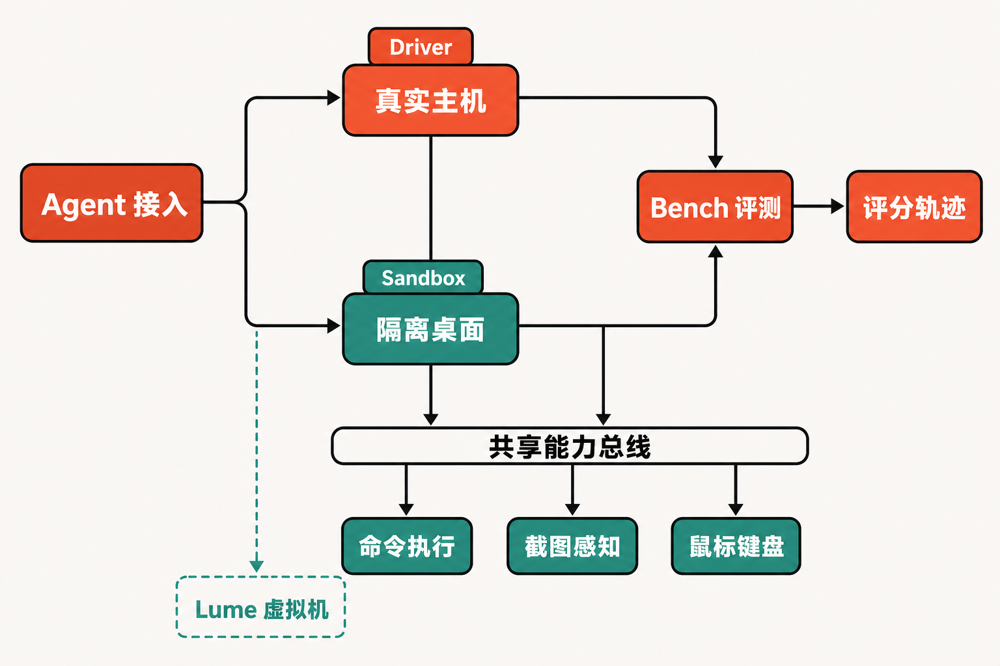

让 AI 帮你整理文档很容易；让它打开桌面软件、识别窗口、点击按钮，再把同一任务稳定重复一百次，却是另一回事。

开发者首先会撞上几个现实问题：鼠标和键盘被自动化程序抢走后，人无法正常工作；不同操作系统暴露的窗口与权限接口并不一致；任务失败后缺少可复现的干净环境；即使 Agent 完成了操作，也很难用统一标准判断结果是否正确。

开源项目 **trycua/cua** 瞄准的正是这一层。它不是又一个负责规划和推理的通用 Agent，而是一套把“真实桌面控制、隔离计算机、任务评测与轨迹导出”连接起来的基础设施。

## 30 秒认识项目

- **一句话定位：** 为 Computer-Use Agent 提供桌面驱动、跨系统沙箱和评测能力的开源工具套件。
- **仓库地址：** [trycua/cua](https://github.com/trycua/cua)
- **许可证：** MIT。
- **主要语言：** GitHub 页面标注为 HTML，但这是一个多语言 monorepo，还大量使用 Python、Rust、Swift、TypeScript 和 Shell，不能把它理解成单一 HTML 项目。
- **活跃度：** 截至 **2026 年 8 月 20 日 18:44（北京时间）**，仓库页面显示约 1.5k Fork、325—327 个未关闭 Issue、4434 次提交。核验时 Star 数未正常加载，因此本文不写精确值。8 月 17—20 日连续出现提交、Issue 和 Release，维护频繁，但也处在快速演进期。

截至同一核验日，[发布页面](https://github.com/trycua/cua/releases)的最新条目是 Cua Driver 0.21.1 nightly；最新稳定 Sandbox 为 0.4.2，稳定 Driver 为 0.21.0。Nightly 是从特定 main 提交自动生成的构建，需要主动选择，不应和稳定版混为一谈。

## 它真正解决的，不只是“自动点击”

常见桌面自动化方案通常落在三个方向：基于屏幕坐标模拟鼠标键盘、通过浏览器 DOM 驱动网页，或者直接准备一台虚拟机。它们各自有用，却很难单独覆盖真实应用、隔离执行和结果评测的完整链路。

Cua 的差异在于“组合”：Driver 面向现有主机及应用；Sandbox 提供一次性 GUI 计算机；Cua-Bench 定义任务、运行 Agent 并评分；Lume 则负责 Apple Silicon 上的 macOS/Linux 虚拟机。根据[官方文档](https://cua.ai/docs)，这些组件既能服务真实机器，也能服务本地隔离桌面。

这意味着它更接近 Computer-Use 的基础设施层，而不是某个固定工作流的录制器。**这是基于组件边界得出的判断，不是官方性能承诺。**

## 四个核心能力，价值分别在哪里


### 1. 尽量不打断人的后台桌面控制

Cua Driver 支持 macOS、Windows 和 Linux，可通过 MCP、CLI 或长期运行的 daemon 接入。其目标是在后台完成点击、输入和验证，尽量不抢占当前光标与焦点。

实际价值是：Agent 可以在已有应用环境中工作，而用户不必把整台电脑完全让给它。不过“后台”只是 best-effort 能力，并非所有应用和平台都能保证无感执行，这一点将在限制部分展开。

### 2. 为每次任务准备干净、可丢弃的电脑

Cua Sandbox 可以创建 Linux、macOS、Windows 和 Android 环境，并向程序开放 shell、截图、鼠标和键盘接口。一次性环境能减少历史文件、登录状态和残留进程对结果的干扰，也更适合运行不完全可信的任务。

与直接在工作电脑上执行相比，沙箱的主要收益不是“点击更快”，而是隔离性和可重复性。

### 3. 把演示变成可比较的评测

Cua-Bench 可运行 OSWorld、ScreenSpot、Windows Arena 或自定义任务，支持并行执行、结果评分与训练轨迹导出。它试图回答的不只是“Agent 有没有动起来”，还包括“任务是否完成、不同方案能否在同一条件下比较”。

对于模型团队，这使失败轨迹可以进入分析或训练流程；对于应用团队，则有机会把回归测试从人工观看录像变成结构化任务。

### 4. 补上 Apple Silicon 的本地虚拟化路径

Lume 基于 Apple Virtualization.Framework，在 Apple Silicon 上创建和管理 macOS/Linux 虚拟机。它让 Mac 开发者能在本地获得更贴近桌面应用的隔离环境，而不只依赖浏览器容器或远端机器。

它的适用范围也很明确：这是面向 Apple Silicon 的组件，不是所有硬件平台的通用虚拟化替代品。

## 从任务到结果：组件怎样协作

按照[项目 README](https://raw.githubusercontent.com/trycua/cua/main/README.md)和官方文档能够确认的边界，一条典型链路可以概括为：Agent 通过 MCP、CLI 或 SDK 发出操作；任务进入 Driver 控制真实机器，或进入 Sandbox 获得隔离桌面；执行过程中调用 shell、截图、鼠标与键盘；需要系统化评估时，由 Cua-Bench 定义任务、运行 Agent、评分并导出轨迹。

Lume 位于更底层，为 Apple Silicon 上的部分 macOS/Linux 虚拟机提供支撑。不同部署是否必然同时使用四个组件，资料没有这样承诺，因此不能把它们画成固定、不可拆分的流水线。



## 安装与最小示例

如果目标是先体验隔离 Sandbox，README 给出的最低要求是 **Python 3.11 或更高版本**，安装命令为：

```bash
pip install cua
```

以下示例保留 README 明确列出的类与调用方式，创建临时 Linux 环境并获取截图：

```python
import asyncio
from cua import Sandbox, Image

async def main():
    async with Sandbox.ephemeral(Image.linux()) as sb:
        screenshot = await sb.screenshot()
        print(type(screenshot))

asyncio.run(main())
```

同一个 `sb` 对象还提供 `sb.shell.run(...)`、`sb.mouse.click(...)` 和 `sb.keyboard.type(...)`。具体参数应以当前版本 API 文档为准，避免照搬旧版示例。

若要安装真实桌面使用的 Driver，[官方安装文档](https://cua.ai/docs/how-to-guides/driver/install)给出的 macOS/Linux 命令是：

```bash
/bin/bash -c "$(curl -fsSL https://cua.ai/driver/install.sh)"
cua-driver --version
cua-driver doctor
```

Windows PowerShell 命令为：

```powershell
irm https://cua.ai/driver/install.ps1 | iex
```

这些命令会下载并执行远程脚本。用于公司设备前，应先审阅脚本并遵循组织的软件安装规范。Driver 默认发送不含内容的产品遥测；如不需要，可按文档关闭：

```bash
cua-driver telemetry disable
```

## 优点、限制与潜在风险

项目最突出的优点，是把桌面操作、隔离环境和评测放进同一套件；支持真实主机与一次性环境两种路线；并且提供 MCP、CLI、SDK 等接入方式。密集发布也说明维护活跃。

但活跃不等于成熟。官方的[已知限制](https://cua.ai/docs/reference/cua-driver/limits)显示，类型化浏览器写操作主要覆盖受控 CDP 端点绑定的 Chrome、Edge、Chromium 和有限形态的 Electron；Safari、Firefox、WebView2、Tauri 等没有同等支持。通用 GNOME/KDE Wayland 往往只能只读发现或拒绝写操作，部分游戏、Blender、Unity 及重 Canvas 应用仍可能短暂切到前台。

macOS 还需要 Accessibility 与 Screen Recording 权限，最低要求为 macOS 14 Sonoma。Retina 环境中，元素坐标与截图像素可能存在约两倍比例差；浏览器语义快照最多覆盖前 300 个交互元素，导航后旧引用还会失效。

社区 Issue 可作为风险线索，但不能直接视为最新版的普遍缺陷。例如 [Issue #2020](https://github.com/trycua/cua/issues/2020)报告旧版 Driver 无法定位无标题 WPF 顶层窗口；核验时它仍为 Open，但测试版本是 0.6.7/0.6.8，明显早于当前 0.21.x，采用者应在当前版本重新复现。

安全方面，真实主机模式可能接触已有登录会话、文件和应用状态。官方提供 standard、bounded、unrestricted 三种权限模式；无人值守任务更适合使用带审核 capability manifest 的 bounded 模式。**编辑观点：** 对未知网站、外部文件或高权限账号，隔离 Sandbox 应当是默认选择，而不是出问题后的补救措施。

## 谁适合试，谁应当观望

它适合开发桌面 Agent、需要跨系统 GUI 测试、构造 Computer-Use 评测集，或希望在 Apple Silicon 上管理本地桌面虚拟机的团队。对这些用户，Cua 值得做一个限定场景的技术验证，尤其应测试自己的操作系统、目标应用、权限配置和失败恢复流程。

它不适合只需稳定网页表单自动化、无法接受快速版本变化、依赖 Safari/Firefox 或复杂 Wayland 写入，或准备让 Agent 直接操作高权限生产主机却没有沙箱和审核机制的团队。

## 结语

trycua/cua 的意义，不在于再造一个会规划任务的 Agent，而在于给 Agent 准备“手、电脑和考场”。它覆盖的链路相当完整，更新也很积极；与此同时，跨平台桌面自动化的兼容性、权限和坐标问题并没有凭空消失。

因此，本文的结论是：**值得试，但应从隔离环境、固定应用和可验证任务开始；它目前更像快速成长的工程基础设施，而不是可以无条件接管所有桌面的成熟通用层。**

## 参考资料

1. [trycua/cua GitHub 仓库](https://github.com/trycua/cua)
2. [项目 README](https://raw.githubusercontent.com/trycua/cua/main/README.md)
3. [Cua Developers 官方文档](https://cua.ai/docs)
4. [Cua Driver 安装指南](https://cua.ai/docs/how-to-guides/driver/install)
5. [GitHub Releases](https://github.com/trycua/cua/releases)
6. [Cua Driver Known Limits](https://cua.ai/docs/reference/cua-driver/limits)
7. [Windows 空标题窗口问题：Issue #2020](https://github.com/trycua/cua/issues/2020)
8. [trycua/cua Issues 列表](https://github.com/trycua/cua/issues)
