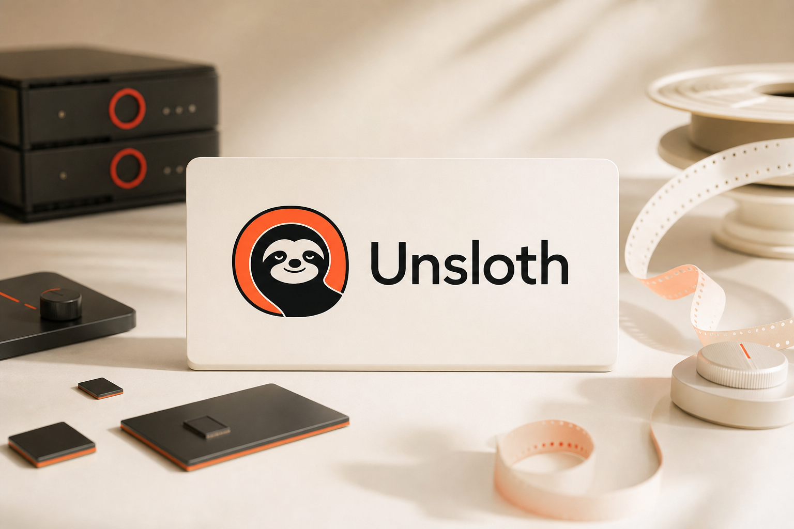
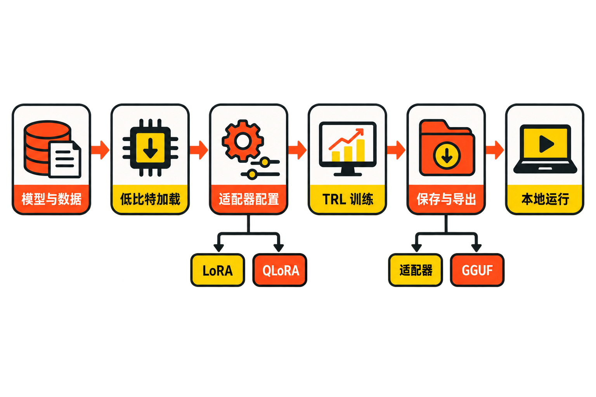

一名开发者想用自己的问答数据微调开源模型，往往先撞上三堵墙：显存装不下，训练时间太长，CUDA、PyTorch、量化库和训练框架的版本又互相牵制。即使模型终于跑起来，后面还有聊天验证、GGUF 导出和本地服务部署。

[Unsloth](https://github.com/unslothai/unsloth)试图把这些环节串成一条更短的路径。它最初以高效微调见长，如今已扩展成包含桌面应用、Web UI 和 Python 核心包的平台。不过，它不是“让任何电脑都能训练任何模型”的魔法工具：模型尺寸、序列长度、训练方式与硬件后端仍然决定资源上限。

## 30 秒认识项目

- **一句话定位：**面向本地硬件的大模型运行、微调、量化、导出与服务平台。
- **仓库：**[unslothai/unsloth](https://github.com/unslothai/unsloth)
- **许可证：**并非全仓库单一许可；Core 核心包为 Apache-2.0，Studio UI 等指定组件为 AGPL-3.0，集成时须逐目录、逐文件核查。
- **主要语言：**Python；近期镜像统计还显示 TypeScript 占有一定比例，与 Studio、Desktop 前端有关。
- **活跃度：**截至 **2026 年 9 月 1 日 08:02（UTC+8）**，GitHub 页面显示约 6.8k Fork、963 个开放 Issue、437 个开放 PR、7,983 次提交。约在 2026 年 8 月 28 日抓取的第三方快照显示约 74.7k Star；这不是 GitHub API 实时值，只能作为近似参考。
- **最新版本：**核实时为 [v0.1.804-beta](https://github.com/unslothai/unsloth/releases/tag/v0.1.804-beta)，发布于 2026 年 8 月 27 日。

这些数字证明项目受到关注且更新频繁，却不能单独证明代码质量、训练正确性或生产成熟度。



## 它解决的不是一个点，而是一段工程链路

传统代码式微调通常需要用户自行组合模型加载、低比特量化、LoRA、数据模板、TRL 训练器、保存与格式转换。Unsloth Core 保留了这条可编程路线，同时用优化内核和预设工作流降低显存及配置成本；Studio 和 Desktop 则把模型管理、聊天、训练与导出进一步放进图形界面。

与常见替代方案相比，它的差异不只是“另一个训练框架”：

- 相比直接用 Transformers、PEFT 和 TRL 手工组装，Unsloth 更强调经过整合的端到端路径，但抽象层也可能增加排障时的项目特有知识。
- 相比只负责本地推理的工具，它覆盖训练、保存、量化和导出，而不止聊天。
- 相比完全托管的云服务，它强调在本地和消费级硬件上运行，用户能保留数据与环境控制权，但必须自己处理驱动、显存和安全配置。

**事实：**官方称典型微调可达到约 2 倍速度并节省约 70% 显存。**判断：**这是项目方基准，不是独立、普适的性能结论；模型、GPU、序列长度、量化方式和对照配置变化后，应重新测量。

## 四项核心能力，价值在哪里

### 1. 低资源微调

项目支持 LoRA、QLoRA、全参数微调、预训练、SFT、DPO、GRPO、强化学习和 FP8。对个人开发者而言，关键价值是可以先从小型 instruct 模型与 QLoRA 开始，用较低资源验证数据和任务是否有效，而不是一开始就承担全参数微调成本。[官方微调指南](https://unsloth.ai/docs/get-started/fine-tuning-llms-guide)也采用这一建议。

### 2. 从训练到导出的连续流程

Core 的典型流程是：用 `FastLanguageModel` 加载模型，加入 LoRA/QLoRA 适配器，准备数据集，通过 TRL 训练，最后保存 LoRA 或导出 GGUF、safetensors 等格式。实际价值在于减少训练结果与下游运行格式之间的手工衔接。

### 3. 三种使用入口

Desktop 面向原生桌面体验，Studio 提供 Web UI，Core 则供开发者写代码。Studio 还覆盖模型管理、聊天、RAG、工具调用、代码执行和 OpenAI 兼容 API。团队可以先用界面验证流程，再进入 Core 做自动化；但三种入口并不代表它们在所有系统和后端上具备完全相同的能力。

### 4. 更宽的模型与硬件覆盖

[项目 README](https://github.com/unslothai/unsloth/blob/main/README.md)列出 LLM、GGUF、MLX、扩散、嵌入、视觉、音频和 TTS 模型，并覆盖 Windows、Linux、WSL、macOS以及 NVIDIA、AMD、Intel GPU、CPU、Vulkan和多 GPU。最新 beta 版还加入 Qwen3.8-Flash-Next、GLM-5.3-Flash 的本地运行支持，并改进 GPU/系统内存卸载规划。

**需要区分：**“列入支持范围”是项目声明；具体模型能否在某台机器上顺利训练，仍取决于后端、驱动、内存和功能组合。

## 工作流：Unsloth 如何把环节串起来



基于官方 README，可以把 Core 路径概括为：

**模型与数据 → 低比特加载 → LoRA/QLoRA 适配 → TRL 训练 → 保存适配器或导出模型 → 本地推理、Studio 或其他部署端。**

其中，4 位、8 位、16 位加载与全参数训练是不同模式，不能随意同时启用。`max_seq_length`、数据模板、量化方式和 LoRA 参数会共同影响显存、速度与效果。官方文档还提醒，训练损失降至零可能意味着过拟合；训练跑完并不等于模型已经可用，仍需保留验证集并检查输出质量。

## 安装与最小使用示例

以下命令来自[官方 README](https://github.com/unslothai/unsloth/blob/main/README.md)。联网脚本会在本机执行代码，正式环境应先下载并审阅脚本内容。

macOS、Linux 或 WSL 安装 Studio：

```bash
curl -fsSL https://unsloth.ai/install.sh | sh
unsloth studio
```

Windows PowerShell：

```powershell
irm https://unsloth.ai/install.ps1 | iex
unsloth studio
```

如果选择代码式 Core，官方最小路径要求先安装 `uv`、创建 Python 3.13 虚拟环境，再安装：

```bash
uv pip install unsloth --torch-backend=auto
```

安装后也可通过官方入口启动本地模型代理：

```bash
unsloth start codex
```

README 还允许用 `--model` 指定 Hugging Face 或 GGUF 模型。对于首次微调，官方 Notebook 比凭摘要拼装一段未经核验的完整训练脚本更可靠，因为它包含相互匹配的模型、数据模板和参数。

## 优点、限制与风险

**优点：**产品形态完整；兼顾界面与代码；训练方法、模型类型和导出格式覆盖较广；近期提交和 Release 活跃。对资源有限的开发者，它提供了一条从实验到本地运行的较短路径。

**限制：**最新 Release 仍带 `beta` 后缀，发布说明包含 100 余项聊天、可靠性和性能改进。这既显示维护积极，也说明 Desktop 与 Studio 仍在快速演进。高更新频率可能带来接口、依赖和安装流程变化，生产使用应锁定版本、记录环境并做回归测试。

Windows 也并非处处无摩擦。[Issue #9440](https://github.com/unslothai/unsloth/issues/9440)记录了特定 Windows、Python、PyTorch与CUDA组合下的安装失败；它只是一个用户案例，不能推导出普遍故障率。相关修复已被新版变更引用，但目标机器仍需实际验证。

**安全风险：**README 明确提醒，远程或局域网暴露 Studio 时，服务器端工具默认开启。应设置强密码，必要时使用 `--disable-tools`，并避免未经隔离地开放代码执行能力。

**合规风险：**[许可证文件](https://github.com/unslothai/unsloth/blob/main/LICENSE)不能代表所有组件都采用 Apache-2.0。修改 AGPL-3.0 组件并通过网络向用户提供服务，可能触发提供对应源代码的义务；商业再分发前应检查文件头、目录说明、COPYING 与依赖许可。

## 谁适合尝试，谁应谨慎

它适合有本地 GPU、希望学习或实施 LoRA/QLoRA 的开发者，希望把私有数据尽量留在本地的团队，以及需要在聊天验证、训练和导出之间快速迭代的人。

它不太适合不愿维护 Python、驱动和模型环境的纯业务用户；要求长期稳定接口、严格变更控制却没有回归测试能力的生产系统；以及误以为低比特微调可以替代优质数据、评估和安全治理的团队。

## 结语

Unsloth 值得尝试，但应把它视为一套仍在快速演进的模型工程平台，而不是性能承诺。较稳妥的路径是：从官方 Notebook、小模型和 QLoRA 起步，在自己的硬件与数据上记录显存、耗时和验证结果；确认收益后再考虑 Studio 服务化、格式导出与商业集成。

它真正有吸引力的地方，不是仓库拥有多少 Star，而是试图把“模型加载—低资源训练—验证—导出—本地服务”变成一条连贯路径。它是否适合生产，则必须由可复现测试、安全边界和许可证审查回答。

## 参考资料

1. [Unsloth GitHub 仓库](https://github.com/unslothai/unsloth)
2. [项目 README](https://github.com/unslothai/unsloth/blob/main/README.md)
3. [v0.1.804-beta Release](https://github.com/unslothai/unsloth/releases/tag/v0.1.804-beta)
4. [官方大模型微调指南](https://unsloth.ai/docs/get-started/fine-tuning-llms-guide)
5. [仓库许可证文件](https://github.com/unslothai/unsloth/blob/main/LICENSE)
6. [仓库官方图片目录](https://github.com/unslothai/unsloth/tree/main/images)
7. [Windows 安装问题 Issue #9440](https://github.com/unslothai/unsloth/issues/9440)
8. [GitStar 项目指标快照](https://gitstar.co/unslothai/unsloth)
